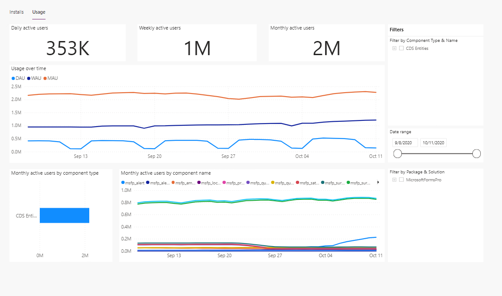
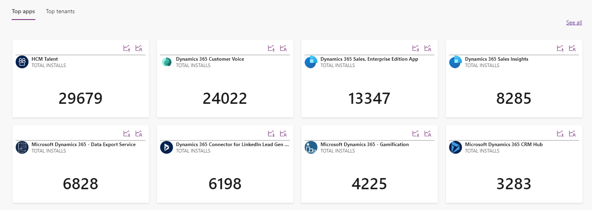
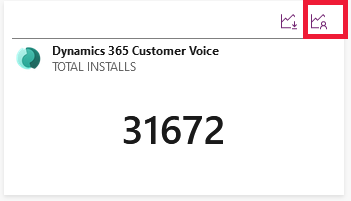

# App usage analytics

[!INCLUDE [cc-beta-prerelease-disclaimer](../../includes/cc-beta-prerelease-disclaimer.md)]

As an ISV, you need data&mdash;like active users or the number of times the solution has been installed&mdash;to measure the success of your application. You can use app usage analytics to get visibility into monthly, daily, and weekly usage data. 

[!INCLUDE[cc-terminology](includes/cc-terminology.md)]

> [!NOTE]
> A tenant or customer needs to update their apps for you to start seeing usage data.

With the app usage feature, you can filter usage data by **Component Type**, **Data Date**, **Package Name**, and **Solution Name**. An app can have multiple packages, and an individual package can have multiple solutions. Each solution can have multiple components. App usage is measured based on how many times the components of the application are used in a month, week, or day. 

> [!NOTE]
> An app must be deployed via [AppSource](https://appsource.microsoft.com) in order for you to see this data.

> [!div class="mx-imgBorder"]
> 

Some of the components of a solution can have shared ownership by multiple ISVs. For shared components, only the publisher who created the component gets the usage credit. For example, ISV1 created a form and ISV2 extended the form by adding a widget to it. Every time the form is used, ISV1 gets the usage credit. Whenever the widget is used, ISV2 gets the usage credit. If a user visited the form only to access the widget, ISV1 also gets the usage credit.

For a component that isn't shared, only the publisher who created it gets the usage credit.

## View the app usage dashboard
1. Sign in to [ISV studio](https://aka.ms/ISVStudio/).
1. On the **Home** page, view the list of published apps. If necessary, scroll down to view the app for which you want to view usage details.
1. Select the app, and then select the **Usage** tab.

   > [!div class="mx-imgBorder"]
   > 

   You can also go directly to the app usage details by selecting the app usage icon from an app in the list, as shown in the following image.

   > [!div class="mx-imgBorder"]
   > 

## Overview of the usage dashboard

The usage dashboard shows the following metrics:

- **Monthly active users**: Tracks the number of unique users who used the app within the last month.
- **Daily active users**: Tracks the number of daily unique users who used the app within the last 24 hours.
- **Weekly active users**: Tracks the number of daily unique users who used the app within the last seven hours.
- **Usage over time**: Tracks the number of monthly, weekly, and daily active users over time.
- **Monthly active users by component type**: Tracks the number of monthly active users, filtered by component type.
- **Monthly active users by component name**: Tracks the number of monthly active users, filtered by component name.

### Filtering the usage dashboard

You can filter the usage dashboard by using the available filters. To see the metrics rolled up to the solution level, select all the components of the solution in the filter. Similarly, you can roll up all solution metrics to the package level, and roll up all package metrics to the app level.

### See also

[Home page](isv-app-management-homepage.md)  
[App page](isv-app-management-apppage.md)  
[Tenant page](isv-app-management-tenantpage.md) 
[AppSource checker](isv-app-management-appsource-checker.md) 
[Connector certification](isv-app-management-certification.md)

[!INCLUDE[footer-include](../../includes/footer-banner.md)]