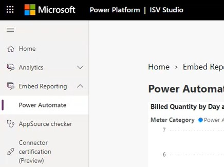
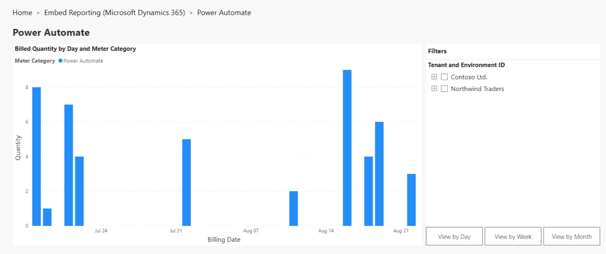
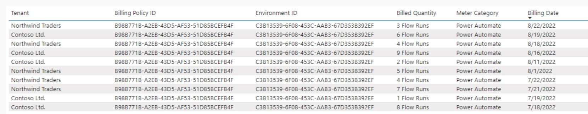
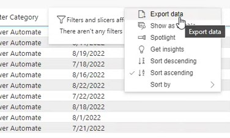

# Power Automate Embed Pay-as-you-go for ISVs (preview)

[!INCLUDE [cc-beta-prerelease-disclaimer](../../includes/cc-beta-prerelease-disclaimer.md)]

> [!IMPORTANT]
> - This is a preview feature.
> - Preview features aren't meant for production use and may have restricted functionality. These features are available before an official release so that customers can get early access and provide feedback.

Power Automate Embed Pay-as-you-go (PAYG) for ISVs allows verified publishers to leverage Power Platform into their solutions through an embedded licensing model that simplifies the customer experience. With this capability, customers can run flows using the connector without acquiring a separate Microsoft license and ISVs are billed on their existing Azure subscription for their customers' usage of their connector. 

## Sign-up for Power Automate Embed PAYG for ISVs
To enable this capability, ISVs can join the public preview program by completing the following form: [Join here](https://forms.office.com/Pages/ResponsePage.aspx?id=v4j5cvGGr0GRqy180BHbR9Bd5zmFN9VOlOkf4CNd94lUMVNTSTYzRTFRUDk1NFZaSVpUSUtEOUVFNi4u)
While you wait to hear back from the preview team, please review the following onboarding guide and detailed documentation: [Program overview](https://dynamicspartners.transform.microsoft.com/isv-cloud)

## Access Embed Reporting in ISV Studio
ISV Studio is a portal designed for third-party publishers to view how well their product is doing in terms of installs, install failures, and usage. After completing the onboarding process, you can login to [ISV Studio](https://isvstudio.powerapps.com) to view reports related to the consumption of your connector: 

1. From the lefthand navigation menu, expand Embed Reporting to click Power Automate.

2. The Embed Reporting Power Automate page displays a usage report for the last 3-month in graph format for the pre-selected publisher. Graph features:
	- Filter to view by tenant
	- Aggregated to view by day, week, or month
	- Export data as summary
	

3. Below the graph, you can see the same data in table format. Filters applied to the graph will apply to the table. The following columns are displayed:
	- Tenant: Customer tenant name
	- Billing Policy ID: Billing policy created.
	- Environment ID: Customer environment consuming the flow.
	- Billed Quantity: Consumed quantity based on meter category.
	- Meter Category: Power Automate is currently the only available option
	- Billing Date: Date the billing policy was created

4. You can export the graph and table by hovering over the top-right corner to expand additional actions.

### See also

[Introduction to ISV Studio for the Power Platform](isv-app-management.md)  
[Home page](isv-app-management-homepage.md)  
[App page](isv-app-management-apppage.md)  
[AppSource checker](isv-app-management-appsource-checker.md)  
[Connector Certification](isv-app-management-certification.md)

[!INCLUDE[footer-include](../../includes/footer-banner.md)]
