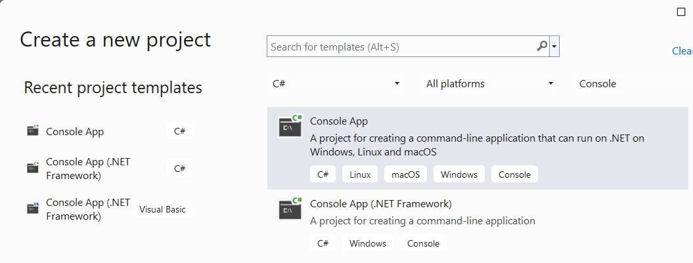
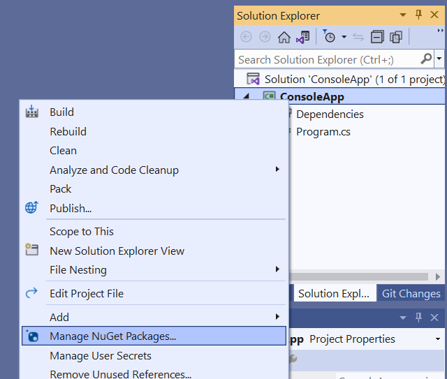
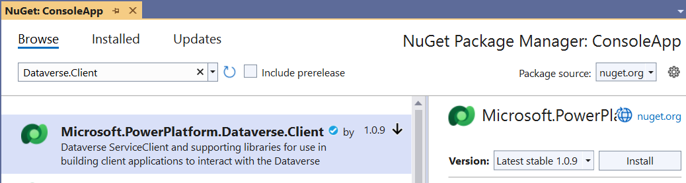

# Quickstart: Organization service sample (C#)

[!INCLUDE[cc-terminology](../includes/cc-terminology.md)]

This is where you begin working with the .NET SDK assemblies to work with data using Microsoft Dataverse.

In this quickstart, you will create a minimum console application to connect to the Organization service using the <xref:Microsoft.Xrm.Tooling.Connector.CrmServiceClient> class. You will pass  your connection information using a connection string passed to the constructor.

You will use the <xref:Microsoft.Xrm.Sdk.IOrganizationService>.<xref:Microsoft.Xrm.Sdk.IOrganizationService.Execute*> method passing an instance of the <xref:Microsoft.Crm.Sdk.Messages.WhoAmIRequest> class, and you will display the <xref:Microsoft.Crm.Sdk.Messages.WhoAmIResponse>.<xref:Microsoft.Crm.Sdk.Messages.WhoAmIResponse.UserId> value.

> [!NOTE]
> This quickstart example does not include error handling. This is a minimum example of what you need to connect to and use the Organization service.


## Prerequisites

 - Visual Studio (2019 recommended)
 - Internet connection
 - Valid user account for a Dataverse instance
    - Your username
    - Your password
 - Url to the Dataverse environment you want to connect with
 - Basic understanding of the Visual C# language

## Create Visual Studio project

1. Create a new Console App (.NET Framework) project using .NET Framework 4.6.2

    

    > [!NOTE]
    > This screenshot shows the name `OrgServiceQuickStart`, but you can choose to name the project and solution whatever you want. 

1. In **Solution Explorer**, right-click the project you created and select **Manage NuGet Packages...** in the context menu.

    

1. Browse for the latest version of the  `Microsoft.CrmSdk.XrmTooling.CoreAssembly` NuGet package and install it.

    

> [!NOTE]
> You must select **I Accept** in the **Licence Acceptance** dialog.

## Edit Program.cs

1. Add these using statements to the top of `Program.cs`

    ```csharp
    using Microsoft.Crm.Sdk.Messages;
    using Microsoft.Xrm.Tooling.Connector;
    ```

1. Replace the `Main` method with the following code. The supported values for *AuthType* are listed in [Connection string parameters](../xrm-tooling/use-connection-strings-xrm-tooling-connect.md).

    ```csharp
    static void Main(string[] args)
    {            
        // e.g. https://yourorg.crm.dynamics.com
        string url = "<your environment url>";
        // e.g. you@yourorg.onmicrosoft.com
        string userName = "<your user name>";
        // e.g. y0urp455w0rd 
        string password = "<your password>";

        string conn = $@"
        Url = {url};
        AuthType = OAuth;
        UserName = {userName};
        Password = {password};
        AppId = 51f81489-12ee-4a9e-aaae-a2591f45987d;
        RedirectUri = app://58145B91-0C36-4500-8554-080854F2AC97;
        LoginPrompt=Auto;
        RequireNewInstance = True";

        using (var svc = new CrmServiceClient(conn))
        {

            WhoAmIRequest request = new WhoAmIRequest();

            WhoAmIResponse response = (WhoAmIResponse)svc.Execute(request);

            Console.WriteLine("Your UserId is {0}", response.UserId);

            Console.WriteLine("Press any key to exit.");
            Console.ReadLine();
        }
    }
    ```

1. Edit the following values to add information for your environment. You can find your environment URL in the Web application under **Settings > Customization > Developer Resources**.

    ```csharp
    // e.g. https://yourorg.crm.dynamics.com
    string url = "<your environment url>";
    // e.g. you@yourorg.onmicrosoft.com
    string userName = "<your user name>";
    // e.g. y0urp455w0rd
    string password = "<your password>";
    ```

## Run the program

1. Press F5 to run the program. The output should look like this:

    ```bash
    Your UserId is 969effb0-98ae-478c-b547-53a2968c2e75
    Press any key to exit.
    ```

### Congratulations!

You have successfully connected to the organization service.

## Next Steps

These articles will explain how to work with Dataverse tables:

[Entity class operations using the Organization service](entity-operations.md)<br />
[Create table rows using the Organization Service](entity-operations-create.md)<br />
[Retrieve a table row using the Organization Service](entity-operations-retrieve.md)<br />
[Update and delete table rows using the Organization Service](entity-operations-update-delete.md)<br />
[Associate and disassociate table rows using the Organization Service](entity-operations-associate-disassociate.md)


[!INCLUDE[footer-include](../../../includes/footer-banner.md)]