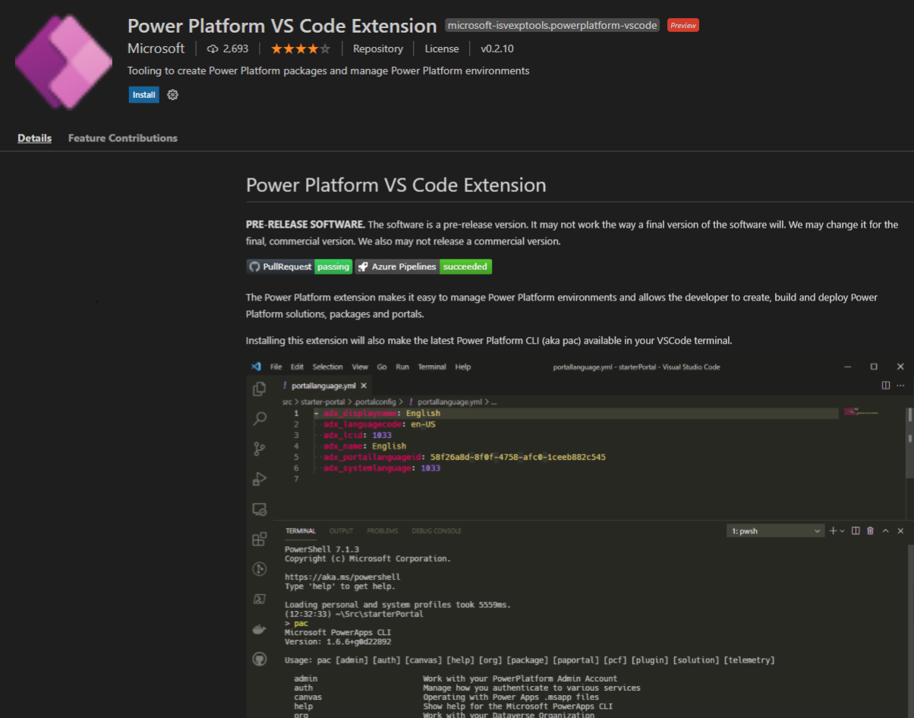

# What is Microsoft Power Platform CLI? 

[!INCLUDE[cc-data-platform-banner](../../includes/cc-data-platform-banner.md)]

> [!NOTE] 
> Effective June 2021, Microsoft Power Apps CLI is rebranded to Microsoft Power Platform CLI. More information: [Blog: Microsoft Power Platform is the best way for teams to build together](https://cloudblogs.microsoft.com/powerplatform/2021/05/25/microsoft-power-platform-is-the-best-way-for-teams-to-build-together/)<p/>Microsoft Power Platform CLI is currently not available for use in the GCC and GCC High regions.

Microsoft Power Platform CLI is a simple, one-stop developer CLI that empowers developers and ISVs to perform various operations in Microsoft Power Platform related to environment lifecycle features, and to authenticate and work with Microsoft Dataverse environments, solution packages, portals, code components, and so on.  

## Install Microsoft Power Platform CLI

You can use either of the following ways to install Microsoft Power Platform CLI.

### Using Power Platform VS Code Extension

To install Microsoft Power Platform CLI using Visual Studio Code Extension:

1. Open [Visual Studio Code](https://code.visualstudio.com/).
1. Select **Extensions** icon from the **Activity** panel. In the search bar, enter **Power Platform VS Code Extension**.
1. Select **Install**. Once the installation is finished, restart your Visual Studio Code to see the extension within the **Terminal** window.

   > [!div class="mx-imgBorder"]
   > 
   
> [!NOTE]
> Microsoft Power Platform Visual Studio Code Extension updates automatically. 

1. You can also initiate the install into Visual Studio Code directly from [Marketplace]( https://aka.ms/ppcvscode) and it will launch Visual Studio Code and commence the extension installation.

### Standalone Power Platform CLI

To install standalone Power Platform CLI:

1. Download and install [Microsoft Power Platform CLI](https://aka.ms/PowerAppsCLI).

1. To take advantage of all the latest capabilities, update Microsoft Power Platform CLI tooling to the latest version by using this command (not applicable for Power Platform VS Code Extension):
    ```CLI
    pac install latest

    ```
> [!NOTE]
> - Currently, Microsoft Power Platform CLI is supported only on Windows 10.
> - Power Platform VS Code Extension is in public preview, and works on both Windows 10 and macOS. 

## Common commands

This table lists some of the common commands used in the CLI.

|Command|Description|
|-------|-----------|
|[admin](#admin)|Commands for environment lifecycle features.|
|[auth](#auth)|Commands to [authenticate to Dataverse](../component-framework/import-custom-controls.md#connecting-to-your-environment).|
|[canvas](#canvas)|Commands for working with canvas app source files.|
|[org](#org)|Commands for working with Dataverse environments.|
|[package](#package)|Commands for working with [solution packages](/power-platform/alm/package-deployer-tool).|
|[paportal](#paportal)|Commands for working with [Power Apps portals (Preview)](../../maker/portals/power-apps-cli.md).|
|[pcf](#pcf)|Commands for working with [Power Apps component framework](../component-framework/overview.md).|
|[plugin](#plugin)|Command to create a [plug-in](./plug-ins.md) project.|
|[solution](#solution)|Commands for working with [Dataverse solution projects](../../maker/data-platform/solutions-overview.md).|
|[telemetry](#telemetry)|Manages the telemetry settings.|


### Admin

Commands to work with environment lifecycle features.

#### Parameters

|Property Name|Description|
|-------------|-----------|
|list|Lists all environments from the tenant. It has the following parameters <ul><li>*environment-id*: List all environments that contain a given string in their ID (alias: -id).</li><li>*url*: List all environments that contain a given string in their URL (alias -u).</li><li>*type*: Lists all environments of the given type (alias: -t). </li><li>*name*: List all environments that contain a given string in their name (alias: -n). </li><li>*organization-id*: List all environments that contain a given string in their organization ID (alias: -oi).</li></ul> |
|create|Creates a new environment. It has the following parameters: <ul><li>*name*: Sets the name of the environment (alias: -n).</li><li>*region*: Sets the environment's region name. Defaults to `unitedstates` if not specified (alias -r).</li><li>*type*: Sets the type of the environment. Available values are Trial, Sandbox, Production, SubscriptionBasedTrial (alias: -t).</li><li>*currency*: Sets the default currency used in the environment. Defaults to USD if not specific (alias: -c).</li><li>*language*: Sets the default language of the environment. Defaults to English if not specified (alias: -l).</li><li>*templates*: Sets the Dynamics 365 apps that should be deployed to the environment. Pass as comma-separated values (alias: -t).</li><li>*domain*: Sets the domain name that's part of the environment URL. If the domain name is already in use, a numeric value will be appended to the domain name. For example, if `contoso` is already in use, the environment URL will become `https://contoso0.crm.dynamics.com` (alias -d).</li><li>*input-file*: Arguments can be passed in a `.json` input file instead of through the command line. For example, {"name" : "contoso"}. The arguments passed through the command line will take precedence over arguments from the `.json` input file (alias: -if).</li></ul> |
|backup|Takes the backup of an environment. It has the following parameters: <ul><li>*url*: URL of the environment to be backed up (alias: -u).</li><li>*label*: Sets the backup label as provided (alias: -l).</li><li>*environment-id*: ID of the environment to be backed up (alias: -id).</li><li>*notes*: Additional notes provided for the backup (alias: -n).</li></ul> |
|delete|Deletes an environment. It has the following parameters: <ul><li>*url*: URL of the environment to be deleted (alias: -u). </li><li>*environment-id*: ID of the environment to be deleted (alias: -id).</li></ul>|
|reset|Resets an environment. It has the following parameters: <ul><li>*url*: URL of the environment to reset (alias: -u)</li><li>*name*: Sets the name of the environment (alias: -n).</li><li>*currency*: Sets the default currency used in the environment. Defaults to USD if not specified (alias: -c)</li><li>*purpose*: Sets the description used to associate the environment with a specific intent (alias: -p) </li><li>*language*: Sets the default language of the environment. Defaults to English if not specified (alias: -l).</li><li>*templates*: Sets the Dynamics 365 apps that should be deployed to the environment. Pass as comma-separated values (alias: -t).</li><li>*domain*: Sets the domain name that's part of the environment URL. If the domain name is already in use, a numeric value will be appended to the domain name. For example, if `contoso` is already use, the environment URL will become `https://contoso0.crm.dynamics.com` (alias -d).</li><li>*input-file*: Arguments can be passed in a `.json` input file instead of through the command line. For example, {"name" : "contoso"}. The arguments passed through the command line will take precedence over arguments from the `.json` input file (alias: -if).</li></ul>|
|list-backups|Lists all available backups for the environment.<!--note from editor: Edit okay? --> It has the following parameters:<ul><li>*url*: URL of the environment for which you want to list backups (alias: -u).</li><li> *environment-id*: ID of the environment for which you want to list backups (alias: -id).</li></ul>|
|restore|Restores an environment from a given backup. It has the following parameters: <ul><li>*source-url*: URL of the source environment to be restored from (alias: -s). </li><li>*target-url*: URL of the target environment to be restored to (alias: -t). </li><li>*selected-backup*: DateTime of the backup in `mm/dd/yyyy hh:mm` format or latest (alias: -sb).</li><li>*name*: Optional name of the restored environment (alias: -n).</li></ul>|
|copy|Copies a source environment to a destination environment. It has the following parameters: <ul><li>*source-url*: URL of the source environment to be copied from (alias: -su).</li><li>*target-url*: URL of the target environment to be copied to (alias: -tu).</li><li>*source-environment-id*: ID of the source environment to be copied from (alias: -si).</li><li>*target-environment-id*: ID of the target environment to be copied to (alias: -ti). </li><li>*name*: Name to be used for the target environment (alias: -n).</li><li>*type*: Type of copy. Available values are: None, MinimalCopy, Fullcopy  (alias: -t).</li></ul>|

### Canvas

Commands for working with canvas app source files. Edit, manage, and collaborate on your app outside of Power Apps Studio with tools such as VS Code and GitHub.

> [!NOTE]
> The Canvas commands are in public preview. They may not be available in the version of Microsoft Power Platform CLI that you're using currently. 

#### Parameters

|Property name|Description|Example|
|-------------|-----------|-------|
| unpack | Unpacks the `.msapp`  source file.<br/> Download the `.msapp` file from Power Apps Studio by navigating to **File** > **Save as** > **This computer**.<br/>  If the **sources** parameter is not specified, a directory with the same name and location as the `.msapp` file is used with `_src` suffix.  | `pac canvas unpack --msapp HelloWorld.msapp --sources MyHelloWorldFiles`<br/>`pac canavs unpack --msapp HelloWorld.msapp`<br/>*unpacks to default* `HelloWorld_src` *directory* |
| pack | Creates an `.msapp` file from the previously unpacked source files. <br/>The result can be opened in Power Apps Studio by navigating to **File** > **Open** > **Browse**.<br/> After being unpacked, the source files can be edited and managed with external tools such as Visual Studio Code and GitHub. | `pac canvas pack --sources MyHelloWorldFiles --msapp HelloWorld.msapp` |

#### Folder structure

Unpack and pack properties use the following folder structure:

- **\src** - Control and component files. This contains the sources.
   - ***\*.fx.yaml*** - The formulas extracted from the `control.json` file.<!--note from editor: Maybe the Note format would be good to use here?-->
    >[!NOTE]
    >This is the place to edit your formulas.
   - ***CanvasManifest.json*** - A manifest file that contains the information normally present in the header, properties, and publishInfo.
   - ***\*.json*** - The raw `control.json` file.
   - ***\EditorState\*.editorstate.json*** - Cached information for Power Apps Studio to use.
- **\DataSources** - All the data sources used by the app.
- **\Connections** - Connection instances saved with the app and used when reloading into Power Apps Studio. 
- **\Assets** - Media files embedded in the app.
- **\pkgs** - A downloaded copy of external references, such as templates, API definition files, and component libraries. These are similar to NuGet/NPM references. 
- **\other** - All miscellaneous files needed to re-create the `.msapp`.
   - ***entropy.json*** - Volatile elements (like timestamps) are extracted to this file. This helps reduce noisy differences in other files while ensuring that we can still round-trip.
   - Holds other files from the msapp, such as what's in \references.

#### File format

The `.fx.yaml` files use a subset of [YAML](https://yaml.org/spec/1.2/spec.html). Similar to Excel, all expressions should begin with an equal sign `=`. More information: [Power Fx YAML Formula Grammar](/power-platform/power-fx/yaml-formula-grammar)

#### Merging changes with Power Apps Studio

When merging changes that are made in two different Power Apps Studio sessions:

- Ensure that all the control names are unique. For example, inserting a button in two different sessions can result in two `Button1` controls. We recommend that you name the controls soon after you create them. The tool doesn't accept two controls with the same name.  
- For these files, merge them as you normally do:
   - \src\*.fx.yaml
- If there are conflicts or errors, you can delete these files:
   - \src\editorstate\*.json  - These files contain optional information in Power Apps Studio.
   - \other\entropy.json  
- For any conflicts in these files, it's ok to accept the latest version: 
   - \checksum.json
- If there are any merge conflicts under these paths, it isn't safe to merge. Let us know if this happens often; we'll work on restructuring the file format to avoid conflicts.
   - \Connections\*
   - \DataSources\*
   - \pkgs\*
   - CanvasManifest.json

#### Open source

The canvas commands in Microsoft Power Platform CLI are open source. Discuss improvements, raise issues, and access the code from [Power Apps language tooling repository](https://github.com/microsoft/PowerApps-Language-Tooling).

### Package

Command to work with solution packages.

#### Parameters

|Property Name|Description|Example|
|-------------|-----------|-------|
|init|Initializes a new package project. It has the following parameter: <ul><li>*outputdirectory*: Output directly where the package is created.</li></ul>| `pac package init --outputdirectory c:\samplepackage`|
|add-reference|Sets the reference path to the solution project folder by passing the `path` parameter.|`pac package add-reference --path c:\Users\Downloads\SampleSolution`|
|show| Shows the content of a package .dll or a .zip file with a package. It has the following parameter: <ul><li>*package*: The path location to the package .dll (library) or the .zip file.</li></ul>| `pac package show c:\samplepackage.dll`|
|deploy| Deploys the package .dll or the .zip file with a package. It has the following parameters:<ul><li>*logFile*: Path to a log file location where the logs are redirected. </li><li>*logConsole*: This option is used if you want to direct the logs to the console.</li><li>*package*: The path location to the package .dll (library) or a .zip file with a package.</li></ul>**Note**: You can use both `logFile` and `logConsole` parameters together, or use one parameter or the other. | `pac package deploy --logFile c:\samplelogdata --package c:\samplepackage` |

### Paportal

Commands to work with [Power Apps portals (Preview)](../../maker/portals/power-apps-cli.md).

#### Parameters

|Property Name|Description|Example|
|-------------|-----------|-------|
|list|Lists all portal websites from the current Dataverse environment. |`pac paportal list`|
|download|Download portal website content from the current Dataverse environment. It has the following parameters: <ul><li>*path*: Path where the website content will be downloaded (alias: -p).</li><li>*webSiteId*: Portal website ID to download (alias: -id).</li><li>*overwrite*: (Optional) true to overwrite existing content, false to fail if the folder already has website content (alias: -o).</li></ul>|`pac paportal download --path "C:\portals" --webSiteId f88b70cc-580b-4f1a-87c3-41debefeb902`|
|upload|Upload portal website content to the current Dataverse environment. It has the following parameter:<ul><li>*path*: Path where the website content is stored (alias: -p).</li></ul>|`pac paportal upload --path "C:\portals\starter-portal"`|

### PCF

Commands to work with [Power Apps component framework](../component-framework/overview.md). 

#### Parameters

|Property Name|Description|Example|
|-------------|-----------|-------|
|init|Initializes the code component project. It has the following parameters: <ul><li>*namespace*: Namespace of the code component. </li><li>*name*: Name of the code component.</li><li>*template*: Field or dataset</li></ul>| `pac pcf init --namespace SampleNameSpace --name SampleComponent --template field`|
|push|Pushes the code component to the Dataverse instance with all the latest changes. It has the following parameter:<ul><li>*publisher-prefix*: Publisher prefix of the organization.</li></ul>|`pac pcf push --publisher-prefix dev`|
|version|Updates the component manifest file with the specified patch version. It has the following parameters: <ul><li>*patchversion*: Patch version of the code component. `patchversion` will only take value of the third part of the version tuple: `Major.Minor.Patch`.</li><li>*path*: Absolute or relative path of the component manifest file.</li><li>*allmanifests*: Updates the patch version for all the component manifest files.</li><li>*updatetarget*: Updates the specified manifest file. It has two values, build and project.</li><li>*strategy*: Updates the patch version for the manifest files by using specified strategy values. It has the following values: <ul><li>*gittags*: Use Git tags to decide whether a particular component's patch version needs to be updated.</li><li>*filetracking*: Use a .csv file to decide whether a particular component's patch version needs to be updated.</li><li>*manifest*: Increments the patch version by 1 for all the components.</li></li></ul>|`pac pcf version --patchversion 1.0.0.0 --path c:\Users\Downloads\SampleComponent --allmanifests`  <br/><br/> `pac pcf version --strategy gittags`|


### Solution

Commands for working with [Dataverse solution projects](../../maker/data-platform/solutions-overview.md).

#### Parameters

|Property Name|Description|Example|
|-------------|-----------|-------|
|init|Initializes the solution project.  It has the following parameters:<ul><li>*publisher-name*: Publisher name of the organization.</li><li> *publisher-prefix*: Publisher prefix of the organization.</li></ul>|`pac solution init --publisher-name developer --publisher-prefix dev`  |
|add-reference|Sets the reference path to the component project folder by passing the `path` parameter.|`pac solution add-reference --path c:\Users\Downloads\SampleComponent`|
|clone|Creates a solution project based on the existing solution project. It has the following parameters:<ul><li>*name*: The name of the solution to be exported.</li><li>*targetversion*: The version that the exported solution supports.</li><li>*include*: Settings that should be included in the solution being exported. It has the following values: autonumbering, calendar, customization, emailtracking, externalapplications, general, isvconfig, marketing, outlooksynchronization, relationshiproles, sales</li></ul>|`pac solution clone -–name  sampleSolution --version 1.0.0.2 --include general`|
|import|Imports a Dataverse solution to an environment. It requires that you be connected to an environment [Auth commands](#auth), and has the following parameters:<ul><li>*activate-plugins*: Activates plug-ins and workflows in the environment after the import (alias: -ap).</li><li>*async*: Imports the solution asynchronously (alias: -a).</li><li>*force-overwrite*: Forces an overwrite of unmanaged customizations (alias: -f). </li><li>*import-as-holding*: Imports the solution as a holding solution (alias: -h).</li><li>*max-async-wait-time*: Maximum asynchronous wait time in minutes. Default value is 60 minutes (alias: -wt).</li><li>*path*: Path to the solution .zip file. If not specified, assumes the current folder (alias: -p).</li><li>*publish-changes*: Publishes changes after successful import (alias: -pc). </li><li>*skip-dependency-check*: Skips the dependency check against dependencies flagged as product update (alias: -s). </li><li>*convert-to-managed*: Converts the solution as managed upon import.</li></ul>|`pac solution import --path c:\Users\Documents\Solution.zip `|
|export|Exports a Dataverse solution from an environment. It requires that you be connected to an environment [Auth commands](#auth), and has the following parameters:<ul><li>*path*: Complete file name where the exported solution .zip file will be saved.</li><li>*name*: Name of the solution that needs to be exported.</li><li>*managed*: Defines whether the solution should be exported as a managed solution.</li><li>*targetversion*: The version that the exported solution supports.</li><li>*include*: Settings that should be included in the solution being exported.</li></ul>|`pac solution export --path c:\Users\Documents\Solution.zip -- name SampleComponentSolution --managed true --targetversion 10.0.03 --include general`|
|list|Lists all solutions from a Dataverse environment. It requires that you be connected to an environment [Auth commands](#auth). This command has no parameters.|`pac solution list`  |


### Auth

Commands to [authenticate to Dataverse](../component-framework/import-custom-controls.md#connecting-to-your-environment).

#### Parameters

|Parameter Name|Description|Example|
|-------------|-----------|-------|
|create| Creates the authentication profile for your organization by passing the `url` parameter. Shows AAD dialog if sign in credentials are not specified, and has the following arguments:<ul><li> *name*: The name to give to this auth profile, maximum 12 characters (alias: -n). </li><li> *kind*: Kind of auth profile, defaults to Dataverse (alias: -k).</li><li> *url*: Resource URL to connect to (alias: -u).</li><li>  *username*: Optional: Username to authenticate with (alias: -un).</li><li> *password*: Optional: Password to authenticate with (alias: -p).</li><li> *applicationId*: Optional: Application ID to authenticate with (alias: -id).</li><li> *clientSecret*: Optional: Client secret to authenticate with (alias: -cs).</li><li> *tenant*: Optional: Tenant ID if using `app id` and `client secret` (alias: -t).</li><li>  *cloud*: Optional: Cloud instance to authenticate with. Values: Public, Tip1, Tip2, UsGov, UsGovHigh, UsGovDod (alias: -ci).</li></ul>|`pac auth create --url https://Myorg.crm.dynamics.com`|
|list|Provides the list of authentication profiles stored on current computer. This command has no arguments.|`pac auth list`|
|select|Provides a way to switch between previously created authentication profiles by passing the `index` parameter.<br/>It has the following arguments:<ul><li> *index*: The index of the profile to be active (alias: -i).</li><li> *name*: The name of the profile to be active (alias: -n).</li></ul>|`pac auth select --index 2`|
|delete|Deletes the authentication profile created by passing  the `index` parameter.<br/>It has the following arguments:<ul><li> *index*: The index of the profile to be deleted (alias: -i).</li><li> *name*: The name of the profile to be deleted (alias: -n).</li></ul>|`pac auth delete --index 2`|
|clear|Clears all the authentication profiles created on the local machine. This command has no arguments.| `pac auth clear`|

### Telemetry

Manages the telemetry settings.

#### Parameters

|Parameter Name|Description|Example|
|------------|------------|---------|
|enable|Enables the telemetry option.|`pac telemetry enable`|
|disable|Disables the telemetry option.| `pac telemetry disable`|
|status|Returns whether the telemetry is enabled or disabled.|`pac telemetry status`|

### Org

Command to work with Dataverse organizations.

#### Parameters

|Parameter Name|Description|Example|
|-------------|-----------|--------|
|who|Displays information about the current Dataverse organizations.|`pac org who`|


### Plugin

Manages to create a [plug-in](./plug-ins.md) project.

#### Parameters

|Parameter Name|Description|Example|
|-------------|-----------|--------|
|init|Initializes a directory with a new plug-in class library.|`pac plugin init`|

## Uninstall Microsoft Power Platform CLI 

To uninstall Microsoft Power Platform CLI tooling, run the MSI from [here](https://aka.ms/PowerPlatformCLI).

To uninstall the Visual Studio Code extension, follow the same steps as installing the extension, except this time select the uninstall button.

If you're a Private Preview participant and have an older version of CLI, follow these steps:

1. To find out where Microsoft Power Platform CLI is installed, open a command prompt and enter `where pac`.

1. Delete the PowerAppsCLI folder.

1. Open the Environment Variables tool by running the command `rundll32 sysdm.cpl,EditEnvironmentVariables` in the command prompt.

1. In the `User variable for...` section, double-click to select `Path` .

1. Select the row containing the PowerAppsCLI path, and then select **Delete** on the right side.

1. Select **OK** twice.


### See also

[Power Apps component framework](../component-framework/overview.md)


[!INCLUDE[footer-include](../../includes/footer-banner.md)]
