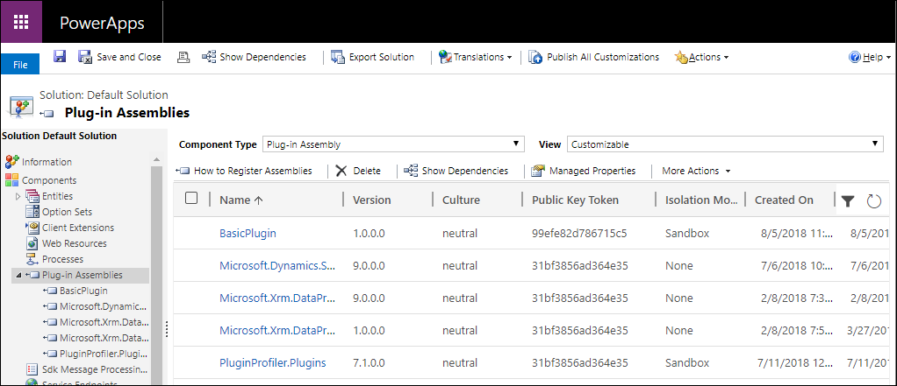

# Register a plug-in

[!INCLUDE[cc-terminology](includes/cc-terminology.md)]

After a plug-in is written and compiled, it must be registered with the event framework to execute when a specific entity type (table) and operation (message) is processed by Dataverse. To register a plug-in with the Dataverse event framework requires use of a tool - Plug-in Registration tool (PRT), or the Power Platform Tools extension for Visual Studio.

The PRT creates Dataverse object registrations and supports editing those registrations. This article describes how to register a plug-in assembly and step, add an assembly to a solution, and perform other common operations using the Plug-in Registration tool.

The Visual Studio extension provides a more feature rich development environment and covers the entire coding, deployment, and debugging/profiling development process. For information about using the Power Platform Tools extension for Visual Studio, see the [quickstart](tools/devtools-create-plugin.md).

More information: [Event framework](event-framework.md)

## About the Plug-in Registration tool

The Plug-in Registration tool (PRT) supports registration of plug-in assemblies, message processing steps, and other types of objects with Dataverse. PRT is one of several Dataverse tools available for download from [NuGet.org](https://www.nuget.org). Follow the instructions in [Dataverse development tools](download-tools-nuget.md) to download PRT and optionally other development tools.

After you download the PRT, follow the [Connect using the Plug-in Registration tool](tutorial-write-plug-in.md#register-plug-in) instructions to connect the tool to your target Dataverse environment where your plug-in is to be registered.

:::image type="content" source="media/dv_plugin_registration_tool.png" alt-text="The Plug-in Registration tool main window.":::

## Register an assembly

Registering an assembly is the process of uploading the assembly to the Dataverse database. See the instructions found at [Register your assembly](tutorial-write-plug-in.md#register-your-assembly) in the [Tutorial: Write and register a plug-in](tutorial-write-plug-in.md)

> [!NOTE]
> You will find options related to the *isolation mode* and *location* for the assembly. These refer to options that apply to on-premise deployments. Dataverse is not available for on-premises deployments, so you will always accept the default options of **SandBox** and **Database** for these options.

When an assembly is uploaded, it's stored in the `PluginAssembly` table. Most of the properties are set using reflection of the imported table. The base64 encoded bytes of the assembly are stored in the `Content` column. While viewing the **Properties** of the assembly in the PRT, you can only edit the **Description** value.

### View registered assemblies

You can view information about registered assemblies in the application solution explorer without using the PRT.

[!INCLUDE [cc_navigate-solution-from-powerapps-portal](../../includes/cc_navigate-solution-from-powerapps-portal.md)]

> [!NOTE]
> Each assembly you add using PRT will be added to the system **Default Solution**, (not to be confused with the **Common Data Services Default Solution**). To view the **Default Solution**, select **All solutions** under **Solutions** and then change the view to **All Solutions - Internal**.
>
> For more information about solutions, see [Introduction to solutions](introduction-solutions.md)

After selecting the name of the Default Solution in the internal solution list, you can find all the assemblies that are registered for this environment.

## Add your assembly to a solution

As described in [View registered assemblies](#view-registered-assemblies), the assembly registration you created was added to the system **Default Solution**. You should add your assembly to an unmanaged solution so you can distribute it to other organizations.

Within the unmanaged solution you're using, use solution explorer to navigate to **Plug-in Assemblies**. In the list menu, select **Add Existing**. In the following figures, a custom solution named Common Data Service Default Solution is used.

Then add your assembly as a component to the solution.

When you select the plug-in assembly you added, you can view the plug-in classes it includes.

> [!NOTE]
> Any existing or subsequent step registrations are not added to the unmanaged solution that includes the plug-in assemblies. You must add each registered step to the solution separately. More information: [Add step to solution](#add-step-to-solution)

## Register plug-in step

When an assembly is loaded or updated, any classes that implement <xref:Microsoft.Xrm.Sdk.IPlugin> are made available in the PRT. Use the instructions in [Register a new step](tutorial-write-plug-in.md#register-a-new-step) in the [Tutorial: Write and register a plug-in](tutorial-write-plug-in.md) to create a new step registration.

When you register a step, there are several registration options available to you depending on the stage of the event pipeline and the type of operation you intend to register your code on.

### General Configuration Information Fields

|Field|Description|
|--|--|
|**Message**|PRT auto-completes available message names in the system. More information: [Use messages with the Organization service](org-service/use-messages.md)|
|**Primary Entity**|PRT auto-completes valid tables that apply to the selected message. These messages have a `Target` parameter that accepts an <xref:Microsoft.Xrm.Sdk.Entity> or <xref:Microsoft.Xrm.Sdk.EntityReference> type. If valid tables apply, you should set this field value when you want to limit the number of times the plug-in is called.  If you leave it blank for core table messages like `Update`, `Delete`, `Retrieve`, and `RetrieveMultiple` or any message that can be applied with the message the plug-in will be invoked for all the tables that support this message.|
|**Secondary Entity**|This field remains for backward compatibility for deprecated messages that accepted an array of <xref:Microsoft.Xrm.Sdk.EntityReference> as the `Target` parameter. This field is typically not used anymore.|
|**Filtering Attributes**|With the `Update` or `OnExternalUpdated` message, when you set the **Primary Entity**, filtering columns limits the execution of the plug-in to cases where the selected columns are included in the update. Setting this field is a best practice for performance. |
|**Event Handler**|This field value will be populated based on the name of the assembly and the plug-in class. |
|**Step Name**|The name of the step. A value is pre-populated based on the configuration of the step, but this value can be overridden.|
|**Run in User's Context**|Provides options for applying impersonation for the step. The default value is **Calling User**. If the calling user doesn't have privileges to perform operations in the step, you may need to set this field value to a user who has these privileges. More information: [Set user impersonation for a step](#set-user-impersonation-for-a-step) |
|**Execution Order**|Multiple steps can be registered for the same stage of the same message. The number in this field determines the order in which they'll be applied from lowest to highest.   **Note**: You should set this to control the order in which plug-ins are applied in the stage. It's not recommended to simply accept the default value. The actual execution order of the plugins with the same Execution Order value (for the same stage, table and message) isn't guaranteed and can be random.|
|**Description**|A description for step. This value is pre-populated but can be overwritten.|

### Event Pipeline Stage of execution

Choose the stage in the event pipeline that best suites the purpose for your plug-in.

|Option|Description|
|--|--|
|**PreValidation**|[!INCLUDE [cc-prevalidation-description](../../includes/cc-prevalidation-description.md)]|
|**PreOperation**|[!INCLUDE [cc-preoperation-description](../../includes/cc-preoperation-description.md)]|
|**PostOperation**|[!INCLUDE [cc-postoperation-description](../../includes/cc-postoperation-description.md)]|

More information: [Event execution pipeline](event-framework.md#event-execution-pipeline)

### Execution Mode

There are two modes of execution asynchronous, and synchronous.

|Option|Description|
|--|--|
|**Asynchronous**|The execution context and the definition of the business logic to apply is moved to system job, which will execute after the operation completes.|
|**Synchronous**|Plug-ins execute immediately according to the stage of execution and execution order. The entire operation will wait until they complete.|

Asynchronous plug-ins can only be registered for the **PostOperation** stage. For more information about how system jobs work, see [Asynchronous service](asynchronous-service.md)

### Special step registration scenarios

There are certain scenarios where a step registration and table combination isn't obvious. This is the result of how the system is designed internally where there's a special relationship between tables or operations. The information below identifies these cases and provides step registration guidance.

- There are certain cases where plug-ins registered for the _Update_ event can be called twice. More information: [Behavior of specialized update operations](special-update-operation-behavior.md)
- Register a plug-in step on **account** or **contact** when you want to handle data changes to **customeraddress**, **leadaddress**, **publisheraddress**, or **competitoraddress** records.

### Deployment

|Option|Description|
|--|--|
|**Server**|The plug-in will run on the Dataverse server.|
|**Offline**|The plug-in will run within the Dynamics 365 for Outlook client when the user is in offline mode.|

<!-- TODO Add link to where more information about offline-plugins will be documented -->

### Set configuration data

The **Unsecure Configuration** and **Secure Configuration** fields in the PRT allow you to specify configuration data to pass to the plug-in for a specific step.

> [!NOTE]
> Secure Configuration data is not included with the step registration when you export a solution.

You can write your plug-in to accept string values in the constructor to use this data to control how the plug-in should work for the step. More information: [Pass configuration data to your plug-in](write-plug-in.md#pass-configuration-data-to-your-plug-in)

### Define entity images

Within your plug-in, you may want to reference primary table property values that weren't included in an operation. For example, in an `Update` operation you might want to know what a value was before it was changed, but the execution context doesn't provide this information, it only includes the changed value.

If your plug-in step is registered in the **PreValidation** or **PreOperation** stages of the execution pipeline, you could use the Organization service to retrieve the current value of the property, but this isn't a good practice for performance. A better practice is to define a pre-entity image with your plug-in step registration. This will capture a 'snapshot' of the table with the fields you're interested in as they existed before the operation that you can use to compare with the changed values.

> [!IMPORTANT]
> The default behavior when creating an entity image is to select all columns. **Don't use this default behavior.** This will negatively impact performance. Only include those columns that are required by the logic of your plug-in.

#### Messages that support entity images

In Dataverse, only the following messages support entity images:

|Message|Request Class Property| Description|
|--|--|--|
|`Assign`|`Target`|The assigned table.|
|`Create`|`Target`|The created table.|
|`Delete`|`Target`|The deleted table.|
|`DeliverIncoming`|`EmailId`|The delivered email ID.|
|`DeliverPromote`|`EmailId`|The delivered email ID.|
|`Merge`|`Target` or `SubordinateId`|The parent table, into which the data from the child table is being merged or the child table that is being merged into the parent table.|
|`Route`|`Target`|The item being routed.|
|`Send`|`FaxId`, `EmailId`, or `TemplateId` |The item being sent.|
|`SetState`|`EntityMoniker`|The table for which the state is set.|
|`Update`|`Target`|The updated table.|

#### Types of entity images

There are two types of entity images: **Pre Image** and **Post Image**. When you configure them, these images will be available within the execution context as <xref:Microsoft.Xrm.Sdk.IExecutionContext.PreEntityImages> and <xref:Microsoft.Xrm.Sdk.IExecutionContext.PostEntityImages> properties respectively. As the names suggest, these snapshots represent what the table looks like before the operation and after the operation. When you configure an entity image, you'll define a table alias* value that will be the key value you'll use to access a specific entity image from the `PreEntityImages` or `PostEntityImages` properties.

#### Availability of images

When you configure an entity image, it's important that you recognize that the type of entity images available depend on the stage of the registered step and the type of operation. For example:

- You can't have a **Pre Image** for the `Create` message because the table doesn't exist yet.
- You can't have a **Post Image** for the `Delete` message because the table won't exist anymore.
- You can only have a **Post Image** for steps registered in the **PostOperation** stage of the execution pipeline because there's no way to know what the table properties will be until the transaction is completed.
- For an `Update` operation that is registered in the **PostOperation** stage you can have both a **Pre Image** AND a **Post Image**.

#### Add an entity image

Use the [Power Platform Tools](tools/devtools-install.md) extension for Visual Studio to [add an entity image](tools/devtools-create-plugin.md#add-an-entity-image) to a plug-in step.

Alternately, you can use the Plug-in Registration Tool to add an entity image to a step by following the instructions in [Tutorial: Update a plug-in](tutorial-update-plug-in.md) under the section [Add an image](tutorial-update-plug-in.md#add-an-image).

### Add step to solution

As mentioned in [Add your assembly to a solution](#add-your-assembly-to-a-solution), **Plug-in Assemblies** are solution components that can be added to an unmanaged solution. **Sdk Message Processing Steps** are also solution components and must also be added to an unmanaged solution in order to be distributed.

The procedure to add a step to a solution is similar to adding an assembly. You'll use the **Add Existing** command to move it into the desired unmanaged solution. The only difference is that if you attempt to add a step but haven't already added the assembly that contains the class used in the step, you'll be prompted to add missing required components.

If you encounter this, you should usually select **OK** to bring the assembly in with the unmanaged solution. The only time you wouldn't select this is if your solution is designed to be installed in an environment where another solution containing the assembly is already installed.

Similarly, you should note that removing the assembly from the solution won't remove any steps that depend on it.

### Set user impersonation for a step

With the [Plug-in Registration tool](#about-the-plug-in-registration-tool) running and logged into the target Dataverse environment, you can proceed to set or change a step registration. In this section, we will discuss changing the user on whos behalf the plug-in will perform its operations. Meaning, the effective user that is performing the data operations initiated by the plug-in. By default, the calling user (the user that invoked an operation in Dataverse) is the owner of said operations. However a different user can be specified in the step registration. You will need to have the System Administrator or System Customizer security role to perform this operation.

To set the user in a plug-in step:

1. Expand the target plug-in assembly node in the assembly view until you see the desired (Step) registration node.
1. Choose the step node, and then choose **Update** in either the context menu or the toolbar.
1. Choose a different user from the drop-down list of available users next to the **Run in User's Context** label.
1. Choose **Update Step**.

More information: [Impersonate a user](impersonate-a-user.md)

## Update an assembly

When you change and rebuild an assembly that you've previously registered, you'll need to update it. See the [Update the plug-in assembly registration](tutorial-update-plug-in.md#update-the-plug-in-assembly-registration) step in the [Tutorial: Update a plug-in](tutorial-update-plug-in.md) for the steps.

### Assembly versioning

If you're making changes to a plug-in assembly that is part of a managed solution that has been deployed you need to consider the impact your changes may have when you update that managed solution. The version of the assembly will control the behavior.

Plug-in assemblies can be versioned using a semantic versioning format of `major.minor.build.revision` defined in the `Assembly.info` file of the Microsoft Visual Studio project. Depending on what part of the assembly version number is changed in a newer solution, the following behavior applies when an existing solution is updated through import.

- **The build or revision assembly version number is changed**

  This is considered an in-place upgrade. The older version of the assembly is removed when the solution containing the updated assembly is imported. Any pre-existing steps from the older solution are automatically changed to refer to the newer version of the assembly.

- **The major or minor assembly version number is changed**

  When an updated solution containing the revised assembly is imported, the assembly is considered a different assembly than the previous version of that assembly in the existing solution. Plug-in registration steps in the existing solution will continue to refer to the previous version of the assembly. If you want existing plug-in registration steps for the previous assembly to point to the revised assembly, you'll need to use the Plug-in Registration tool to manually change the step configuration to refer to the revised assembly type. This should be done before exporting the updated assembly into a solution for later import.

## Unregister or disable plug-ins and components

You can unregister or disable plug-ins and their components using the Plug-in Registration tool (PRT).

> [!IMPORTANT]
> It is no longer possible to unregister or disable Microsoft or out-of-box system plug-ins and steps. Previously, you were able to unregister or disable some of the Microsoft.* and other out-of-box system plug-ins. We have changed this behavior to no longer allow this. The change in functionality was made because unregistering or disabling these plug-ins or steps can cause product features not to work as expected. If you have a need to unregister or disable such a plug-in or step, file a Microsoft support request.

### Disable or enable a plug-in step

With the [Plug-in Registration tool](#about-the-plug-in-registration-tool) running and logged into the target Dataverse environment, you can proceed to disable or enable plug-in steps. Disabling a step effectively turns off the plug-in from executing when Dataverse processes the entity and message combination specified in the step registration.

> [!IMPORTANT]
> Disabling a plug-in can negatively affect the functionality of your app, a solution, or the Dataverse system. Make sure you understand the implications before you proceed.

To disable or enable a registered plug-in step:

1. Expand the target plug-in assembly node in the assembly view until you see the desired step registration node.
1. Choose the step, and then choose **Enable** or **Disable** in either the context menu or the toolbar.

:::image type="content" source="media/disable-step-prt.png" alt-text="Disable a step using the Plug-in Registration tool.":::

You can also disable or enable steps in the legacy Dataverse Solution Explorer user interface using the **Activate** and **Deactivate** command options.

:::image type="content" source="media/step-activate-deactivate-commands-solution-explorer.png" alt-text="Changing a plug-in step in legacy Solution Explorer.":::

### Unregister components

The PRT provides commands to unregister assemblies, types, steps, and images. See the [Unregister assembly, plug-in, and step](tutorial-update-plug-in.md#unregister-assembly-plug-in-and-step) instructions in the [Tutorial: Update a plug-in](tutorial-update-plug-in.md) for the procedure.

These are delete operations on the [PluginAssembly](reference/entities/pluginassembly.md), [PluginType](reference/entities/plugintype.md), [SdkMessageProcessingStep](reference/entities/sdkmessageprocessingstep.md), and [SdkMessageProcessingStepImage](reference/entities/sdkmessageprocessingstepimage.md) tables.

You can also delete **Plug-in Assemblies** and **Sdk Message Processing Steps** in the solution explorer to achieve the same result. In the figure below, a custom solution named Common Data Service Default Solution is shown.

> [!NOTE]
> You cannot delete (unregister) any **Plug-in Assemblies** while existing **Sdk Message Processing Steps** depend on them. Entity images are not available to be deleted separately, but they will be deleted when any steps that use them are deleted.

## Next steps

[Debug Plug-ins](debug-plug-in.md)

### See also

[Write plug-ins to extend business processes](plug-ins.md) 
[Write a plug-in](write-plug-in.md) 
[Tutorial: Write and register a plug-in](tutorial-write-plug-in.md) 
[Tutorial: Debug a plug-in](tutorial-debug-plug-in.md) 
[Tutorial: Update a plug-in](tutorial-update-plug-in.md) 

[!INCLUDE[footer-include](../../includes/footer-banner.md)]
