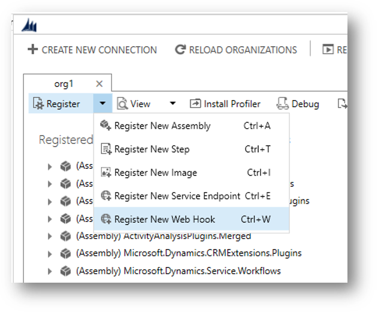

# Register a WebHook

[!INCLUDE[cc-terminology](includes/cc-terminology.md)]

Use the Plug-in Registration tool to register a WebHook. To get the Plug-in Registration tool, see [Dataverse development tools](download-tools-nuget.md).

In the Plug-in Registration tool, select the **Register New WebHook** option.



When you register a WebHook, you must provide three items of information:


|Item  |Description  |
|---------|---------|
|**Name**|A unique name describing the WebHook.|
|**Endpoint URL**|The URL to post execution context information to.|
|**Authentication**|One of three authentication options. For any type of authentication, you must provide the keys that identifies the request as legitimate.|

Registered WebHooks support only port 80 for HTTP and port 443 for HTTPS. 

## Authentication options

The correct WebHook registration authentication option and values to use depends on what the endpoint expects. The owner of the endpoint must tell you what to use. To use Webhooks with Microsoft Dataverse, the endpoint must allow one of the following authentication options:

|Type  |Description  |
|---------|---------|
|**HttpHeader**|Includes one or more key values pairs in the header of the http request.<br />Example: <br />`Key1: Value1`<br />`Key2: Value2`|
|**WebhookKey**|Includes a query string using `code` as the key and a value required by the endpoint. When registering the WebHook using the Plug-in Registration tool, only enter the value.<br />Example: <br />`?code=00000000-0000-0000-0000-000000000001`|
|**HttpQueryString**|Includes one or more key value pairs as query string parameters.<br />Example: <br />`?Key1=Value1&Key2=Value2`|

> [!NOTE]
> The **WebhookKey** option is useful with [Azure Functions](https://azure.microsoft.com/services/functions/) because the authentication query string is expected to have a key name of `code`.

Any request to the endpoint configured should fail when the authentication options passed in the request don't match. The endpoint is responsible for this.

<a name="query-WebHook-registrations"></a>

## Query WebHook registrations

Webhook registrations are stored in the [ServiceEndpoint Table](reference/entities/serviceendpoint.md) and have a [Contract](reference/entities/serviceendpoint.md#BKMK_Contract) value of `8`.

You can find details about the registered Webhooks by querying the **ServiceEndpoint** table.

**Web API:**

`GET [organization URI]/api/data/v9.0/serviceendpoints?$filter=contract eq 8&$select= serviceendpointid,name,authtype,url`

More information: [Query data using the Web API](webapi/query/overview.md)

**FetchXml:**

```xml
<fetch>
  <entity name="serviceendpoint" >
    <attribute name="serviceendpointid" />
    <attribute name="name" />
    <attribute name="authtype" />
    <attribute name="url" />
    <filter>
      <condition attribute="contract" operator="eq" value="8" />
    </filter>
  </entity>
</fetch> 
```

More information: [Use FetchXml to retrieve data](fetchxml/retrieve-data.md)

Details about the authentication values set are in the [AuthValue](reference/entities/serviceendpoint.md#BKMK_AuthValue) property and can't be retrieved.

## Register a step for a WebHook

Registering a step for a WebHook is like registering a step for a plug-in. The main difference is that you can't specify any configuration information.

Just like a plug-in, you specify the message, and information about tables when appropriate. You can also specify where in the event pipeline to execute the WebHook, the execution mode and whether to delete any **AsyncOperation** when the operation succeeds. 


Information about the **Step Name**, and **Description** is autopopulated based on the options you choose, but you can change them. If you don't set some **Filtering Attributes** for a message that supports them, you're prompted to do so as a performance best practices.

### Execution mode and debugging your WebHook registration

Your choice in registering the WebHook changes the experience you have when debugging if things don't work.

#### Asynchronous mode

When you use asynchronous execution mode a System Job (asyncoperation) is created to capture the success or failure of the operation. Choosing to delete the System Job when it succeeds saves database space.

Any errors that occur are recorded in System Jobs. In the web application you can go to **Settings > System > System Jobs** to review the status of any Webhooks. There's a **Status Reason** value of **Failed**. Open the failed System Job to find details that describe why the job failed.

<a name="query-failed-asynchronous-jobs-for-a-given-step"></a>

#### Query failed asynchronous jobs for a given step

When you know the **sdkmessageprocessingstepid** of a given step, you can query the [AsynchronousOperations Table](reference/entities/asyncoperation.md) for any errors. You can use the [OwningExtensionId](reference/entities/asyncoperation.md#BKMK_OwningExtensionId) value to filter the results to a specific registered step. The following examples use *&lt;stepid&gt;* for the **sdkmessageprocessingstepid** of the step.

> [!TIP]
> To get the **sdkmessageprocessingstepid** of a given step, see [Query steps registered for a WebHook](#query-steps-registered-for-a-webhook) below.

**Web API:**

`GET [organization URI]/api/data/v9.0/asyncoperations?$orderby=completedon desc&$filter=statuscode eq 31 and _owningextensionid_value eq @stepid&$select=name,friendlymessage,errorcode,message,completedon?@stepid=<stepid>`

More information: [Query data using the Web API](webapi/query/overview.md)

**FetchXML:**

```xml
<fetch>
  <entity name="asyncoperation" >
    <attribute name="name" />
        <attribute name="friendlymessage" />
    <attribute name="errorcode" />
    <attribute name="message" />
    <attribute name="completedon" />     
    <filter>
      <condition attribute="owningextensionid" operator="eq" value="<stepid>" />
    </filter>
    <order attribute="completedon" descending="true" />
  </entity>
</fetch>
```

More information: [Use FetchXml to retrieve data](fetchxml/retrieve-data.md)

#### Synchronous mode

[!INCLUDE [synchronous-webhook-error](includes/synchronous-webhook-error.md)]

> [!NOTE]
> You should use synchronous mode when it is important that the operation triggered by the WebHook occur immediately or if you want the entire transaction to fail unless the WebHook payload is received by the service. A simple WebHook step registration provides limited options to manage failure, but you can also invoke Webhooks using plug-ins and workflow activities if you require more control. More information: [Invoke a WebHook from a plug-in or workflow activity](use-webhooks.md#invoke-a-webhook-from-a-plug-in-or-workflow-activity).

## Query steps registered for a WebHook

Data for registered Webhooks is in the [SdkMessageProcessingStep Table](reference/entities/sdkmessageprocessingstep.md).

You can query the steps registered for a specific WebHook when you know the `serviceendpointid` for the WebHook. See [Query WebHook registrations](#query-WebHook-registrations) for a query to get the ID for a registered WebHook.

**Web API:**

You can use this Web API Query where *&lt;id&gt;* is the [ServiceEndpointId](reference/entities/serviceendpoint.md#BKMK_ServiceEndpointId) of the WebHook:

```http
GET [organization URI]/api/data/v9.0/serviceendpoints(@id)/serviceendpoint_sdkmessageprocessingstep?$select=sdkmessageprocessingstepid,name,description,asyncautodelete,filteringattributes,mode,stage?@id=<id>
```

For more information about the registered step, you can use this Web API query where *&lt;stepid&gt;* is the [SdkMessageProcessingStepId](reference/entities/sdkmessageprocessingstep.md#BKMK_SdkMessageProcessingStepId) for the step:

```http
GET [organization URI]/api/data/v9.0/sdkmessageprocessingsteps(@id)?$select=name,description,filteringattributes,asyncautodelete,mode,stage&$expand=plugintypeid($select=friendlyname),eventhandler_serviceendpoint($select=name),sdkmessagefilterid($select=primaryobjecttypecode),sdkmessageid($select=name)?@id=<stepid>
```

**FetchXML:**

You can use this FetchXML to get the same information in one query where *&lt;serviceendpointid&gt;* is the ID of the WebHook:

```xml
<fetch>
  <entity name="sdkmessageprocessingstep" >
    <attribute name="name" />
    <attribute name="filteringattributes" />
    <attribute name="stage" />
    <attribute name="asyncautodeletename" />
    <attribute name="description" />
    <attribute name="mode" />
    <link-entity name="serviceendpoint" from="serviceendpointid" to="eventhandler" link-type="inner" alias="endpnt" >
      <attribute name="name" />
      <filter>
        <condition attribute="serviceendpointid" operator="eq" value="<serviceendpointid>" />
      </filter>
    </link-entity>
    <link-entity name="sdkmessagefilter" from="sdkmessagefilterid" to="sdkmessagefilterid" link-type="inner" alias="fltr" >
      <attribute name="primaryobjecttypecode" />
    </link-entity>
    <link-entity name="sdkmessage" from="sdkmessageid" to="sdkmessageid" link-type="inner" alias="msg" >
      <attribute name="name" />
    </link-entity>
  </entity>
</fetch>
```

## Next steps

[Test WebHook registration with request logging site](test-WebHook-registration.md)<br />
[Use Webhooks to create external handlers for server events](use-webhooks.md)

[!INCLUDE[footer-include](../../includes/footer-banner.md)]
