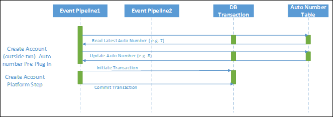
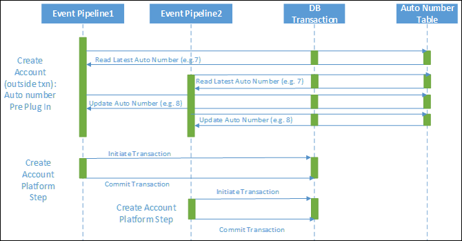
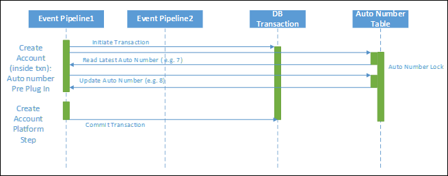
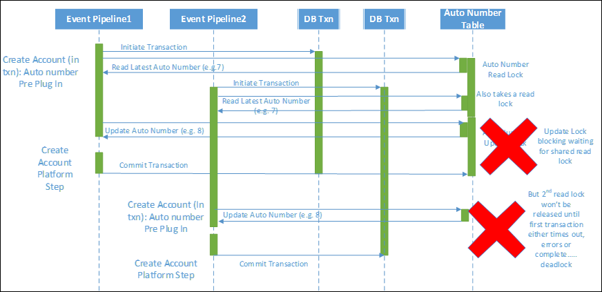
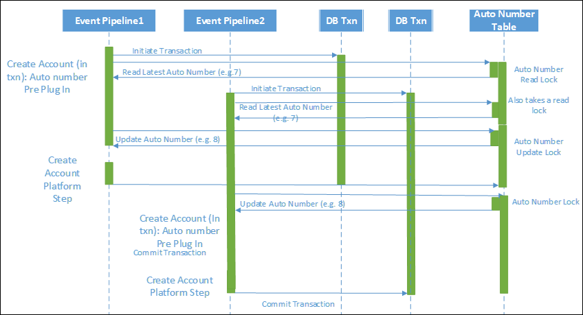
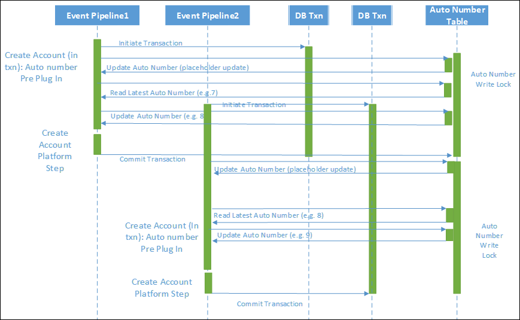
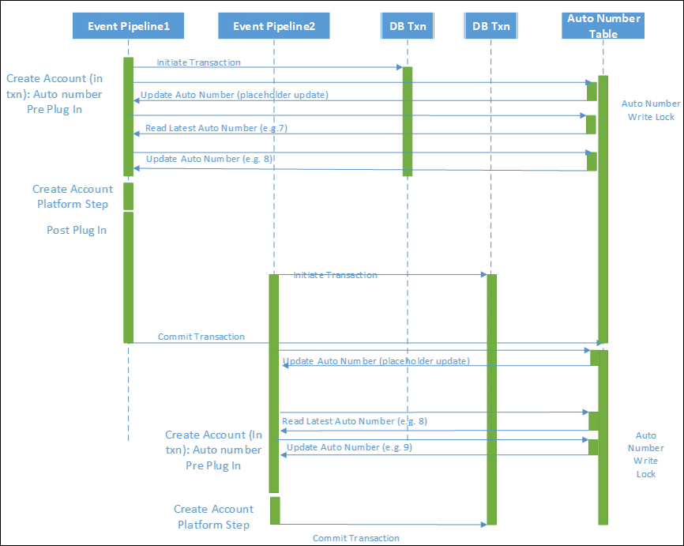
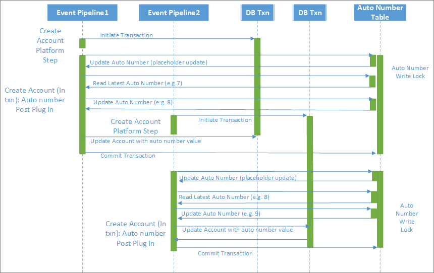

# Scalable Customization Design: Auto-numbering example

[!INCLUDE[cc-data-platform-banner](../../../includes/cc-data-platform-banner.md)]

> [!NOTE]
> This example supports a series of topics about scalable customization design. To start at the beginning, see [Scalable Customization Design in Microsoft Dataverse](overview.md).

One scenario that illustrates the common misunderstanding of how transactions are handled within Dataverse is implementing an automatic numbering scheme.

In this scenario the requirement is typically to:

- Generate a unique number following a particular pattern.
- Allow for many concurrent requests to create the related type of records; for example, accounts that need a unique reference.
- Allow for sequential numbering of the unique numbers.
- Ensure that the number generation is consistent, but scalable, and does not error out under load. It also needs to ensure that duplicate numbers cannot be generated.
- Generate the number on the creation of the relevant record.

The typical approach involves variations of the following:

- Store the last used number in an auto number index data store; for example, a custom entity with a row per data type.
- Retrieve the last used number and increment that number.
- Record the new number against the newly generated record.
- Store the new number back as being the last used number in the auto number index store.

The following sections describe different approaches that can be taken within Dataverse and highlight the implications, showcasing both the importance and benefit of understanding the way transactions are utilized. 

## Approach 1: Out of a transaction

The simplest approach is to realize that any use of a commonly required resource would introduce the potential for blocking. Since this has an impact on scalability you may decide you want to avoid a platform transaction when generating an auto number.
Let’s consider the scenario for auto numbering generation outside of the pipeline transaction in a pre-validation plug-in.

When you run this in isolation it works fine. It doesn’t, however, actually protect against concurrency errors. As the following diagram shows, if two requests in parallel both request the latest number and then both increment and update the value, you’ll end up with duplicate numbers. Because there is no locking held against the retrieved number, it is possible for a race condition to occur and both threads to end up with the same value. 

In many cases, even though multiple requests may be occurring, due to the limited window for overlapping this could work fine, but it is relying on luck rather than good design to prevent the duplication.

## Approach 2: In a plug-in transaction

If you do the auto numbering from a plug-in registered within the transaction (txn), surely this works….right?

In the same circumstances of overlapping requests trying to generate numbers at the same time, it would be possible for both requests to be granted a shared read lock on the auto numbering table. Unfortunately, at the point the application tries to upgrade this to an exclusive lock, this would not be possible as there would be another shared read lock preventing this.

Depending on how the queries are being generated, the exact behavior can vary, but relying on those conditions and not being certain of the outcome where the uniqueness is essential isn’t ideal. Even if this does not generate a failure, the shared read ability could allow a duplicate number to be generated if the isolation modes aren’t correct. As the following diagram shows, both records end up with the same auto number value of 8.

## Approach 3: Pre-lock in a plug-in transaction

Understanding the way the transactions work leads to being able to generate a safe way to do this. 

In this approach, from the start of the transaction, a placeholder update is performed on the auto numbering record to some field (for example, UpdateInProgress) used purely for the purpose of maintaining consistency. It does this by writing an update indicating an update is about to start. This process then requests and takes an exclusive write lock on that row in the auto numbering table, blocking other processes from starting the auto numbering approach. 

This then allows you to safely increment and write back the updated auto number without any other process being able to interfere. 

It does have the implication that this will serialize not only the auto numbering updates but also the account creation requests as both these steps occur in the same platform transaction. If the creation of accounts are quick actions then that may be a perfectly good approach and it ensures that account creation and auto numbering are performed consistently; if one fails they both fail and roll back.
 
In fact, where the other actions within the transaction are quick, this is the most consistent and efficient approach for implementing auto numbering in customizations. 

If however, you also introduce other synchronous plug-ins or workflows that each take extended amounts of time to complete, serialization can become a real scalability challenge, as the auto numbering process not only blocks itself but blocks waiting for the other activities to complete. 

Normally, generation of the auto number would be done in a pre-event plug-in. You include the number in the input parameters to the create step and avoid a second update in the post processing to record the generated auto number against the account.

With the scalability implications in mind, if there is other complex processing in the account creation process, an alternative would be to move the auto number generation to a post create process, which still ensures a consistent update process. The benefit would be that it reduces the length of time within the transaction that the auto number record lock is held as the lock is only taken towards the end of the process. If the auto numbering table is the most highly contested resource and this approach is taken for all processes accessing it, this reduces the amount of contention overall.

The tradeoff here would be the need to perform an additional update to account, while reducing the overall length of time blocking waiting for the auto numbering record.

[!INCLUDE[footer-include](../../../includes/footer-banner.md)]