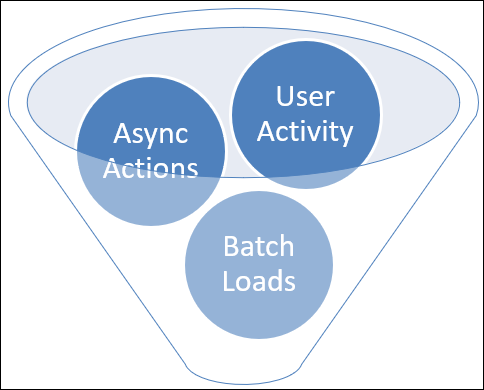
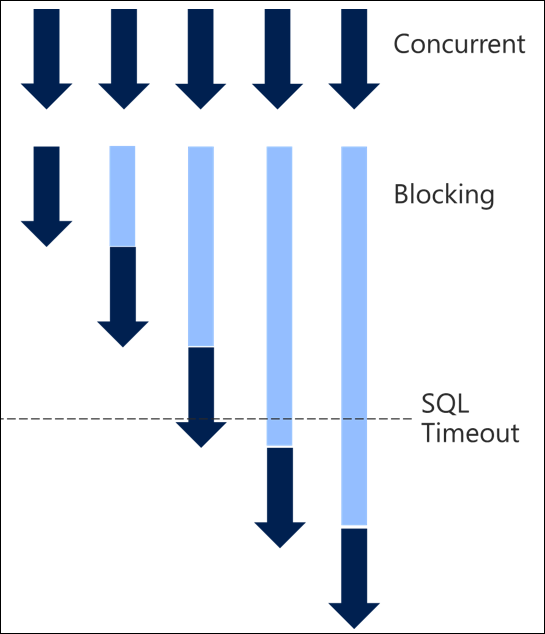
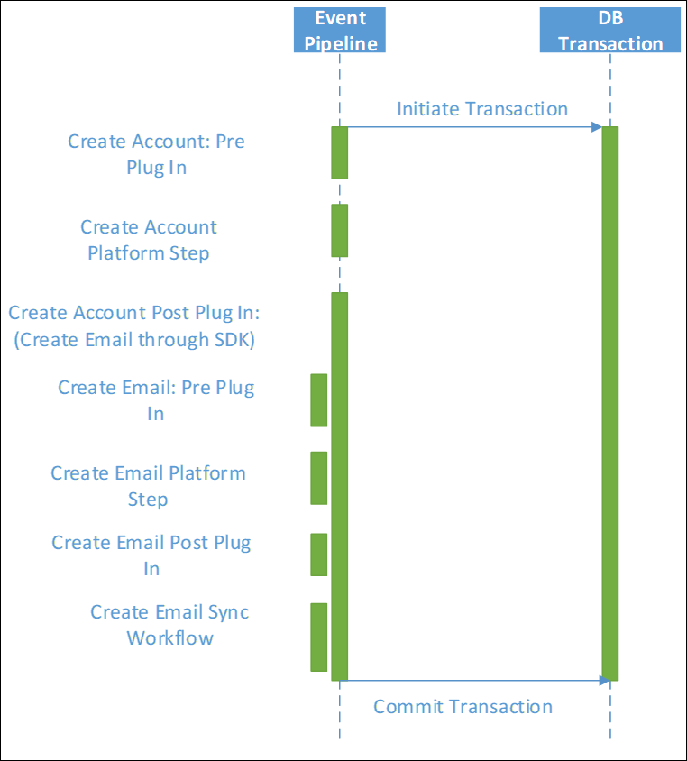
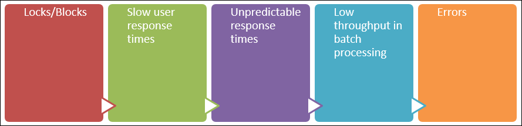

# Scalable Customization Design: Concurrency issues

[!INCLUDE[cc-data-platform-banner](../../../includes/cc-data-platform-banner.md)]

> [!NOTE]
> This is the third in a series of topics about scalable customization design. To start at the beginning, see [Scalable Customization Design in Microsoft Dataverse](overview.md).
> The previous topic [Scalable Customization Design: Database transactions](database-transactions.md) described how database transactions are applied and the effect they have on different types of customizations.

When you have concurrent requests, the chance of collisions on locks becomes higher. The longer the transactions take, the longer the locks are held. The chances are even higher of collision and the overall impact would be greater on end users. 

You also need to be aware of the multiple ways that activity can be driven onto the application, each of which is taking locks that could cause conflict with other actions within the system. In these cases, locking is preventing inconsistencies of data occurring when overlapping actions occur on the same data. 

Some key areas to consider design for, and check for if you do see problems, are:

- **User driven activity**: Directly through the user interface.
- **Async actions**: Activity that occurs later as a result of other actions. When this activity will be processed isn’t known at the time the initiating action is triggered.
- **Batch activities**: Either driven from within Dataverse such as bulk delete jobs or server side synchronization processing), or driven from external sources such as integration from another system.

## Async operations in parallel

A common misconception is that async workflows or plug-ins are processed serially from a queue and there wouldn’t be conflict between them. This isn’t accurate, since Dataverse processes multiple asynchronous activities in parallel both within each async service instance and across async service instances spread over different servers to increase throughput. Each async service actually retrieves jobs to be performed in batches of approximately 20 per service based on configuration and load.

If you initiate multiple asynchronous activities from the same event on the same record, they’re likely to process in parallel. As they fired on the same record, a common pattern is updates back to the same parent record; therefore the conflict opportunity is high. 

When a triggering event occurs, such as the creation of an account, asynchronous logic in Dataverse may create entries in the [AsyncOperation (System Job) Entity](../reference/entities/asyncoperation.md) for each process or action to be taken. The Async Service monitors this table, picks up waiting requests in batches, and then processes them. Because the workflows are triggered at the same time, they are highly likely to be picked up in the same batch and processed at the same time. 

## Why it’s important to understand transactions

The [Auto-numbering example](auto-numbering-example.md) provides a scenario that illustrates how database transactions and concurrency issues need to be considered when designing scalable customizations.

## Serialization and Timeouts

A high degree of serialization is typically what turns blocking into timeouts and poor throughput. When you have many concurrent requests, once they serialize and take a long time to process, each request in turn takes longer and longer until you start hitting timeouts and therefore errors. 

The plug-in timeout starts from when it is initiated. A SQL timeout is calculated on the database request, so if a query blocks waiting for a long time, it can time out.

## Chain of actions

As well as understanding the specific queries in the directly triggered activities, it is also necessary to consider where a chain of related events may occur.
 
Each message request made in a plug-in or as a step in a synchronous workflow not only triggers the direct action but may also cause other synchronous plug-ins and workflows to fire. Each of these synchronous activities will occur in the same transaction, extending the life of that transaction and any locks held possibly much longer than may be realized.

The overall effect may be much greater than initially realized. This can often happen unintentionally where multiple people are building up the implementation, or it evolves over time. 

## Running into platform constraints

This is where the platform constraints can come in. And in reality this sort of behavior is exactly what the constraints are there to protect the broader system from.

Whenever this level of delay of processing occurs, it will have unintended consequences in other areas of the system and on other users. It’s therefore important to prevent this kind of activity from interfering with system performance.

While the easy way to avoid the errors may be to relax the platform constraints, this is not addressing the more fundamental impact on the overall scalability and performance of the system. This needs to be addressed by fixing and preventing the behavior triggering the constraints in the first place. 

## Impact on usage

What often also has an impact on usage is a cascading series of implications of this behavior.

The initial issue is locks and therefore blocking in the system. This leads to slow user response times, which is then amplified as unpredictable and unreliable user response times, often in a particular area of the system.

In the extreme case or under heavier than normal load, this can then show through in any background batch processing with poor throughput. Eventually it can all escalate into errors occurring in the system.

It is common that when investigating SQL timeout errors, users are also reporting poor and unpredictable response times, and the connection had not been made between these as related issues. 

## Next steps

Understand design patterns you can apply (or avoid) to minimize performance issues. More information: [Scalable Customization Design: Transaction design patterns](transaction-design-patterns.md)

[!INCLUDE[footer-include](../../../includes/footer-banner.md)]