# Scalable Customization Design: Database transactions

[!INCLUDE[cc-data-platform-banner](../../../includes/cc-data-platform-banner.md)]

> [!NOTE]
> This is the second in a series of topics about scalable customization design. To start at the beginning, see [Scalable Customization Design in Microsoft Dataverse](overview.md).

One of the most fundamental concepts behind many of the challenges faced here is that of the database transaction. In Dataverse the database is at the heart of almost all requests to the system and the place data consistency is primarily enforced.

- No Dataverse data operations, either internal or part of code customizations, work completely in isolation.
- All Dataverse data operations interact with the same database resources, either at a data level or an infrastructure level such as processor, memory, or I/O usage.
- To protect against conflicting changes, each request takes locks on resources to be viewed or changed.
- Those locks are taken within a transaction and not released until the transaction is committed or aborted.

## Transaction and locking awareness

A common reason that problems can occur in this area is the lack of awareness of how customizations can affect transactions.

Although the details of how this is done is beyond the scope of this topic, the most simple element to consider is that as Dataverse interacts with data in its database. SQL Server determines the appropriate locks to be taken by transactions on that data such as:
- When retrieving a particular record, SQL Server takes a read lock on that record.
- When retrieving a range of records, in some scenarios it can take a read lock on that range of records or the entire table.
- When creating a record, it generates a write lock against that record.
- When updating a record, it takes a write lock against the record.
- When a lock is taken against a table or record, it’s also taken against any corresponding index records.

However, it’s possible to influence the scope and duration of these locks. It’s also possible to indicate to SQL Server that no lock is required for certain scenarios.

Let’s consider SQL Server database locking and the impact of separate requests trying to access the same data. In the following example, creating an account has set up a series of processes, some with plug-ins that are triggered as soon as the record is created, and some in a related asynchronous workflow that is initiated at creation.
 
The example shows the consequences  when an account update process has complex post processing while other activity also interacts with the same account record. If an asynchronous workflow is processed while the account update transaction is still in progress, this workflow could be blocked waiting to obtain an update lock to change the same account record, which is still locked.

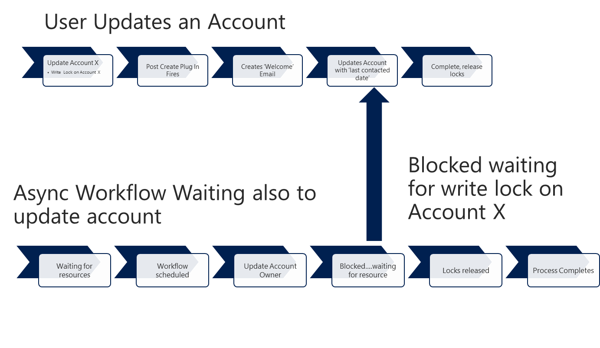

It should be noted that transactions are only held within the lifetime of a particular request to the platform. 
Locks aren’t held at a user session level or while information is being shown in the user interface. As soon as the platform has completed the request, it releases the database connection, the related transaction, and any locks it has taken. 

## Blocking

While the kind of blocking in the previous example can be inconvenient in and of itself, this can also lead to more serious consequences when you consider that Dataverse is a platform that can process hundreds of concurrent actions. While holding a lock on an individual account record may have reasonably limited implications, what happens when a resource  is more heavily contested?

For example, when each account is given a unique reference number it may lead to a single resource that is tracking the used reference numbers being blocked by every account creation process. As described in the [Auto-numbering example](auto-numbering-example.md), if a lot of accounts are generated in parallel, overlapping requests will all need to access that auto-numbering resource and will block it until they complete their action. The longer each account creation process takes, and the more concurrent requests there are, the more blocking occurs.

While the first request to grab the auto-number resource lock can easily be completed, the second request will need to wait for the first to complete before it can check what the next unique reference number is. The third request will have to wait for both the first and second requests to complete. The more requests there are, the longer blocking will occur. If there are enough requests, and each request takes long enough, this can push the later requests to the point that they time out, even though individually they may complete correctly.

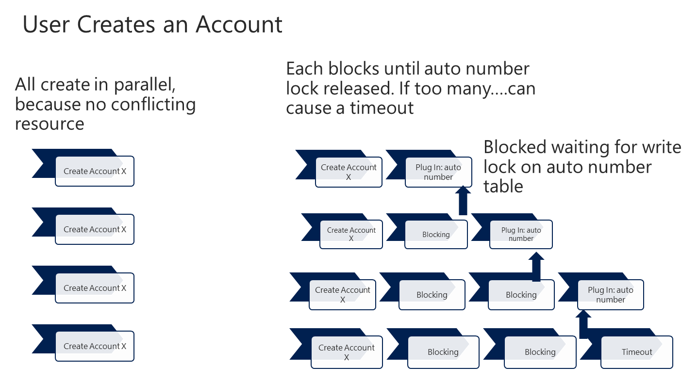

## Lock release

There are two primary reasons why a lock isn’t released but is held until the transaction is completed:

- The database server holds onto the lock for consistency in case the transaction will later make another request to update the data item.
- The database server also has to allow for the fact that an error or abort command issued later can cause it to roll the entire transaction back, so it needs to hold onto the locks for the entire lifetime of the transaction to ensure consistency.

It is important to recognize that even though your process may have completed any interactions with a particular piece of data, the lock will be held until the entire transaction is complete and committed. The longer the transaction is extended, the longer the lock will be held, preventing other threads from interacting with that data. 
As will be shown later, this also includes related customizations that work within the same transaction and can significantly extend the lifetime of transactions such as synchronous workflows.

In the following example, the write lock on a custom entity in the pre create plug-in for an account is locked until all logic tied to the creation of the account is completed.

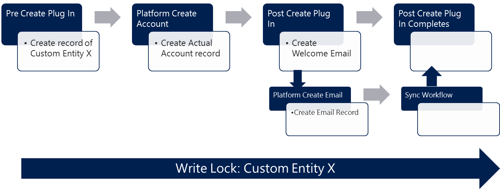

## Intermittent errors: timing

Intermittent behavior is an obvious symptom of blocking from concurrent activity. If repeating exactly the same action later succeeds when earlier it failed, there is a very strong likelihood that the error or slowness was caused by something else occurring at the same time.

That is important to realize as debugging a problem often involves stripping the offending functionality back to the bare minimum. However, when the problem only occurs intermittently, you may need to look at where the failing action is conflicting with another activity in the system, and you need to look at potential contention points. You can mitigate conflict by optimizing an individual process; however, the shorter the processing time, the less likely the activity will conflict with other processes. 

## Transaction control

While in most cases the way transactions are used can simply be left to the platform to manage, there are scenarios where the logic needed is complex enough that understanding and influence over transactions is required to achieve the desired results. Dataverse offers a number of different customization approaches that impact differently on the way transactions are used.

When you understand how each type of customization participates in the platform transactions, you can model complex scenarios effectively in Dataverse and predict their behavior.

As mentioned earlier, a transaction is only held during the lifetime of a request to the platform, it is not something that is maintained once the platform step is completed. This avoids transactions being held by an external client for long periods and blocking other platform activities.

The job of the platform is to maintain consistency throughout the platform transaction pipeline and where appropriate allow customizations to participate in that same transaction.

## How Model-driven Apps use transactions

Before understanding how customizations interact with the platform, it is useful to understand how model-driven apps use requests to the platform, and how it affects transaction use.

|Operation|Description|
|--|--|
|Forms (Retrieve)|&bull; Takes a read lock on the record shown. &bull; Low impact on other uses.|
|Create|&bull; Performs a create request through the platform &bull; Low impact on other activities, as a new record nothing else blocking on it &bull; Can potentially block locking queries to the whole table until it is complete. &bull; Often can trigger related actions in customization which can have an impact.|
|Update|&bull; Performs an update request through the platform. &bull; More likely to have conflicts. An update lock will block anything else updating or reading that record. Also blocks anything taking a broad read lock on that table. &bull; Often triggers other activities.|
|View (RetrieveMultiple)|&bull; Would think this would block lots of other activity. &bull; But deliberately passes `nolock` hints to queries &bull; So typically does not lock other activities. &bull; Although poor query optimization can affect DB resource usage and possibly hit timeouts.|

## Event pipeline: platform step

When an event pipeline is initiated, a SQL transaction is created to include the platform step. This ensures that all database activity performed by the platform is acted on consistently. The transaction is created at the start of the event pipeline and either committed or aborted when the processing is completed, depending on whether it was successful. 

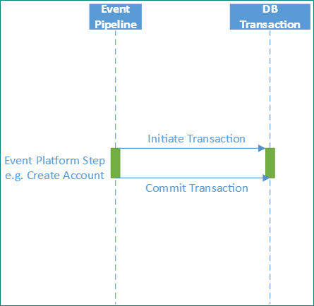

## Customization requests

It’s also possible to participate in the platform initiated transaction within customizations. Each type of customization participates in transactions in a different way. The following sections will describe each in turn. 
    
- [Sync plug-ins (pre or post operation: in transaction context)](#sync-plug-ins-pre-or-post-operation-in-transaction-context)
- [Sync plug-ins (pre and post operation: in transaction context)](#sync-plug-ins-pre-and-post-operation-in-transaction-context)
- [Sync plug-ins (**PreValidation**: outside transaction context)](#sync-plug-ins-prevalidation-outside-transaction-context)
- [Sync plug-ins (**PreValidation**: in transaction context)](#sync-plug-ins-prevalidation-in-transaction-context)
- [Async plug-ins](#async-plug-ins)
- [Plug-in transaction use summary](#plug-in-transaction-use-summary)
- [Synchronous workflows](#synchronous-workflows)
- [Asynchronous workflows](#asynchronous-workflows)
- [Custom workflow activity](#custom-workflow-activity)
- [Custom actions](#custom-actions)
- [Web service requests](#web-service-requests)

### Sync plug-ins (pre or post operation: in transaction context)

When plug-ins are registered for an event, they can be registered against a **PreOperation** or **PostOperation** stage that is within the transaction. Any message requests from the plug-in will be performed within the transaction. This means the lifetime of the transaction, and any locks taken, will be extended.

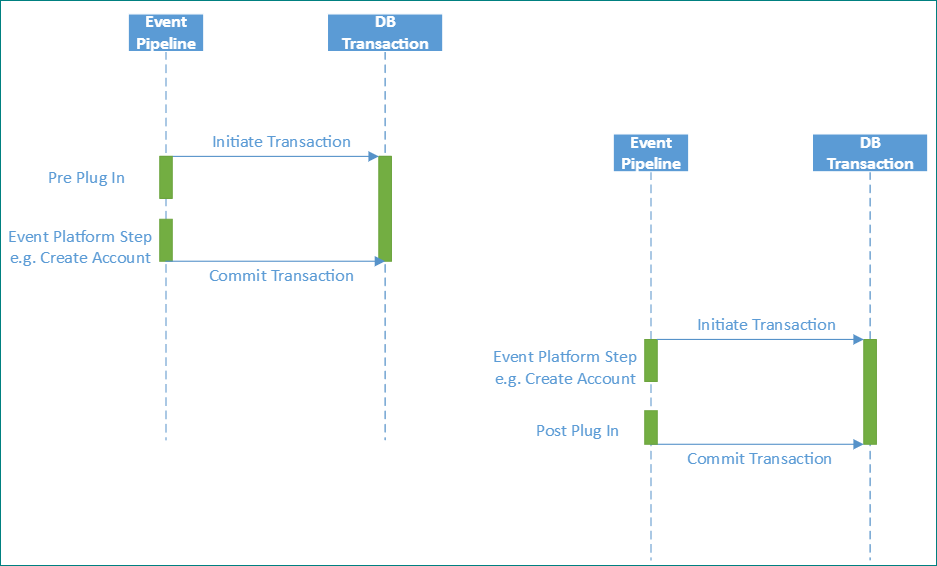

### Sync plug-ins (pre and post operation: in transaction context)

Plug-ins can be registered against both the **PreOperation** and **PostOperation** stages. In this case the transaction can extend even further because it will extend from the start of the **PreOperation** plug-in until the **PostOperation** plug-in completes.

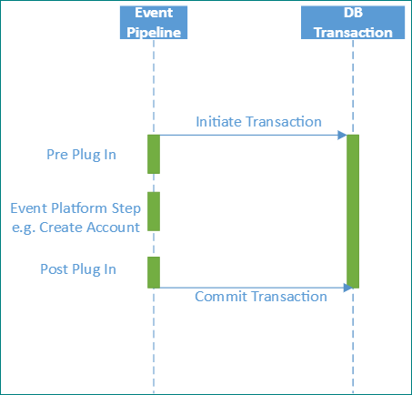

### Sync plug-ins (**PreValidation**: outside transaction context)

A plug-in can also be registered to act outside of the platform transaction by being registered on the **PreValidation** stage.

> [!NOTE]
> It does NOT create its own transaction. As a result, each message request within the plug-in is acted upon independently within the database.

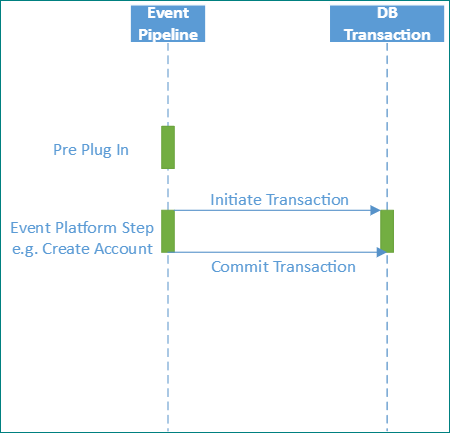

This scenario only applies when the **PreValidation** is called as the first stage of a pipeline event . Even though the plug-in is registered on the **PreValidation** stage, it is possible it will participate in a transaction as the next section describes. It can’t be assumed that a **PreValidation** plug-in doesn’t participate in a transaction, although it is possible to check from the execution context if this is the case.

### Sync plug-ins (**PreValidation**: in transaction context)

The related scenario occurs when a **PreValidation** plug-in is registered but the related pipeline event is triggered by message request from within an existing transaction. 

As the following diagram shows, creating an account can cause a **PreValidation** plug-in to perform initially outside of a transaction when the initial create is performed. If, as part of the post plug-in, a message request is made to create a related child account because that second event pipeline is initiated from within the parent pipeline, it will participate in the same transaction. 

In that case, the **PreValidation** plug-in will discover that a transaction already exists and so will participate in that transaction even though it’s registered on the **PreValidation** stage. 

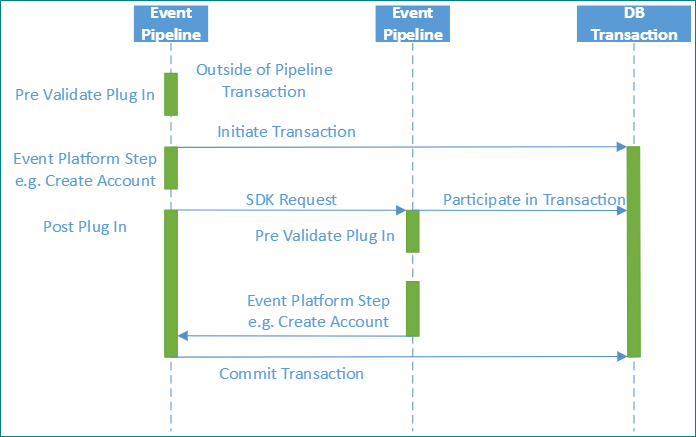

As previously mentioned, the plug-in can check the execution context for the <xref:Microsoft.Xrm.Sdk.IExecutionContext.IsInTransaction> property, which will indicate if this plug-in is performing within a transaction or not.

### Async plug-ins

A plug-in can also be registered to act asynchronously. In this case, the plug-in also acts outside of the platform transaction.

> [!NOTE]
> The plug-in doesn’t create its own transaction; each message request within the plug-in is acted upon independently.

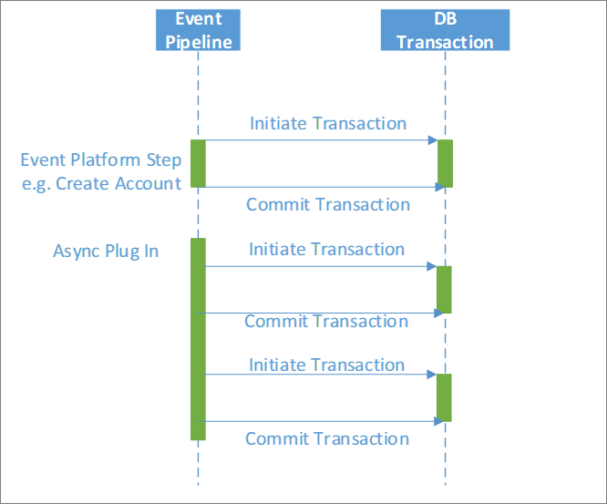

### Plug-in transaction use summary

To summarize:

- Synchronous plug-ins typically participate in transactions.
- Async plug-ins never participate in a platform transaction; each request is performed independently.
- **PreValidation** plug-ins don’t create a transaction but participate if one already exists.

|Event|Stage name|Transaction does not yet exist|Transaction already exists|
|--|--|--|--|
|Pre-Event|**PreValidation**|No transaction is created. Does not participate in transaction; each request uses independent transaction to the database|Participates in existing transaction|
|Pre-Event|**PreOperation**|Participates in existing transaction|Participates in existing transaction|
|Post-Event|**PostOperation**|Participates in existing transaction|Participates in existing transaction|
|Async|N/A|No transaction is created. Does not participate in transaction; each request uses independent transaction to the database|N/A|

### Synchronous workflows

From the perspective of transactions, synchronous workflows act as pre/post operation plug-ins. They therefore act within the platform pipeline transaction and can have the same effect on the length of the overall transaction.

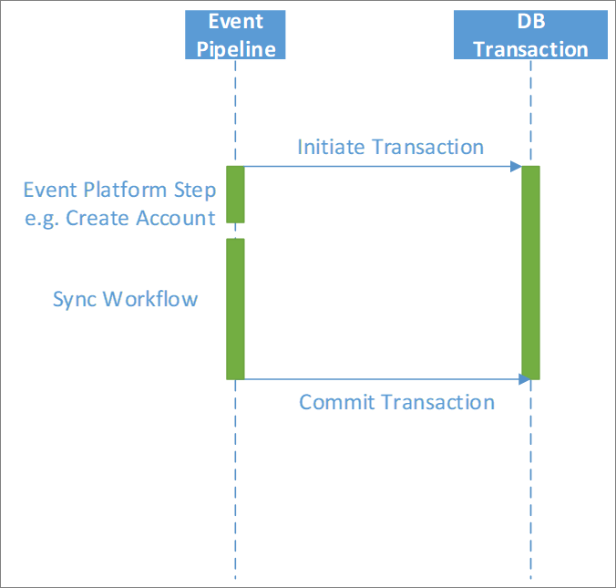

### Asynchronous workflows

Asynchronous workflows are triggered outside of the platform transaction.

> [!NOTE]
> The workflow also does NOT create its own transaction and therefore each message request within the workflow is acted upon independently.

The following diagram shows the asynchronous workflow acting outside of the platform transaction and each step initiating its own independent transaction.

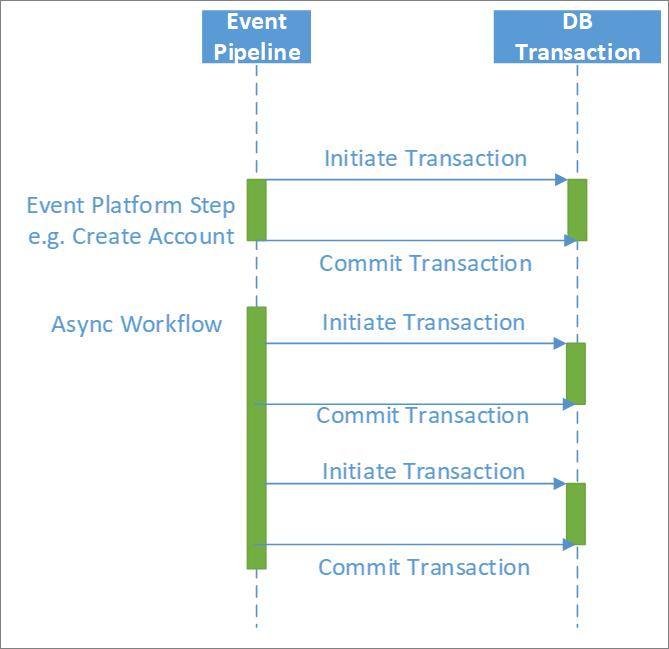

### Custom workflow activity

Custom workflow activities act within the parent workflow context.

- Sync workflow: Acts within the transaction
- Async workflow: Acts outside the transaction

The following diagram shows custom activities first acting within a synchronous workflow and then within an asynchronous workflow.

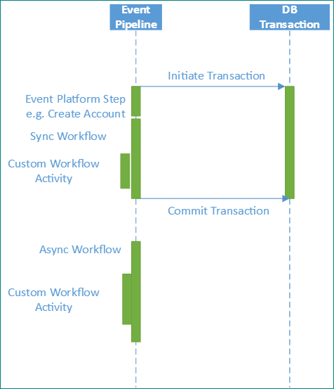

### Custom actions

Custom actions can create their own transactions. This is a key feature. A custom action can create a separate transaction outside of the platform step depending on whether it is configured to Enable Rollback.

- Enable Rollback set
    - If called through a message request from a plug-in running within the transaction, and Enable Rollback is set, the custom action will act within the existing transaction.
    - The custom action will otherwise create a new transaction and run within that.
- Enable Rollback not set
    - The custom action won’t act within a transaction.

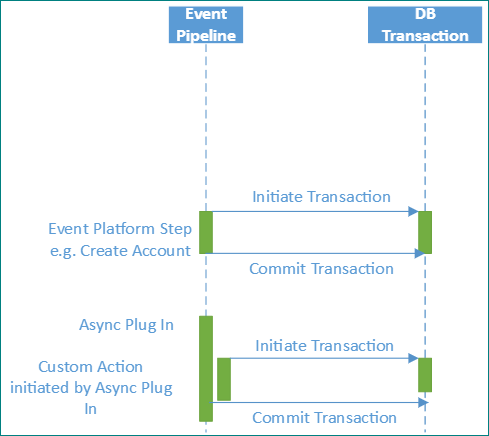

### Web service requests

When requests are made externally through web services, a pipeline is created and transaction handling within the pipeline occurs as previously discussed, but a transaction is not maintained once the response is returned. Since how long it will be until the next request is an unknown, the platform does not allow locking of resources which would block other activities.

When multiple requests are made within a plug-in using the same execution context, it is the common execution context that maintains the transaction reference and in synchronous plug-ins ensures each request is made within the same transaction. The ability to maintain an execution context across requests is not available outside of plug-ins and therefore a transaction cannot be maintained across separate requests made externally.

There are two special messages where multiple actions can be passed to the Dataverse platform as part of a single web service request.

|Message|Description|
|--|--|
|`ExecuteMultiple`|This allows multiple independent actions to be passed within the same web service request. Each of these requests is performed independently within the platform so there is no transaction context held between requests.|
|`ExecuteTransaction`|This allows multiple actions to be processed within the same database transaction, in a similar way to multiple message requests made from within a synchronous plug-in.   This ability would also have implications similar to multiple message requests; that is, if each action takes a long time (such as by making expensive queries or triggering a long chain of related synchronous plug-ins or workflows) this could lead to blocking issues in the broader platform.|

#### Web API (OData) Requests in plug-ins

Do not use Web API (OData) requests within a plug-in to the same organization as the plug-in. Always use the <xref:Microsoft.Xrm.Sdk.IOrganizationService> methods. This allows for the transaction context to be passed so that the operation can participate in the pipeline transaction.

## Next steps

In addition to database transactions, it is important to appreciate the impact of multiple concurrent data operations can have on the system. More information: [Scalable Customization Design: Concurrency issues](concurrency-issues.md)

[!INCLUDE[footer-include](../../../includes/footer-banner.md)]