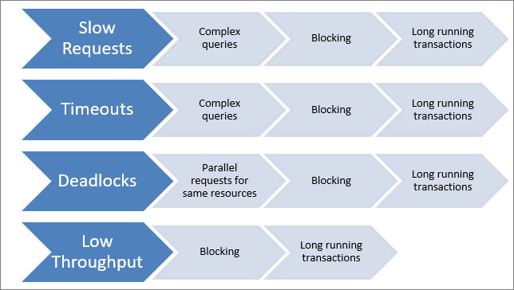

# Scalable Customization Design in Microsoft Dataverse

[!INCLUDE[cc-data-platform-banner](../../../includes/cc-data-platform-banner.md)]

> [!NOTE]
> This is the first in a series of topics about scalable customization design. While this content has been divided into separate topics, it presents a wholistic view of concepts, issues, and strategies surrounding the design of scalable customizations. Each topic builds upon concepts established in preceding topics.
> You can [download these topics as a single PDF document](/powerapps/opbuildpdf/developer/data-platform/scalable-customization-design/TOC.pdf?branch=live) if you want to read it offline.

Dataverse is designed to protect itself and its users from long running activities that could affect both the response times for the user making a request and the stability and responsiveness of the system for other users.

A challenge faced by some people implementing Dataverse solutions are errors thrown by the platform or the underlying Microsoft SQL Server database when these protective measures take effect. This is often interpreted as the platform not being able to scale or incorrectly terminating or throttling requests to the system.

This content is based on experiences investigating and addressing the true underlying causes of the majority of these types of challenges. These topics describe how the platform protects itself from the impact of these requests imposed on the system and explains why this behavior is most often the result of custom implementations not understanding the impact on blocking and transaction usage within the platform.

This content also describes how optimizing a custom implementation to avoid these types of behaviors will not only avoid platform errors, but also enable better performance and end user experiences as a result. It provides good design practices and identifies common errors to avoid.

## The challenge

Investigating and addressing the challenges in this area typically starts when certain types of errors and symptoms appear in the system. These are often perceived to be problems in the platform and the necessary remedial step is to loosen up the platform constraints that typically trigger a slow running request to become a reported error.

In reality, while the errors could be avoided in the short term by relaxing some of the platform constraints, these constraints are there for good reasons and are designed to prevent an excessively long running action from affecting other users or system performance. While the constraints could be relaxed to avoid the errors, users would still be experiencing slow response times and this would be affecting other users’ experience of the system as well.

Therefore, it’s preferable to look at the root causes of why these constraints are being triggered and causing errors, and then optimize the code customizations to avoid them. This will provide a more consistent and more responsive system for the users. 

### Common symptoms

These types of problems typically exhibit a combination of common symptoms as shown in the following table.

|Symptom|Description|
|--|--|
|**Slow requests**|Users see slow response times for the system in particular areas, for example, certain forms and queries|
|**Generic SQL errors**|Certain actions respond with a platform error reporting a Generic SQL Error.  This often translates at a platform layer to a SQL timeout.|
|**Deadlocks**|Platform errors reporting that a deadlock has occurred, which has forced the action to be terminated and rolled back.|
|**Limited throughput**|Particularly in batch load scenarios, this often exhibits in really slow throughput being achieved, much slower than should be possible.|
|**Intermittent errors / slow performance**|An important indicator of these behaviors is where the same action can be very fast or incredibly slow, and retrying it works much more quickly or avoids an error|

In reality a combination of these symptoms can and often would be reported together when these challenges are faced. It’s not always the case that these symptoms are an indicator of problems with the design. Other issues, such as disk I/O limitations in the database or a product bug, can cause similar symptoms. But the most common cause of these kinds of symptoms, and therefore one worth checking for, relates directly to the design of the custom implementation and how it affects the system. 

> *Why should we worry? Doesn’t Dataverse just take care of this…?*

It does as far as it can… But it uses locking and transactions to protect the system against conflicts when required.

We also provide options for you to make choices about your particular scenario and to decide where it is important to control access to data. But those choices can be made incorrectly, and it is possible to introduce unintended consequences in custom code. 
These problems typically have an impact on the user experience through slower response times so understanding the implications of certain actions can lead to more consistent and better results for users.

## Understanding causes

Common symptoms have causes that force particular requests to run slowly and then to trigger platform constraints. The following diagram shows typical symptoms with some of the common root causes of these symptoms.

The underlying impact of long running transactions, database blocking, and complex queries can all overlap with each other and amplify their effects to cause these symptoms. For example, a series of long running queries that are completely independent of each other may cause slow user response times, but only once they require access to the same resources do the response times become so slow that they become errors. 

## Design for platform constraints

The Dataverse platform has a number of deliberate constraints it imposes to prevent any one action having too detrimental an impact on the rest of the system and, therefore, on users. 
While this behavior can be frustrating since it can block specific requests from completing and often leads to questions around whether the constraints can be lifted, this is rarely a good approach when you consider the broader implications.

When the platform is used as intended and an implementation is optimized, it’s very rare that there is a scenario where these constraints would be encountered. Running into the constraint is almost always an indication of behaviors that will be tying up resources excessively in the system. This means other requests either from the same user or other users can’t be processed. So while it may be possible to loosen the constraint on the request being blocked, what that actually means is that the resources it is consuming are tied up for even longer causing bigger impacts on other users.

At the heart of these constraints is the idea that the Dataverse platform is designed to support a transactional, multi-user application where quick response to user demand is the priority. It’s not intended to be a platform for long running or batch processing. It is possible to drive a series of short requests to Dataverse but Dataverse isn’t designed to handle batch processing. Equally, where there are activities running large iterative processing, Dataverse isn’t designed to handle that iterative processing.

In those scenarios, a separate service can be used to host the long running process, driving shorter transactional requests to Dataverse itself. For example, using Flow or hosting Microsoft SQL Server Integration Services (SSIS) elsewhere and then driving individual create or update requests to Dataverse is a much better pattern than using a plug-in to loop through thousands of records being created in Dataverse.

It is worth being aware of and understanding the platform constraints that do exist, so that you can allow for them in your application design. Also, if you do encounter these errors, you can understand why they are happening and what you can change to avoid them.

|Constraint|Description|
|--|--|
|**Plug-in timeouts**|&bull; Plug-ins will time out after 2 minutes  &bull; Don't preform long running operations in plug-ins. Protects the platform and the sandbox service and ultimately the user from poor user experience|
|**SQL timeouts**|&bull; Requests to SQL Server time out at 30 seconds &bull; Protects against long running requests &bull; Provides protection within a particular organization and its private database &bull; Also provides protection at a database server level against excessive use of shared resources such as processors/memory|
|**Workflow limits**|&bull; Operates under a Fair Usage policy &bull; No specific hard limits, but balance resource across organizations &bull; Where demand is low an organization can take full advantage of available capacity. Where demand is high, resources and throughput are shared.|
|**Maximum concurrent connections**|&bull; There is a platform default setting of  a maximum connection pool limit of 100 connections from the  Web Server connection pool in IIS to the database. Dataverse does not change this value &bull; If you hit this, it is an indication of an error in the system; look at why so many connections are blocking &bull; With multiple web servers, each with 100 concurrent connections to the database of typical &lt; 10ms, this suggests a throughput of &gt; 10k database requests for each web server. This should not be required and would hit other challenges well before that|
|**ExecuteMultiple**|&bull; The `ExecuteMultiple` message is designed to assist with collections of operations being sent to Dataverse from an external source &bull; The processing of large groups of these requests can tie up vital resources in Dataverse at the expense of more response critical requests by users.|
|**Service Protection Limits**|&bull; To ensure consistent availability and performance for everyone we apply some limits to how APIs are used. These limits are designed to detect when client applications are making extraordinary demands on server resources. &bull; More information: [Service Protection API Limits](../api-limits.md)|

## Next steps

To understand how the platform constraints are applied it is necessary to understand database transactions. More information: [Scalable Customization Design: Database transactions](database-transactions.md)

[!INCLUDE[footer-include](../../../includes/footer-banner.md)]