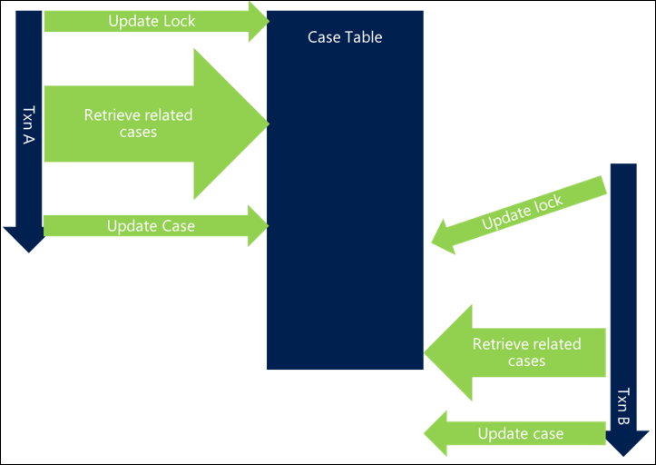

# Scalable Customization Design: Transaction design patterns

[!INCLUDE[cc-data-platform-banner](../../../includes/cc-data-platform-banner.md)]

> [!NOTE]
> This is the fourth in a series of topics about scalable customization design. To start at the beginning, see [Scalable Customization Design in Microsoft Dataverse](overview.md).

This section describes design patterns to avoid or minimize and their implications. Each design pattern needs to be considered in the context of the business problem being solved and can be useful as options to investigate.

## Don’t avoid locking

Locking is a very important component of SQL Server and Dataverse, and is essential to healthy operation and consistency of the system. For this reason it is important to understand its implications on design, particularly at scale.

## Transaction usage: Nolock hint

One capability of the Dataverse platform that is heavily used by views is the ability to specify that a query can be performed with a nolock hint, telling the database that no lock is needed for this query. 

Views use this approach because there is no direct link between the act of launching the view and subsequent actions. A number of other activities could happen either by that user or others in between and it is not practical or beneficial to lock the entire table of data the view shows waiting until the user has moved on. 

Because a query across a large data set means that it potentially affects others trying to interact with any of that data, being able to specify that no lock is required can have a significant benefit on system scalability. 

When making a query of the platform through the SDK it can be valuable to specify that nolock can be used. It indicates that you recognize this query doesn’t need to take a read lock in the database. It’s especially useful for queries where:

- There’s a broad scope of data
- Highly contested resources are queried
- Serialization isn’t important

Nolock shouldn’t be used if a later action depends on no change to the results, such as in the auto number locking example earlier. 

An example scenario where it can be useful is determining if an email is related to an existing case. Blocking other users from creating new cases to ensure there is no possibility of a case being generated that the email could link to would not be a beneficial level of consistency control. 

Instead, making a reasonable effort to query for related cases and attach the email to an existing case or create a new one, while still allowing other cases to be generated, is more appropriate. Particularly, as there is no inherent link in the timing between these two actions, the email could just as easily have come in a few seconds earlier and no link would have been detected. 

Whether nolock hints are valid for a particular scenario would typically be based on a judgment of the likelihood and impact of conflicts occurring and the business implication of not ensuring consistency of actions between a retrieve and subsequent actions. Where no business impact would occur from avoiding locking, using nolocks would be a valuable optimization choice. If there is a potential business impact, the consequence of this can be weighed against the performance and scalability benefits of avoiding locking. 

## Consider order of locks

Another approach that can be useful in reducing the impact of blocking, and particularly in avoiding deadlocking, is having a consistent approach to the ordering of locks in an implementation. 

A simple and common example is when updating or interacting with groups of users. If you have requests that update related users (such as adding members to teams or updating all participants in an activity), not specifying an order can mean that if two concurrent activities try to update the same users, you can end up with the following behavior, which results in a deadlock: 

- Transaction A tries to update User X and then User Y
- Transaction B tries to update User Y and then User X

Because both requests start together, Transaction A is able to get a lock on User X and Transaction B is able to get a lock on User Y, but as soon as each of them try to get a lock on the other user they block and then deadlock. 

Simply by ordering the resources you access in a consistent way you can prevent many deadlock situations. The ordering mechanism is often not important as long as it is consistent and can be done as efficiently as possible. For example, ordering users by name or even by GUID can at least ensure a level of consistency that avoids deadlocks.

In a scenario using this approach, Transaction A would get User X, but Transaction B would also try now to get User X rather than User Y first. While that means Transaction B blocks until Transaction A completes, this scenario avoids the deadlock and is completed successfully.

In more complex and efficient scenarios, it may be that you lock least commonly referenced users first and more frequently referenced users last, which leads to the next design pattern.

## Hold contentious locks for shortest period

There are scenarios, such as the auto numbering approach, where there is no way around the fact that there is a heavily contested resource that needs to be locked. In that case, the blocking problem can’t be completely avoided, but can be minimized.

When you have heavily contested resources, a good design is to not include the interaction with that resource at the functionally logical point in the process, but move the interaction with it to as close to the end of the transaction as possible. 

With this approach, although there will still be some blocking on this resource, it reduces the amount of time that resource is locked, and therefore decreases the likelihood and time in which other requests are blocked while waiting for the resource. 

## Reduce length of transactions

In a similar way, a lock only becomes a blocking issue if two processes need access to the same resource at the same time. The shorter the transaction that holds a lock, the less likely that two processes, even if they access the same resource, will need it at exactly the same time and cause a collision. The less time the transactions are held, the less likely blocking will become a problem.

In the following example, the same locks are taken but other processing within the transaction means that the overall length of the transaction is extended, leading to overlapping requests for the same resources. This means that blocking occurs and each request is slower overall.

By shortening the overall length of the transaction, the first transaction completes and releases its locks before the second request even starts, meaning there is no blocking and both transactions complete efficiently. 

Other activities within a request that extend the life of a transaction can increase the chance of blocking, particularly when there are multiple overlapping requests, and can lead to a significantly slower system. 

There are a number of ways that the transaction length can be reduced.

## Optimize requests

Each transaction is made up of a series of database requests. If each request is made as efficiently as possible, this reduces the overall length of a transaction and reduces the likelihood of collision.

Review each query you make to determine whether:

- Your query only asks for what it needs, for example, columns, records, or entity types.
  - This maximizes the chance that an index can be used to efficiently service the query
  - It reduces the number of tables and resources that need to be accessed, reducing the overhead on other resources in the database server and reducing the query time
  - It avoids potential blocking on resources that you don’t need, particularly where a join to another table is asked for but could be avoided or is unnecessary
- An index is in place to assist the query, you are querying in an efficient way, and an index seek rather than scan is taking place

  It’s worth noting that introducing an index doesn’t avoid locking on create/update of records in the underlying table. The entries in the indexes are also locked when the related record is updated as the index itself is subject to change. The existence of indexes doesn’t avoid this problem completely.

In the following example, the retrieval of related cases isn’t optimized and adds to the overall transaction length, introducing blocking between threads.

By optimizing the query, there’s less time spent performing it, and the chance of collision is lower, thereby reducing blocking.

Making sure that the database server can process your query as efficiently as possible can significantly decrease the overall time of your transactions and reduce the potential for blocking.

## Reduce chain of events

As was shown in earlier examples, the consequences of long chains of related events can have a material impact on the overall transaction time and therefore the potential for blocking arises. This is particularly the case when triggering synchronous plug-ins and workflows, which then trigger other actions, and they in turn trigger further synchronous plug-ins and workflows.

Carefully reviewing and designing an implementation to avoid long chains of events occurring synchronously can be beneficial in reducing the overall length of a transaction. This allows any locks that are taken to be released more quickly and reduce the potential for blocking. 

It also reduces the likelihood of secondary locks becoming a major concern. In the auto numbering example on account creation, the primary issue initially is access to the auto numbering table, but when many different actions are performed in one sequence, a secondary blockage, such as updates to a related user record, may start to surface also. Once multiple contested resources are involved, avoiding blocking becomes even harder. 

Considering whether some activities need to be synchronous or asynchronous can mean the same activities are achieved but have less initial impact. Particularly for longer running actions or those depending on heavily contested resources, separating them from the main transaction by performing them in an asynchronous action can have significant benefits. This approach will not work if the action needs to complete or fail with the broader platform step, such as updating a police crime report with the next auto number value ensuring a continuous, sequential number scheme is maintained. In those scenarios other approaches to minimize the impact should be taken. 

As the following example shows, simply by moving some actions out to an asynchronous process, which means the actions are performed outside of the platform transaction, can mean that the length of the transaction is shorter and the potential for concurrent processing increases.

## Avoid multiple updates to the same record

When designing multiple layers of functional activity, while it is good practice to break down the needed actions to logical and easily followed flows of activity, in many cases this would lead to multiple, separate updates to the same record.
 
In the case handling scenario, first updating a case with a default owner based on the customer it is raised against and then later having a separate process to automatically send communications to that customer and update the last contact date against the case is a perfectly logical thing to do functionally. 

The challenge, however, is that this means there are multiple requests to Dataverse to update the same record, which has a number of implications:

- Each request is a separate platform update, adding overall load to the Dataverse server and adding time to the overall transaction length, increasing the chance of blocking.
- It also means that the case record will be locked from the first action taken on that case, meaning that the lock is held throughout the rest of the transaction. If the case is accessed by multiple parallel processes, that could cause blocking of other activities. 

Consolidating updates to the same record to a single update step, and later in the transaction, can have a significant benefit to overall scalability, particularly if the record is heavily contested or accessed by multiple people quickly after creation, for example, as with a case.

Deciding whether to consolidate updates to the same record to a single process would be based on balancing the complexity of implementation against the potential for conflict that separate updates could introduce. But for high volume systems, this can be very beneficial for highly contested resources. 

## Only update things you need to

While it is important not to reduce the benefit of a Dataverse system by excluding activities that would be beneficial, often requests are made to include customizations that add little business value but drive real technical complexity.
 
If every time we create a task we also update the user record with the number of tasks they currently have allocated, that could introduce a secondary level of blocking as the user record would also now be heavily contended. It would add another resource that each request may need to block and wait for, despite not necessarily being critical to the action. In that example, consider carefully whether storing the count of tasks against the user is important or if the count can be calculated on demand or stored elsewhere such as using hierarchy and rollup field capabilities in Dataverse natively. 

As will be shown later, updating system user records can have negative consequences from a scalability perspective. 

## Multiple customizations triggered on same event

Triggering multiple actions on the same event can result in a greater chance of collision as by the nature of the requests those actions are likely to interact with the same related objects or parent object.

This is a pattern that should be carefully considered or avoided as it is very easy to overlook conflicts, particularly when different people implement the different processes.

## When to use different types of customization

Each type of customization has different implications for use. The following table highlights some common patterns, when each should be considered and used, and when it isn’t appropriate for use.

Often a compromise between different behaviors may need to be considered so this gives guidance of some of the common characteristics and scenarios to consider but each scenario needs to be evaluated and the right approach chosen based on all the relevant factors.

|Pre/post stage|Sync/async|Type of customization|When to use|When not to use|
|--|--|--|--|--|
|Pre Validation|Sync|Plug-in|Short term validation of input values|Long running actions.  When creating related items that should be rolled back if later steps fail.|
|Pre Operation|Sync|Workflow/Plug-in|Short term validation of input values.  When creating related items that should be rolled back as part of platform step failure.|Long running actions.  When creating an item and the resulting GUID will need to be stored against the item the platform step will create/update.|
|Post Operation |Sync|Workflow/ Plug-in|Short running actions that naturally follow the platform step and need to be rolled back if later steps fail, for example, creation of a task for the owner of a newly created account.  Creation of related items that need the GUID of the created item and that should roll back the platform step in the event of failure|Long running actions.  Where failure should not affect the completion of the platform pipeline step.|
|Not in event pipeline|Async|Workflow/ Plug-in|Medium length actions that would impact on the user experience.  Actions that cannot be rolled back anyway in the event of failure.  Actions that should not force the rollback of the platform step in the event of failure.|Very long running actions.  These shouldn’t be managed in Dataverse.  Very low cost actions. The overhead of generating async behavior for very low cost actions may be prohibitive; where possible do these synchronously and avoid the overhead of async processing.|
|N/A Takes context of where it is called from||Custom Actions|Combinations of actions launched from an external source, for example, from a web resource|When always triggered in response to a platform event, use plug-in/workflow in those cases.|

## Plug-ins/workflows aren’t batch processing mechanisms

Long running or volume actions aren’t intended to be run from plug-ins or workflows. Dataverse isn’t intended to be a compute platform and especially isn’t intended as the controller to drive big groups of unrelated updates.

If you have a need to do that, offload and run from a separate service, such as an Azure worker role. 

## Setting up security

A very common escalation area is scalability of setting up security. This is a costly operation, so when done in volume can always cause challenges if not understood and carefully considered. 

### Team setup

- Always add users in the same order: avoid deadlocks
- Only update users if they need to be updated: avoid invalidating users' caches unnecessarily

### Owner v. access teams

- If users' teams change regularly, be careful about using owner teams heavily; every time they change they invalidate the user’s cache in the web server
- Ideally make changes when the user isn’t working, reduce impact, such as overnight

### Lots of team memberships/ BUs

- Consider carefully scenarios with lots of teams/BUs add to complexity of calculation

### Cascading behavior

- Consider cascading sharing, for example, assignment

### Careful updating  of user records

- Don’t regularly update system user records unless something fundamental has changed as this forces the user cache to be reloaded and the security privileges to be recalculated, an expensive activity
- Don’t use system user to record how many open activities the user has, for example

## Diagram related actions

An activity that is very beneficial as a preventative measure, as well as a tool for diagnosing blocking problems, is to diagram related actions triggered in the Dataverse platform. When doing this it helps to highlight both intentional and unintentional dependencies and triggers in the system. If you aren’t able to do this for your solution, you might not have a clear picture of what your implementation actually does. Creating such a diagram can expose unintended consequences and is good practice at any time in an implementation. 

The following example highlights how initially two processes work perfectly well together but in ongoing maintenance the addition of a new step to create a task can create an unintended loop. Using this documentation technique can highlight this at the design stage and avoid this affecting the system.

<!-- NOTE: Excluding content on isolation modes and transaction diagnosis as it is for on-premises only. -->

## Review system captured statistics

There are a number of ways to determine what is happening if the problem occurs outside of the database layer. The first is analysis of plug-in performance. The [PluginTypeStatistic Entity](../reference/entities/plugintypestatistic.md) can be queried to give an indication of how often the plug-in is running, and statistics on how long it typically takes to run.

When certain errors are occurring, using the server trace files to understand where related problems may be occurring in the platform can also be useful. More information: [Use Tracing](../debug-plug-in.md#use-tracing)

## Summary

The content in [Scalable Customization Design in Dataverse](overview.md) and the subsequent topics [Database transactions](database-transactions.md), [Concurrency issues](concurrency-issues.md), and this one have described the following concepts with examples and strategies that will help you understand how to design and implement scalable customizations for Dataverse.

Some key things to remember include the following: 

### Locks/ transactions

- Locks and transactions are essential to a healthy system
- But when used incorrectly, can lead to problems

### Platform constraints

- Platform constraints often exhibit in the form of errors
- But rarely is the constraint the cause of the problem
- They’re there to protect the platform and other activity from being affected

### Design for transaction use

- If implementations are designed with transaction behavior in mind, this can lead to much greater scalability and improved user performance

[!INCLUDE[footer-include](../../../includes/footer-banner.md)]