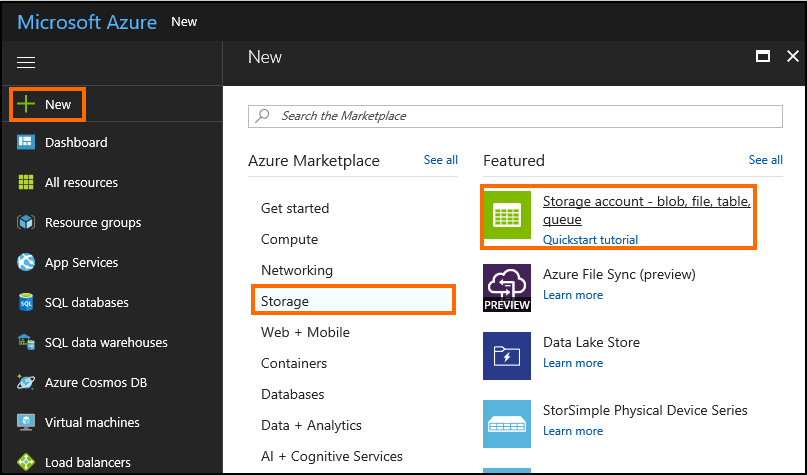
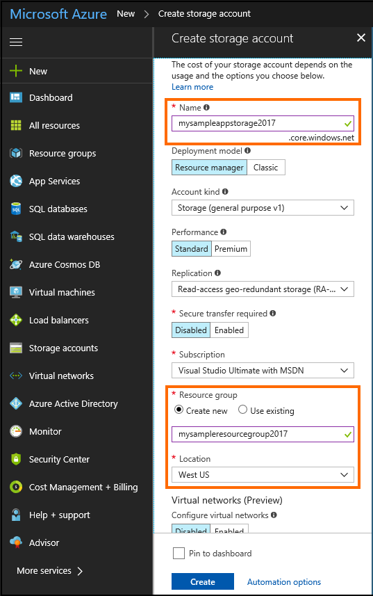
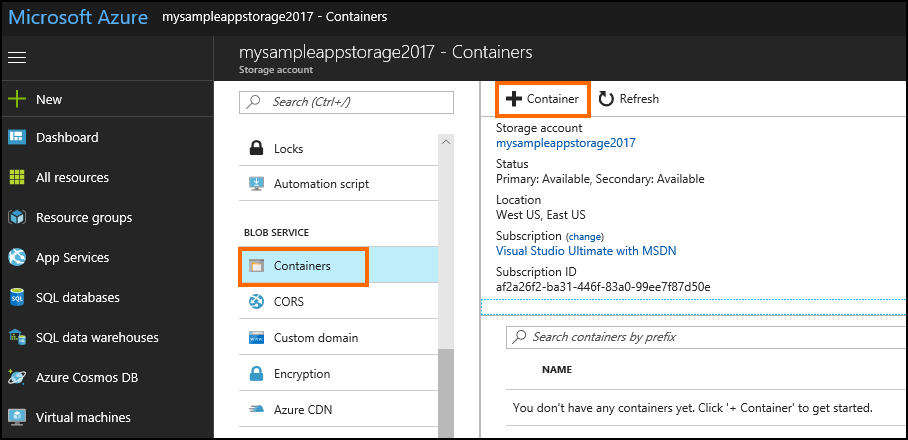
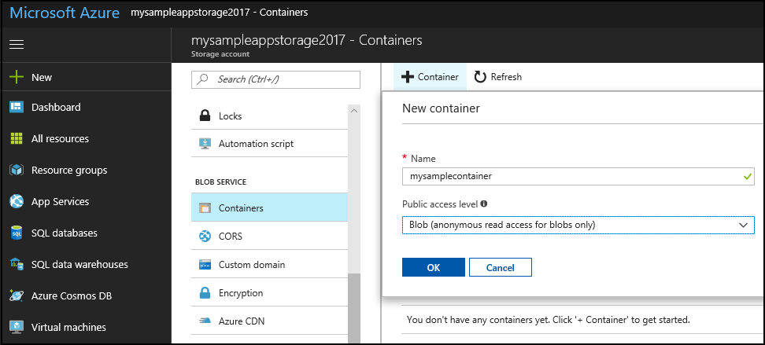
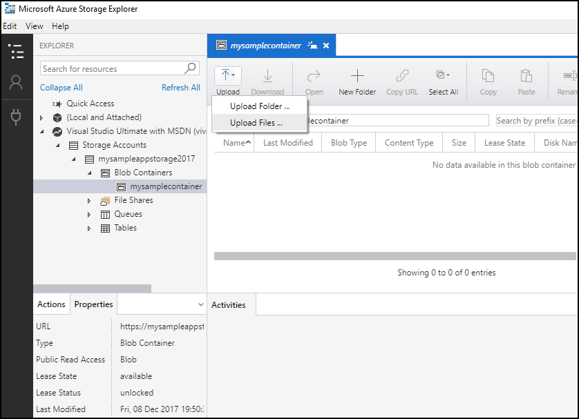
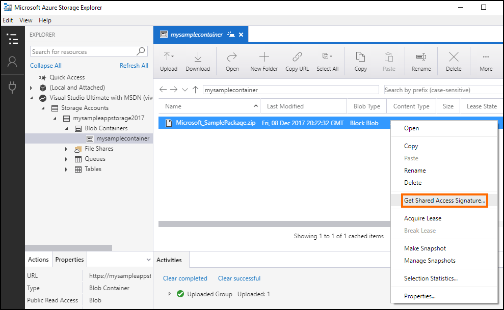
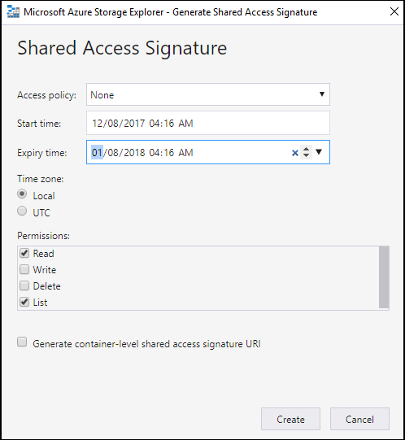
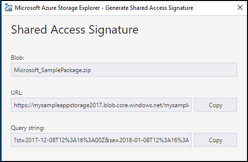

# Step 4: Store your AppSource Package on Azure Storage and generate a URL with SAS key

[!INCLUDE[cc-data-platform-banner](../../includes/cc-data-platform-banner.md)]

Microsoft Azure Storage is a Microsoft-managed cloud service that provides storage that is highly available, secure, durable, scalable, and redundant. More information: [Introduction to Microsoft Azure Storage](/azure/storage/common/storage-introduction).

To maintain security of your files, all app developers must store their AppSource package file in a Microsoft Azure Blob storage account, and use a Shared Access Signature (SAS) key to share the package file. Your package file is retrieved from your Azure Storage location for certification, and then for AppSource trials.

## Before you upload your package

Download and install the Microsoft Azure Storage Explorer from [https://storageexplorer.com](https://storageexplorer.com).

Azure Storage Explorer lets you easily manage the contents of your storage account.

## Upload your package and generate a URL with SAS key

To upload your package to Azure Blob storage:

1. Create a free trial or pay as you go Azure account at [https://azure.microsoft.com](https://azure.microsoft.com).
2. Sign in to Azure Management portal at [https://portal.azure.com](https://portal.azure.com).
3. Create a new Storage account by clicking  > **Storage** > **Storage account - blob, file, table, queue**.
    
   

4. On the **Create storage account** page, specify **Name**, **Resource group**, and **Location** for your storage account. Leave the rest of the columns with the default options. Click **Create**. 

   
  
5. After your storage account is created, navigate to the newly created resource group, and create a new Blob container. Under **Blob Service**, select **Containers**, and then **+ Container**.

   

6. Specify a name for your container, and select the **Public access level** as **Blob**. Click **OK**.

   

7. Start Azure Storage Explorer on your computer, and connect to your Azure Storage account by signing in using the same account with which you created your Azure Storage account.

8. In Azure Storage Explorer, select the newly created container, and then select **Upload** > **Upload Files** to upload the app source package that you created in [Step 4: Create an AppSource package for your app](create-package-app-appsource.md). 

   

9. Browse to the AppSource package file on your computer, and select to upload it.

10. Right-click on the uploaded AppSource package file, and select **Get Shared Access Signature**.

    

11. On the **Shared Access Signature** page, modify the **Expiry time** value to make the Shared Access Signature (SAS) active for a month from the **Start time**. Click **Create**.

    

12. The next page displays information about the generated SAS information. Copy the **URL** value and save it for later. You will need to specify this URL while creating an offer in Partner Center.

    

> [!div class="nextstepaction"]
> [Next steps: Submit your app on Partner Center](next-steps-submit-app-cloud-partner-portal.md)

[!INCLUDE[footer-include](../../includes/footer-banner.md)]
