# Tutorial: Debug a plug-in

This tutorial is the second in a series that will show you how to work with plug-ins. 

- [Tutorial: Write and register a plug-in](tutorial-write-plug-in.md)
- Tutorial: Debug a plug-in (This tutorial)
- [Tutorial: Update a plug-in](tutorial-update-plug-in.md)

For detailed explanation of supporting concepts and technical details see:

- [Use plug-ins to extend business processes](plug-ins.md)
- [Write a plug-in](write-plug-in.md)
- [Register a plug-in](register-plug-in.md)
- [Debug Plug-ins](debug-plug-in.md)

## Goal

Because the plug-in executes on a remote server, you cannot attach a debugger to the plug-in process. The plug-in profiler captures a profile of an executing plug-in and allows you to re-play the execution of the plug-in using Visual Studio on your local computer.

## Prerequisites

- All the prerequisites for  [Tutorial: Write and register a plug-in](tutorial-write-plug-in.md) apply. See [Prerequisites](tutorial-write-plug-in.md#prerequisites). The exception is that Visual Studio 2019 or later is required to install and use Power Platform Tools.
- If you haven't completed the previous tutorial, you can use the general steps below with a different registered plug-in.

## Install plug-in profiler

There are two tools available from which to run the Plug-in Profiler: the Plug-in Registration Tool and Power Platform Tools for Visual Studio. Instructions for the use of both tools are provided in this tutorial.

#### [Plug-in Registration Tool](#tab/prt)

1. If the Plug-in Registration tool isn't already installed and open, follow the steps in [Tutorial: Write and register a plug-in](tutorial-write-plug-in.md) to open it. Complete the [Connect using the Plug-in Registration tool](tutorial-write-plug-in.md#connect-using-the-plug-in-registration-tool) section.

1. In the Plugin Registration tool, click **Install Profiler**.

    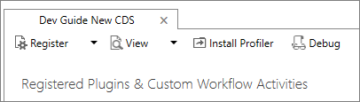

#### [Power Platform Tools](#tab/pptools)

1. Follow the instructions in [Install Power Platform Tools](tools/devtools-install.md).

---

Following the steps provided above results in a new managed solution named Plug-in Profiler in your Microsoft Dataverse development environment.

## Start profiling

#### [Plug-in Registration Tool](#tab/prt)

1. In the Plug-in Registration tool, select the **(Step) BasicPlugin.FollowupPlugin: Create of account** step you registered earlier, and click **Start Profiling**.

    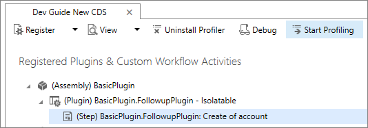

    > [!TIP]
    > For alternate information about running the profiler installed with the Plug-in Registration Tool see [Run the plug-in profiler from a Command Prompt window](#run-profiler-standalone).

#### [Power Platform Tools](#tab/pptools)

1. In Visual Studio select **View** > **Power Platform Explorer** to open the view if it is not already open.

1. Expand the **Plug-in Assemblies** node and then completely expand the **BasicPlugin.FollowupPlugin** assembly node.

1. Right click the step registration of the plug-in and choose **Start Profiling**.

---

When presented with the **Profiler Settings** dialog, accept the default settings and click **OK** to close the dialog.

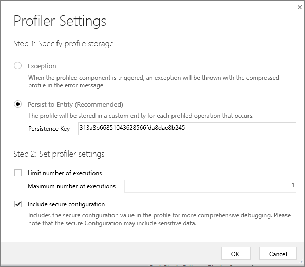

## Capture a profile

In your model-driven (or other) app, create a new account to execute the plug-in. This will capture an instance of the plug-in executing and persist it as a Plug-in Profile table row in Dataverse. You can see this row in Power Apps under **Tables** > **Plug-in Profile** by choosing **Data**.

#### [Plug-in Registration Tool](#tab/prt)

1. In the Plug-in Registration tool, click **Debug**.

    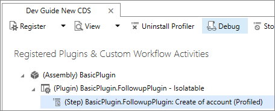

#### [Power Platform Tools](#tab/pptools)

1. In Power Platform Tools, right-click the plug-in class file in the plug-in library project and choose **Debug**.

---

2. In the **Replay Plug-in Execution** dialog, on the **Setup** tab, click the  icon to open the **Select Profile from CRM** dialog.

3. In the **Select Profile from CRM** dialog, select the profile where **Type Name** equals **BasicPlugin.FollowupPlugin** and represents the profile captured when you last triggered the plug-in.

    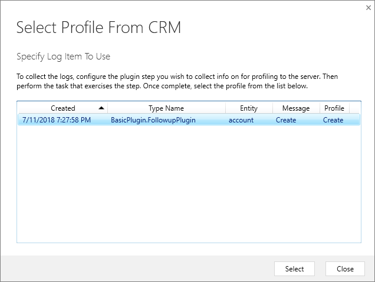

## Debug your plug-in

1. In the **Replay Plug-in Execution** dialog, on the **Setup** tab, in the **Specify Assembly** section, click the ellipses (**…**) button and choose the location of your `BasicPlugin.dll`.

    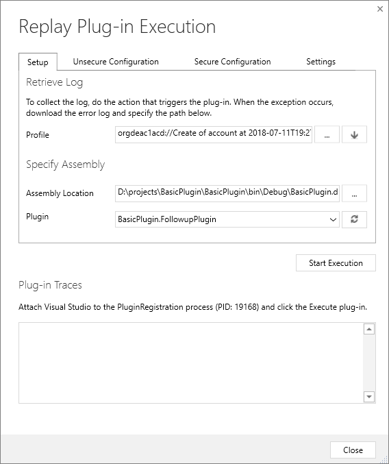

1. In your Visual Studio project, set a break point in your plug-in class.

    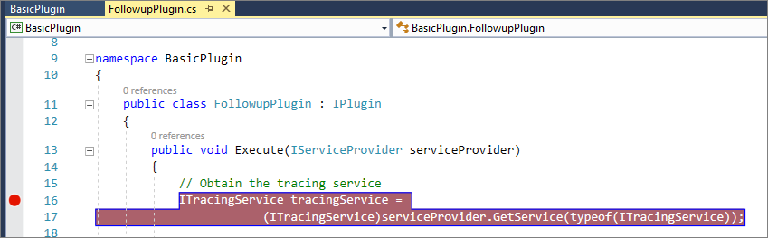

1. In your Visual Studio project, select **Debug** > **Attach to Process…**.

    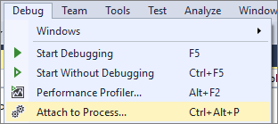

1. Select the **PluginRegistration.exe** process and click **Attach**.

    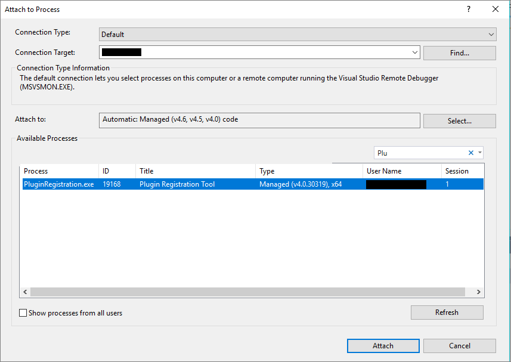

    > [!NOTE]
    > You should see that the Plug-in Registration tool is now running in debug mode.

1. In the **Replay Plug-in Execution** dialog, click **Start Execution**.

    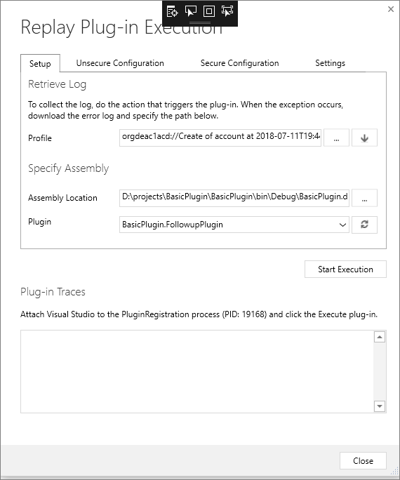

1. In your Visual Studio project, you should see that the code is paused at the breakpoint you set earlier. 

    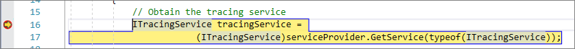

1. You can now step through your code to debug.

## Repeat

To repeat, in your Visual Studio project select **Debug** > **Reattach** to process and in the **Replay Plug-in Execution** dialog click **Start Execution** again.

## Stop profiling

1. Close the **Replay Plug-in Execution** dialog
1. In the Plug-in Registration tool, click **Stop Profiling**.

    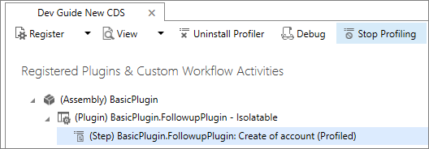

## Next steps

To learn more about common things you will do with plug-ins, continue to [Tutorial: Update a plug-in](tutorial-update-plug-in.md)

If you will not continue to the next tutorial you should unregister the BasicPlugin assembly you created in this step. See [Unregister assembly, plug-in, and step](tutorial-update-plug-in.md#unregister-assembly-plug-in-and-step) for instructions.

## Run the plug-in profiler from a Command Prompt window

 While it is often preferable to run the profiler interactively from the Plug-in Registration tool, the profiler can be executed from a Command Prompt window independent of the tool. This is useful to obtain the plug-in profile log from a customer's [!INCLUDE[pn_dynamics_crm](../../includes/pn-dynamics-crm.md)] apps server to debug a failed plug-in. A developer can then use that log to replay the plug-in's execution in the Plug-in Registration tool and debug the plug-in using[!INCLUDE[pn_Visual_Studio](../../includes/pn-visual-studio.md)].

### Procedure: Run the plug-in profiler from a Command Prompt

1. Open a Command Prompt window and set the working directory to the folder where you downloaded the Plug-in Registration tool `PluginRegistration.exe`.
2. Type this command to see the available run-time parameters: `PluginProfiler.Debugger.exe /?`.  
3. Review the supported parameter list and re-run the PluginProfiler.Debugger.exe program with the appropriate parameters.

[!INCLUDE[footer-include](../../includes/footer-banner.md)]
