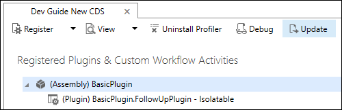
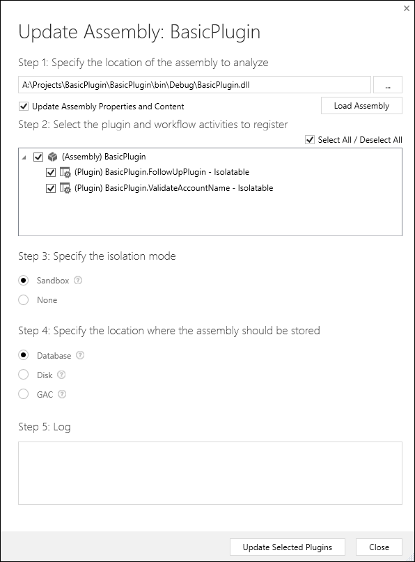
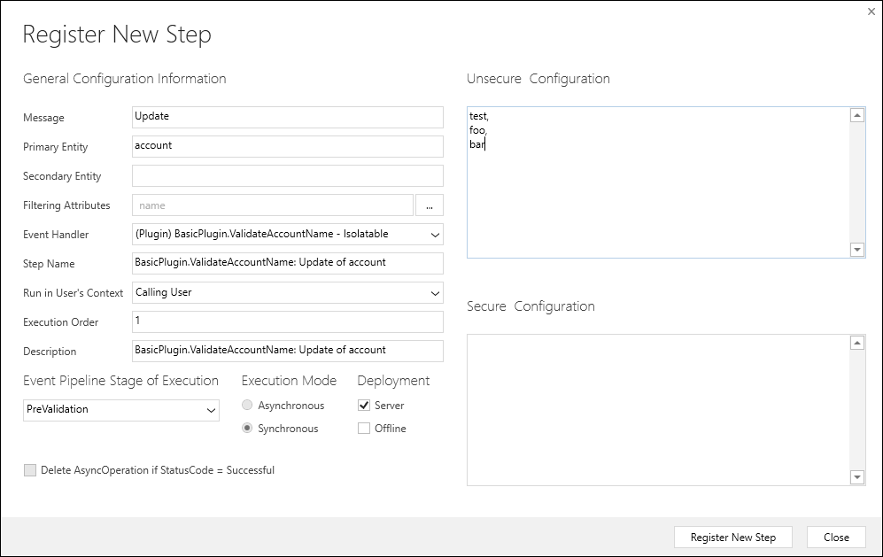
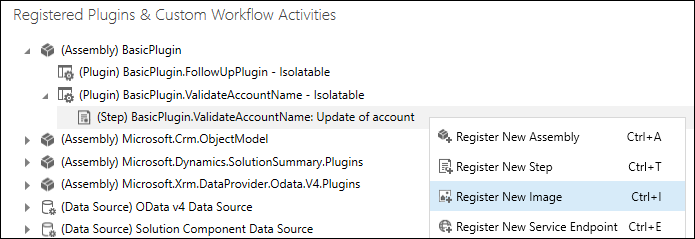
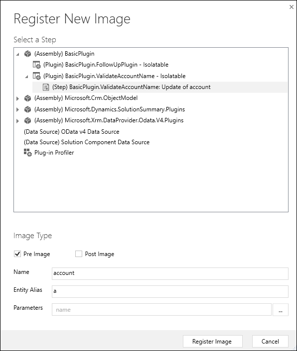
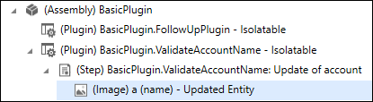
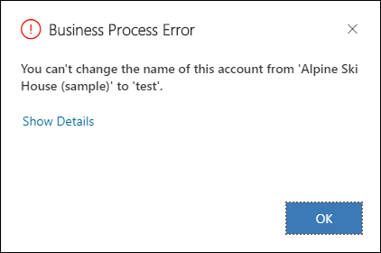
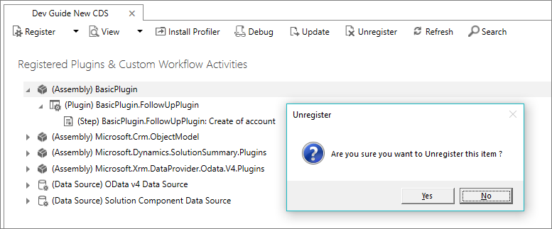

# Tutorial: Update a plug-in

[!INCLUDE[cc-terminology](includes/cc-terminology.md)]

This tutorial is the third in a series that will show you how to work with plug-ins.

- [Tutorial: Write and register a plug-in](tutorial-write-plug-in.md)
- [Tutorial: Debug a plug-in](tutorial-debug-plug-in.md)
- Tutorial: Update a plug-in (This tutorial)

For detailed explanation of supporting concepts and technical details see:

- [Use plug-ins to extend business processes](plug-ins.md)
- [Write a plug-in](write-plug-in.md)
- [Register a plug-in](register-plug-in.md)
- [Debug Plug-ins](debug-plug-in.md)

## Goal

This tutorial will describe additional common things you will do with plug-ins. In this tutorial you will:

 - Update a plug-in assembly
 - Create and register a synchronous plug-in
 - Use configuration data in the plug-in
 - Throw an error to show to the user
 - Configure and use a pre-entity image in your code
 - Unregister and assembly, a plug-in, or a step


The goal of this tutorial is:

- Create a synchronous plug-in registered on the pre-validation stage of the Update message of the account table.
- The plug-in will evaluate a set of string values passed as configuration data when the plug-in is registered.
- If the name of the account is changed to one of these values and the previous value didn’t contain the new name, cancel the operation and send an error message back to the user.

## Prerequisites

- Complete [Tutorial: Write and register a plug-in](tutorial-write-plug-in.md)
- [Tutorial: Debug a plug-in](tutorial-debug-plug-in.md) is recommended but not required.

> [!NOTE]
> Because many basic steps were described in detail in [Tutorial: Write and register a plug-in](tutorial-write-plug-in.md), the same level of detail is not included for the same steps in this tutorial.

## Create a new plug-in class

1. In Visual Studio, add a new class to the **BasicPlugin** project named `ValidateAccountName.cs`
    > [!NOTE]
    > When you make a significant change to an assembly, you should update the assembly version. This is particularly important if you intend to update an assembly that is part of a managed solution. The version is part of the fully qualified name of the assembly which is a unique identifier of the assembly. The solution update process may not recognize that the assembly has changed when the fully qualified name of the assembly hasn't changed.
1. Add the following code to the class and re-build the assembly.


```csharp
using Microsoft.Xrm.Sdk;
using System;
using System.Collections.Generic;
using System.Linq;

namespace BasicPlugin
{
  public class ValidateAccountName : IPlugin
  {
    //Invalid names from unsecure configuration
    private List<string> invalidNames = new List<string>();

    // Constructor to capture the unsecure configuration
    public ValidateAccountName(string unsecure)
    {
      // Parse the configuration data and set invalidNames
      if (!string.IsNullOrWhiteSpace(unsecure))
        unsecure.Split(',').ToList().ForEach(s =>
        {
          invalidNames.Add(s.Trim());
        });
    }
    public void Execute(IServiceProvider serviceProvider)
    {

      // Obtain the tracing service
      ITracingService tracingService =
      (ITracingService)serviceProvider.GetService(typeof(ITracingService));
      try
      {

        // Obtain the execution context from the service provider.  
        IPluginExecutionContext context = (IPluginExecutionContext)
            serviceProvider.GetService(typeof(IPluginExecutionContext));

        // Verify all the requirements for the step registration
        if (context.InputParameters.Contains("Target") && //Is a message with Target
            context.InputParameters["Target"] is Entity && //Target is an entity
            ((Entity)context.InputParameters["Target"]).LogicalName.Equals("account") && //Target is an account
            ((Entity)context.InputParameters["Target"])["name"] != null && //account name is passed
            context.MessageName.Equals("Update") && //Message is Update
            context.PreEntityImages["a"] != null && //PreEntityImage with alias 'a' included with step
            context.PreEntityImages["a"]["name"] != null) //account name included with PreEntityImage with step
        {
          // Obtain the target entity from the input parameters.  
          var entity = (Entity)context.InputParameters["Target"];
          var newAccountName = (string)entity["name"];
          var oldAccountName = (string)context.PreEntityImages["a"]["name"];

          if (invalidNames.Count > 0)
          {
            tracingService.Trace("ValidateAccountName: Testing for {0} invalid names:", invalidNames.Count);

            if (invalidNames.Contains(newAccountName.ToLower().Trim()))
            {
              tracingService.Trace("ValidateAccountName: new name '{0}' found in invalid names.", newAccountName);

              // Test whether the old name contained the new name
              if (!oldAccountName.ToLower().Contains(newAccountName.ToLower().Trim()))
              {
                tracingService.Trace("ValidateAccountName: new name '{0}' not found in '{1}'.", newAccountName, oldAccountName);

                string message = string.Format("You can't change the name of this account from '{0}' to '{1}'.", oldAccountName, newAccountName);

                throw new InvalidPluginExecutionException(message);
              }

              tracingService.Trace("ValidateAccountName: new name '{0}' found in old name '{1}'.", newAccountName, oldAccountName);
            }

            tracingService.Trace("ValidateAccountName: new name '{0}' not found in invalidNames.", newAccountName);
          }
          else
          {
            tracingService.Trace("ValidateAccountName: No invalid names passed in configuration.");
          }
        }
        else
        {
          tracingService.Trace("ValidateAccountName: The step for this plug-in is not configured correctly.");
        }
      }
      catch (Exception ex)
      {
        tracingService.Trace("BasicPlugin: {0}", ex.ToString());
        throw;
      }
    }
  }
}
```

### About the code
- This class includes a constructor to capture the unsecure configuration that will be set when a step is configured.
- This class requires specific step configuration to work correctly:
    - Update message
    - On the account table
    - With the account name included in the attributes
    - With PreEntityImage using specific alias ‘a’
    - With PreEntityImage including the name columns.
- If the step configuration is not correct, the plug-in will only write to the trace that it is not configured correctly
- If no invalid names are set in the configuration, the plugin will only write to the trace that no invalid names were passed to the configuration
- If the new name matches any of the invalid names set using configuration AND the original name does not contain the new name, an <xref:Microsoft.Xrm.Sdk.InvalidPluginExecutionException> will be thrown with the message to the user that this operation is not allowed.

## Update the plug-in assembly registration

The existing assembly from [Tutorial: Write and register a plug-in](tutorial-write-plug-in.md) should already be registered. To add the new **ValidateAccountName** plug-in without unregistering the existing assembly, you must update it.

1. Select the **(Assembly) Basic Plugin** and select **Update**.

    

1. In the **Update Assembly: Basic Plugin** dialog, specify the location of the assembly by clicking the ellipses (**…**) and the assembly will load.

    

1. Verify that the assembly and both plug-ins are selected and click **Update Selected Plugins**.

## Configure a new step

Configure the **ValidateAccountName** plug-in using these settings:

|Setting|Value|
|--|--|
|Message|Update|
|Primary Entity|account|
|Filtering Attributes|name|
|Event Pipeline Stage of Execution|PreValidation|
|Execution Mode|Synchronous|
|Unsecure Configuration|test,<br />foo,<br />bar|



## Add an image

1. Right-click the step you just registered and select **Register New Image**.

    

1. In the **Register New Image** dialog, configure the image with these settings:

    |Setting|Value|
    |--|--|
    |Image Type|Pre Image|
    |Name|account|
    |Entity Alias|a|
    |Parameters|name|

    

1. When the image is registered you will see it in the Plug-in Registration tool.

    

## Test the plug-in

1. Open the application and attempt to update an existing account name to `test`, `foo`, or `bar`.
1. When you try to save, you should see the following message:

    

1. If you update an existing account with a name that includes `test`, `foo`, or `bar`, then update the account to `test`, `foo`, or `bar` you should not see the message.

## Unregister assembly, plug-in, and step

Use the Plug-in Registration tool to **Unregister** (delete) any assembly, plug-in or step. Deleting an assembly will delete all plug-ins and steps for that assembly.




[!INCLUDE[footer-include](../../includes/footer-banner.md)]