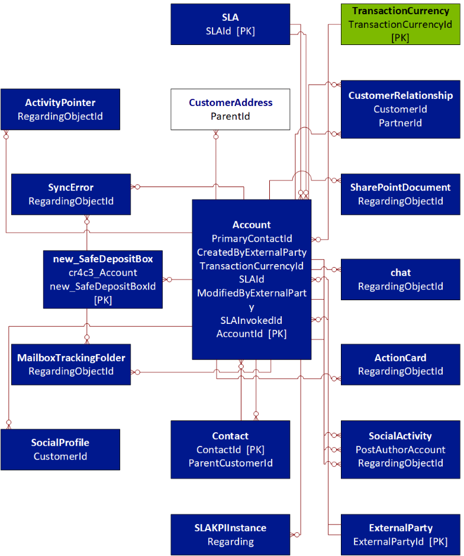
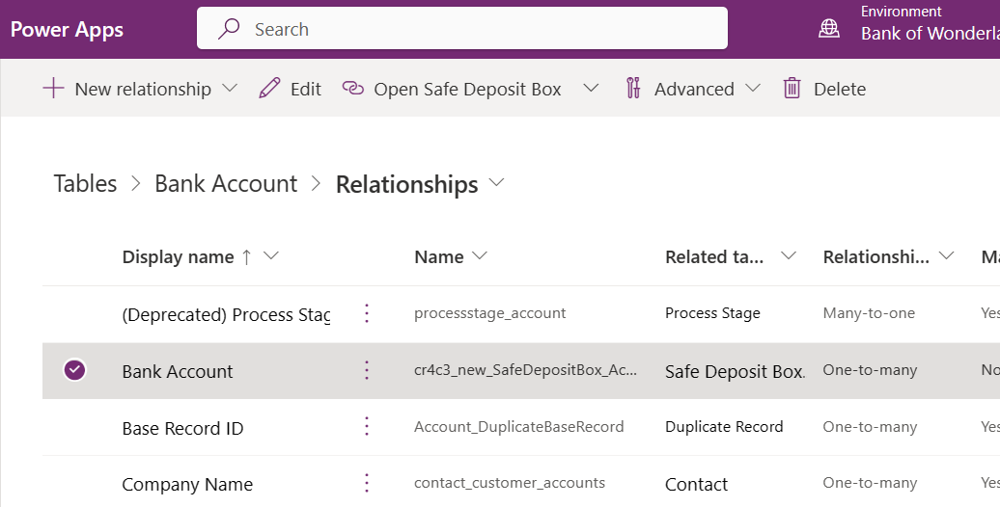
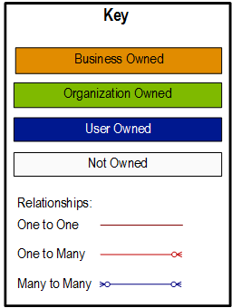

# Generate entity diagrams using metadata

A visual representation of metadata can be useful, especially when you're trying to describe the relationship between entities in the system. You can use the Metadata Diagram tool, available as a code sample, to read the Organization web service metadata and generate entity relationship diagrams from that data.

You can create a diagram that shows a relationship for just one entity, or a complex diagram that includes dozens of related entities, including custom and system entities.

## Relationships in entity diagrams

The following example shows a new custom entity named "Safe Deposit Box" created in Power Apps and its relationship to a slightly customized "Bank Account" (account) entity.

The following entity diagram was generated using the Metadata Diagram tool. It shows the relationship between the `account` entity, the custom `new_safedepositbox` entity, and other entities in the system. The names shown are the logical entity names.

> [!NOTE]
> If there are multiple relationships between the same two entities, the diagram shows only one line for simplicity.



You can look up information about relationships for a table in Power Apps. Notice the one-to-many relationship with Safe Deposit Box.



The bank account entity that the diagram shows represents a bank account for a customer. As a bank customer, you can open several bank accounts, such as checking and savings accounts, where each bank account can have zero or more safe deposit boxes. This relationship is an example of a one-to-many relationship type between a bank account and safe deposit boxes.

You can associate multiple activities, such as tasks, emails, and appointments, with a bank account. The bank account is associated with a customer, there's contact information on file, and a chat log for support requests is kept.

## About the diagrams

The SDK documentation includes diagrams for many system entities. You can find these diagrams in the topics that describe the entity capabilities. Each box in the diagram has the entity name in bold text on the first line. The following lines list the attributes that define the relationships for that entity.

The Metadata Diagram tool doesn't generate lines that show the relationships to the organization, business unit, and user (systemuser) entities. This choice simplifies the diagram. Color coding indicates the owner relationship for each entity. The following diagram describes the color coding:



<a name="Generate"></a>

## Generate entity diagrams with the metadata diagram tool

To use the Metadata Diagram tool to generate Microsoft Visio metadata diagrams, build and run the tool code by using the provided Visual Studio solution in the code sample's project folder.

Sample source code: [Generate entity diagrams with the metadata diagram tool](https://github.com/microsoft/PowerApps-Samples/tree/master/dataverse/GenerateEntityDiagram)

The project folder contains a Readme file with instructions for building and running the sample. The code sample is a stand-alone console application that creates an entity relationship diagram. The program requires Microsoft Visio to be installed on your computer as it calls Visio library functions to generate the diagram.

You can run the program at the command prompt. List the entities you want to include in the diagram as command-line arguments. You can include other entities in your diagram as needed to show all the relationships for each entity you requested. To generate a diagram that shows the relationships for the account and new_safedepositbox entities, use the following command:

```ms-dos
GenerateEntityDiagram.exe account new_safedepositbox
```

The custom entity new_safedepositbox must exist in your environment for this command to work. Otherwise, try any combination of entities that do exist - perhaps "account contact".
The name of the generated Visio file is account.vsd.

> [!NOTE]
> The tool uses the name of the first entity on the command line as the name of the Visio file. If you execute the following two commands, the second command overwrites the diagram generated by the first. This behavior occurs because the Visio files have the same name –"account.vsd":
>
> `GenerateEntityDiagram.exe account`
>
> `GenerateEntityDiagram.exe account new_safedepositbox`
>
> To avoid overwriting a generated diagram file, rename the first file before you run the second command.

## Community tools

The following community-developed tools provide alternative ways to generate entity relationship diagrams from Dataverse metadata.

### UML diagram generator

[UML Diagram Generator](https://jonasr.app/uml?utm_source=msdocs) for [XrmToolBox](https://www.xrmtoolbox.com/) is a tool that generates Entity Relationship Diagrams ([ERD](https://en.wikipedia.org/wiki/Entity%E2%80%93relationship_model)) as [PlantUML](https://plantuml.com/) files from metadata in Microsoft Dynamics 365 and the Power Platform Dataverse. Because the result is text-based files, you can manually edit them and keep them in source control for change tracking over time.

### Entity relation diagram creators

These tools generates visual Entity Relationship Diagrams from metadata in Microsoft Dynamics 365 and the Power Platform Dataverse.

- [Entity Relation Diagram Creator](https://www.xrmtoolbox.com/plugins/JourneyIntoCRM.XrmToolbox.ERDPlugin/) for [XrmToolBox](https://www.xrmtoolbox.com/) 
- [ERD Visio Builder](https://www.powerplatformtoolbox.com/tools/c488f1c2-714f-4136-9f94-773dc6dbf4e1) for [Power Platform ToolBox](https://www.powerplatformtoolbox.com/)

### ERD Visio builder

[ERD Visio Builder](https://www.xrmtoolbox.com/plugins/LinkeD365.ERDVisioBuilder/) for [XrmToolBox](https://www.xrmtoolbox.com/) is a tool that generates Visio diagrams from metadata in Microsoft Dynamics 365 and the Power Platform Dataverse.

### More community tools

For more information, see the [Developer tools](developer-tools.md) article. For more information about UML Diagram Generator, see [jonasr.app/uml](https://jonasr.app/uml?utm_source=msdocs). For more information on the ERD Visio Builder, see [LinkeD365.blog](https://linked365.blog/2020/07/06/erd-visio-builder-xrmtoolbox-addon/).

> [!NOTE]
> The community tools aren't a product of Microsoft and Microsoft doesn't provide support for them.
> If you have questions about the tool, contact the publisher. For more information, see [XrmToolBox](https://www.xrmtoolbox.com).

### See also

[Work with Dataverse tables using code](entities.md)  
[Work with table definitions using code](metadata-services.md)

[!INCLUDE[footer-include](../../includes/footer-banner.md)]
