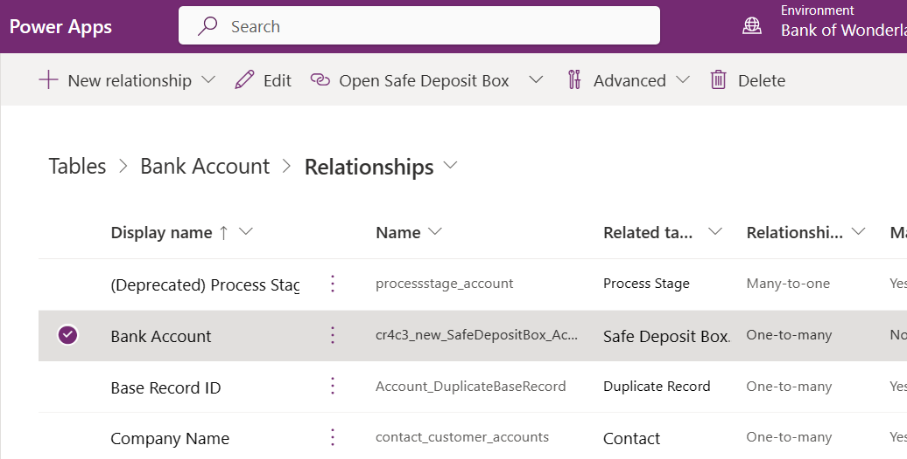

# Use metadata to generate entity diagrams

Visual representation of metadata can be useful, especially when you are trying to describe the relationship between entities in the system. You can use the Metadata Diagram tool, available as a code sample, to read the Organization web service metadata and generate entity relationship diagrams from that data.

You can create a diagram that shows a relationship for just one entity, or a complex diagram that includes dozens of related entities, including custom and system entities.

## Relationships in entity diagrams

The following example shows a new custom entity named "Safe Deposit Box" created in Power Apps and its relationship to a slightly customized "Bank Account" (account) entity.

The following entity diagram was generated using the Metadata Diagram tool. It shows the relationship between the `account` entity, the custom `new_safedepositbox` entity, and other entities in the system. The names shown are the logical entity names.

> [!NOTE]
> If there are multiple relationships between the same two entities, only one line is drawn in the diagram for simplicity.


You can look up information about relationships for a table in Power Apps. Notice the one-to-many relationship with Safe Deposit Box.



The bank account entity that is shown on the diagram represents a bank account for a customer. As a bank customer, you can open several bank accounts, such as checking and savings accounts, where each bank account can have zero or more safe deposit boxes. This is an example of a one-to-many relationship type between a bank account and safe deposit boxes.

You can associate multiple activities, such as tasks, emails, and appointments with a bank account. THe bank account is associated with a customer, there is contact information on file, and a chat log for support requests is kept.

## About the diagrams

You can find the diagrams for many system entities in the SDK documentation, in the topics that describe the entity capabilities. In each box in the diagram, the first line in bold text is the name of the entity. Subsequent lines contain the names of the attributes used to define the relationships for that entity.

The Metadata Diagram tool does not generate lines showing the relationships to the following entities: organization, business unit, and user (systemuser). This is done to simplify the diagram. Color coding is used to indicate the owner relationship for each entity. The following diagram describes the color coding:


<a name="Generate"></a>

## Generate entity diagrams with the Metadata Diagram tool

To use the Metadata Diagram tool to generate Microsoft Visio metadata diagrams, build and execute the tool code using the provided Visual Studio solution in the code sample's project folder.

Sample source code: [Generate entity diagrams with the metadata diagram tool](https://github.com/microsoft/PowerApps-Samples/tree/master/dataverse/GenerateEntityDiagram)

The project folder contains a Readme file with instructions for building and running the sample. The code sample is a stand-alone console application that creates an entity relationship diagram. The program requires Microsoft Visio to be installed on your computer as it calls Visio library functions to generate the diagram.

You can run the program at the command prompt. List the entities you wish to include in the diagram as command-line arguments. Other entities may be included in your diagram as needed to show all the relationships for each entity you have requested. To generate a diagram that shows the relationships for the account and new_safedepositbox entities, use the following command:

```ms-dos
GenerateEntityDiagram.exe account new_safedepositbox
```

The custom entity new_safedepositbox must exist in your environment for this to work. Otherwise, try any combination of entities that do exist - perhaps "account contact".
The name of the generated Visio file is account.vsd.

> [!NOTE]
> The tool uses the name of the first entity on the command line as the name of the Visio file. If you execute the following two commands, the second command overwrites the diagram generated by the first. This is because the Visio files have the same name –”account.vsd”:
>
> `GenerateEntityDiagram.exe account`
>
> `GenerateEntityDiagram.exe account new_safedepositbox`
>
> To avoid overwriting a generated diagram file, you have to rename the first file before you run the second command.

## Community tools

### UML Diagram Generator

**[UML Diagram Generator](https://jonasr.app/uml?utm_source=msdocs)** for XrmToolBox is a tool that generates Entity Relationship Diagrams ([ERD](https://en.wikipedia.org/wiki/Entity%E2%80%93relationship_model)) in the form of [PlantUML](https://plantuml.com/) files from metadata in Microsoft Dynamics 365 and the Power Platform Dataverse. As the result is text-based files, they can be manually edited and kept in source control for change tracking over time.

**[Entity Relation Diagram Creator](https://www.xrmtoolbox.com/plugins/JourneyIntoCRM.XrmToolbox.ERDPlugin/)** for XrmToolBox is a tool that generates visual Entity Relationship Diagrams from metadata in Microsoft Dynamics 365 and the Power Platform Dataverse.

**[ERD Visio Builder](https://www.xrmtoolbox.com/plugins/LinkeD365.ERDVisioBuilder/)** for XrmToolBox is a tool that generates Visio diagrams from the metadata in Microsoft Dynamics 365 and the Power Platform Dataverse.

See the [Developer tools](developer-tools.md) article for community developed tools, [jonasr.app/uml](https://jonasr.app/uml?utm_source=msdocs) for more information about UML Diagram Generator, and [LinkeD365.blog](https://linked365.blog/2020/07/06/erd-visio-builder-xrmtoolbox-addon/) for more information on the ERD Visio Builder.

> [!NOTE]
> The community tools are not a product of Microsoft and we do not extend support to the community tools.
> If you have questions pertaining to the tool, please contact the publisher. More Information: [XrmToolBox](https://www.xrmtoolbox.com).

### See also

[Work with Dataverse tables using code](entities.md)  
[Work with table definitions using code](metadata-services.md)

[!INCLUDE[footer-include](../../includes/footer-banner.md)]
