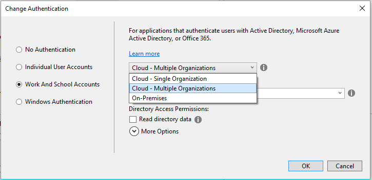
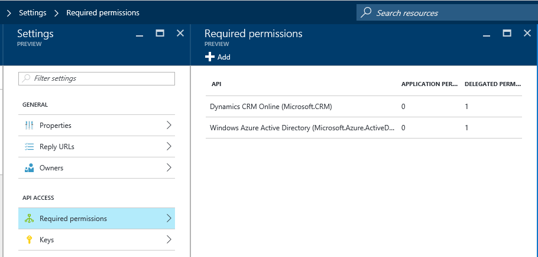
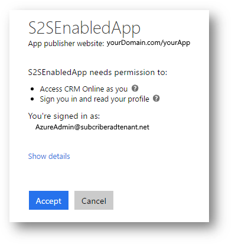

# Use multi-tenant server-to-server authentication

[!INCLUDE[cc-terminology](includes/cc-terminology.md)]

Multi-tenancy is the most common app scenario and the one which is used for apps distributed using Microsoft AppSource, but you can also use multi-tenancy without listing your application with Microsoft AppSource.  
  
Each Microsoft Dataverse organization is associated with an Azure Active Directory tenant. Your web application or service is registered with its own Azure AD tenant.  
  
In this scenario any Dataverse tenant can potentially use your multi-tenant application after an administrator grants consent for the application to access data.  
  
   

## Requirements  

 To create and test a multi-tenant application that uses server-to-server (S2S) authentication you will need:  
  
- An Azure AD tenant you will use to publish your application or service.  
  
- Two (2) Dataverse subscriptions  
  
  -   One must be associated with Azure AD tenant you will use to publish your application or service.  
  
  -   The other might be a trial subscription to use for testing how a subscriber will access your application.  
  
  

## Overview: Develop and test your application  

 The application you will create must be registered with the Azure AD tenant you will use when you publish the application.  
  
 At a high level, the process consists of:  
  
1. Create a multi-tenant web application registered with your Azure AD tenant.  
  
2. Create an application user associated with the registered application in your Dataverse tenant  
  
3. Create a custom security role and assign it to the application user in your Dataverse tenant  
  
4. Test your application using your Dataverse tenant
  
5. Test your application using a separate Dataverse tenant  
  

## Create a multi-tenant web application registered with your Azure AD tenant

 You will create a multi-tenant web application or service which uses Azure AD as the authentication provider.  
  
 Exactly how you do this will not be the focus of this topic. There are a number of ways you can approach this and make choices that fit your requirements or preferences. See the following links for more information and samples:  

- [Build a multi-tenant SaaS web application using Azure AD & OpenID Connect](https://github.com/Azure-Samples/active-directory-dotnet-webapp-multitenant-openidconnect)
  
- [An ASP.NET Core Web app signing-in users in any org with the Microsoft identity platform](https://github.com/Azure-Samples/active-directory-aspnetcore-webapp-openidconnect-v2/tree/master/1-WebApp-OIDC/1-2-AnyOrg)  
  
Azure AD requires the following values to register your application:  
  
|Value|Description|  
|-----------|-----------------|  
|**Application ID URI**|The identifier for an application. This value is sent to Azure AD during authentication to indicate which application the caller wants a token for. Additionally, this value is included in the token so that the application knows it was the intended target.|  
|**Reply URL and Redirect URI**|In the case of a Web API or web application, the Reply URL is the location to which Azure AD will send the authentication response, including a token if authentication was successful.|  
|**Client ID**|The ID for an application, which is generated by Azure AD when the application is registered. When requesting an authorization code or token, the client ID and key are sent to Azure AD during authentication.|  
|**Key**|The key that is sent along with a client ID when authenticating to Azure AD to call a web API  .|  
  
 When the application is registered it will be assigned an **Azure Active Directory Object Id**, a unique identifier for the registered application.  
  
 If you create a new ASP.NET MVC application with Visual Studio you will have options to specify that the application will support the multi-tenant functionality. The template for an MVC application provides the option to specify what kind of authentication occurs. You will have the option to choose the authentication method by configuring the properties of your project when you create it. The following diagram shows the options available:  
  
   
  
 When you configure a project with these options it will be configured to use OWIN middleware and scaffolding for a basic application that supports this scenario. With some basic modifications it can be adapted to work with Dataverse. 
  
 In the process of creating and registering your application for development you will most likely use `https://localhost` as the **Sign-on URL** and **Reply URL** values so you can test and debug your application locally before publishing. You will need to change these values before you publish your app.  
  
 When you register your app you must generate a key, also known as a `ClientSecret`. These keys can be configured for a 1 or 2-year duration. As the host of the application you must treat this value like a password and it is your responsibility to manage renewal of the keys before they expire. You may want to use Key Vault. More information: [https://azure.microsoft.com/services/key-vault/](https://azure.microsoft.com/services/key-vault/)  
  

## Grant your application rights to access Dataverse data
  
 This is the reason why your Dataverse tenant must be associated with your Azure AD tenant. If your Azure AD tenant is not associated with a Dataverse tenant, you will not be able to perform the following steps.  
  
1. Go to [https://portal.azure.com](https://portal.azure.com) and select **Azure Active Directory**.  
  
2. Click **App registrations** and look for the application you created using Visual Studio.  
  
3. You need to give your application privileges to access Dataverse data. In the **API Access** area click **Required permissions**. You should see that it already has permissions for **Windows Azure Active Directory**.  
  
4. Click **Add**, then **Select an API**. In the list, select **Dynamics 365** and then click the **Select** button.  
  
5. In **Select permissions**, select **Access Dynamics 365 as organization users**. Then click the **Select** button.  
  
6. Click **Done** to add these permissions. When you are done you should see the permissions applied.  
  
     
  

## Create an application user associated with the registered application in Dataverse

 When your application accesses the Dataverse data of one of the subscribers of your application, it will require an application user in the subscriber’s Dataverse organization. Like any Dataverse user, this application user must be associated with at least one security role which defines the data the user is able to access.  
  
 The [SystemUser Table](reference/entities/systemuser.md) has three new columns to store this data.  
  
|Schema Name|Display Name|Type|Description|  
|-----------------|------------------|----------|-----------------|  
|[ApplicationId](reference/entities/systemuser.md#BKMK_ApplicationId)|**Application ID**|UniqueidentifierType|The identifier for the application. This is used to access data in another application.|  
|[ApplicationIdUri](reference/entities/systemuser.md#BKMK_ApplicationIdUri)|**Application ID URI**|StringType|The URI used as a unique logical identifier for the external app. This can be used to validate the application|  
|[AzureActiveDirectoryObjectId](reference/entities/systemuser.md#BKMK_AzureActiveDirectoryObjectId)|**Azure AD Object ID**|UniqueidentifierType|This is the application directory object Id.|  
  
 This `systemuser``AzureActiveDirectoryObjectId` property value must be a reference to the Azure Active Directory Object Id of your registered application. This reference will be set in Dataverse when the application user is created based on the `ApplicationId` value.  
  
> [!NOTE]
>  When you are initially developing your application with your own Dataverse tenant and the Azure AD tenant associated with it, you can simply create the application user because the registered application is already part of your Azure AD tenant.  
> 
>  However, in order to create the application user in a different organization for testing, or whenever a subscriber will use your application, they must first grant consent for your application, so the steps in the process are different. See [Test your application using a separate Dynamics 365 tenant](#bkmk_TestUsingSeparateTenant) for more information.  
  
  

### Create a security role for the application user  

 In the next step you will create a Dataverse application user. The privileges and access rights for this user will be defined by a custom security role you set. Before you create the application user, you must create a custom security role so you can associate the user to it. More information: [Create or edit a security role](/previous-versions/dynamicscrm-2016/administering-dynamics-365/dn531130(v=crm.8))  
  
> [!NOTE]
>  The application user cannot be associated with one of the default Dataverse security roles. You must create a custom security role to associate with the application user.  
  
   

### Manually create a Dataverse application user  

 The procedure to create this unlicensed user is different from creating a licensed user. Use the following steps:  
  
1. Navigate to **Settings** > **Security** > **Users**  
  
2. In the view drop-down, select **Application Users**.  
  
3. Click **New**. Then verify that you are using the **Application user** form.  
  
    If you do not see the **Application ID**, **Application ID URI** and **Azure AD Object ID** fields in the form, you must select the **Application User** form from the list:  
  
     
  
4. Add the appropriate values to the fields:  
  
   |Field|Value|  
   |-----------|-----------|  
   |**Application ID**|The Application ID value for the application registered with Azure AD.|  
   |**Full Name**|The name of your application.|  
   |**Primary Email**|The email address you want your subscribers to use to contact you.|  
  
    The **User Name**, **Application ID URI** and **Azure AD Object ID** fields are locked and you cannot set values for these fields.  
  
    When you create this user the values for these fields will be retrieved from Azure AD based on the **Application ID** value when you save the user.  
  
5. Associate the application user with the custom security role you created in [Create a security role for the application user](#bkmk_CreateSecurityRole). More information: [Create users and assign security roles](/dynamics365/customer-engagement/admin/create-users-assign-online-security-roles)  
  
  

## Test your application using your Dataverse tenant

 Because the application has been registered with your Azure AD tenant and the application user in your development organization is already configured, you can continue to develop your application against your own Dataverse tenant. But this is not a valid test of the multi-tenant capability. You need to test your application on a separate Dataverse tenant.  
  
   

## Test your application using a separate Dataverse tenant  

 Before you test your application with a separate Dataverse tenant, an administrator for the Azure AD tenant must grant consent for the application. The administrator grants consent by navigating to the application using a browser. The first time they access the application, they will see a dialog like this:  
  
   
  
 When they grant consent, your registered application will be added to the  Azure AD Enterprise applications list and it is available to the users of the Azure AD tenant.  
  
 Only after an administrator has granted consent, you must then create the application user in the subscriber’s Dataverse tenant. You can manually create the application user using the steps described in [Manually create a Dynamics 365 application user](#bkmk_ManuallyCreateUser).  
  
 For initial tests you may want to manually perform these steps. When you are ready to make your application or service available to subscribers you will want to have a more efficient procedure. This is covered in the next section.  
  

## Prepare a method to deploy the application user  

 After subscribers grant consent to your application or service you will need an easy, reliable way for them to add the application user and any other required components to their Dataverse organization.  
  
 You must include a custom security role which defines what privileges your application requires and then make sure that the application user is associated to that custom security role. Because a custom security role can be included in a solution, you should prepare a managed solution which contains the definition of the custom security role and any other solution components your application requires.  
  
 For information about creating custom security roles, see  
  
- [Create or edit a security role](/dynamics365/customer-engagement/admin/create-edit-security-role)  
- [Copy a security role](/dynamics365/customer-engagement/admin/copy-security-role)  
- [Add solution components](/dynamics365/customer-engagement/customize/create-solution.md#add-solution-components)
  
  For information about creating a Dataverse solution, see the following topics:
  
- [Use solutions for your customizations](/power-platform/alm/use-solutions-for-your-customizations)  
- [Package and distribute extensions using solutions](/dynamics365/customer-engagement/developer/package-distribute-extensions-use-solutions)  
  
  However, the application user cannot be included with a solution so you will need to provide a way to create this application user and associate it with the custom security role.  
  
  There are several ways that you can achieve this, including writing your own program using the web services and having the subscriber run the program.  
  
  The Dynamics 365 Package Deployer is an application which can be used to prepare a package to automate transferring solutions and data to a different Dataverse organization. More information: [Create packages for the Package Deployer](/power-platform/alm/package-deployer-tool)  
  
### See also

 [Use single-tenant server-to-server authentication](use-single-tenant-server-server-authentication.md)   
 [Build web applications using server-to-server (S2S) authentication](build-web-applications-server-server-s2s-authentication.md)   
 [Connect to Dynamics 365](/dynamics365/customer-engagement/developer/connect-customer-engagement)

[!INCLUDE[footer-include](../../includes/footer-banner.md)]