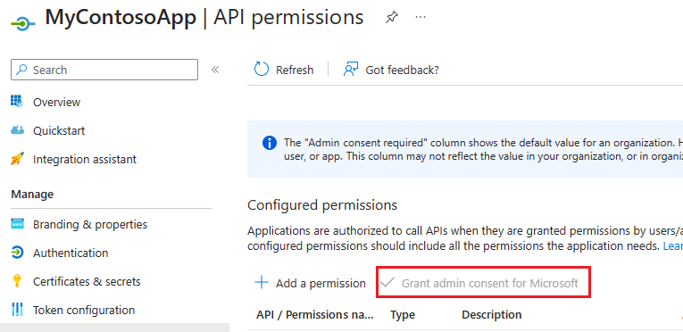

# Use single-tenant server-to-server authentication

The single-tenant server-to-server (S2S) scenario typically applies for enterprise organizations that have multiple Microsoft Dataverse environments using Active Directory Federation Services (AD FS) for authentication. However, it can also be applied by environments when the application won't be distributed to other environments.  
  
 An enterprise can create a web application or service to connect to any Dataverse environments associated with a single Azure Active Directory (Azure AD) tenant.
  
## Differences from multi-tenant scenario

 Creating a web application or service for single-tenant server-to-server authentication is similar to authentication for a multi-tenant organization but there are some important differences.  
  
-   Because all the organizations are in the same tenant, there is no need for a tenant administrator to grant consent for each organization. The application is simply registered once for the tenant.
  
-   You have the opportunity to use certificates rather than keys if you prefer.

In the [See also](#bkmk_seealso) section at the end of this article, there are links to information on upgrading a single-tenant application to multi-tenancy.  

<a name="bkmk_Requirements"></a>

## Requirements  

 To create and test a single-tenant application that uses server-to-server authentication you will need:  
  
- An Azure AD tenant to use when registering the provided sample application.
- A Dataverse subscription that is associated with the Azure AD tenant.
- Administrator privileges in the Azure AD tenant and Dataverse environment.

<a name="bkmk_registration"></a>

## Azure application registration

To create an application registration in Azure AD, follow these steps.

1. Navigate to https://admin.microsoft.com and sign in, or from your Dataverse environment web page, and select the application launcher in the top left corner.
2. Choose **Admin** > **Admin centers** > **Azure Active Directory**
3. From the left panel, choose **Azure Active Directory** > **App registrations (Preview)**
4. Choose **+ New registration**
5. In the **Register an application** form provide a name for your app, select **Accounts in this organizational directory only**, and choose **Register**. A redirect URI is not needed for this walkthrough and the provided sample code.

    > [!div class="mx-imgBorder"]
    > 

6. On the **Overview** page, select **API permissions**

    > [!div class="mx-imgBorder"]
    > 

7. Choose **+ Add a permission**
8. In the **Microsoft APIs** tab, choose **Dynamics CRM**
9. In the **Request API permission** form, select **Delegated permissions**, check **user_impersonation**, and select **Add permissions**

    > [!div class="mx-imgBorder"]
    > 

10. On the **API permissions** page select **Grant admin consent for "org-name"** and when prompted choose **Yes**

    > [!div class="mx-imgBorder"]
    > 

11. Select **Overview** in the navigation panel, record the **Display name**, **Application ID**, and **Directory ID** values of the app registration. You will provide these later in the code sample.
12. In the navigation panel, select **Certificates & secrets**
13. Below **Client secrets**, choose **+ New client secret** to create a secret
14. In the form, enter a description and select **Add**. Record the secret string. You will not be able to view the secret again once you leave the current screen.

<a name="bkmk_appuser"></a>

## Application user creation

To create an unlicensed "application user" in your environment, follow these steps. This application user will be given access to your environment's data on behalf of the end user who is using your application.

1. Navigate to your Dataverse environment (https://*[org]*.crm.dynamics.com).
2. Navigate to **Settings** > **Security** > **Users**.
3. Choose **Application Users** in the view filter.
4. Select **+ New**.
5. In the **Application User** form, enter the required information. 

   1. In the **Application ID** field, enter the application ID of the app you registered earlier in Azure AD.

    > [!div class="mx-imgBorder"]
    > 

6. After selecting **SAVE**, if all goes well, the **User Name**, **Application ID URI**, **Azure AD Object Id**, **Full Name**, and **Primary Email** fields will auto-populate with correct values where:<p/>
&nbsp;&nbsp;**User Name** == 'Application Name + Application ID'@TenantID.com<br/>
&nbsp;&nbsp;**Full Name** == 'Application Name'<br/>
&nbsp;&nbsp;**Primary Email** == **User Name**

    > [!div class="mx-imgBorder"]
    > 

7. Before exiting the user form, choose **MANAGE ROLES** and assign a security role to this application user so that the application user can access the desired organization data.

> [!NOTE]
> In an environment, only one application user for each Azure AD registered application is supported. You will not be able to change the primary email address or username once the application user is created.

> [!IMPORTANT]
> When developing a real-world application using S2S, you should use a custom security role which can be stored in a solution and distributed along with your application.

## Enable or disable application users

When application users are created, they are automatically enabled. The default Application User form shows the **Status** in the form footer; the **Status** field can't be updated.  

In an event that an application user’s status is disabled and you need to enable it, you can perform the following steps to customize the Application User form to allow update to the **Status** field. You can also use these steps to disable an application user that is no longer used.

1. Remove the **Status** field from the Application User form footer.
    1. Navigate to your Dataverse environment (https://*[org]*.crm.dynamics.com).
    1. Navigate to **Settings** > **Customizations** > **Customize the System**.
    1. In the left pane, select **Entities** > **User** > **Forms**.
    1. Select **Application User** in the list of forms
    1. Select **Footer** in the actions bar.
    1. Click on the Status grid, and then select Remove in the actions bar.

    > [!div class="mx-imgBorder"]
    > 

1. Add the **Status** field to a new section in the body of the Application User form.
    1. Select **Body** in the actions bar.
    1. On the **Insert** tab, select **Section** > **One Column**.
    1. Under **Field Explorer** locate the **Status** field, and drag and drop the **Status** field into the new section area.
 
    > [!div class="mx-imgBorder"]
    > 

1. Save and publish the customizations

Now, you can navigate to the application user and update the **Status** field as required to enable or disable the application user.

> [!CAUTION]
> Disabling an application user will break all the integration scenarios that use the application user.


<a name="bkmk_coding"></a>

## Application coding and execution

Follow these steps to download, build, and execute the sample application. The sample calls the Web API to return a list of the top 3 accounts (by name) in the organization.

1. Download the Visual Studio 2017 SingleTenantS2S [sample](https://github.com/Microsoft/PowerApps-Samples/tree/master/cds/webapi/C%23/SingleTenantS2S).
2. Update the App.config file with your app registration and server key values.
3. Build and run the application.

### Expected results
An OData response listing the names of the top 3 accounts in your organization.

### Example console output
Shown below is example console output obtained from an organization that only had two accounts named "Test Account 1", and "Test Account 2".

```json
{
"@odata.context":"https://crmue2.api.crm.dynamics.com/api/data/v9.1/$metadata#accounts(name)",
"@Microsoft.Dynamics.CRM.totalrecordcount":-1,
"@Microsoft.Dynamics.CRM.totalrecordcountlimitexceeded":false,

"value":[
{"@odata.etag":"W/\"4648334\"","name":"Test Account 1","accountid":"28630624-cac9-e811-a964-000d3a3ac063"},
{"@odata.etag":"W/\"4648337\"","name":"Test Account 2","accountid":"543fd72a-cac9-e811-a964-000d3a3ac063"}]
}
```

<a name="bkmk_seealso"></a>

### See also

[Use Multi-Tenant server-to-server authentication](use-multi-tenant-server-server-authentication.md)   
[Build web applications using server-to-server (S2S) authentication](build-web-applications-server-server-s2s-authentication.md)  
[How to: Sign in any Azure Active Directory user using the multi-tenant application pattern](/azure/active-directory/develop/howto-convert-app-to-be-multi-tenant)

[!INCLUDE[footer-include](../../includes/footer-banner.md)]