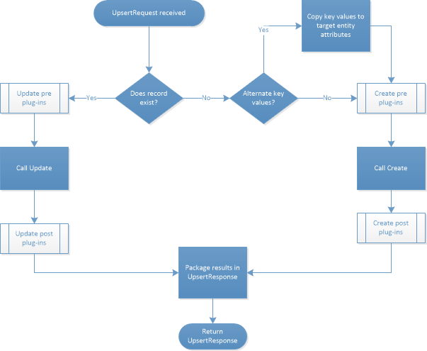

# Use Upsert to insert or update a record

[!INCLUDE[cc-data-platform-banner](../../includes/cc-data-platform-banner.md)]

You can reduce the complexity involved with data integration scenarios by using the <xref:Microsoft.Xrm.Sdk.Messages.UpsertRequest> message. When loading data into Microsoft Dataverse from an external system, for example in a bulk data integration scenario, you may not know if a record already exists in Dataverse. In such cases you won’t know if you should call an <xref:Microsoft.Xrm.Sdk.Messages.UpdateRequest> or a <xref:Microsoft.Xrm.Sdk.Messages.CreateRequest> operation. This results in your querying for the record first to determine if it exists before performing the appropriate operation. You can now reduce this complexity and load data into Dataverse more efficiently by using the new <xref:Microsoft.Xrm.Sdk.Messages.UpsertRequest> (Update or Insert) message.  
  
<a name="BKMK_UsingUpsert"></a>   

## Using Upsert  
 It is best to use <xref:Microsoft.Xrm.Sdk.Messages.UpsertRequest> only when you aren’t sure if the record exists. That is, when you aren’t sure if you should call a <xref:Microsoft.Xrm.Sdk.Messages.CreateRequest> or an <xref:Microsoft.Xrm.Sdk.Messages.UpdateRequest> operation. There is a performance decrease in using <xref:Microsoft.Xrm.Sdk.Messages.UpsertRequest> versus using <xref:Microsoft.Xrm.Sdk.Messages.CreateRequest>. If you are sure the record doesn’t exist, use <xref:Microsoft.Xrm.Sdk.Messages.CreateRequest>.  
  
 The <xref:Microsoft.Xrm.Sdk.Messages.UpsertRequest> includes a property named <xref:Microsoft.Xrm.Sdk.Messages.UpsertRequest.Target>. This property contains the table definition that will be used in an <xref:Microsoft.Xrm.Sdk.Messages.UpdateRequest> or a <xref:Microsoft.Xrm.Sdk.Messages.CreateRequest> operation. It also includes all the columns required by the <xref:Microsoft.Xrm.Sdk.Messages.CreateRequest> for the target table type so that the record can be created if it doesn’t exist.  
  
 You can inspect <xref:Microsoft.Xrm.Sdk.Messages.UpsertResponse.RecordCreated> to determine if the record was created. <xref:Microsoft.Xrm.Sdk.Messages.UpsertResponse.RecordCreated> will be true if the record didn’t exist and was created. It will be false if the record already existed and was updated. <xref:Microsoft.Xrm.Sdk.Messages.UpsertResponse.Target> will be an `EntityReference` to the record that was found to exist or to the record that was created.  
  
 To understand how <xref:Microsoft.Xrm.Sdk.Messages.UpsertRequest> works, see the following section.  
  
<a name="BKMK_upsert"></a>   
## Understanding the Upsert process  
 The following steps describe the processing logic when an <xref:Microsoft.Xrm.Sdk.Messages.UpsertRequest> is received:  
  
1. Send <xref:Microsoft.Xrm.Sdk.Messages.UpsertRequest> with enough data for a create or insert operation.  
  
2. Dataverse will look up the record targeted by the target table.  
  
3. If the record exists:  
  
   1.  Set the ID property of the target table with the ID of the found record.  
  
   2.  Call Update.  
  
   3.  Set the <xref:Microsoft.Xrm.Sdk.Messages.UpsertResponse.RecordCreated> to `false`.  
  
   4.  Create an <xref:Microsoft.Xrm.Sdk.EntityReference> from the target table of the update as the value for <xref:Microsoft.Xrm.Sdk.Messages.UpsertResponse.Target>.  
  
   5.  Return the <xref:Microsoft.Xrm.Sdk.Messages.UpsertResponse>.  
  
4. If the record doesn’t exist:  
  
   1.  Copy any alternate key values into the target table columns.  
  
   2.  Call `Create`.  
  
   3.  Set the <xref:Microsoft.Xrm.Sdk.Messages.UpsertResponse.RecordCreated> to `true`.  
  
   4.  Create an <xref:Microsoft.Xrm.Sdk.EntityReference> from the target table type and the ID result of the `Create` request as the value for <xref:Microsoft.Xrm.Sdk.Messages.UpsertResponse.Target>.  
  
   5.  Return the <xref:Microsoft.Xrm.Sdk.Messages.UpsertResponse>.  
  
   The following illustration shows the process that unfolds when an <xref:Microsoft.Xrm.Sdk.Messages.UpsertRequest> is received.  
  
     
  
<a name="BKMK_SampleCode"></a>   

## Sample code  
 The [Insert or update a record using Upsert](/samples/browse/) sample [ProductUpsertSample.cs](https://code.msdn.microsoft.com/Insert-or-update-a-record-aa160870/sourcecode?fileId=136218&pathId=1243320355) file contains the following `ProcessUpsert` method to apply the `UpsertRequest` message on the contents of an XML file to create new records or update existing ones.  
  
```csharp
public void ProcessUpsert(String Filename)
{
    Console.WriteLine("Executing upsert operation.....");
    XmlTextReader tr = new XmlTextReader(Filename);
    XmlDocument xdoc = new XmlDocument();
    xdoc.Load(tr);
    XmlNodeList xnlNodes = xdoc.DocumentElement.SelectNodes("/products/product");

    foreach (XmlNode xndNode in xnlNodes)
    {
        String productCode = xndNode.SelectSingleNode("Code").InnerText;
        String productName = xndNode.SelectSingleNode("Name").InnerText;
        String productCategory = xndNode.SelectSingleNode("Category").InnerText;
        String productMake = xndNode.SelectSingleNode("Make").InnerText;

        //use alternate key for product
        Entity productToCreate = new Entity("sample_product", "sample_productcode", productCode);

        productToCreate["sample_name"] = productName;
        productToCreate["sample_category"] = productCategory;
        productToCreate["sample_make"] = productMake;
        UpsertRequest request = new UpsertRequest()
        {
            Target = productToCreate
        };

        try
        {
            // Execute UpsertRequest and obtain UpsertResponse. 
            UpsertResponse response = (UpsertResponse)_serviceProxy.Execute(request);
            if (response.RecordCreated)
                Console.WriteLine("New record {0} is created!", productName);
            else
                Console.WriteLine("Existing record {0} is updated!", productName);
        }

        // Catch any service fault exceptions that Microsoft Dynamics CRM throws.
        catch (FaultException<Microsoft.Xrm.Sdk.OrganizationServiceFault>)
        {
            throw;
        }

    }
    // Prompts to view the sample_product entity records.
    // If you choose "y", IE will be launched to display the new or updated records.
    if (PromptForView())
    {
        ViewEntityListInBrowser();
    }

}
```
  
### See also  
 [Use change tracking to synchronize data with external systems](use-change-tracking-synchronize-data-external-systems.md)   
 [Define alternate keys for a table](define-alternate-keys-entity.md)   
 [Using alternate keys](use-alternate-key-create-record.md)


[!INCLUDE[footer-include](../../includes/footer-banner.md)]