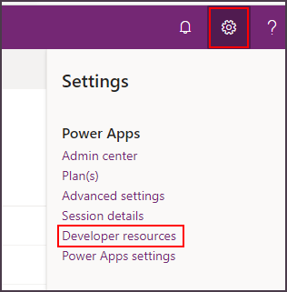

# View developer resources

This article provides resources for developers and information about the specific environment you're working with.

1. Sign into [Power Apps](https://make.powerapps.com), and select your environment in the top-right corner.

1. Select the **Settings** button in the top-right corner, and select **Developer resources**.

    

The following sections explain the information available on the developer resources page.

## Unique identifiers

The first three pieces of information (**Environment unique name**, **Environment ID**, and **Organization ID**) are the unique identifiers that describe your environment and specific Microsoft Dataverse instance (organization).

This information is needed when you connect through developer tooling or use Azure extensions with your instance. More information: [Azure integration](./azure-integration.md)

## Connect your apps to Microsoft Dataverse instance

This next two pieces of information provide you with the APIs you need to connect to your Dataverse environment.

### Web API endpoint

This is the URL for the Web API for your instance. The Web API is an OData v4 RESTful API. More information: [Use the Dataverse Web API](/powerapps/developer/data-platform/webapi/overview)

### Discovery endpoint

HTTP REST API providing connection information for the set of instances to which the caller has access. More information: [Discover the URL for your organization](/powerapps/developer/data-platform/webapi/discover-url-organization-web-api)

## Documentation

This section provides links for developers to find resources. The following resources are available:

|Link |Description|
|---------|---------|
|[Developer center](/powerapps/developer/data-platform)|The main entry point for documentation for developers.|
|[Official NuGet feed](https://go.microsoft.com/fwlink/?LinkId=550994)|Discover NuGet packages to add SDK assemblies to your projects.|
|[PowerShell Gallery feed](https://go.microsoft.com/fwlink/?LinkId=2165435)|Discover PowerShell packages to make working with Dataverse easier.|
|[Sample Code](https://go.microsoft.com/fwlink/?LinkId=553007)|A list of code samples available.|
