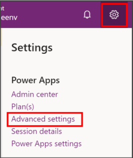
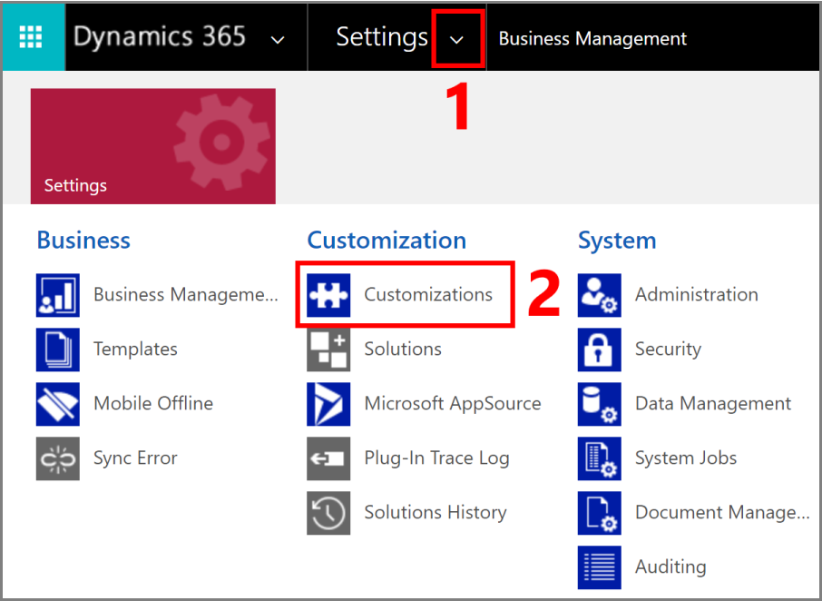
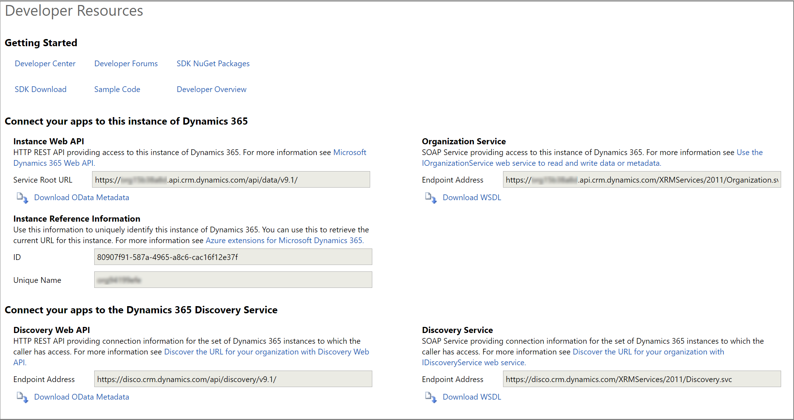

# View or download developer resources

[!INCLUDE[cc-data-platform-banner](../../includes/cc-data-platform-banner.md)]

This page provides resources for developers and information about the specific instance you're working on. 

## View the Developer Resources page for your environment

1. Sign into [Power Apps](https://make.powerapps.com), and select your environment in the top-right corner.

1. Select the **Settings** button in the top-right corner, and select **Advanced Settings**.

    

1. On the **Settings** page, select the drop-down arrow next to **Settings**, and select **Customizations**.

    

1. On the **Customizations** page, select **Developer Resources** to view the page with resources for developers.

    

The following sections explain the information available on the developer resources page.

## Getting Started 

This section provides links for developers to find resources. The following resources are available:

|Link |Description|
|---------|---------|
|[Developer Center](https://go.microsoft.com/fwlink/?LinkId=551006)|The main entry point for documentation for developers.|
|[Developer Forums](https://go.microsoft.com/fwlink/?LinkId=550993)|Ask and answer questions with other developers.|
|[SDK NuGet Packages](https://go.microsoft.com/fwlink/?LinkId=550994)|Discover NuGet packages to add SDK assemblies to your projects.|
|SDK Download|We no longer ship the SDK package as a download on Microsoft Download Center. Instead, the SDK assemblies and tools are available as [NuGet packages](https://go.microsoft.com/fwlink/?LinkId=550994). Use the PowerShell script in this article to get the latest version of SDK tools: [Download tools from NuGet](https://docs.microsoft.com/powerapps/developer/data-platform/download-tools-nuget)|
|[Sample Code](https://go.microsoft.com/fwlink/?LinkId=553007)|A list of code samples available.|
|[Developer Overview](https://go.microsoft.com/fwlink/?LinkId=550995)|Link to a topic providing an overview for developers.|

## Connect your apps to this instance of Microsoft Dataverse

This section provides information you need to connect to your Dataverse instance.

### Instance Web API

This is the URL for the Web API for your instance. The Web API is an OData v4 RESTful API. You can also download the service document that describes the metadata and operations available in your instance. More information: [Developer Documentation: Use the Dataverse Web API](/powerapps/developer/data-platform/webapi/overview)

### Organization Service

This is the URL for the SOAP endpoint for the Organization Service for your instance.
You can download the WSDL for this service here, but usually you will use the CrmSvcUtil.exe code generation tool to build entity classes for .NET projects. More information: 
- [Developer Documentation: Create early bound entity classes with the code generation tool (CrmSvcUtil.exe)](/powerapps/developer/data-platform/org-service/generate-early-bound-classes)
- [Developer Documentation: Use the Organization Service](/powerapps/developer/data-platform/org-service/overview)

### Instance Reference Information

This information uniquely describes your instance. There is a GUID **ID** and a **Unique Name**.
This information is needed when you use Azure extensions with your instance.
More information: [Azure integration](/powerapps/developer/data-platform/azure-integration)

## Connect your apps to the Dataverse Discovery Service

Because people may have access to multiple Dataverse environments, the discovery services allow for retrieving the available environments that a person can access based on their user credentials.

### Discovery Web API

This is the endpoint address for the RESTful OData v4 version of the Discovery Service to use for your instance. You can also download the service document here.
More information: [Developer Documentation: Discover the URL for your organization using the Web API](/powerapps/developer/data-platform/webapi/discover-url-organization-web-api)

### Discovery Service

This is the endpoint address for the SOAP version of the Discovery Service to use for your instance. You can also download the service document here.
More information: [Developer Documentation: Discover the URL for your organization using the Organization Service](/powerapps/developer/data-platform/org-service/discovery-service)
  
  

[!INCLUDE[footer-include](../../includes/footer-banner.md)]