# Create virtual tables using the virtual connector provider (preview)

[!INCLUDE [cc-beta-prerelease-disclaimer](../../../includes/cc-beta-prerelease-disclaimer.md)]

Virtual tables enable integrating data from external data sources by seamlessly representing that data as tables in Microsoft Dataverse, without data replication. Solutions built on Microsoft Power Platform can leverage virtual tables as if they were native Dataverse tables. More information: [Get started with virtual tables](get-started-ve.md).

In this public preview release, we are introducing the virtual connector provider which supports  creating virtual tables using the [SQL Server connector](https://docs.microsoft.com/connectors/sql). We will continue to expand and support other tabular connectors as part of this provider in subsequent releases. 

To learn more about supported actions and limitations, see [connector reference for the SQL Server connector](https://docs.microsoft.com/connectors/sql/).

## Overview

Virtual connector provider extends [connectors](https://docs.microsoft.com/connectors/connectors) allowing you to create virtual tables in Dataverse. When you establish a remote connection to an external source using a connector data source, the virtual connector provider automatically generates an **Entity Catalog** with a list of all the available tables by retrieving table definitions (metadata) from the external data source.

The **Entity Catalog** does not persist any information and always represents the external data source’s current state. You can select tables from the **Entity Catalog** to create virtual tables. If you're working with multiple external data sources, an **Entity Catalog** is generated for each external source.

The underlying data source is key for allowing the provider to establish an authenticated remote connection to the external data. It uses a connection reference that stores pertinent details regarding the external source. The information stored in the connection reference is specific to the connector type and the connection it refers to. 

> [!div class="mx-imgBorder"]
> 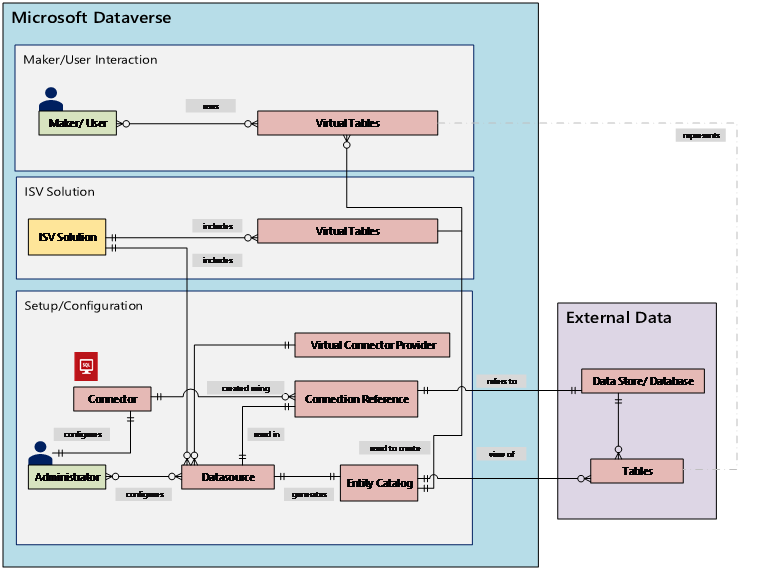

For example, setting up the **SQL Server** connector needs server name, database name, the authentication method, username, password, and (optionally) gateway connection details. Each external data source needs a new connection reference defined to create an instance of its **Entity Catalog**.

The connector permissions enforce the ability for organizational users to access and operate on the virtual table. The connection can be shared with one user or can be shared with entire organization. This allows users to access and operate on virtual tables using a shared connection.

Additionally, you need to create a service principal (Application ID) that will be used to authenticate with the provider. The service principal needs to be created in the tenant of the organization. The provider supports the use of **client ID** and **secret** values when setting up the data source. See the [prerequisite](#prerequisites) section below on how to set up a service principal.

Application lifecycle management (ALM) is supported for virtual tables created using the virtual connector provider. Virtual tables should be part of the managed solution along with the connection reference to distribute the solution. The solution can have other components, such as a model-driven app that uses virtual tables. When importing the solution into a new Dataverse environment, the data source should be updated to use a connection reference setup in the respective environment and **client ID** and **secret**.

More information about Application lifecycle management (ALM) and solutions:

- [Application lifecycle management (ALM) in Microsoft Power Platform](/power-platform/alm/)

- [Solutions overview](/powerapps/maker/data-platform/solutions-overview)

## Getting started with virtual connector provider

### Prerequisites

- Create a service principal (Application ID) that will be used to authenticate with the provider. The service principal needs to be created in the tenant of your Dataverse platform. For more information on how to create this, please refer to [Creating service principal from Azure portal](https://docs.microsoft.com/en-us/azure/active-directory/develop/howto-create-service-principal-portal#register-an-application-with-azure-ad-and-create-a-service-principal).

- Create a **client secret** value for the registered Application ID. You need this information when you create a data source for the external data as part of setting up the virtual connector. Refer to [Create a new application secret](https://docs.microsoft.com/en-us/azure/active-directory/develop/howto-create-service-principal-portal#option-2-create-a-new-application-secret) doc for steps on how to create this.

> [!NOTE]
> You will need the **client secret** when setting up the virtual table. You can copy this value when creating it.You will not be able to go back to the screen to copy the value.

Save the following values from Azure portal. This will help in setting up the Virtual Table Data Source:

1. **Directory (tenant) ID:** A GUID value representing the Dataverse tenant in which you are setting up the virtual table.

2. **Application (client) ID:** A GUID value representing the service principal (application ID) you created.

3. Select **Certificates & secrets** in the left navigation pane and select **New client secret** to create a new secret value.

4. **Client secret Value:** A unique secret value for the client you created.

> [!div class="mx-imgBorder"]
> 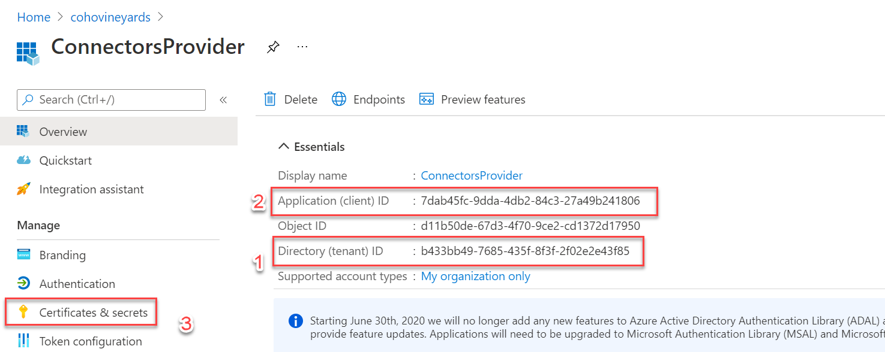

> [!div class="mx-imgBorder"]
> 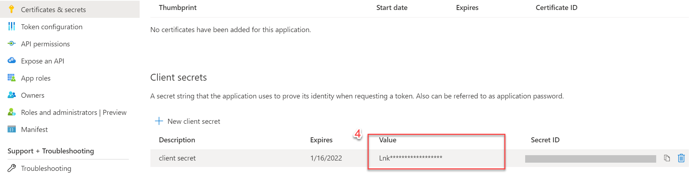

## Create a virtual table using SQL Server connector

To create a virtual table using **SQL Server** connector: 

1. Go to [Microsoft AppSource](https://appsource.microsoft.com/) and search for `Virtual Connector` or select the link to download the provider: [Virtual connectors in Dataverse](https://appsource.microsoft.com/product/dynamics-365/mscrm.connector_provider?tab=Overview)

   > [!div class="mx-imgBorder"]
   > 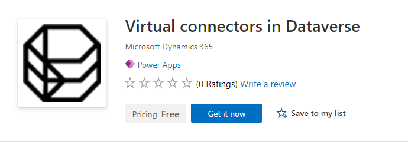

1. Select **Get it now**. In the sign-in dialog, enter work or school account email. Agree the terms and conditions and then select **Continue**. The Power Platform Admin Center will open automatically.

1. Select the environment where you want to install the solution. Agree the terms and conditions and then select **Install**. Once the installation is complete, you will see the **Virtual connectors in Dataverse** app installed under **Environments -> [your environment name] -> Dynamics 365 apps**.

   > [!div class="mx-imgBorder"]
   > 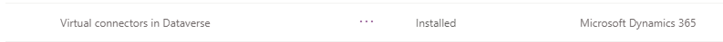

1. You should also see the **Virtual Connector Provider** solution and other solutions enabled in the PowerApps environment .

    > [!div class="mx-imgBorder"]
    > 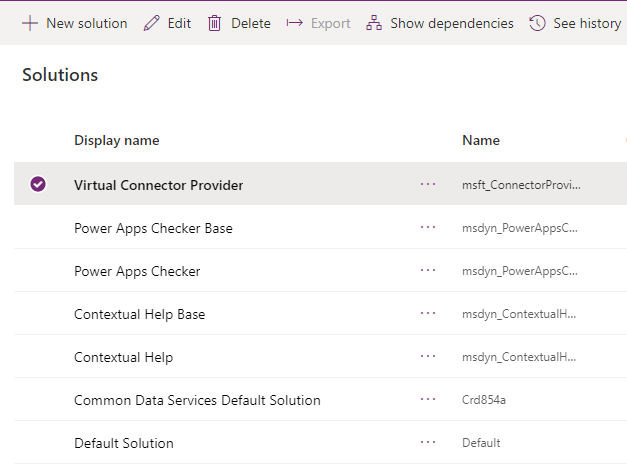

1. Now, go to [Power Apps](https://make.powerapps.com), select the environment in which you would like to set up the virtual table. In the left navigation pane, select **Data** > **Connections** then select **New connection**. Select **SQL Server** connector from the list of connections. Select **SQL Server Authentication** as **Authentication Type**. Enter **SQL server name**, **SQL database name** and then select **Create**.

    > [!div class="mx-imgBorder"]
    > 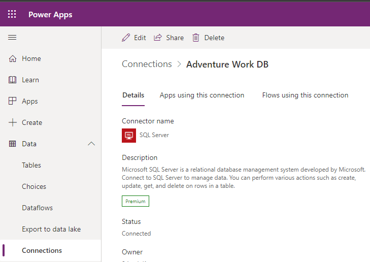

1. Select the connection you created and share this connection with all the users in your organization by selecting the **Share** action in the connection details view.

    > [!div class="mx-imgBorder"]
    > 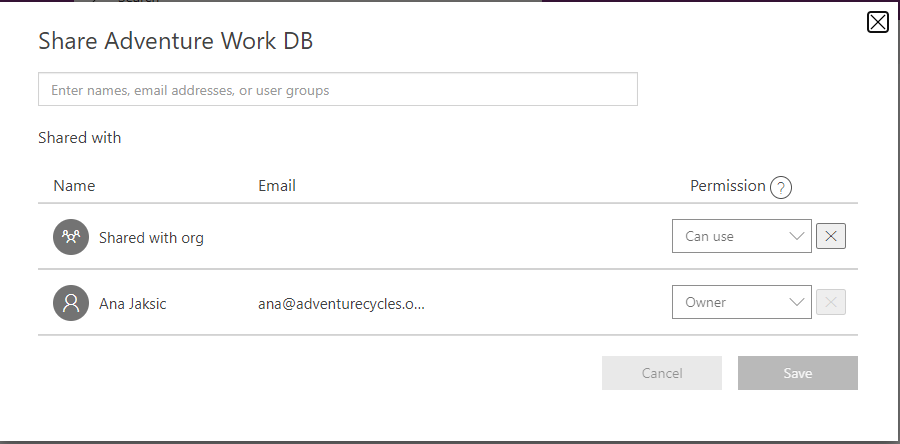

    > [!IMPORTANT] 
    > Sharing the connection with the organization is an important step. This allows for the service principal that was created in this tenant to have access to the connection. 

1. With the connection to the external data source established, you can now start creating **Connection Reference**. As the name suggests, a connection reference is a reference that provides a way for the Dataverse platform to access the connection information associated with the external data source. To create a connection reference:

   1. Go to **Solutions**.
   1. Select the **Default Solution** or any other existing solution you have in your environment to create the virtual table.
   1. Select **New** and then select **Connection Reference (preview).**
   1. Enter **Display name**, select **SQL Server** for the **Connectors** option and then select the data connection that you have created earlier.

   > [!div class="mx-imgBorder"]
   > 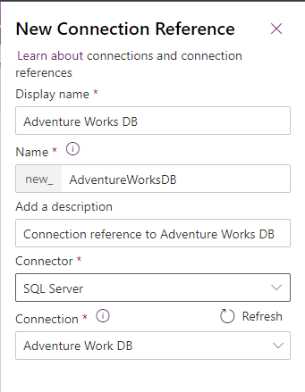

    > [!NOTE] 
    > You can also create a new data connection from this dialog. You will be presented with a list of connectors to choose from. Select the **SQL Server** connector for setting up the new connection.

1. Create a new **Virtual Entity Data Source** by selecting the **Gear icon -> Advanced Setting -> Administration -> Virtual Entity Data Source**. Select **New**. In the pop-up dialog, select the Virtual Connector Data Provider. Enter the connection reference, Tenant ID, environment ID, client ID, and client secret values.

    > [!div class="mx-imgBorder"]
    > 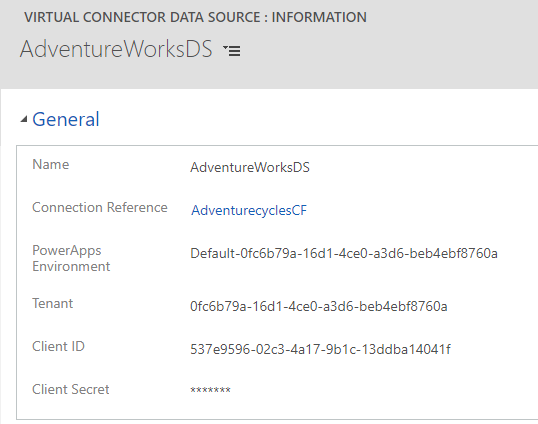

    > [!NOTE]
    > - If you have more than one Dataverse environment, enter the environment GUID in which you are setting up the virtual table data source in the environment column. To find the environment specific GUID – copy the value from the URL as highlighted below.
    >  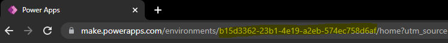
    > - If you have only one Default environment, note that you will have to include the full environment value in the environment column. This includes a `Default-` prefix before the GUID.
    >   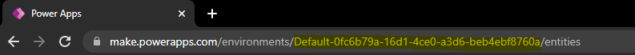

1. With the connection reference and the virtual table data source setup, an **Entity Catalog** is automatically generated. The **Entity Catalog** is specific to the data source and will list all the tables that are in the respective data source.
   > [!NOTE] 
   > - The creation of the entity catalog is an asynchronous process. Depending on your environment, this may take a few minutes. 
   > - The tables you see in the Entity Catalog are not virtual tables in themselves. You need to select from this list of tables representing the external data to create virtual table in Dataverse.
   
   You can view the **Entity Catalog** by selecting **Advanced Find** and using the **Look for:** column. The catalog will include a prefix `Entity Catalog for` followed by the connection reference (example: *Entity Catalog for Adventure Works DB*).

1. Find the **Entity Catalog** for your respective data connection and select the **Results** button to see all the external data source tables. You can also see the Entity Catalog by going to **Data -> Tables** view and selecting the **Data** tab.

    > [!div class="mx-imgBorder"]
    > 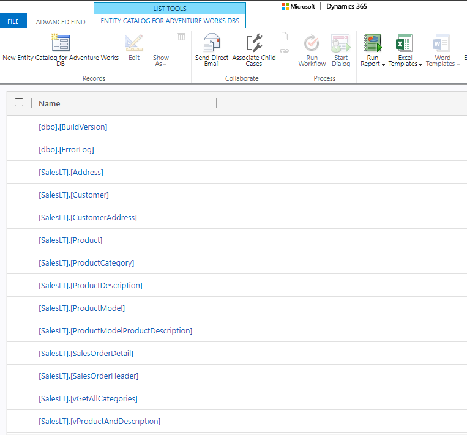

    >[!Note]
    > Bulk creation of virtual tables is not supported currently. Even though the Entity Catalog allows you to select multiple tables, you will have to select one table at a time to create virtual tables.

1. You can now **create a virtual table** by clicking the record from the entity catalog record and setting the **Create or Refresh Entity** column to **Yes**.  Set the **Primary field of the virtual entity** by select the appropriate column name listed. The drop-down lists all the columns of datatype string (nvarchar) that are eligible to be used as the primary field for the virtual table.
    
    > [!div class="mx-imgBorder"]
    > 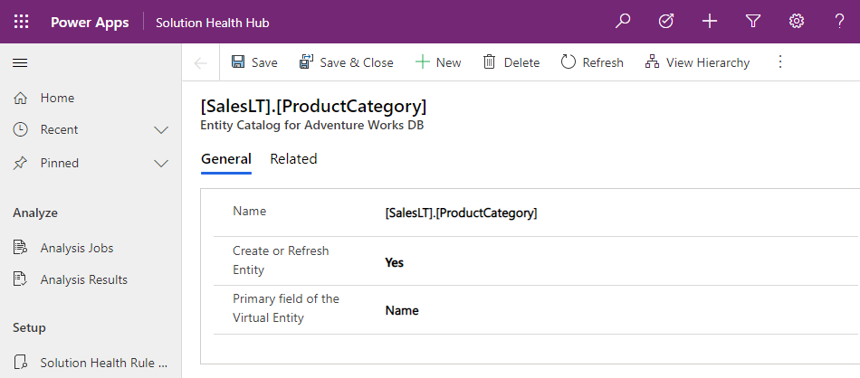

    Saving the record creates the virtual table. Once the virtual table is created, you can go back to **Advanced Find** and select the virtual table to retrieve all the records.

    > [!div class="mx-imgBorder"]
    > 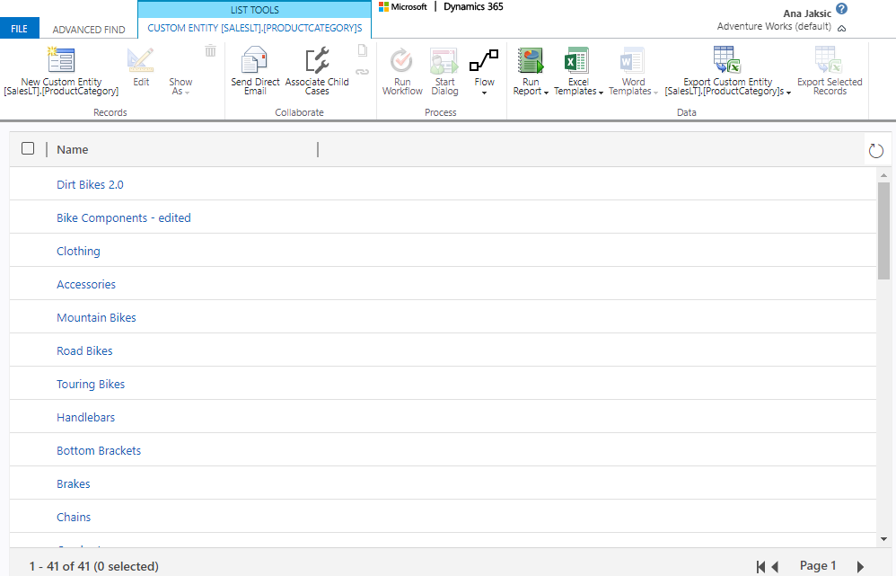

    Here is the view of the same records from the virtual table in the Data tab in PowerApps (**Data -> Tables** view).

    > [!div class="mx-imgBorder"]
    > 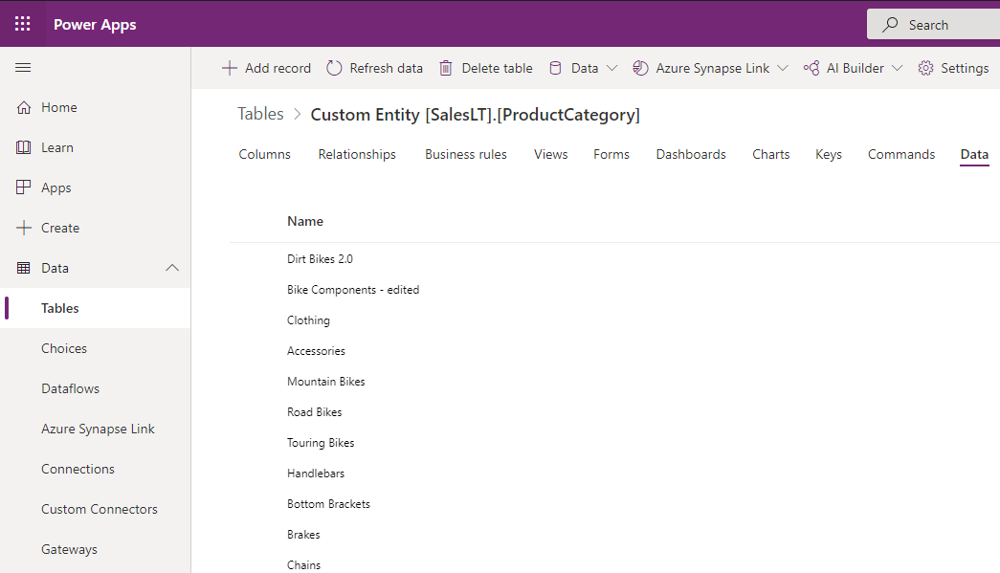

    > [!IMPORTANT] 
    > - Virtual tables no longer require an associated GUID as a primary key with the virtual connector provider. 
    > - The provider automatically maps the primary key associated with the external data source when creating the virtual table. All CRUD operations can be performed on the generated virtual table. 

1. All columns in the external data are automatically mapped to Dataverse types that are support by the connector. You can review the virtual table details and make changes by navigating to **Settings -> Customization – Entities** view.

   Review the [SQL Server Connector documentation](https://docs.microsoft.com/connectors/sql/) for the full list of [datatype mappings supported by SQL Server Connector](https://docs.microsoft.com/connectors/sql/#power-apps-data-type-mappings).

Once you have created a virtual table, you can work with it much the same way as any other table. You can start defining the relationships with other tables, in the environment and use them in your Power Apps and Power Automate flows.

### Setting up virtual table relationship

Virtual tables are  enabled for relationships. You can set up 1:N, N:1, and N:N relationships. These relationships can be established between `native: virtual tables` and between `virtual: virtual tables`. You can only set up `virtual: virtual relationship` between tables from the same virtual table provider. 

For instance, you cannot set up a relationship between a virtual table created using the OData virtual table provider and a virtual table created using the Virtual Connector provider.

#### Defining relationships in virtual tables

Virtual tables created using the virtual connector provider automatically creates all the columns that are represented in the external source table. This will also include columns on which relationships are defined. However, the relationship definition will not be automatically created. You will have to define this relationship in Dataverse manually.

The following example creates an N:1 relationship between a virtual table (**Service Request**) and a native table (**Account**). The column used to set up the relationship is **AccountId**. This column is the primary key in the Account table and is a foreign key in the Service Request table.

A representation of the **Service Request** virtual table is shown below. You will notice that the **AccountId** column, which is the column used for relationship in the external source, is of type **Multiple Line of Text**. You need to have this column represented as a **Lookup** type to create a relationship.

> [!div class="mx-imgBorder"]
> 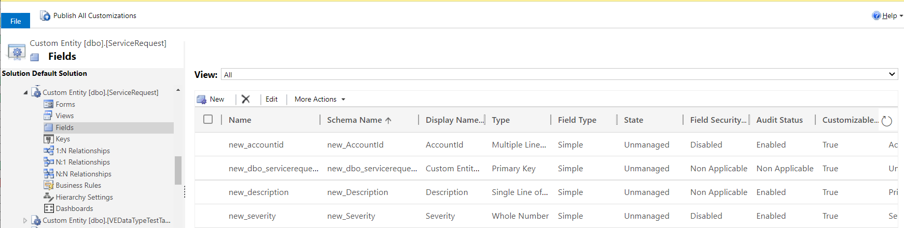

1. Go to **Advanced settings -> Settings -> Customization** and choose **Customize the System**.

2. In the left navigation pane, expand the **Entities** view and browse to the Service Request virtual table definition.

3. Select the **Fields** view and select the **AccountId** column and select **Delete**.

4. Choose **Delete** to confirm the deletion of this column.

5. To create the relationship, select the **N:1 Relationship** within the Service Request table.

6. Select **New Many-to-1 Relationship**.

7. Enter the following details to create the relationship between the Service Request virtual table and the Account table.

    1. In the **Relationship Definition** section – set the **Primary Entity** column value to **Account**.

    2. Optionally, if you want to edit the name of the relationship, you can do so in the **Name** column.

    3. In the **Lookup Field** section – set the **Display Name** to **Account.**

    4. The **Name** column will automatically populate with the lookup column name.

    5. Set the **External Name** value to **AccountId** (matching the column name in your source table).

        > [!div class="mx-imgBorder"]
        > 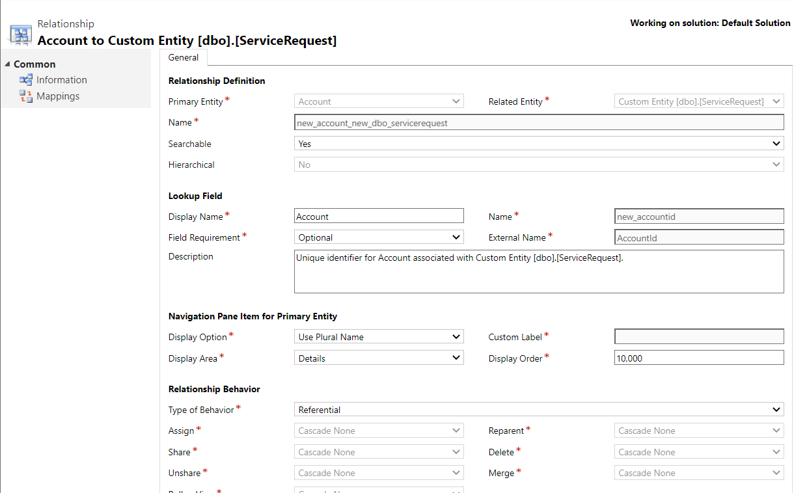

8. Refer to the columns for the **Service Request** virtual table, and you will notice that the **AccountID** column is not a **Lookup** type. This column can now
be added to forms and views to see all associated accounts for each of the service request record.

   > [!div class="mx-imgBorder"]
   > 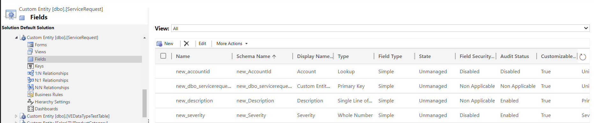

9. With the relationship established you can now create a new service request and pick accounts to associate them to.

   > [!div class="mx-imgBorder"]
   > 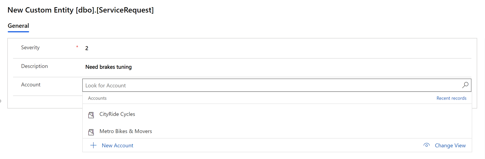

   > [!NOTE]
    > You will have to edit the forms and views for this table to include the lookup column and other requried columns prior to operation on the virtual table.

#### Tips

1. Primary Key column should be included in create form if you did not set up the column to increment during the design of the underlying source table automatically. You will have to enter a valid value in the primary key column for an insert operation to succeed.

2. If **Entity Catalog** creation takes a long time, you can check the job completion status by navigating to **Settings -> System Jobs** view.

3. The easiest way to identify the environment you are working is from the URL. The value following the *https://make.powerapps.com/environments/* path is the GUID representing the environment.

## Known limitations

1. SQL data type `bigint` columns in the source table will be mapped as a decimal data type in Dataverse virtual tables. When platform support is available for `bigint` mapping to a whole number, previously created columns in the virtual table will need to be deleted, and new columns should be created.

2. Maximum length of characters allowed for a text column in a virtual table is 4000 characters. Suppose the destination table has the character set to greater than this value. In that case, any create/update operation exceeding the max character limit will result in a validation error, and the operation will fail.

3. If you have a 1:N or N:N relationship with a virtual table you will see an error when any query with table reference to the virtual table exceeds the 250 record limit. Use filtering in your query to reduce the recordset as a workaround to this limitation.

## Troubleshooting

1. You have configured the virtual table data source, but the **Entity Catalog** did not get created

    **Solution:** One or more values you used when creating the virtual table data source are incorrect. See the [prerequisite](#prerequisites) section and make sure you are copying the correct values from the Azure portal. You need the Tenant ID, Application (Client) ID, and the client secret value. Additionally, you will also need the environment GUID when setting up the data source.

2. When querying the **Entity Catalog** from the Power Apps maker portal, you see an error – *The remote server returned an error: (403) forbidden.*

    **Solution:** Make sure you have the service principal (Application ID) created in the respective tenant, and when creating the connection using the **SQL Server** connector, you have shared the connection with everyone in your org. To share the connection, select the connection and select **Share**. Then, select **Add everyone in my org** and save the connection.

    > [!div class="mx-imgBorder"]
    > 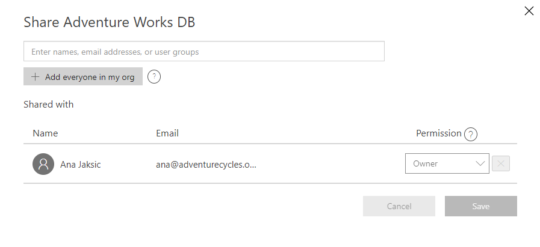
    
    > [!div class="mx-imgBorder"]
    > 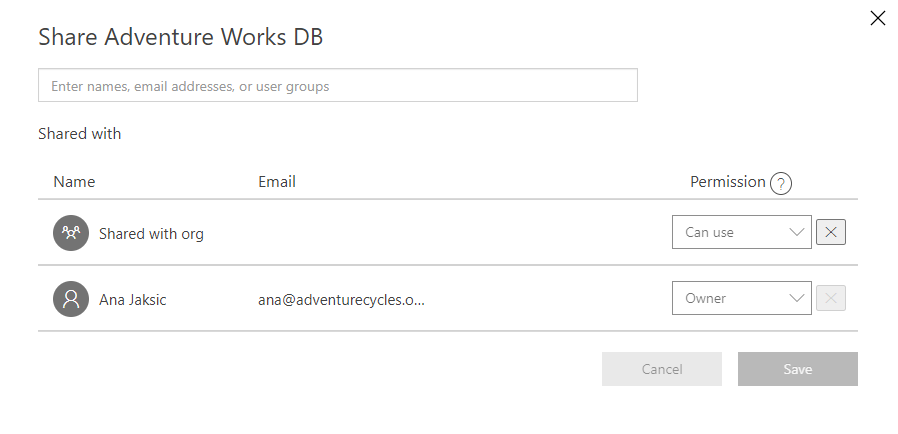

3. When querying the **Entity Catalog** from the Power Apps maker portal, you see an error – *The given key was not present in the dictionary.*

    **Solution:** Check the values you have for the Tenant, Client ID, and client secret columns when setting up the virtual table data source

4. You are seeing only one (1) record in your virtual table even though you have more in your source table.

    **Solution:** Check your source table and make sure it has primary key defined.

### See also

[Get started with virtual tables (entities)](get-started-ve.md)

