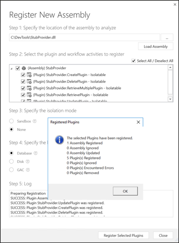

# Sample: Custom virtual table provider with CRUD operations

In this sample, you will be implementing a custom data provider to create a virtual table that supports create, retrieve, update and delete operations. For each of these operations, you will implement a generic plug-in, register them using the Plugin Registration Tool, and enable virtual table data sources to create the virtual table.

To learn more about data providers and plug-in development, see [Custom data providers](https://docs.microsoft.com/powerapps/developer/data-platform/virtual-entities/custom-ve-data-providers)

## Data source details:

For this walkthrough, you will set up a simple table in an external SQL server to create a virtual table. The table name used in this example is **VETicket**.

> [!NOTE]
> Make sure to update your plug-in code, if you wish to change the name of the table or column.

| Column Name | Data Type                      | Purpose                       |
|-------------|--------------------------------|-------------------------------|
| TicketID    | Unique Identified, Primary Key | Primary key for the table.   |
| Severity    | Integer                        | Severity value for the ticket. |
| Name        | String                         | Description of the ticket.     |

There are three steps to enable a custom data provider to create a virtual table.

[Step 1: Implementing the CRUD plugins and registering the assembly in Microsoft Dataverse](#implementing-the-crud-plugins-and-registering-the-assembly)

[Step 2: Creating a data provider and adding the CRUD plugins to the provider](#creating-a-data-provider-and-adding-the-crud-plugins-to-the-provider)

[Step 3: Creating the virtual table in the Dataverse environment](#creating-the-virtual-table-in-the-dataverse-environment)

[Step 4: Create, update, view and delete records using the virtual table](#create-update-view-and-delete-records-using-virtual-table)

## Step 1: Implementing the CRUD plugins and registering the assembly


1. Create your plugin project and install the following NuGet packages. The solution in this example is named **StubProvider**.

   | Microsoft.CrmSdk.CoreAssemblies                 | <https://www.nuget.org/packages/Microsoft.CrmSdk.CoreAssemblies/>                 |
   |-------------------------------------------------|-----------------------------------------------------------------------------------|
   | Microsoft.CrmSdk.Data                           | https://www.nuget.org/packages/Microsoft.CrmSdk.Data/                             |
   | Microsoft.CrmSdk.Deployment                     | https://www.nuget.org/packages/Microsoft.CrmSdk.Deployment/                       |
   | Microsoft.CrmSdk.Workflow                       | https://www.nuget.org/packages/Microsoft.CrmSdk.Workflow/                         |
   | Microsoft.CrmSdk.XrmTooling.CoreAssembly        | <https://www.nuget.org/packages/Microsoft.CrmSdk.XrmTooling.CoreAssembly/>        |
   | Microsoft.IdentityModel.Clients.ActiveDirectory | <https://www.nuget.org/packages/Microsoft.IdentityModel.Clients.ActiveDirectory/> |
   | Microsoft.Rest.ClientRuntime                    | <https://www.nuget.org/packages/Microsoft.Rest.ClientRuntime/>                    |
   | Newtonsoft.Json                                 | https://www.nuget.org/packages/Newtonsoft.Json/13.0.1-beta2                       |
   |||

1. Add the following six (6) class files to your solution. In each of the class files, add the following using statements

    ```csharp
    using System; 
    using System.Collections.Generic; 
    using System.Data.SqlClient; 
    using System.Linq; using System.Text; 
    using System.Threading.Tasks; 
    using Microsoft.Xrm.Sdk; 
    using Microsoft.Xrm.Sdk.Extensions; 
    using Microsoft.Xrm.Sdk.Data.Exceptions; 
    using Newtonsoft.Json; 
    ```

    > [!NOTE]
    > In each of these class implementations, update the table name to match the source table name you have setup. The example used **VETicket** as the source table name.

    | Class file name    | Purpose          |
    |------------|------------------------------------|
    | **Connection.cs**   | This class contains code for creating and managing the connection to the external SQL data source. It includes connection string parameters specific to the external database and SQL-based authentication information required to establish the connection. Replace the values respective to your: Database server, UserID, Password, and table name that you will be creating a virtual table in Dataverse. |
    | **CreatePlugin.cs**  | This class contains code that handles the create operation for the virtual table. |
    | **UpdatePlugin.cs**  | This class contains code that handles updating records in the virtual table.  |
    | **RetrievePlugin.cs**  | This class contains code that retrieves a specific record from the virtual table. |
    | **RetrieveMultiplePlugin.cs**  | This class contains code for fetching multiple records from the virtual table.  |
    | **DeletePlugin.cs**  | This class contains code that allows you to delete a record in the virtual table.|
    |||

     ### Code for Connection.cs   

     ```csharp
     public static class Connection 
     { 
     public static SqlConnection GetConnection() { 
     try { 
     //sample database to connect to 
     SqlConnectionStringBuilder builder = new SqlConnectionStringBuilder(); 
     builder.DataSource = "\<insert your database server name\>"; 
     builder.UserID = "\<insert SQL auth user ID\>"; 
     builder.Password = "\<insert password\>"; 
     builder.InitialCatalog = "\<insert your database name\>"; 
     SqlConnection connection = new SqlConnection(builder.ConnectionString); 
     return connection; 
       } 
     catch (SqlException e) {
      Console.WriteLine(e.ToString()); 
      throw; 
            } 
        } 
      }  
     ```

    ### Code for CreatePlugin.cs  

    ```csharp
    public void Execute(IServiceProvider serviceProvider)
        {
            var context = serviceProvider.Get<IPluginExecutionContext>();
            if (context.InputParameters.Contains("Target") && context.InputParameters["Target"] is Entity)
            {
                Entity entity = (Entity)context.InputParameters["Target"];
                Guid id = Guid.NewGuid(); 
                //change the table name below to the source table name you have created 
                string cmdString = "INSERT INTO VETicket (TicketID,Name,Severity) VALUES (\@TicketID, \@Name, \@Severity)"; 
                SqlConnection connection = Connection.GetConnection(); 
                using (SqlCommand command = connection.CreateCommand()) { 
                    command.CommandText = cmdString;
                    command.Parameters.AddWithValue("\@TicketID", id); 
                    command.Parameters.AddWithValue("\@Name", entity["new_name"]); 
                    command.Parameters.AddWithValue("\@Severity", entity["new_severity"]); 
                    connection.Open(); 
                    try { 
                        var numRecords = command.ExecuteNonQuery(); 
                        Console.WriteLine("inserted {0} records", numRecords); 
                    } 
                    finally { 
                        connection.Close(); 
                    } 
                    // other codes. 
                   } 
                    context.OutputParameters["id"] = id; 
            } 
        } 
    }             
    ```
    ### Code for UpdatePlugin.cs 

    ```csharp
    public void Execute(IServiceProvider serviceProvider){
            var context = serviceProvider.Get<IPluginExecutionContext>(); 
            Guid id = Guid.Empty; 
            if (context.InputParameters.Contains("Target") && context.InputParameters["Target"] is Entity)
            {
                Entity entity = (Entity)context.InputParameters["Target"]; 
                //change the table name below to the source table name you have created  
                string cmdString = "UPDATE VETicket SET {0} WHERE TicketID=\@TicketID"; 
                SqlConnection connection = Connection.GetConnection(); 
                using (SqlCommand command = connection.CreateCommand()) { 
                    command.Parameters.AddWithValue("\@TicketID", entity["new_ticketid"]); 
                    List<string> setList = new List<string>(); 
                    if(entity.Attributes.Contains("new_name")) 
                    { 
                        command.Parameters.AddWithValue("\@Name", entity["new_name"]); 
                        setList.Add("Name=\@Name"); 
                    } 
                    if (entity.Attributes.Contains("new_severity")) 
                    { 
                        command.Parameters.AddWithValue("\@Severity", entity["new_severity"]); 
                        setList.Add("Severity=\@Severity"); 
                    } 
                    command.CommandText = string.Format(cmdString,string.Join(",",setList)); connection.Open(); 
                    try { 
                        var numRecords = command.ExecuteNonQuery();
                        Console.WriteLine("updated {0} records", numRecords); 
                    } 
                    finally { 
                        connection.Close(); 
                    } 
                    // other codes. 
                } 
            } 
        } 
    }
    ```

    ### Code for RetrievePlugin.cs  

    ```csharp
     public class RetrievePlugin : IPlugin
    {
        public void Execute(IServiceProvider serviceProvider)
        {
            var context = serviceProvider.Get<IPluginExecutionContext>();
            Guid id = Guid.Empty; 
            if (context.InputParameters.Contains("Target") && context.InputParameters["Target"] is EntityReference)
            {
                EntityReference entityRef = (EntityReference)context.InputParameters["Target"]; 
                Entity e = new Entity("new_ticket"); 
                //change the table name below to the source table name you have created  
                string cmdString = "SELECT TicketID, Severity, Name FROM VETicket WHERE TicketID=\@TicketID"; 
                SqlConnection connection = Connection.GetConnection(); 
                using (SqlCommand command = connection.CreateCommand()) { 
                    command.CommandText = cmdString; 
                    command.Parameters.AddWithValue("\@TicketID", entityRef.Id); 
                    connection.Open(); 
                    try { 
                        using (SqlDataReader reader = command.ExecuteReader()) { 
                            if (reader.Read()) {
                                e.Attributes.Add("new_ticketid", reader.GetGuid(0)); 
                                e.Attributes.Add("new_severity", reader.GetInt32(1));
                                e.Attributes.Add("new_name", reader.GetString(2)); 
                            } 
                        } 
                    } 
                    finally { 
                        connection.Close(); 
                    } 
                    // other codes. 
                } 
                context.OutputParameters["BusinessEntity"] = e; 
            } 
        } 
    } 
    ```
    ### Code for RetrieveMultiplePlugin.cs 

    ```csharp
        public class RetrieveMultiplePlugin : IPlugin
    {
        public void Execute(IServiceProvider serviceProvider)
        {
            var context = serviceProvider.Get<IPluginExecutionContext>(); 
            EntityCollection collection = new EntityCollection();
            //change the table name below to the source table name you have created  
            string cmdString = "SELECT TicketID, Severity, Name FROM VETicket"; 
            SqlConnection connection = Connection.GetConnection(); 
            using (SqlCommand command = connection.CreateCommand()) { 
                command.CommandText = cmdString; 
                connection.Open(); 
                try { 
                    using (SqlDataReader reader = command.ExecuteReader()) { 
                        while (reader.Read()) { 
                            Entity e = new Entity("new_ticket"); 
                            e.Attributes.Add("new_ticketid", reader.GetGuid(0)); 
                            e.Attributes.Add("new_severity", reader.GetInt32(1)); 
                            e.Attributes.Add("new_name", reader.GetString(2)); 
                            collection.Entities.Add(e); 
                        } 
                    } 
                } 
                finally { 
                    connection.Close(); 
                } 
                context.OutputParameters["BusinessEntityCollection"] = collection; 
            } 
        } 
    }
    ```

    ### Code for DeletePlugin.cs 

    ```csharp
     public class DeletePlugin : IPlugin
    {
        public void Execute(IServiceProvider serviceProvider)
        {
            var context = serviceProvider.Get<IPluginExecutionContext>(); 
            //comment 
            Guid id = Guid.Empty; 
            if (context.InputParameters.Contains("Target") && context.InputParameters["Target"] is EntityReference) {
                EntityReference entityRef = (EntityReference)context.InputParameters["Target"]; 
                id = entityRef.Id; 
                //change the table name below to the source table name you have created 
                string cmdString = "DELETE VETicket WHERE TicketID=\@TicketID"; 
                SqlConnection connection = Connection.GetConnection(); 
                using (SqlCommand command = connection.CreateCommand()) { 
                    command.CommandText = cmdString; command.Parameters.AddWithValue("\@TicketID", id); 
                    connection.Open(); 
                    try { 
                        var numRecords = command.ExecuteNonQuery(); 
                        Console.WriteLine("deleted {0} records", numRecords); 
                    } 
                    finally 
                    { connection.Close(); 
                    } 
                    // other codes. 
                } 
            } 
        } 
    }
    ```

1. Compile and build the solution. You will now have an assembly file (.DLL) you can use to register in your Dataverse environment. You will find this library file in the \<solution folder\>/bin/Debug directory. For example, the assembly file is “StubProvider.dll”

    

1. Register this assembly using the Plugin Registration Tool. You can get the latest Plugin Registration Tool Nuget from [here](https://www.nuget.org/packages/Microsoft.CrmSdk.XrmTooling.PluginRegistrationTool).

1. Launch the plugin registration tool, connect to your Dataverse environment. From the Register drop-down select “Register New Assembly”

   

1. Select the assembly file (example: StubProvider.dll) and register the plugins. Please make sure that you have selected all the CRUD plugins (Create, Update, Delete, Retrieve, and RetrieveMultiple plugins).

    

## Step 2: Creating the data provider and adding the CRUD plugins

1. From the Register drop-down select the “Register New Data Provider” option

1. In the Register New Data Provider dialog, type in/ select values for the
    following fields:

    1. **Data Provider** Name

    2. Select an **existing solution** or **create a new solution**. If you are creating a new solution, **select or create a new publisher** and enter a **version number**.

    3. **Create a new Data Source Entity** and provide a Display Name for the data source, ensure the data source is part of the solution you created/selected.

        > [!NOTE]
        > The Data Source table in Dataverse holds the configuration data for a data source record to be passed to the provider plugins.

    4. Map each of the registered plug-in to its respective operations

    5. Register the new data provider

        

1. In the Plugin Registration Tool, you will see the new Data Source record and the associated Data Provider. Selecting the Data Source will display the details which will include the CRUD plugins and their registered GUID.

    

## Step 3: Creating the virtual table in the Dataverse environment


1. Create a new Virtual Entity Data Source by going to Setting -\> Administration -\> Virtual Entity Data Sources

2. Select **New,** in the Select Data Provider drop-down, select the data provider you created in the previous step.

3. Type in a name for the data source and select **Save and Close**

4. You are now ready to create the virtual table that represents the external data source. To do this, go to **Settings -\> Customize the System**

5. In the left navigation pane of solution explorer, Select Entities, and then select New from the main pane.

6. On the Entity: New form, select the Virtual Table option and enter the following information

    | Field                     | Value                                                                                     |
    |---------------------------|-------------------------------------------------------------------------------------------|
    | Data Source               | The data source you created in the previous step                                          |
    | Display Name              | Virtual Table name                                                                        |
    | Plural Name               | The value will be automatically populated based on the Display Name                       |
    | Name                      | This will also be created automatically based on the value you enter for the display name |
    | External Name             | The name of the source table                                                              |
    | External Collections Name | You can use the same value from the Plural Name field                                     |

7. Select **Save and Close.**

    

8. On the left navigation pane select and expand on the virtual table you created

9. Select **Fields** to update and create new columns representing the external source

10. Open the Primary key field for the virtual table and select **Edit**.

11. Update the **External Name** field to match the field name in your external data source. In this example, the external column name is **TicketID**.

    

12. Select **Save and Close**.

13. Select the **Name** field for the virtual table and select **Edit**.

14. Update the **External Name** field to match the field name in your external data source. In this example, the external column name is **Name**.

    

15. Select **Save and Close**.

16. Select **New** to create a new column in the virtual table. This column will represent the Severity field in the external data source

17. Enter the following information for the new columns

    | Field Name        | Value             |
    |-------------------|-------------------|
    | Display Name      | Severity          |
    | Name              | new_severity      |
    | External Name     | Severity          |
    | Field Requirement | Business Required |
    | Data Type         | Whole Number      |

    

18. Select **Save and Close**.

## Step 4: Create, update, view, and delete records using a virtual table

Create a model-driven app and add the virtual table to the site map. Then select the virtual table main form and the Advanced field view. Publish the app. More information: [Build your first model-driven app from scratch](https://docs.microsoft.com/powerapps/maker/model-driven-apps/build-first-model-driven-app?branch=matp-2190993)


Application users can perform read, create, update, delete operations using the virtual table just like any other table in Microsoft Dataverse.

### See also

[Getting started with virtual entities](https://docs.microsoft.com/powerapps/developer/data-platform/virtual-entities/get-started-ve)<br/>
[API considerations for virtual entities](https://docs.microsoft.com/powerapps/developer/data-platform/virtual-entities/api-considerations-ve)<br/>
[Custom virtual entity data providers](https://docs.microsoft.com/powerapps/developer/data-platform/virtual-entities/custom-ve-data-providers)<br/>
[Virtual table walkthrough using OData v4 Data Provider](https://docs.microsoft.com/powerapps/maker/data-platform/virtual-entity-walkthrough-using-odata-provider)
