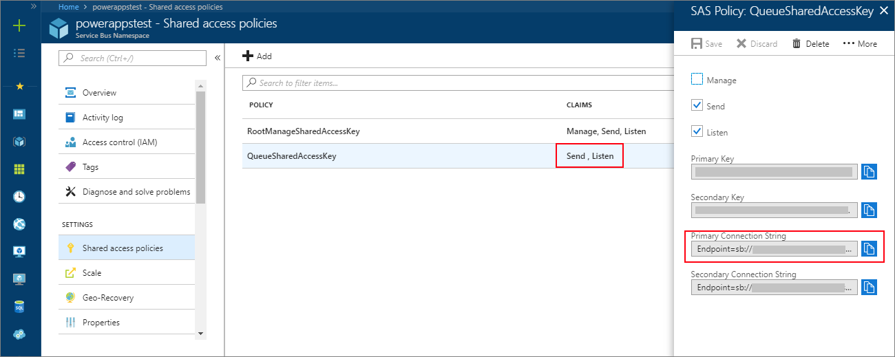
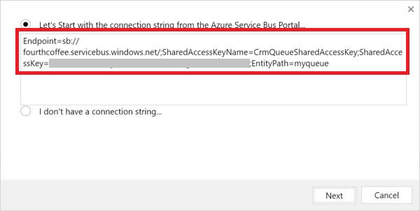
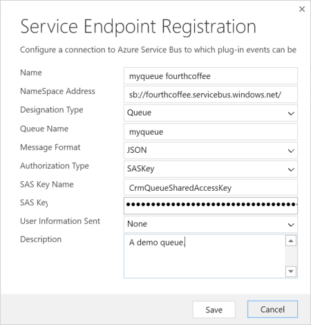
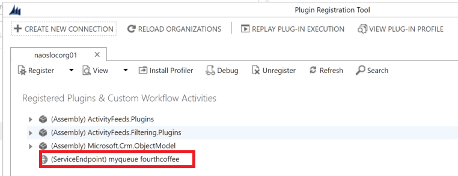

# Tutorial: Configure Azure (SAS) for integration with Microsoft Dataverse

[!INCLUDE[cc-terminology](includes/cc-terminology.md)]

This walkthrough guides you through configuring the Azure Service Bus issuer, scope, and rules to allow a listener application to read the Dataverse messages posted to the Azure Service Bus.  
  
> [!NOTE]
>  This walkthrough applies to any Dataverse deployment when using SAS authorization for Azure messaging. For more information about Azure Service Bus authorization, see [Service Bus authentication and authorization](/azure/service-bus-messaging/service-bus-authentication-and-authorization).  
>   
> You must use the Plug-in Registration Tool. To download the plug-in registration tool, see [Dataverse development tools](download-tools-NuGet.md).
  
## Prerequisites  

<!-- tag:comment In Azure, there are messaging entities (not tables) -->
- An Azure account with a license to create Service Bus entities.
  
- A SAS configured Service Bus namespace.
  
- A SAS configured Service Bus messaging entity: queue, topic, relay, or event hub.
  
- The messaging entity must have the `Send` policy permission at a minimum. For a two-way relay, the policy must also have the `Listen` permission.  
- The authorization connection string of your messaging entity.
  
   
  
 Refer to the [Create a Service Bus namespace using the Azure portal](/azure/service-bus-messaging/service-bus-create-namespace-portal) for instructions on how to create a Service Bus namespace and messaging entity.  
  
## Create a service endpoint

A [ServiceEndpoint Table](reference/entities/serviceendpoint.md) contains configuration data that is required for external messaging with a Azure Service Bus solution endpoint. By using the Plug-in Registration tool, you can easily create a service endpoint table in a Dataverse organization and configure the Service Bus endpoint issuer, scope, and rules.
  
### Register a Service Endpoint  
  
1. Run the Plug-in Registration tool and log into your target Dataverse organization.  
  
2. Select **Register > Register New Service Endpoint**.  
  
3. Check **Let's Start with the connection string from the Azure Service Bus Portal** and paste the connection string of your Service Bus messaging entity.  
  
   
  
4. Select **Next**.  
  
5. Fill out the **Service Endpoint Registration** form by entering the **Designation Type**, **Message Format**, and optionally the **User Information Sent** and **Description** fields.
  
   
  
   For more information about the message format, see [Write a listener application for a Azure solution](write-listener-application-azure-solution.md).  
  
6. Select **Save**.  
  
7. After a few seconds or so, you will see the new service endpoint in the **Registered Plug-ins & Custom Workflow Activities** list.  
  
   
  
### See also

[Azure integration](azure-integration.md) 
[What is Azure Service Bus?](/azure/service-bus-messaging/service-bus-messaging-overview)

[!INCLUDE[footer-include](../../includes/footer-banner.md)]
