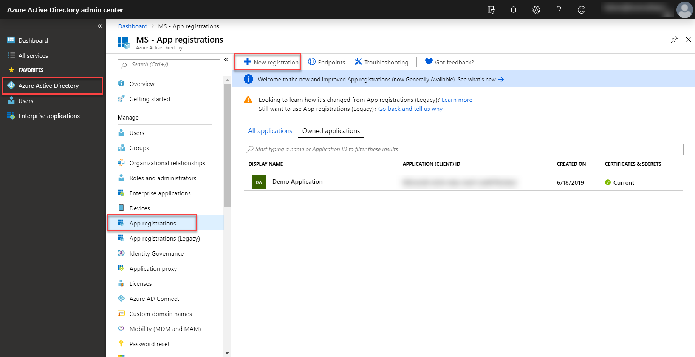
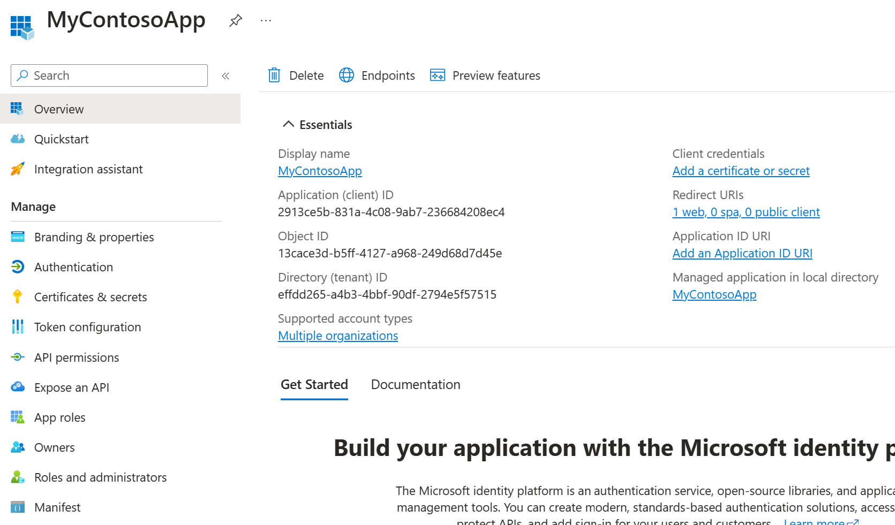
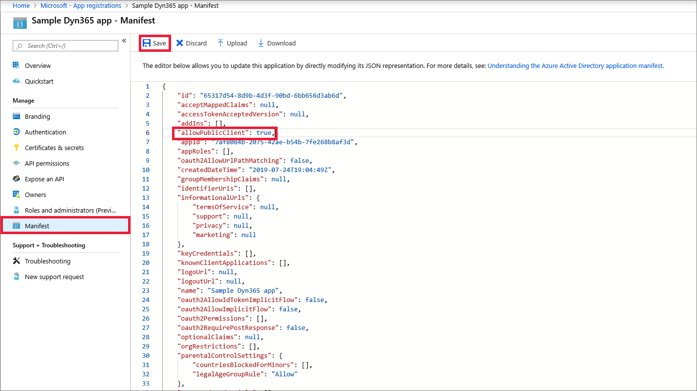
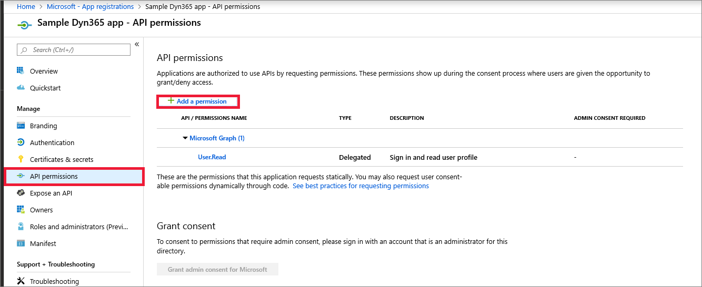

# Tutorial: Register an app with Azure Active Directory

This tutorial describes how to register an application with Azure Active Directory, which enables a user with Power Apps user account to connect to their Microsoft Dataverse environment from external client applications using OAuth authentication.

> [!IMPORTANT]
> Power Apps also provides you with Server-to-Server (S2S) authentication option to connect to Dataverse environment from external applications and services using the special application user account. S2S authentication is the common way that apps registered on Microsoft AppSource use to access the data of their subscribers. More information: [Build web applications using Server-to-Server (S2S) authentication](build-web-applications-server-server-s2s-authentication.md).

App registration in Azure Active Directory is typically done by ISVs who want to develop external client applications to read and write data in Dataverse. Registering an app in Azure Active Directory provides you with **Application ID** and **Redirect URI** values that ISVs can use in their client application's authentication code. When end users use the ISV's application for the *first time* to connect to their Dataverse environment by providing their Dataverse credentials, a consent form is presented to the end user. After consenting to use their Dataverse account with the ISV's application, end users can connect to Dataverse environment from external application. The consent form is not displayed again to other users after the first user who has already consented to use the ISV's app. Apps registered in Azure Active Directory are multi-tenant, which implies that other Dataverse users from other tenant can connect to their environment using the ISV's app.

App registration can also be done by an application developer or individual user who is building a client application to connect to and read/write data in Dataverse. Use the **Application ID** and **Redirect URI** values from your registered app in your client application's authentication code to be able to connect to Dataverse environment from your client application, and perform the required operations. Note that if the app is registered in the same tenant as your Dataverse environment, you won't be presented with a consent form when connecting from your client application to your Dataverse environment.

## Prerequisites  

- An Azure subscription for application registration. A trial account will also work.  
  
## Create an application registration
  
1. Sign in to the [Azure portal](https://go.microsoft.com/fwlink/?linkid=2083908) using an account with administrator permission. You must use an account in the same Microsoft 365 subscription (tenant) as you intend to register the app with. You can also access the Azure portal through the Microsoft 365 [Admin center](https://admin.microsoft.com/adminportal) by expanding the **Admin centers** item in the left navigation pane, and selecting **Azure Active Directory**.  
  
   > [!NOTE]
   > If you don't have an Azure tenant (account) or you do have one but your Microsoft 365 subscription with Dataverse is not available in your Azure subscription, following the instructions in the topic [Set up Azure Active Directory access for your Developer Site](/office/developer-program/microsoft-365-developer-program) to associate the two accounts.   If you don't have an account, you can sign up for one by using a credit card. However, the account is free for application registration and your credit card won't be charged if you only follow the procedures called out in this topic to register one or more apps. More information: [Active Directory Pricing Details](https://azure.microsoft.com/pricing/details/active-directory/)  
  
2. In the Azure portal, select **Azure Active Directory** in the left pane and select **App registrations** and click on **New registration**.
    
      

3. In the **Register an application page**, enter your application's registration information:
   - In the **Name** section, enter a meaningful application name that will be displayed to the users.
   - Select **Accounts in any organizational directory** option from **Supported account types** section.
   - Set the **Redirect URI**.
   - Click on **Register** to create the application.

      

5. On the app **Overview** page, hover over **Application (client) ID** value, and select the **Copy to clipboard** icon to copy the value as you'll need to specify this in your application's authentication code or app.config file where appropriate.

    
  
5. Select **Manifest** tab, in the manifest editor, set the *allowPublicClient** property to **true** and click on **Save**.
   
    

6. Select **API permissions** tab, click on **Add a permission**. 

    

7. Search for and choose **Common Data Service** under the **APIs my organization uses** tab.
    
        
    > [!TIP]
    > If you are presented with more than one **Common Data Service** item in the search list, choose any one of them. In the next step the service name and URL will be shown. At that point you can go back to the API search and choose a different Dataverse list item if needed.
    
8.  Click on **Delegated permissions** and check the options and click on **Add permissions**. 
    
    
    > [!NOTE]
    > A future revision of the form in step #8 will replace the Dynamics CRM logo and icon with Dataverse.

This completes the registration of your application in Azure Active Directory.

## Additional configuration options

If your application will be a Single Page Application (SPA) that depends on CORS you must configure the app registration to support the implicit flow. 
More information: [Tutorial: Registering and configuring a SPA application with adal.js](walkthrough-registering-configuring-simplespa-application-adal-js.md)

If your application will support server-to-server connections, see [Use Multi-Tenant Server-to-server authentication](use-multi-tenant-server-server-authentication.md)
  
### See also  
 [Application registration in Azure Active Directory](/azure/active-directory/develop/active-directory-integrating-applications)    
 [Authenticate Users with Dataverse Web Services](authentication.md)

[!INCLUDE[footer-include](../../includes/footer-banner.md)]