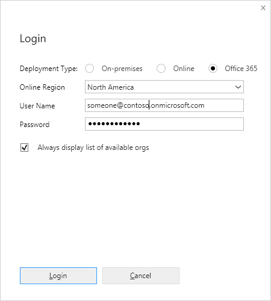
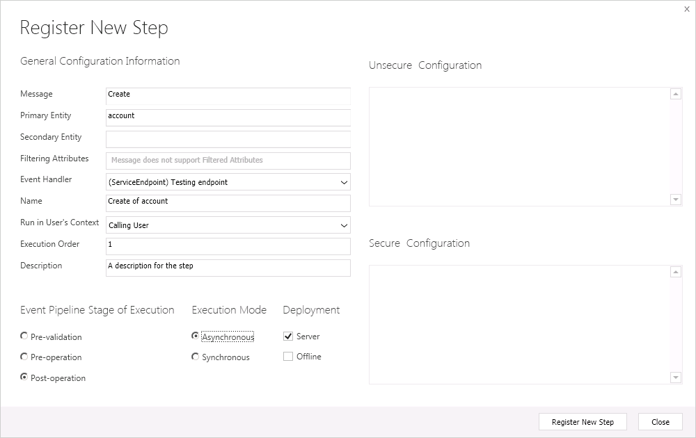

# Tutorial: Register an Azure-aware plug-in using the Plug-in Registration tool

[!INCLUDE[cc-terminology](includes/cc-terminology.md)]

This walkthrough demonstrates how to register a service endpoint step using the Plug-in Registration tool. Once configured, Microsoft Dataverse can post the execution context of the current operation to an Azure solution endpoint. For this walkthrough, the step is registered to post the execution context of the <xref:Microsoft.Xrm.Sdk.Messages.CreateRequest> message for an `Account` table to the Azure Service Bus.  
  
The following prerequisites must be completed before you start this walkthrough:  
  
- Access to the Plug-in Registration tool. [!INCLUDE[proc-download-plugin-registration-tool](../../includes/proc-download-plugin-registration-tool.md)]
- Your Dataverse system user account must have the System Customizer or System Administrator role.
- Have access to a Azure platform service namespace that is configured for SAS authorization, to which Dataverse will post a message.  
- If you plan to use any other Azure messaging entity other than a queue, for example a relay, there must be a listener application actively listening to the specified solution endpoint for Dataverse to successfully post to the Azure Service Bus. For more information, see [Write a listener for an Azure solution](write-listener-application-azure-solution.md).  
- A configured service endpoint with SAS authorization is available in the target organization. More information: [Walkthrough: Configure Microsoft Azure (SAS) for integration with Dataverse](walkthrough-configure-azure-sas-integration.md).  
  
## Steps

This walkthrough contains the following steps:  
  
1. [Connect to Dataverse](#BKMK_Connect)  
1. [Register a service endpoint step for an event](#BKMK_Register)  
1. [Test the endpoint registration](#BKMK_Test)
  

## Connect to Dataverse
 
Follow the steps below to connect to Dataverse using the Plug-in Registration tool.  
  
1. Run the Plug-in Registration tool.  
1. Click **Create New Connection**.  
1. In the **Login** dialog box, select **Microsoft 365**.

    

1. If you check **Display list of available organizations**, you are presented with a list of organizations that you belong to after you click **Login**. This enables you to choose the organization that you want to register the service endpoint with. Otherwise, your default organization is used.  
1. Enter the indicated information about the server and logon account, and then click **Login**.  
  

## Register a service endpoint step for an event

Follow the steps below to register a step for an event on the service endpoint.  
  
1. Select an existing service endpoint in the tab of the tab of the target organization.  
1. Navigate to the **Register** menu and click **Register New Step**.  
1. Fill out the **Register New Step** dialog box for an account create event as shown in the following figure.

    
  
1. Click **Register New Step**.  
  
Dataverse will now post the current message containing the execution context to the Service Bus whenever an account is created. The post is performed asynchronously and is not executed immediately.  
  

## Test the endpoint registration

After you register the endpoint you can test it. A listener must be running or a queue available on the target endpoint for the Service Bus post from the plug-in to happen.  
  
1. Open a canvas or model-driven application for the same organization that you registered the service endpoint under.  
1. Create a new Account table record.
1. Enter an account name, for example 'Adventure Works Cycle', into the **Account Name** field, and then click **Save**.  
1. Wait about 10 minutes for the Azure Service Bus post to occur.  
1. In the **Dynamics 365 - Custom** model-driven app, select  **Settings > System > System Jobs**.  
1. Open the system job that has the same name that you specified for your service endpoint. Check the status to see if the post was successful, is waiting, or failed.  
  
You can now unregister the endpoint, if so desired, by selecting it in the tool's tree view and click **Unregister**.  
  
### See also

[Azure integration for Dataverse](azure-integration.md) 
[Introduction to Microsoft Azure integration with Dataverse](azure-integration.md)

[!INCLUDE[footer-include](../../includes/footer-banner.md)]