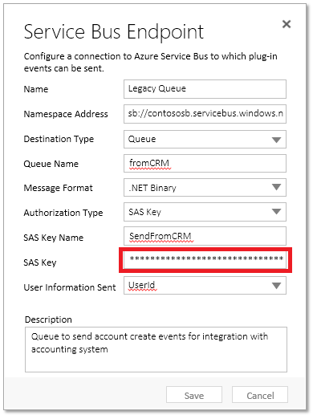

# Tutorial: Update a service endpoint imported from a solution

An extra step is required after importing into an organization a solution containing one or more service endpoints configured for SAS authorization. When the solution containing the service endpoints is exported, the exported solution does not contain the SAS Key for each service endpoint. After importing the solution into an organization, you must perform an additional step to provide the SAS Key for each service endpoint.  
  
Follow these steps to set the SAS Key for each service endpoint after solution import.  
  
## Update the SAS Key  
  
1. Run the Plug-in Registration tool, which is available for download from NuGet. More information: [Download tools from NuGet](download-tools-nuget.md)
  
1. Using the Plug-in Registration tool, sign in to the organization that contains the imported solution.  
  
1. Select the target service endpoint in the tab view of the organization.  
  
1. Select **Update**. You should see the following form with the fields already filled in.  
  
      
  
1. The **SAS Key** field is displayed with a value of "*******".  Replace that value with the correct SAS key value. You can obtain the SAS Key for your Azure messaging entity (queue, topic, etc.) from the [Azure portal](https://portal.azure.com).  
  
1. Select **Save**.  
  
### See also

[Azure integration](azure-integration.md) 
[Service Bus authentication and authorization](/azure/service-bus-messaging/service-bus-authentication-and-authorization) 
[Service Bus access control with Shared Access Signatures](/azure/service-bus-messaging/service-bus-sas)

[!INCLUDE[footer-include](../../includes/footer-banner.md)]