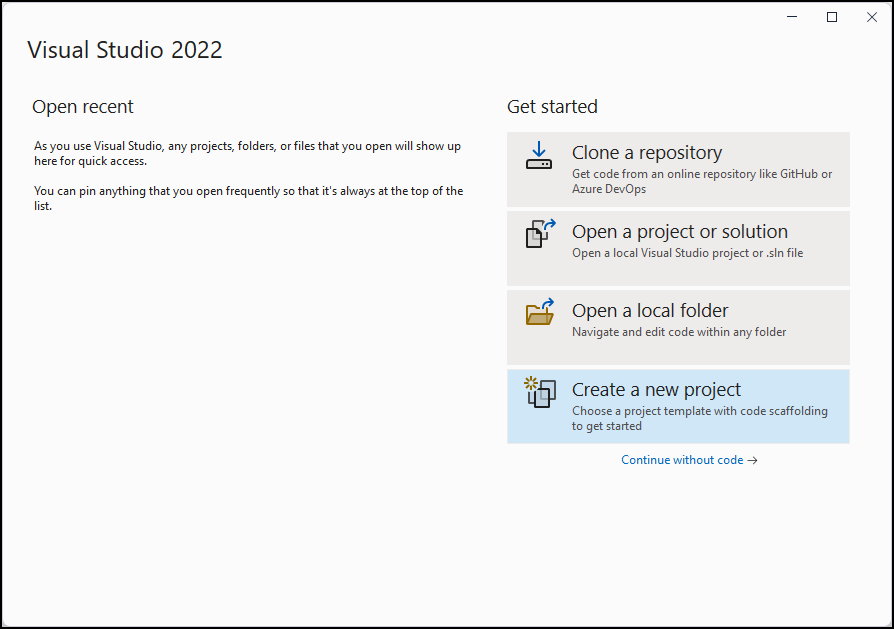
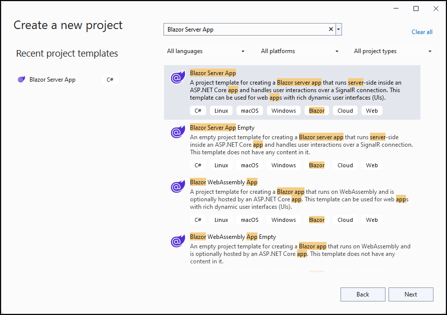
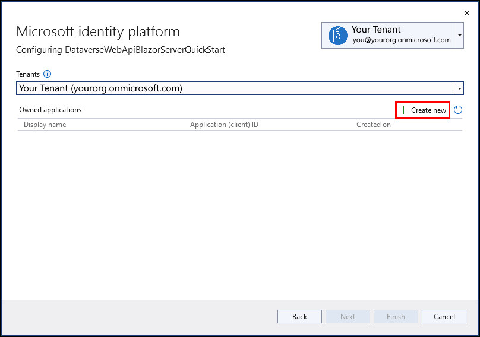
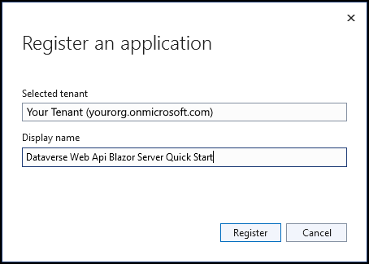

# Quickstart: Blazor Server Web API sample (C#)

In this quickstart, you'll create a Blazor Server application to connect to your Microsoft Dataverse environment using the Web API.

You'll authenticate and use <xref:System.Net.Http.HttpClient> to send a `GET` request containing the [WhoAmI](/dynamics365/customer-engagement/web-api/whoami) function. The response will be a [WhoAmIResponse](/dynamics365/customer-engagement/web-api/whoamiresponse) complex type. After call completion, the `UserId` property value is displayed.

> [!NOTE]
> This is a very simple example to show how to get connected with a minimum of code. The [Enhanced quickstart](enhanced-quick-start.md) will build upon this sample to apply better design patterns.

## Prerequisites

- Visual Studio 2019 (version 16.6.2 or later recommended)
- Familiarity with the Microsoft Azure portal
- Internet connection
- Valid user account for a Dataverse instance
- Administrator access to grant application registrations
- URL to the Dataverse environment you want to connect with
- Basic understanding of the Visual C# language

> [!NOTE]
> To authenticate you must have an app registered in Azure Active Directory. The registration will happen automatically as part of the template creation, but will require additional updates in the Azure portal.

## Create a Visual Studio project

1. Create a new Blazor Server app using .NET Core 3.1 but don't choose **Create** just yet.

    

1. Select **Change** under **Authentication** and then choose **Work or School Accounts**. 

    

1. Choose the appropriate dropdown and then replace `CRM520451` in the example with your environment's name.

1. Select **Create**.

## Configure the application in Active Directory

By default, the template will create a registered application. Connecting to Dataverse will require additional permissions. Open the Azure portal and log in with your credentials. Navigate to **Active Directory** and **App Registrations**, and then choose the entry with the same name as your application.

1. Choose **Authentication**, select (check) **Access tokens** under **Implicit grant**, and then click **Save**.

    

1. Choose **Certificates & secrets** and then select **New client secret**.

1. Assign the secret a name (for example, "Blazor Server client") and expiration date, and then select **Add**.

1. Select the clipboard icon next to your secret to copy it.

    

1. In your Blazor Server app, open `appsettings.json` and add an entry for "ClientSecret". The Active Directory settings should look like this:
    
    ```json
    {
      "AzureAd": {
        "Instance": "https://login.microsoftonline.com/",
        "Domain": "{org}.onmicrosoft.com",
        "TenantId": "{tenantId}",
        "ClientId": "{clientId}",
        "ClientSecret": "{secret}",
        "CallbackPath": "/signin-oidc"
      }
    }
    ```

1. Navigate to **API permissions**

1. Select **Add a permission** and choose **Dynamics CRM**

1. Choose **Delegated permissions** and select (check) **user_impersonation**, and then click **Add permissions**

    

1. Select the newly created permission to highlight it, and then shoose **Grant admin consent for organization** (your environment name is shown)

1. Verify the permissions have green checkboxes in the **status** column

## Prepare the app to use Azure AD tokens

The application requires some extra steps to capture the authentication token and pass it to the Web API request.

1. Right-click on the **Data** folder and add a new class named `TokenProvider`.

    ```csharp
    public class TokenProvider
    {
        public string AccessToken { get; set; }
    }
    ```

1. Open the App.razor file and add the following statements to the top of the file. Change the namespace to match the name of your application.

    ```razor
    @using BlazorWebAPIExample.Data
    @inject TokenProvider Service
    ```

1. Add a `@code` block to accept a parameter and move the token into the service.

    ```csharp
    [Parameter]
    public TokenProvider InitialState { get; set; }

    protected override void OnInitialized()
    {
        Service.AccessToken = InitialState.AccessToken;
        base.OnInitialized();
    }
    ```

1. Open the Pages/\_Host.cshtml file and add the following using statements after the namespace declaration.

    ```razor
    @using BlazorCommonDataService.Data
    @using Microsoft.AspNetCore.Authentication
    ```

1. After the `<body>` tag, add the following code and update the app component to acquire and pass the token.

    ```razor
    @{
        var token = new TokenProvider
        {
            AccessToken = await HttpContext.GetTokenAsync("access_token")
        };
    }
    <app>
        <component type="typeof(App)" param-InitialState="token" render-mode="ServerPrerendered" />
    </app>
    ```

1. Obtain the environment name for the Dataverse management API. If you're not sure what the name is, open the [Power Platform admin center](https://admin.powerplatform.microsoft.com/environments), navigate to **Environments** then choose **Open environment**. You will see a URL like this: `https://{org}.crm.dynamics.com` where {org} is the environment name.

1. Add an entry named `CDSAPI` to the appsettings.json file with the environment URL as the value. Append `/api/data/v9.0/` to the end of the URL so it looks like this:

    ```json
    { "CDSAPI": "https://{org}.crm.dynamics.com/api/data/v9.0/" }
    ```

1. Add this `using` statement to the file Startup.cs.

    ```csharp
    using Microsoft.AspNetCore.Authentication.OpenIdConnect;
    ```

1. In the `Startup.cs` class, add registrations to retrieve the authentication token and configure a client ready to use the token. Place this code between `services.AddAuthentication` and `services.AddControllersWithViews`.

    ```csharp
    services.Configure<OpenIdConnectOptions>(AzureADDefaults.OpenIdScheme,
        opt =>
        {
            var resourceUri = new Uri(Configuration["CDSAPI"]);
            var resource = $"{resourceUri.Scheme}://{resourceUri.Host}/";
            opt.ResponseType = "code";
            opt.SaveTokens = true;
            opt.Scope.Add("user_impersonation");
            opt.Scope.Add(new Uri(Configuration["CDSAPI"]).Host);
            opt.Resource = resource;
        });
    services.AddScoped<TokenProvider>();
    services.AddHttpClient("CDS", client =>
    {
        client.BaseAddress = new Uri(Configuration["CDSAPI"]);
    });
    ```

The first registration allows requesting the token with the proper scope. The second registers the service that tracks the token, and the third creates a client with the base API address pre-configured.

## Make a call to the Web API

Next, you'll update the `Index.razor` component to call the Web API. 

1. Open the Index.razor file and add these statements to the top:

    ```razor
    @using System.Text.Json
    @using BlazorWebAPIExample.Data;
    @using System.Net.Http.Headers;
    @inject IHttpClientFactory Factory
    @inject TokenProvider TokenProvider
    ```

1. Add this markup after the `SurveyPrompt` component:

    ```razor
    @if (Loading)
    {
        <div class="alert alert-warning">Loading...</div>
    }
    @if (Error)
    {
        <div class="alert alert-danger">@ErrorMessage</div>
    }
    @if (!Loading && !Error)
    {
        <div class="alert alert-info">You did it! Your user id is: @UserId</div>
    }
    ```

1. Finally, add a `@code` block with the following code:

    ```csharp
    public bool Loading;
    public string ErrorMessage;
    public bool Error => !string.IsNullOrWhiteSpace(ErrorMessage);
    public string UserId;

    protected override async Task OnInitializedAsync()
    {
        Loading = true;
        try
        {
            var client = Factory.CreateClient("CDS");
            client.DefaultRequestHeaders.Authorization =
                new AuthenticationHeaderValue("Bearer", TokenProvider.AccessToken);
            var result = await client.GetAsync("WhoAmI");
            result.EnsureSuccessStatusCode();
            UserId = JsonDocument.Parse(await result.Content.ReadAsStringAsync())
                .RootElement.GetProperty("UserId").GetGuid().ToString();
        }
        catch (Exception ex)
        {
            ErrorMessage = ex.Message;
        }
        finally
        {
            Loading = false;
        }
        await base.OnInitializedAsync();
    }
    ```

The application is now ready!

## Run the program

Press F5 to run the program. The output should look like this:



**Congratulations!** You have successfully connected to the Web API.

This quickstart sample shows a simple approach to create a Visual Studio project without any exception handling or method to refresh the access token. You can expand on the example to perform more complex operations, and wrap the `HttpClient` object in a service class to handle the permissions.

The [Enhanced quickstart](enhanced-quick-start.md) topic shows how to:

- Implement exception handling methods
- Use basic authentication with a connection string
- Create a reusable method to refresh the access token
- Build reusable methods for data operations

## Next steps

Learn how to structure your code for a better design.

> [!div class="nextstepaction"]
> [Enhanced quickstart](enhanced-quick-start.md)<br/>

### See Also

[Tutorial: Create an ASP.NET Core Blazor WebAssembly App using Dataverse](../walkthrough-blazor-webassembly-single-tenant.md)

[!INCLUDE[footer-include](../../../includes/footer-banner.md)]