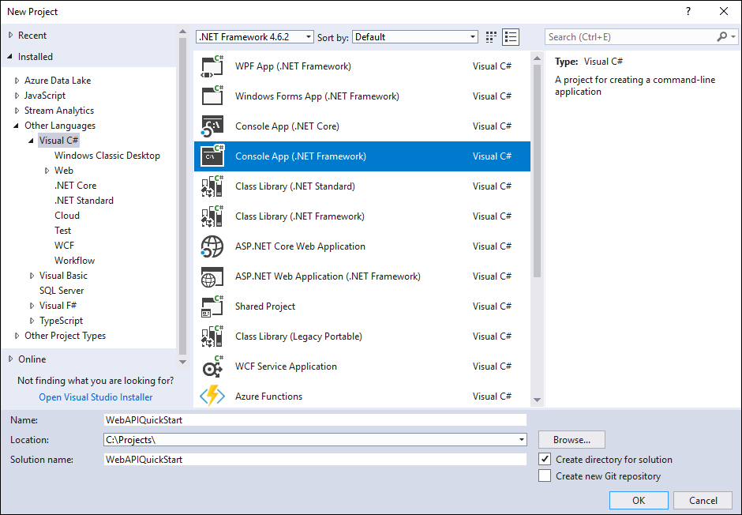
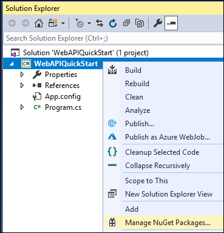
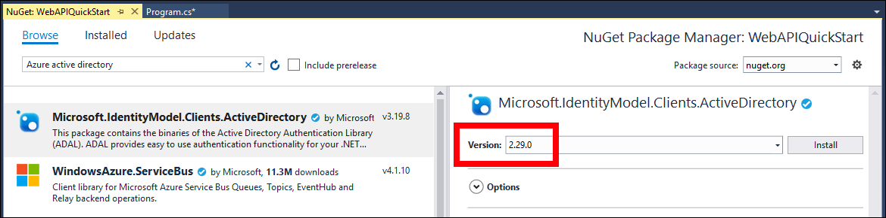
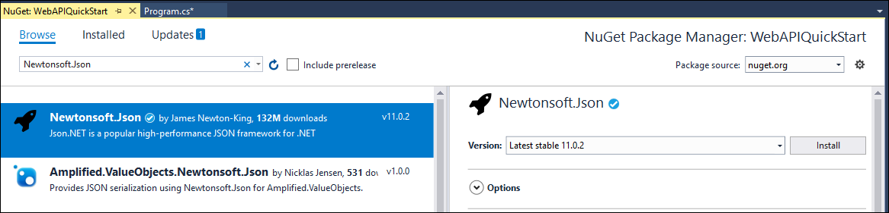

# Quick Start: Web API sample (C#)

In this quick start you will create a simple console application to connect to your Microsoft Dataverse environment using the Web API.

You will authenticate and use an <xref:System.Net.Http.HttpClient> to send a `GET` request to the <xref href="Microsoft.Dynamics.CRM.WhoAmI?text=WhoAmI Function" /> the response will be a <xref href="Microsoft.Dynamics.CRM.WhoAmIResponse?text=WhoAmIResponse ComplexType" />. You will display the `UserId` property value.

> [!NOTE]
> This is a very simple example to show how to get connected with a minimum of code. The following [Enhanced quick start](enhanced-quick-start.md) will build upon this sample to apply better design patterns.

## Prerequisites

 - Visual Studio (2017 or later recommended)
 - Internet connection
 - Valid user account for a Dataverse instance
    - Your username
    - Your password
 - Url to the Dataverse environment you want to connect with
 - Basic understanding of the Visual C# language

> [!NOTE]
> To authenticate you must have an app registered in Azure Active Directory. This quick start example provides an app registration `clientid` value you can use for the purpose of running sample code published by Microsoft. For your own applications you must register your apps. More information: [Walkthrough: Register an app with Azure Active Directory](../walkthrough-register-app-azure-active-directory.md)

## Create Visual Studio project

1. Create a new Console App (.NET Framework) project using **.NET Framework 4.6.2**

    

    > [!NOTE]
    > This screenshot shows the name `WebAPIQuickStart`, but you can choose to name the project and solution whatever you want.

    > [!IMPORTANT]
    > **Known Issue with Visual Studio 2015**
    > 
    > When you are running your project/solution in VS 2015 in debug mode, you may not be able to connect. This happens regardless of whether you are using a Target Framework of 4.6.2 or higher. This can occur because the Visual Studio hosting process is compiled against .NET 4.5 which means by default it does not support TLS 1.2. You can disable the Visual Studio hosting process as a work around. 
    >
    > Right-click on the name of your project in Visual Studio and then click **Properties**. On the **Debug** tab you can uncheck the **Enable the Visual Studio hosting process** option. 
    >
    > This only impacts the debug experience in VS 2015. This does not impact the binaries or executable that are built. The same issue does not occur in Visual Studio 2017.

1. In **Solution Explorer**, right-click the project you created and select **Manage NuGet Packages...** in the context menu.

    

1. Browse for the  `Microsoft.IdentityModel.Clients.ActiveDirectory` NuGet package.
1. Select **Version** 2.29.0 and install it.

    

    > [!IMPORTANT]
    > **Do not install the latest version of this NuGet package.**
    >
    > This sample depends on the capability to pass user credentials without a separate Azure login dialog which is not available in the 3.x version (or greater) version of this library.

    > [!NOTE]
    > You must select **I Accept** in the **Licence Acceptance** dialog.

1. Browse for the `Newtonsoft.Json` NuGet package and install the latest version.

    

## Edit Program.cs

1. Add these using statements to the top of `Program.cs`

    ```csharp
    using Microsoft.IdentityModel.Clients.ActiveDirectory;
    using System.Net.Http.Headers;
    using System.Net.Http;
    using Newtonsoft.Json.Linq;
    ```

1. Replace the `Main` method with the following code:

    ```csharp
    static void Main(string[] args)
    {
       // Set these values:
        // e.g. https://yourorg.crm.dynamics.com
        string url = "<your environment url>";
        // e.g. you@yourorg.onmicrosoft.com
        string userName = "<your user name>";
        // e.g. y0urp455w0rd
        string password = "<your password>";

        // Azure Active Directory registered app clientid for Microsoft samples
        string clientId = "51f81489-12ee-4a9e-aaae-a2591f45987d";

        var userCredential = new UserCredential(userName, password);
        string apiVersion = "9.0";
        string webApiUrl = $"{url}/api/data/v{apiVersion}/";

        //Authenticate using IdentityModel.Clients.ActiveDirectory
        var authParameters = AuthenticationParameters.CreateFromResourceUrlAsync(new Uri(webApiUrl)).Result;
        var authContext = new AuthenticationContext(authParameters.Authority, false);
        var authResult = authContext.AcquireToken(url, clientId, userCredential);
        var authHeader = new AuthenticationHeaderValue("Bearer", authResult.AccessToken);

        using (var client = new HttpClient())
        {
            client.BaseAddress = new Uri(webApiUrl);
            client.DefaultRequestHeaders.Authorization = authHeader;

            // Use the WhoAmI function
            var response = client.GetAsync("WhoAmI").Result;

            if (response.IsSuccessStatusCode)
            {
                //Get the response content and parse it.  
                JObject body = JObject.Parse(response.Content.ReadAsStringAsync().Result);
                Guid userId = (Guid)body["UserId"];
                Console.WriteLine("Your UserId is {0}", userId);
            }
            else
            {
                Console.WriteLine("The request failed with a status of '{0}'",
                            response.ReasonPhrase);
            }

            Console.WriteLine("Press any key to exit.");
            Console.ReadLine();
        }       
    }
    ```

1. Edit the following values to add information for your environment:

    ```csharp
    // e.g. https://yourorg.crm.dynamics.com
    string url = "<your environment url>";
    // e.g. you@yourorg.onmicrosoft.com
    string userName = "<your user name>";
    // e.g. y0urp455w0rd
    string password = "<your password>";
    ```
    To get the `url` value for your environment, follow these steps:

    1. From the [https://make.powerapps.com](https://make.powerapps.com) site with the appropriate environment selected, select **Settings**  and choose **Advanced Customizations**. Your browser will be redirected to the Dynamics 365 page.
    1. On the Dynamics 365 page, select **Settings > Customizations > Developer Resources**.
    1. On the **Developer Resources** page, look below **Instance Web API** and copy the Service Root URL value. 

        It should look something like `https://yourorgname.api.crm.dynamics.com/api/data/v9.2/`. But for this sample, you must trim off the final part (`/api/data/v9.2/`) so that it is just `https://yourorgname.api.crm.dynamics.com`

    For the `userName` and `password` variables, use the same credentials you used to log into the [https://make.powerapps.com](https://make.powerapps.com) site.

## Run the program

1. Press F5 to run the program. The output should look like this:

    ```
    Your UserId is 969effb0-98ae-478c-b547-53a2968c2e75
    Press any key to exit.
    ```

### Congratulations!

You have successfully connected to the Web API.

The quick start sample shows a simple approach to create a Visual Studio project without any exception handling or method to refresh the access token. 

This is enough to verify you can connect, but it doesn't represent a good pattern for building an app.

The [Enhanced quick start](enhanced-quick-start.md) topic shows how to implement exception handling methods, basic authentication method using connection string, a re-usable method to refresh the access token, and introduces how to build re-usable methods to perform data operations.

## Next steps

Learn how to structure your code for a better design.

> [!div class="nextstepaction"]
> [Enhanced quick start](enhanced-quick-start.md)<br/>

[!INCLUDE[footer-include](../../../includes/footer-banner.md)]
