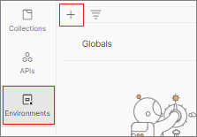
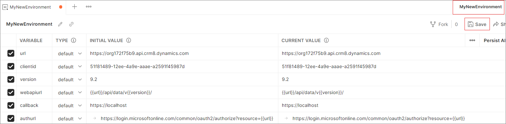
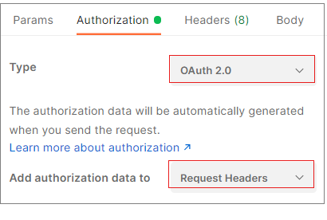
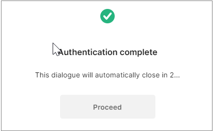
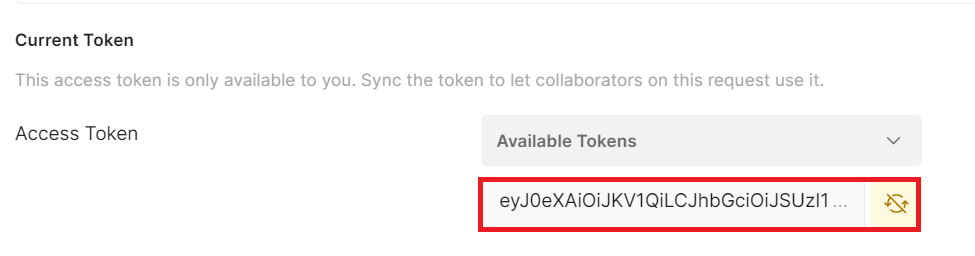
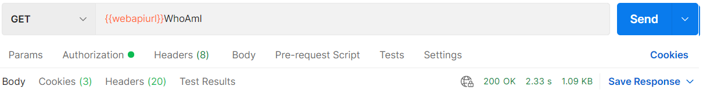

# Set up a Postman environment

You can use Postman to connect to your Microsoft Dataverse instance and to compose Web API requests, send them, and view responses. Managing authentication challenges many people. This topic describes how to configure a Postman environment to work for your Dataverse environments.

You can use a Postman environment to save a set of variables that you use to connect. These values can be accessed within Postman by using this syntax: `{{name}}`. For more information with Postman variables, see [Postman Documentation > Variables](https://www.getpostman.com/docs/v6/postman/environments_and_globals/variables).

## Prerequisites

* Have a Power Apps Dataverse environment that you can connect to. 
* Download and install the [Postman desktop application](https://www.getpostman.com/apps).

 

## Connect with your Dataverse environment

<b>This environment uses a client ID for an application that is registered for all Dataverse environments. </b> The following steps let you connect with your Dataverse instance without registering your own Azure AD applications.</b>

> [!NOTE]
If you build your own application, you should register your own Azure Active Directory (Azure AD) application. To register your own Azure AD application, see the steps described in [Walkthrough: Register a Dataverse app with Azure Active Directory](../walkthrough-register-app-azure-active-directory.md).

1. Launch the Postman desktop application. 
1. To create a new environment, select **Environments** on the left and select +.  
    
1. Enter a name for your environment. Then add the following key-value pairs into the editing space.  
    | Variable name | Value  | Action|
    |----|---|---|
    |`url`|`https://<add your environment name, like 'myorg.crm'>.dynamics.com`| Use your own url |
    |`clientid`|`51f81489-12ee-4a9e-aaae-a2591f45987d`| Copy the value|
    |`version`|`9.2`| Copy the value |
    |`webapiurl`|`{{url}}/api/data/v{{version}}/`| Copy the value |
    |`callback`|`https://localhost`| Copy the value |
    |`authurl`|`https://login.microsoftonline.com/common/oauth2/authorize?resource={{url}}`| Copy the value |
    > [!NOTE]
    > For [Dataverse search](relevance-search.md), specify a version of 1.0 and a webapiurl of {{url}}/api/search/v{{version}}/.

2. Click **Save** to save your environment. 
 

### Generate an access token to use with your environment

To connect using **OAuth 2.0**, you must have an access token. Use the following steps to get a new access token:

1. Make sure the new environment you created is selected.
1. Select the **Authorization** tab. Then set the **Type** to **OAuth 2.0** and set **Add authorization data to** to **Request Headers**.

1. Verify that you have selected the environment that you created.
1. In the **Configure New Token** pane, set the following values:  
    | Name | Value | Action |
    |----|---|---|
    |Grant Type| implicit| Choose implicit from the drop-down |
    |Callback URL| `{{callback}}`| Copy the value |
    |Auth URL|`{{authurl}}`| Copy the value |  
    |Client ID|`{{clientid}}`| Copy the value |  
1. Your configuration would appear something like below: 
     
1. Click **Get New Access Token**. When you do this, an Azure Active Directory sign-in dialog box appears. Enter your username and password, and then click **Sign In**. Once authentication completes, the following dialogue appears.

1. After the authentication dialogue automatically closes in a few seconds, the **Manage Access Token** page appears. Click **Use Token**. 
1. The newly generated token will automatically appear in the text box below the **Available Tokens** drop-down. . 
1. See [Test your connection](#test-your-connection) for steps to verify your connection.
    > [!NOTE]
    > If you are configuring environments in Postman for multiple Dataverse instances using different user credentials, you might need to delete the cookies cached by Postman. Select the **Clear cookies** link, which can be found right above the **Get New Access Token** button, and remove the saved cookies..
    > Some of these cookies are very persistent. You can delete some of them in groups, but you might have to delete others individually.   You might need to do this twice to ensure that no cookies remain.

## Test your connection

Create a new Web API request to test the connection with your Dataverse instance. Use the <xref href="Microsoft.Dynamics.CRM.WhoAmI?text=WhoAmI function" />:
1. Select `GET` as the HTTP method and add `{{webapiurl}}WhoAmI` in the editing space.
  
2. Click **Send** to send this request.
3. If your request is successful, you see the data from the <xref href="Microsoft.Dynamics.CRM.WhoAmIResponse?text=WhoAmIResponse ComplexType" /> that is returned by the <xref href="Microsoft.Dynamics.CRM.WhoAmI?text=WhoAmI Function" />.

## See also

[Use Postman to perform operations](use-postman-perform-operations.md) 
[Walkthrough: Register a Dataverse app with Azure Active Directory](../walkthrough-register-app-azure-active-directory.md)

[!INCLUDE[footer-include](../../../includes/footer-banner.md)]