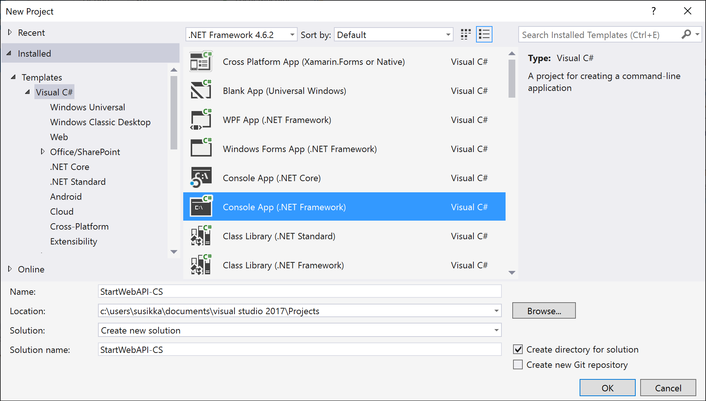

# Start a Microsoft Dataverse Web API project in Visual Studio (C#)

This topic demonstrates how to create a new project in Visual Studio 2017 (or later) that builds a console application that uses the Dataverse Web API. It illustrates the common references and project resources that most applications, including the SDK C# samples, use to implement Web API-based solutions.  
  
<a name="bkmk_prerequisites"></a>   
## Prerequisites  
 The following prerequisites are required to build the console application described in this section.  
  
- Visual Studio 2017 installed on your development computer. Any edition, including [Visual Studio Express](https://www.visualstudio.com/products/visual-studio-express-vs.aspx), should be sufficient to work with the Dataverse Web API.
  
- A NuGet client must be installed: either the command-line utility or the Visual Studio extension. For more information, see [Installing NuGet](https://docs.nuget.org/consume/installing-nuget).  
  
<a name="bkmk_createProject"></a>   

## Create a project  
The following procedure demonstrates how to create a console application project in C# that uses the Microsoft .NET Framework.
  
<a name="bkmk_newProject"></a> 

### New Project  
  
1. In Visual Studio, click **New Project**. The **New Project** dialog is displayed.  
  
2. In the left navigation pane under **Templates**, select **Visual C#**.  
  
3. Above the list of available templates, select **.NET Framework 4.6.2**.  
  
4. From the list of templates, select **Console App(.NET Framework)**. (Alternately choose the project type suited to your solution.)  All of the Web API C# samples are console applications.  
  
     
  
5. In the text boxes near the bottom of the form, supply the project name and location, and then select OK. (For this topic, the solution name "StartWebAPI-CS" was used.) The initial solution files will be generated and the solution loaded into Visual Studio.  
  
6. Under the **Project** menu, open the project's properties form and verify the target framework is set to **.NET Framework 4.6.2**.  
  
#### Install and verify the required assembly references  

1. After the project opens, click on **Tools** in the control bar on the top of your project. Select **NuGet Package Manager** > **Package Manager Console** and install the following NuGet packages.

```
install-package Newtonsoft.Json
install-package System.Net.Http
```
2. In **Solution Explorer**, expand the **References** node.  
  
3. Confirm that all the required references have been added to the project.  
  
4. If you have additional functionality that you routinely use in your applications, you can add the associated references to the required assemblies now. For more information, see [How to: Add or Remove References by Using the Add Reference Dialog Box](/previous-versions/wkze6zky(v=vs.140)).  
  
   Because the Dataverse Web API is based on REST principles, it does not require client-side assemblies to access.  However, other APIs supported by Dataverse apps do require these.
  
#### Add typical using statements  
  
1.  In the **Solution Explorer**, open **Program.cs** for editing.  
  
2.  At the top of the file, add the following `using` statements, which reference namespaces commonly used in Dataverse Web API-based solutions.  
  
    ```csharp
    using Newtonsoft.Json;  
    using Newtonsoft.Json.Linq;  
    using System.Net.Http;  
    using System.Net.Http.Headers;
    ```  
  
3.  If you added routinely used assemblies or references in the previous sections, you may also want to add corresponding `using` statements for these resources.  
  
4.  Save the file.  
  
<a name="bkmk_addConnectionCode"></a>

### Add connection code

This section explains how to add a basic set of settings and instructions to perform these operations.  
  
#### Edit the application configuration file
  
1.  In **Solution Explorer**, open the **App.config** file for editing.  Add the following two sections to it, after the existing `<startup>` section, then save the file.  
  
    ```xml  
  
    <connectionStrings>  
        <clear />  
  
        <!-- When providing a password, make sure to set the app.config file's security so that only you can read it. -->  
        <add name="default"   connectionString="Url=https://myserver/myorg/; Username=name; Password=password; Domain=domain" />  
        <add name="CrmOnline" connectionString="Url=https://mydomain.crm.dynamics.com/; Username=someone@mydomain.onmicrosoft.com; Password=password" />  
      </connectionStrings>  
  
      <appSettings>  
        <!--For information on how to register an app and obtain the ClientId and RedirectUrl  
            values see https://msdn.microsoft.com/dynamics/crm/mt149065 -->  
        <!--Active Directory application registration. -->  
        <!--These are dummy values and should be replaced with your actual app registration values.-->  
        <add key="ClientId" value="e5cf0024-a66a-4f16-85ce-99ba97a24bb2" />  
        <add key="RedirectUrl" value="https://localhost/SdkSample" />  
  
        <!-- Use an alternate configuration file for connection string and setting values. This optional setting  
        enables use of an app.config file shared among multiple applications. If the specified file does  
        not exist, this setting is ignored.-->  
        <add key="AlternateConfig" value="C:\Temp\crmsample.exe.config"/>  
      </appSettings>  
  
    ```  
  
2.  When developing or deploying a solution, the actual connection and application registration values must be substituted for the example placeholder values.  
  
### Next steps

 At this point the solution can be built without errors. If you edit the application configuration file to supply values for your Dynamics 365 Server, the program should also successfully connect to that server. The solution represents a skeletal frame that is ready to accept custom code, including calls to the Dataverse Web API.  
  
> [!TIP]
>  Before you leave this topic, consider saving your project as a project template. You can then reuse that template for future learning projects and save yourself some time and effort in setting up new projects. To do this, while your project is open in Microsoft Visual Studio, in the **File** menu select **Export template**. Follow the [Export Template Wizard](/previous-versions/visualstudio/visual-studio-2015/ide/how-to-create-project-templates) instructions to create the template.  
  
### See also

 [Get Started with the Web API (C#)](get-started-dynamics-365-web-api-csharp.md)   
 [Use the Web API Helper Library (C#)](./enhanced-quick-start.md)   
 [Perform operations using the Web API](perform-operations-web-api.md)

[!INCLUDE[footer-include](../../../includes/footer-banner.md)]