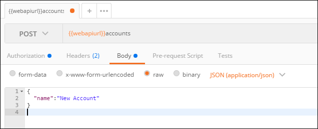

# Use Postman to perform operations with the Web API

[!INCLUDE[cc-terminology](../includes/cc-terminology.md)]

Use Postman to compose and send Web API requests and view responses. This topic describes how to use Postman to create Web API requests that perform create, retrieve, update, and delete (CRUD) operations and use functions and actions.

> [!IMPORTANT]
> You need to have an environment that was created by using the steps described in [Set up a Postman environment](setup-postman-environment.md).

The environment created by using the instructions in [Set up a Postman environment](setup-postman-environment.md) creates a `{{webapiurl}}` Postman variable that provides the base URL for requests. Append to this variable to define the URL for your requests.

The HTTP methods and values you use depend on the type of operations you want to perform. The following sections show examples of common operations.

## Retrieve multiple records

Use a `GET` request to retrieve a set of records. The following example retrieves the first three account records.

> [!NOTE]
> Web API requests should include certain HTTP headers. Every request should include the `Accept` header value of `application/json`, even when no response body is expected. The current OData version is `4.0`, so include header `OData-Version: 4.0`. Include the `OData-MaxVersion` header so that there is no ambiguity about the version when there are new releases of OData. More information: [HTTP headers](compose-http-requests-handle-errors.md#http-headers).

**Example**


`GET` `{{webapiurl}}accounts?$select=name,accountnumber&$top=3`


The body of the response looks like this:

```json
{
    "@odata.context": "https://yourorg.crm.dynamics.com/api/data/v9.0/$metadata#accounts(name,accountnumber)",
    "value": [
        {
            "@odata.etag": "W/\"2291741\"",
            "name": "Contoso Ltd",
            "accountnumber": null,
            "accountid": "9c706dc8-d2f5-e711-a956-000d3a328903"
        },
        {
            "@odata.etag": "W/\"2291742\"",
            "name": "Fourth Coffee",
            "accountnumber": null,
            "accountid": "a2706dc8-d2f5-e711-a956-000d3a328903"
        },
        {
            "@odata.etag": "W/\"2291743\"",
            "name": "Contoso Ltd",
            "accountnumber": null,
            "accountid": "9c3216b8-3efb-e711-a957-000d3a328903"
        }
    ]
}
```

More information: [Query data using the Web API](query-data-web-api.md).

## Retrieve a particular record

Use a `GET` request to retrieve a record. The following example retrieves two properties from a specific account and expands information about the related primary contact to include a full name.


`GET` `{{webapiurl}}accounts(`*&lt;accountid&gt;*`)?$select=name,accountnumber&$expand=primarycontactid($select=fullname)`


The body of the response looks like this:

```json
{
    "@odata.context": "https://yourorg.crm.dynamics.com/api/data/v9.0/$metadata#accounts(name,accountnumber,primarycontactid(fullname))/$entity",
    "@odata.etag": "W/\"2291742\"",
    "name": "Fourth Coffee",
    "accountnumber": null,
    "accountid": "a2706dc8-d2f5-e711-a956-000d3a328903",
    "primarycontactid": {
        "@odata.etag": "W/\"1697263\"",
        "fullname": "Susie Curtis",
        "contactid": "a3706dc8-d2f5-e711-a956-000d3a328903"
    }
}
```
More information: [Retrieve a table using the Web API](retrieve-entity-using-web-api.md).

## Create a record

Use a `POST` request to send data to create a record. Set the URL to the entity set name--in this case, `accounts`--and set the headers as shown here.

`POST` `{{webapiurl}}accounts`


Set the body of the request with information about the account to create.



When you send this request, the body will be empty, but the ID of the created account will be in the `OData-EntityId` header value.

More information: [Create a table using the Web API](create-entity-web-api.md).

## Update a record

Use the `PATCH` method to update a table record, as shown here.

`PATCH` `{{webapiurl}}accounts(`*&lt;accountid&gt;*`)`


When you send this request, the response body will be empty, but the ID of the updated account will be in the `OData-EntityId` header value.

More information: [Update and delete tables using the Web API](update-delete-entities-using-web-api.md).

## Delete a record

Use the `DELETE` method to delete an existing record.

`DELETE` `{{webapiurl}}accounts(`*&lt;accountid&gt;*`)`


When you send this request, the account record with the given `accountid` gets deleted.

More information: [Update and delete tables using the Web API](update-delete-entities-using-web-api.md).

## Use a function

Use a `GET` request with the functions listed in [Web API Function Reference](/dynamics365/customer-engagement/web-api/functions?view=dynamics-ce-odata-9) to perform reusable operations with the Web API. The example that follows shows how to send a Web API request that uses the <xref:Microsoft.Dynamics.CRM.RetrieveDuplicates?text=RetrieveDuplicates function /> to detect and retrieve duplicates of a specified record.

|HTTP method|URL|
|----|----|
|`GET`|`{{webapiurl}}RetrieveDuplicates(BusinessEntity=@p1,MatchingEntityName=@p2,PagingInfo=@p3)?@p1={'@odata.type':'Microsoft.Dynamics.CRM.account','accountid':'`*&lt;accountid&gt;*`'}&@p2='account'&@p3={'PageNumber':1,'Count':50}`|


Functions return either a collection or a complex type. The response from the preceding <xref href="Microsoft.Dynamics.CRM.RetrieveDuplicates?text=RetrieveDuplicates function" /> should look like this:

```json
{
        {
    "@odata.context": "https://yourorgname.crm.dynamics.com/api/data/v9.0/$metadata#accounts",
    "value": [
        <Omitted for brevity: JSON data for any matching accounts including all properties>
    ]
}
}
```

More information: [Use Web API functions](use-web-api-functions.md).

## Use an action

Use a `POST` request with the actions listed in [Web API Action Reference](/dynamics365/customer-engagement/web-api/actions?view=dynamics-ce-odata-9) to perform operations that have side effects.

This example shows how to use <xref href="Microsoft.Dynamics.CRM.BulkDetectDuplicates?text=BulkDetectDuplicates action" />.

`POST` `{{webapiurl}}BulkDetectDuplicates`


The request in the example just shown submits an asynchronous duplicate detection job that runs in the background. The duplicates are detected according to the published duplicate rules for the table type. <xref href="Microsoft.Dynamics.CRM.BulkDetectDuplicatesResponse?text=BulkDetectDuplicatesResponse ComplexType" /> is returned as a response from <xref href="Microsoft.Dynamics.CRM.BulkDetectDuplicates?text=BulkDetectDuplicates action" />. The response includes the `JobId` property, which contains the GUID of the asynchronous duplicate detection job that detects and logs duplicate records.

More information: [Use Web API actions](use-web-api-actions.md).

## See also

[Use Postman with the Web API](use-postman-web-api.md)<br>
[Perform operations using the Web API](perform-operations-web-api.md)


[!INCLUDE[footer-include](../../../includes/footer-banner.md)]