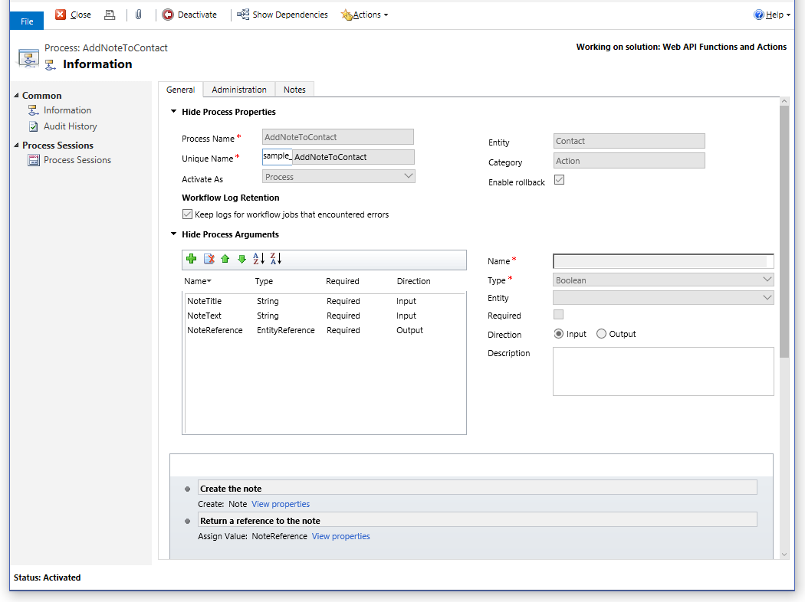
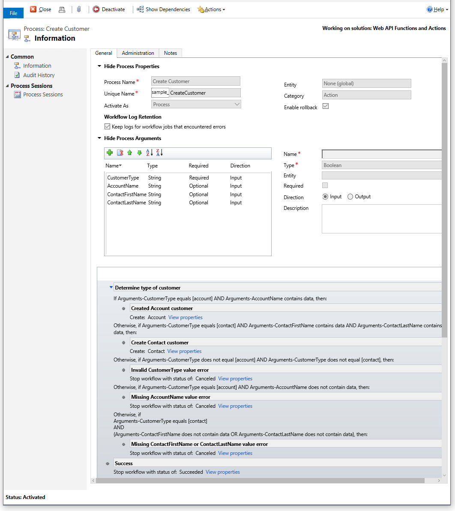

# Web API Functions and Actions Sample

[!INCLUDE[cc-terminology](../includes/cc-terminology.md)]

This group of samples demonstrate how to perform bound and unbound functions and actions, including custom actions, using the Microsoft Dataverse Web API. This sample is implemented as a separate project for the following languages:  
  
-   [Functions and Actions Sample (C#)](samples/functions-actions-csharp.md)  
  
This topic explains the structure and content of the sample at a higher, language-neutral level. Review the linked sample topics above for language-specific implementation details about how to perform the operations described in this topic.  
  
<a name="bkmk_demonstrates"></a>  
 
## Demonstrates  

This sample is divided into the following principal sections, containing Web API functions and actions operations which are discussed in greater detail in the associated conceptual topics.  
  
|Topic section|Associated topic(s)|  
|-------------------|---------------------------|  
|[Sample data](#bkmk_sampleData)||  
|[Using unbound function with no parameters](#bkmk_unboundFunctionNoParams)|[Unbound functions](use-web-api-functions.md#bkmk_unboundFunctions)<br /><br /> <xref href="Microsoft.Dynamics.CRM.WhoAmI?text=WhoAmI Function" /><br /><br /> <xref href="Microsoft.Dynamics.CRM.systemuser?text=systemuser EntityType" />|  
|[Using unbound function with parameters](#bkmk_unboundFunctionWithParams)|[Unbound functions](use-web-api-functions.md#bkmk_unboundFunctions)<br /><br /> <xref href="Microsoft.Dynamics.CRM.GetTimeZoneCodeByLocalizedName?text=GetTimeZoneCodeByLocalizedName Function" />|  
|[Using bound function with no parameters](#bkmk_boundFunctionWithParams)|[Bound functions](use-web-api-functions.md#bkmk_boundFunctions)<br /><br /> <xref href="Microsoft.Dynamics.CRM.CalculateTotalTimeIncident?text=CalculateTotalTimeIncident Function" />|  
|[Using unbound action with parameters](#bkmk_unboundActionWithParams)|[Unbound actions](use-web-api-actions.md#bkmk_unboundActions)<br /><br /> <xref href="Microsoft.Dynamics.CRM.WinOpportunity?text=WinOpportunity Action" /><br /><br /> <xref href="Microsoft.Dynamics.CRM.opportunity?text=opportunity EntityType" />|  
|[Using bound action with parameters](#bkmk_boundActionWithParams)|[Bound actions](use-web-api-actions.md#bkmk_boundActions)<br /><br /> <xref href="Microsoft.Dynamics.CRM.AddToQueue?text=AddToQueue Action" /><br /><br /> <xref href="Microsoft.Dynamics.CRM.WhoAmI?text=WhoAmI Function" /><br /><br /> <xref href="Microsoft.Dynamics.CRM.systemuser?text=systemuser EntityType" /><br /><br /> <xref href="Microsoft.Dynamics.CRM.letter?text=letter EntityType" />|  
|[Using bound custom action with parameters](#bkmk_boundCustomActionWithParams)|[Use a custom action](use-web-api-actions.md#bkmk_customActions)<br /><br /> [Bound actions](use-web-api-actions.md#bkmk_boundActions)<br /><br /> <xref href="Microsoft.Dynamics.CRM.contact?text=contact EntityType" />|  
|[Using unbound custom action with parameters](#bkmk_unboundCustomActionWithParams)|[Use a custom action](use-web-api-actions.md#bkmk_customActions)<br /><br /> [Unbound actions](use-web-api-actions.md#bkmk_unboundActions)<br /><br /> <xref href="Microsoft.Dynamics.CRM.account?text=account EntityType" />|  
|[Handling custom action exceptions](#bkmk_boundCustomActionErrorHandling)|[Use a custom action](use-web-api-actions.md#bkmk_customActions)<br /><br /> [Unbound actions](use-web-api-actions.md#bkmk_unboundActions)<br /><br /> <xref href="Microsoft.Dynamics.CRM.contact?text=contact EntityType" />|  
  
The following sections contain a brief discussion of the Dataverse Web API operations performed, along with the corresponding HTTP messages and associated console output.  
  
<a name="bkmk_sampleData"></a>
   
## Sample data  

To ensure the operations in this sample work properly, we first create sample data on the Dataverse server. These sample data will be deleted from the server unless the user chooses to not delete them. The data in this sample are created individually as follows.  
  
- Create an account (e.g.: `Fourth Coffee`) and associate it with an incident that has three 30 minute tasks (90 minutes total). After the tasks are created, they are then marked as completed. The operation will calculate the total time it took to complete these three tasks.  
  
    ```json  
    {  
      title: "Sample Case",  
      "customerid_account@odata.bind": accountUri,  
      Incident_Tasks: [  
       {  
        subject: "Task 1",  
        actualdurationminutes: 30  
       },  
       {  
        subject: "Task 2",  
        actualdurationminutes: 30  
       },  
       {  
        subject: "Task 3",  
        actualdurationminutes: 30  
       }  
      ]  
     };  
    ```  
  
- Create an account and associate it with an opportunity. This opportunity will be mark as won in the sample operation.  
  
    ```json  
    {  
     name: "Sample Account for WebAPIFunctionsAndActions sample",  
     opportunity_customer_accounts: [{  
      name: "Opportunity to win"  
     }]  
    };  
    ```  
  
- Create a letter activity. The letter will be added to the current user's queue in the sample operation.  
  
    ```json  
    {  
      description: "Example letter"  
    }  
    ```  
  
- Create a contact to use with a custom action `sample_AddNoteToContact` in the sample operation.  
  
    ```json  
    {  
      firstname: "Jon",  
      lastname: "Fogg"  
    }  
    ```  
  
<a name="bkmk_sampleOperations"></a>
   
## Sample operations  

The sample operations in this topic are organized in the following ways.  
  
- Working with functions: These operations show bound and unbound functions that either accept parameters or not.  
- Working with actions: These operations show bound and unbound actions that either accept parameters or not.  
- Custom actions: These operations show bound and unbound actions and how to handle custom error exceptions.  
  
<a name="bkmk_workingWithFunctions"></a> 
  
## Working with functions  

[Functions](web-api-types-operations.md#bkmk_functions) are operations that do not have side effects. A function can be bound to a table row or table (entity type) collection. Query functions are never bound. For more info, see [Use Web API functions](use-web-api-functions.md). This section shows samples of how bound and unbound functions are used and how parameters are passed in.  
  
<a name="bkmk_unboundFunctionNoParams"></a>  
 
### Using unbound function with no parameters 
 
Use an unbound function to retrieve the current user's full name by making use of the <xref href="Microsoft.Dynamics.CRM.WhoAmI?text=WhoAmI Function" />. This operation demonstrates how to call an unbound function that does not accept parameters. This operation returns the current user's full name.  
  
Getting the request and response for the <xref href="Microsoft.Dynamics.CRM.WhoAmI?text=WhoAmI Function" />.  
  
 **Request**  
  
```http  
GET https://[Organization URI]/api/data/v9.0/WhoAmI HTTP/1.1  
OData-MaxVersion: 4.0  
OData-Version: 4.0  
Content-Type: application/json; charset=utf-8   
```  
  
 **Response**  
  
```http  
HTTP/1.1 200 OK  
Content-Type: application/json; odata.metadata=minimal  
OData-Version: 4.0  
Content-Length: 273  
  
{  
   "@odata.context":"https://[Organization URI]/api/data/v9.0/$metadata#Microsoft.Dynamics.CRM.WhoAmIResponse",  
   "BusinessUnitId":"0d6cc84a-d3f6-e511-80d0-00155da84802",  
   "UserId":"b08dc84a-d3f6-e511-80d0-00155da84802",  
   "OrganizationId":"0f47eae2-a906-4ae4-9215-f09875979f6a"  
}  
```  
  
<a name="bkmk_unboundFunctionWithParams"></a>
   
### Using unbound function with parameters  

Use an unbound function to retrieve the time zone code. This operation demonstrates how to call an unbound function that accept parameters. This operation returns the current time zone code for the specified time zone. More information:[Passing parameters to a function](use-web-api-functions.md#bkmk_passParametersToFunctions)  
  
 **Request**  
  
```http  
GET https://[Organization URI]/api/data/v9.0/GetTimeZoneCodeByLocalizedName(LocalizedStandardName=@p1,LocaleId=@p2)?@p1='Pacific%20Standard%20Time'&@p2=1033 HTTP/1.1  
OData-MaxVersion: 4.0  
OData-Version: 4.0  
Content-Type: application/json; charset=utf-8 
```  
  
 **Response**  
  
```http  
HTTP/1.1 200 OK  
Content-Type: application/json; odata.metadata=minimal  
OData-Version: 4.0  
Content-Length: 154  
  
{  
   "@odata.context":"https://[Organization URI]/api/data/v9.0/$metadata#Microsoft.Dynamics.CRM.GetTimeZoneCodeByLocalizedNameResponse",  
   "TimeZoneCode":4  
}  
```  
  
 **Console output**  
  
```  
Unbound function: GetTimeZoneCodeByLocalizedName  
    Function returned time zone Pacific Standard Time, with code '4'.  
```  
  
<a name="bkmk_boundFunctionWithParams"></a>
   
### Using bound function with no parameters  

Use a  bound function to retrieve the total time it took to complete all the tasks of an incident. This operation demonstrates how to call a bound function that does not accept parameters. This operation returns the total minutes the incident took to close out all its tasks. This function also makes use of the incident data we created for this sample program. More information:[Bound functions](use-web-api-functions.md#bkmk_boundFunctions)  
  
 **Request**  
  
```http  
GET https://[Organization URI]/api/data/v9.0/incidents(3d920da5-fb4a-e611-80d5-00155da84802)/Microsoft.Dynamics.CRM.CalculateTotalTimeIncident() HTTP/1.1  
OData-MaxVersion: 4.0  
OData-Version: 4.0  
Content-Type: application/json; charset=utf-8  
  
```  
  
 **Response**  
  
```http  
HTTP/1.1 200 OK  
Content-Type: application/json; odata.metadata=minimal  
OData-Version: 4.0  
Content-Length: 148  
  
{  
   "@odata.context":"https://[Organization URI]/api/data/v9.0/$metadata#Microsoft.Dynamics.CRM.CalculateTotalTimeIncidentResponse",  
   "TotalTime":90  
}  
```  
  
 **Console output**  
  
```  
Bound function: CalculateTotalTimeIncident  
    Function returned 90 minutes - total duration of tasks associated with the incident.  
```  
  
<a name="bkmk_workingWithActions"></a> 
  
## Working with actions  

[Actions](web-api-types-operations.md#bkmk_actions) are operations that allow side effects. An action is either bound or unbound. For more info, see [Use Web API actions](use-web-api-actions.md). This section shows samples of how bound and unbound actions are used and how parameters are passed in. It also shows how custom actions are used and how to handle exceptions from these custom actions.  
  
<a name="bkmk_unboundActionWithParams"></a>
   
### Using unbound action with parameters 
 
Use an unbound action that takes a set of parameters. This operation closes an opportunity and marks it as won by calling the <xref href="Microsoft.Dynamics.CRM.WinOpportunity?text=WinOpportunity Action" />. The <xref href="Microsoft.Dynamics.CRM.opportunity?text=opportunity EntityType" /> was created as sample data earlier in the program. More information:[Unbound actions](use-web-api-actions.md#bkmk_unboundActions)  
  
 **Request**  
  
```http  
POST https://[Organization URI]/api/data/v9.0/WinOpportunity HTTP/1.1  
OData-MaxVersion: 4.0  
OData-Version: 4.0  
Content-Type: application/json; charset=utf-8  
  
{  
   "Status":3,  
   "OpportunityClose":{  
      "subject":"Won Opportunity",  
      "opportunityid@odata.bind":"https://[Organization URI]/api/data/v9.0/opportunities(47920da5-fb4a-e611-80d5-00155da84802)"  
   }  
}  
```  
  
 **Response**  
  
```http  
HTTP/1.1 204 No Content  
OData-Version: 4.0   
```  
  
 **Console output**  
  
```  
Unbound Action: WinOpportunity  
    Opportunity won.  
```  
  
<a name="bkmk_boundActionWithParams"></a>
   
### Using bound action with parameters
  
Use a bound action that takes parameters. This operation adds a letter to the current user's queue. To accomplish this, we use the <xref href="Microsoft.Dynamics.CRM.WhoAmI?text=WhoAmI Function" /> and the <xref href="Microsoft.Dynamics.CRM.systemuser?text=systemuser EntityType" /> to get a reference to the current user's queue.  We also need reference to the <xref href="Microsoft.Dynamics.CRM.letter?text=letter EntityType" />. This letter was created as sample data earlier in the program. Then the bound <xref href="Microsoft.Dynamics.CRM.AddToQueue?text=AddToQueue Action" /> is called to add the letter to the current user's queue. More information:[Bound actions](use-web-api-actions.md#bkmk_boundActions)  
  
 **Request**  
  
```http  
POST https://[Organization URI]/api/data/v9.0/queues(1f7bcc50-d3f6-e511-80d0-00155da84802)/Microsoft.Dynamics.CRM.AddToQueue HTTP/1.1  
OData-MaxVersion: 4.0  
OData-Version: 4.0  
Content-Type: application/json; charset=utf-8  
Content-Length: 110  
  
{  
   "Target":{  
      "activityid":"4c920da5-fb4a-e611-80d5-00155da84802",  
      "@odata.type":"Microsoft.Dynamics.CRM.letter"  
   }  
}  
```  
  
 **Response**  
  
```http  
HTTP/1.1 200 OK  
Content-Type: application/json; odata.metadata=minimal  
OData-Version: 4.0  
Content-Length: 170  
  
{  
   "@odata.context":"https://[Organization URI]/api/data/v9.0/$metadata#Microsoft.Dynamics.CRM.AddToQueueResponse",  
   "QueueItemId":"67bdfabd-fc4a-e611-80d5-00155da84802"  
}  
```  
  
 **Console output**  
  
```  
Bound Action: AddToQueue  
    QueueItemId returned from AddToQueue Action: 67bdfabd-fc4a-e611-80d5-00155da84802  
```  
  
<a name="bkmk_customActions"></a> 
  
## Working with custom actions  

If you define custom actions for your solution, you can call them using the Dataverse Web API. Regardless of whether the operations included in your custom action have side effects, they can potentially modify data and therefore are considered actions rather than functions. There is no way to create a custom function. More information:[Use a custom action](use-web-api-actions.md#bkmk_customActions).  
  
This sample comes with two custom actions. They both require parameters but one is bound and the other is unbound.  
  
- `sample_AddNoteToContact`: A bound custom action that takes two parameters. One is a `NoteTitle` and the other is a `NoteText`. This custom action adds a note to a <xref href="Microsoft.Dynamics.CRM.contact?text=contact EntityType" />. Below is a screen shot of the **Information** page for this custom action.  
  
 <!-- TODO:
    -->
  
- `sample_CreateCustomer`: An unbound custom action that require different parameters depending on what type of customer is being created. For example, when the `AccountType` is "account" then it only requires `AccountName` parameter. When the `AccountType` is "contact", a `ContactFirstName` and `ContactLastName` parameters are required. Below is a screen shot of the **Information** page for this custom action.  
<!-- TODO:  
   
   -->
<a name="bkmk_boundCustomActionWithParams"></a>
   
### Using bound custom action with parameters 
 
This example calls the `sample_AddNoteToContact` custom action which is bound to the contact table  with the required parameters. This custom action adds a note to an existing contact. This action returns a row with an `annotationid` property. To show that the note was added, the `annotationid` is used to request information about the note.  
  
The request and response of the action.  
  
 **Request**  
  
```http  
POST https://[Organization URI]/api/data/v9.0/contacts(4d920da5-fb4a-e611-80d5-00155da84802)/Microsoft.Dynamics.CRM.sample_AddNoteToContact HTTP/1.1  
OData-MaxVersion: 4.0  
OData-Version: 4.0  
Content-Type: application/json; charset=utf-8  
Content-Length: 80  
  
{  
   "NoteTitle":"The Title of the Note",  
   "NoteText":"The text content of the note."  
}  
```  
  
 **Response**  
  
```http  
HTTP/1.1 200 OK  
Content-Type: application/json; odata.metadata=minimal  
OData-Version: 4.0  
Content-Length: 149  
  
{  
   "@odata.context":"https://[Organization URI]/api/data/v9.0/$metadata#annotations/$entity",  
   "annotationid":"ba146d0b-fd4a-e611-80d5-00155da84802"  
}  
```  
  
 The request and response of the annotation.  
  
 **Request**  
  
```http  
GET https://[Organization URI]/api/data/v9.0/annotations(ba146d0b-fd4a-e611-80d5-00155da84802)?$select=subject,notetext&$expand=objectid_contact($select=fullname) HTTP/1.1  
OData-MaxVersion: 4.0  
OData-Version: 4.0  
Content-Type: application/json; charset=utf-8  
  
```  
  
 **Response**  
  
```http  
HTTP/1.1 200 OK  
OData-Version: 4.0  
Content-Length: 450  
  
{  
   "@odata.context":"https://[Organization URI]/api/data/v9.0/$metadata#annotations(subject,notetext,objectid_contact,objectid_contact(fullname))/$entity",  
   "@odata.etag":"W/\"622978\"",  
   "subject":"The Title of the Note",  
   "notetext":"The text content of the note.",  
   "annotationid":"ba146d0b-fd4a-e611-80d5-00155da84802",  
   "objectid_contact":{  
      "@odata.etag":"W/\"622968\"",  
      "fullname":"Jon Fogg",  
      "contactid":"4d920da5-fb4a-e611-80d5-00155da84802"  
   }  
}  
```  
  
 **Console output**  
  
```http  
Custom action: sample_AddNoteToContact  
    A note with the title 'The Title of the Note' and the content 'The text content of the note.' was created and associated with the contact Jon Fogg.  
```  
  
<a name="bkmk_unboundCustomActionWithParams"></a> 
  
### Using unbound custom action with parameters  

This operation calls the `sample_CreateCustomer`  custom action to create an "account" customer. Required parameters  are passed in for a `CustomerType` of `account`.  
  
 **Request**  
  
```http  
POST https://[Organization URI]/api/data/v9.0/sample_CreateCustomer HTTP/1.1  
OData-MaxVersion: 4.0  
OData-Version: 4.0  
Content-Type: application/json; charset=utf-8  
Content-Length: 103  
  
{  
   "CustomerType":"account",  
   "AccountName":"Account Customer Created in WebAPIFunctionsAndActions sample"  
}  
```  
  
 **Response**  
  
```http  
HTTP/1.1 204 No Content  
OData-Version: 4.0  
  
```  
  
<a name="bkmk_boundCustomActionErrorHandling"></a> 
  
### Handling custom action exceptions  

This example shows that custom actions can return custom error messages. You handle custom exceptions the same way you handle standard exceptions. To get the custom error message from the  `sample_CreateCustomer`  custom action , this example creates a "contact" customer. However, we intentionally pass in the wrong parameters for this `CustomerType` parameter. This operation then catches the exception and displays the error message, then continues with the sample program.  
  
 **Request**  
  
```http  
POST https://[Organization URI]/api/data/v9.0/sample_CreateCustomer HTTP/1.1  
OData-MaxVersion: 4.0  
OData-Version: 4.0  
Content-Type: application/json; charset=utf-8  
Content-Length: 103  
  
{  
   "CustomerType":"contact",  
   "AccountName":"Account Customer Created in WebAPIFunctionsAndActions sample"  
}  
```  
  
 **Response**  
  
```http  
HTTP/1.1 500 Internal Server Error  
Content-Type: application/json; odata.metadata=minimal  
OData-Version: 4.0  
Content-Length: 2760  
  
{  
   "error":{  
      "code":"",  
      "message":"ContactFirstName and ContactLastName are required when CustomerType is contact."
   }  
}  
```  
  
 **Console output**  
  
```  
Expected custom error: ContactFirstName and ContactLastName are required when CustomerType is contact.  
```  
  
### See also  

[Use the Dataverse Web API](overview.md)<br />
[Use Web API functions](use-web-api-functions.md)<br />
[Use Web API actions](use-web-api-actions.md)<br />
[Web API Functions and Actions Sample (C#)](samples/functions-actions-csharp.md)<br />


[!INCLUDE[footer-include](../../../includes/footer-banner.md)]