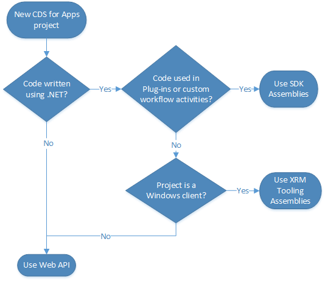

# Work with data using code in Microsoft Dataverse

[!INCLUDE[cc-terminology](includes/cc-terminology.md)]

Dataverse has [tables](entities.md) that are used to model and manage business data. You can use the stock provided tables or define your own custom tables to store data.

## Use web services to work with data

Dataverse provides two web services that you can use to interact with data: data service, and Organization service. Choose the one that best matches the requirement and your skills. Use the Web API when coding for the data service and the SDK API when coding for the Organization service.

### Web API

The Web API is an OData v4 RESTful endpoint. Use this for any programming language that supports HTTP requests and authentication using OAuth 2.0.

More information: [Use the Dataverse Web API](webapi/overview.md) 

### Organization service

Use the .NET Framework SDK assemblies for projects that involve writing plug-ins or workflow extensions.

More information: [Use the Dataverse Organization service](org-service/overview.md)

> [!NOTE]
> Use the Xrm.Tooling assemblies if you are creating a Windows client application. More information: [Build Windows client applications using the XRM tools](xrm-tooling/build-windows-client-applications-xrm-tools.md)

[!INCLUDE[footer-include](../../includes/footer-banner.md)]