# Debug Workflow Activities

[!INCLUDE[cc-data-platform-banner](../../../includes/cc-data-platform-banner.md)]

Because custom workflow extensions are .NET Framework assemblies you can debug them using methods very similar to how you debug plug-ins. 

## Use the Plug-in Registration Tool

The Plug-in Registration Tool (PRT) is one of the tools you can download from NuGet. More information: [Download tools from NuGet](../download-tools-nuget.md).

Once you have downloaded the PRT, click the `PluginRegistration.exe` to run it.

## Install Profiler

From the PRT you can install the Plug-in profiler solution by clicking the **Install Profiler** button.

This solution add the capability to capture the context that is passed to your workflow activity and enables replay that you can use to debug the logic in your code locally using Visual Studio.

When the **Plug-in profiler** is installed for your Microsoft Dataverse instance, you will see it in the PRT at the bottom of the list of **Registered Plugins & Custom Workflow Activities**.

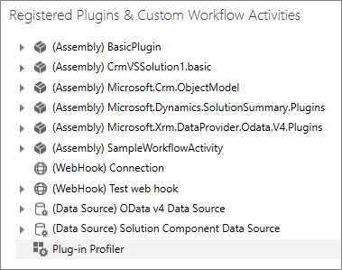

## Profile a workflow activity

To profile a workflow activity, right-click on the **Plug-in Profiler** and select **Start Profiling Workflow**.

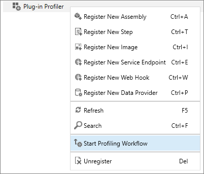

This will open the **Profiler Settings** dialog which will provide the following options:

|Field|Description|
|--|--|
|**Workflow**|Select the Workflow or Custom action that contains the workflow activity you want to debug.|
|**Steps**|Select the specific steps within that workflow or custom action that you want to debug.|
|**Specify profile storage**|We recommend that you choose **Persist to Entity**.|
|**Set profiler settings**|If your are working with a system where the workflow is being executed frequently, you can reduce performance impact by choosing to limit the number of profiles that are captured.|
|**Include secure configuration**|This provides the option to avoid seeing potentially sensitive data that may be passed as secure configuration.|

Click **OK** to save your settings.

> [!NOTE]
> At the time of this writing you may see the following error:
> 
> 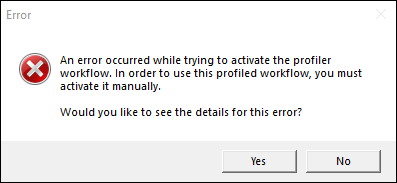
> 
> The details of this error will include the message: `Automatic workflow cannot be published if no activation parameters have been specified.`
> 
> The profile settings are successfully saved. This error occurs because the process of profiling a custom workflow activity will create a copy of the workflow and will disable both the original workflow and the copy. You will need to re-configure the profiled copy and activate it to capture a profile.  See the following steps for more information.

## Capture a profile

When a profile for workflow containing a custom workflow activity is configured, a copy of the original workflow is created and it will have the text `(Profiled)` appended to the name. Both the original and the copy of the workflows are deactivated.

> [!NOTE]
> Unless you are working in the system **Default** solution, you may not see the copied workflow because it is added to that solution. To view the copied workflow in the solution you are working in, you need to click **Add Existing** and add this copy to your solution.

The deactivated workflows should look like this:

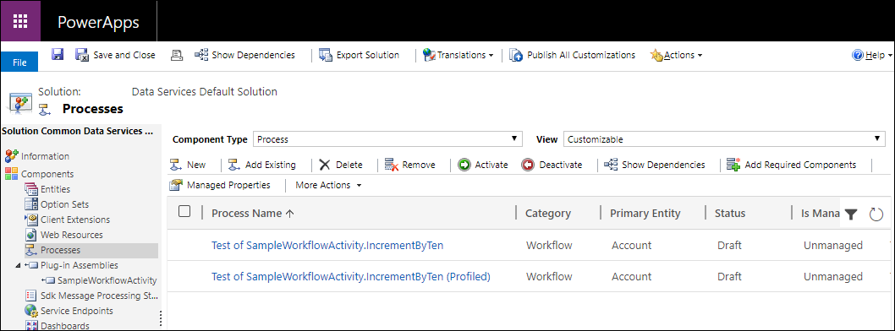

When the workflow is copied, some of the configuration is lost. If you try to activate the copied workflow, you will get the following error: `An automatic process cannot be activated if no activation parameters have been specified. Add activation parameters, and then activate. ...`

This means you have to re-configure the **Start when** properties of the workflow. In this case, we want to set the workflow to start when the **Account Name** field changes:

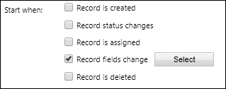

Click the **Select** button to choose the **Account Name** field.

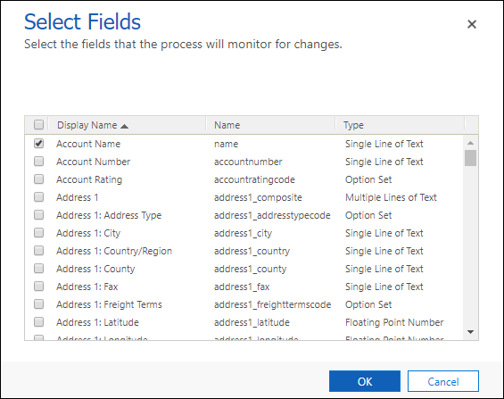

The copied profile workflow will also be changed to a background (asynchronous) workflow. It will be easier to test a real-time (synchronous) workflow, so in the menu bar click **Convert to a real-time workflow**.

Save the copied profile workflow and activate it.

In an app connected to your Dataverse instance, or by using the web services, update the **Account Name** value of an account entity. This will capture an instance of the context passed to your custom workflow activity and persist it as a profile record in the system.

> [!TIP]
> If your workflow is asynchronous, make sure that it completes before moving on to the next step. Go to Settings > System Jobs and verify that the workflow succeeded.

## Stop profiling

After you have captured the profile you need to debug, you should stop profiling the plug-in.  

To stop profiling, unregister the workflow using the PRT.

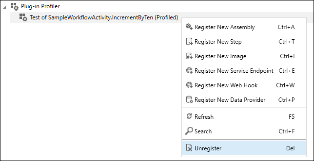

This will delete the copy of the workflow that was made.

> [!IMPORTANT]
> The workflow that was copied will still be deactivated. You will need to manually reactivate it if you want it to be applied.

## Debug your assembly

1. In the PRT, click **Replay Plug-in execution**.
1. In the **Replay Plug-in Execution dialog**, on the **Setup** tab, click the download button to select a **Profile**.

    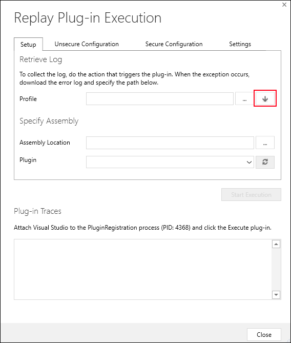

    > [!NOTE]
    > The **Unsecure Configuration**, **Secure Configuration**, and **Settings** tabs are not used for workflow activity debugging. They are only used for Plug-ins.

1. In the **Select Profile from CRM** dialog, choose the most recent profile that represents the one you just generated.

    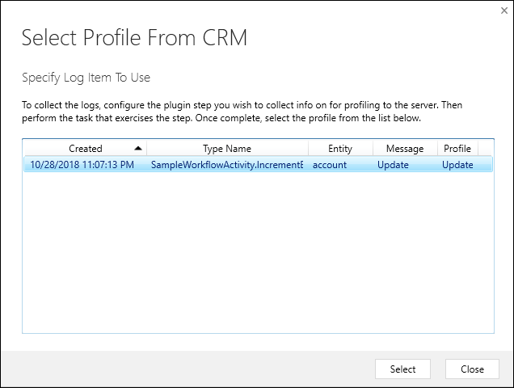

    > [!NOTE]
    > You can manage captured profiles in the **Dynamics 365 - custom** web application by navigating to **Settings** > **Extensions** > **Plug-in Profiles**.

1. Click **Select** to close the dialog.
1. In the **Assembly Location** field, click the ellipses (**...**) button to add the location of the assembly that contains the workflow activity you are debugging.
1. Open your Workflow Activity project in Visual Studio.
1. Add a breakpoint to a line within the `Execute` method of your workflow activity.

    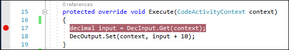

1. From the **Debug** menu, select **Attach to Process...**.
1. Look for the process for `PluginRegistration.exe`.

    > [!TIP]
    > The search filter will help you find this faster. The Process Id (PID) assigned to the process will be different for each session. The PID is shown in the **Replay Plug-in Execution** dialog under **Plug-in Traces**.

    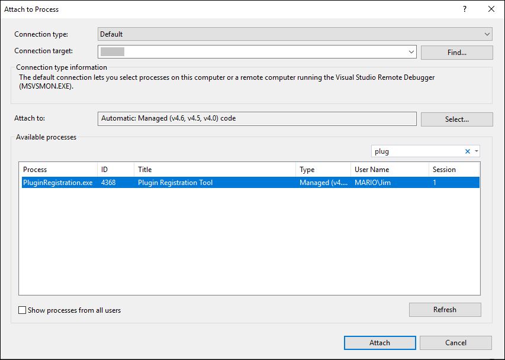

1. Click **Attach** to attach your Visual Studio debugger to the PRT application that will run the process replay.
1. In the PRT **Replay Plug-in Execution** dialog, click the **Start Execution** button.

You should now be able to step through your code and debug your workflow activity using Visual Studio.

### More information

[Debug Plug-ins](../debug-plug-in.md) 
[Tutorial: Debug a plug-in](../tutorial-debug-plug-in.md)

[!INCLUDE[footer-include](../../../includes/footer-banner.md)]