# Tutorial: Create workflow extension

[!INCLUDE[cc-data-platform-banner](../../../includes/cc-data-platform-banner.md)]

This tutorial will show you the process to extend the workflow designer to add custom activities and logic using a workflow assembly, sometimes known as a workflow activity. The extensions you create this way can be used within a workflow, a custom action, or a dialog.

This tutorial uses a very simple example to focus on the requirements and process to:

- Create a Visual Studio Class Library project
- Add a CodeActivity class
- Define input and output parameters
- Add your business logic
- Sign and build the assembly
- Register your assembly
- Test your assembly
- Add your assembly to a solution

## Prerequisites

- A Microsoft Dataverse instance and administrator privileges
- Understanding of how to configure workflows. More information: [Classic Dataverse workflows](/flow/workflow-processes)
- A model-driven app that allows you to edit accounts.

## Goal

The example below will create a simple custom workflow activity that may be used in a workflow, dialog, or action process. More information: [Configure workflow stages and steps](/flow/configure-workflow-steps)

This custom workflow activity will match the following requirements:

1. Accept an decimal input parameter
1. Output a value equal to the input parameter plus 10.

In a workflow for the **Account** entity it may be used in the following manner to increment the **Credit limit** value using two steps:

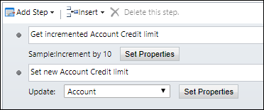

Step 1 uses the **Sample: Increment by 10** custom workflow activity to accept the **Account Credit Limit** value and increment it by 10.
Step 2 uses the **Update Record** action to update the **Account Credit Limit** value with the incremented value.

### Step 1: Get incremented Account Credit Limit

When the first step is added, the custom workflow activity will be available in a **Sample** group and have the name **Increment by 10**.

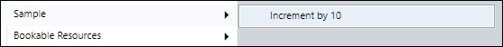

When configuring the first step by clicking the **Set Properties** button, the **Decimal input** property will be required and accept only a decimal value, such as the **Credit Limit** attribute of the **Account** entity.

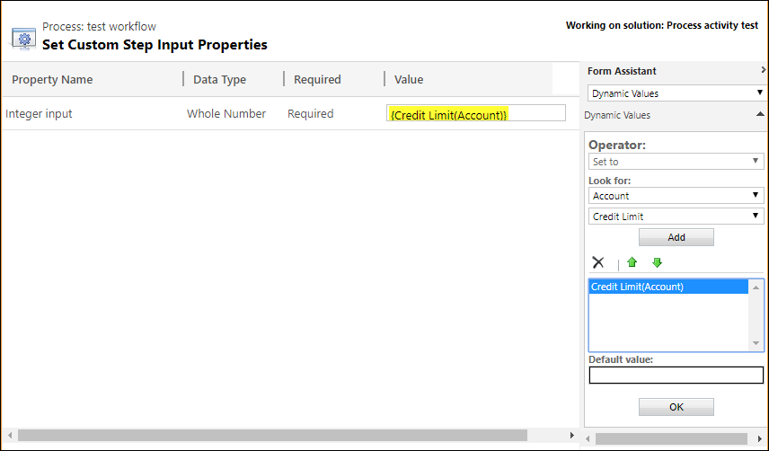

### Step 2: Set new Account Credit Limit

In the second step, an **Update Record** action will assign the output of the **Get incremented Account Credit Limit** step to update the **Account Credit** limit value with the incremented value.

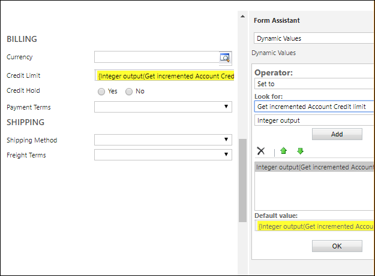

## Create a Visual Studio Class Library project

This project will create a simple workflow assembly that will increment an decimal value by 10.

1. Start Visual Studio.
1. On the **File** menu, click **New**, and then click **Project**.
1. Search for *Class library* and select **Class Library (.NET Framework)**.

    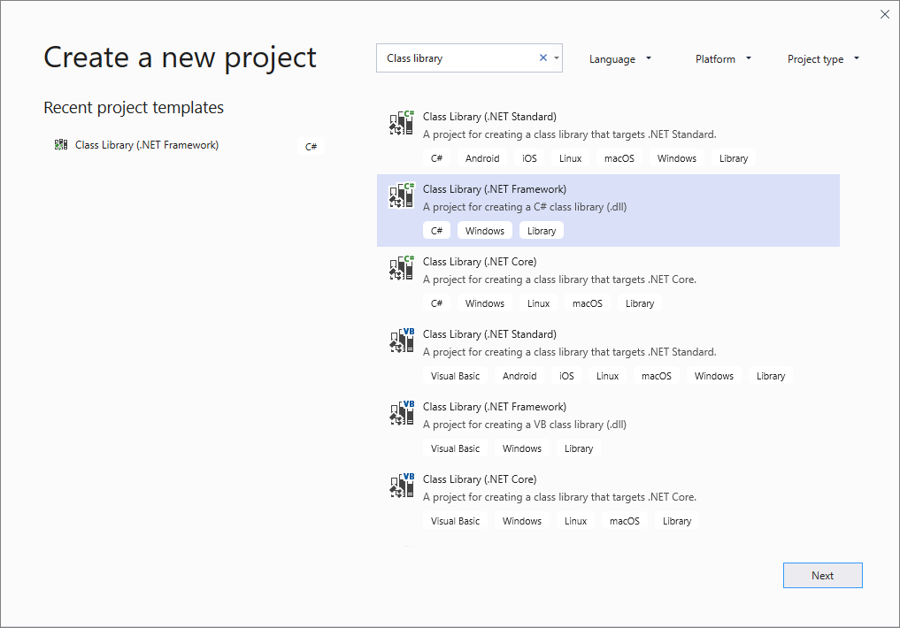

1. Click **Next**.
1. Specify a name and location for the solution.

    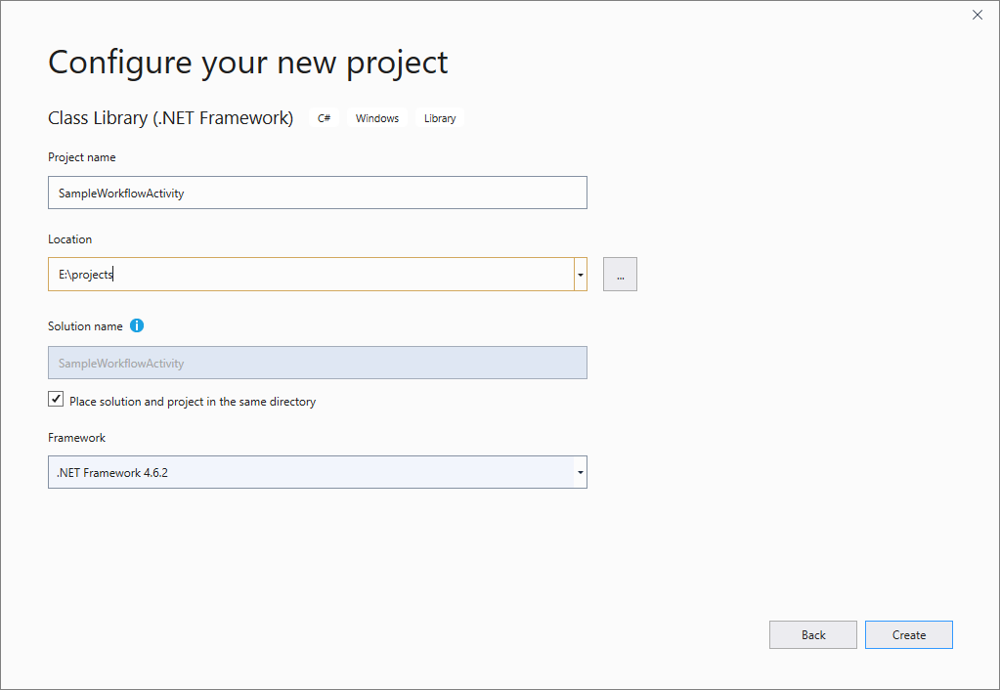

    > [!NOTE]
    > Choose a Project name that makes sense for your project. In this example we will use `SampleWorkflowActivity`.

1. Click **Create**.
1. In the **Solution Explorer**, right-click on the project select **Properties**. On the **Application** tab, verify that  **.NET Framework 4.6.2** is set as the target framework.

    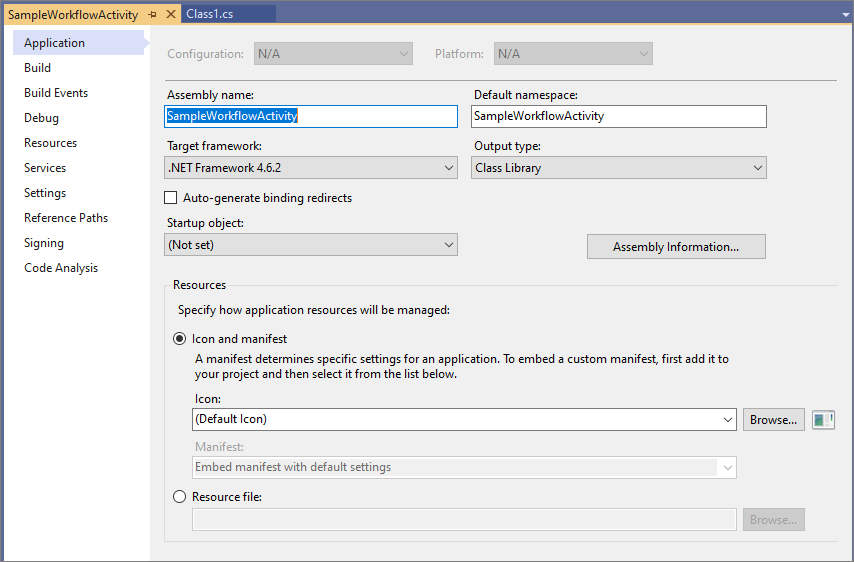

1. In the **Solution Explorer**, right-click the project and select **Manage NuGet Packages…** .

    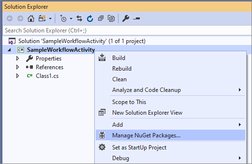

1. Browse for the [Microsoft.CrmSdk.Workflow](https://www.nuget.org/packages/Microsoft.CrmSdk.Workflow/) NuGet package and install it.

    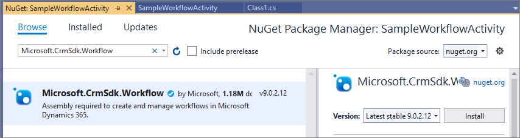

    > [!NOTE]
    > Make sure that the package you are installing is owned by [crmsdk](https://www.nuget.org/profiles/crmsdk). This package will include the `Microsoft.Xrm.Workflow.dll` include a dependency on the [Microsoft.CrmSdk.CoreAssemblies](https://www.nuget.org/packages/Microsoft.CrmSdk.CoreAssemblies/) package so that the required `Microsoft.Xrm.Sdk.dll` assembly is included as well. 

1. You must click **I Accept** in the **License Acceptance** dialog.

    

## Rename the class file

1. In **Solution Explorer**, right-click the default Class1.cs file and and select **Rename**.

    

    > [!NOTE]
    > Choose a class name that makes sense for your activity. In this example, we will name the class `IncrementByTen`.

1. Select **Yes** in the dialog box that asks if you would like to rename the class as well.

    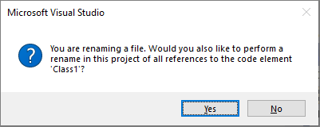

1. Open the IncrementByTen.cs file, and add the following using directives:

    ```csharp
    using System.Activities;
    using Microsoft.Xrm.Sdk;
    using Microsoft.Xrm.Sdk.Workflow;
    ```

1. Make the class inherit from the [CodeActivity](/dotnet/api/system.activities.codeactivity) class and give it a public access modifier as shown here:

    ```csharp
    public class IncrementByTen: CodeActivity
        {

        }
    ```

1. Add the **Execute** method from the `CodeActivity` class using Visual Studio Quick actions or manually:

    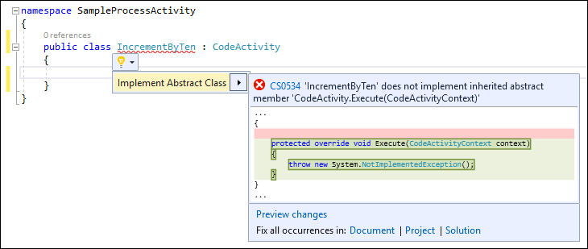

1. The class now looks like this:

    ```csharp
    public class IncrementByTen : CodeActivity
    {
        protected override void Execute(CodeActivityContext context)
        {
            throw new NotImplementedException();
        }
    }
    ```

## Define input and output parameters

1. Add a set of input and output parameters where the value of the output parameter will be the value of the input parameter incremented by 10.

    ```csharp
    public class IncrementByTen : CodeActivity
    {
        [RequiredArgument]
        [Input("Decimal input")]
        public InArgument<decimal> DecInput { get; set; }

        [Output("Decimal output")]
        public OutArgument<decimal> DecOutput { get; set; }

        protected override void Execute(CodeActivityContext context)
        {
            
        }
    }
    ```

    > [!NOTE]
    > Notice how [.NET Attributes](/dotnet/standard/attributes) are used to provide metadata about the parameters in the assembly. More information: [Add parameters](workflow-extensions.md#add-parameters)

## Add your business logic

Add the logic within the Execute method to apply the logic to increment the input value by 10.

```csharp
    protected override void Execute(CodeActivityContext context)
    {
      decimal input = DecInput.Get(context);
      DecOutput.Set(context, input + 10);
    }
```

## Sign and build the assembly

1. Custom workflow activity (and plug-in) assemblies must be signed. In the project properties, under the **Signing** tab, select **Sign the assembly**. Below **Choose a strong name key file**, select the **&lt;New...&gt;** option.
    You do not need to set a password for the purpose of this tutorial. For this example we created a new strong name key file named `SampleWorkflowActivity.snk`

    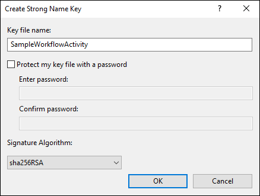

1. Build the solution in Debug mode and verify that the `SampleWorkflowActivity.dll` assembly is in the `/bin/Debug` folder.

> [!NOTE]
> While developing an assembly it is fine to use the **Debug** build configuration. When you deploy your assembly to a production server or in a solution, you should use the **Release** build configuration.

## Register your assembly

Custom workflow activity assemblies are registered using the Plug-in Registration tool. The tool provides a graphical user interface and supports registering assemblies that contain plug-ins or custom workflow activities. To get the Plug-in Registration tool see: [Download tools from NuGet](../download-tools-nuget.md)

[!INCLUDE [cc-connect-plugin-registration-tool](../includes/cc-connect-plugin-registration-tool.md)]

### Register your assembly

1. Select **Register** > **Register New Assembly**

    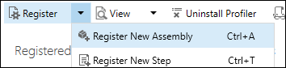

1. In the **Register New Assembly** dialog, click the ellipses button (**…**) and navigate to the `SampleWorkflowActivity.dll` in the `/bin/Debug` folder.

    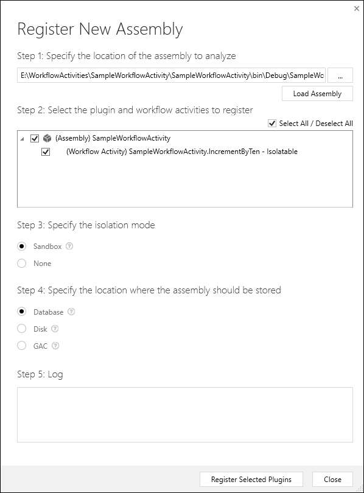

    > [!NOTE]
    > Note: With Dataverse the only valid options for Steps 3 & 4 are selected and invalid options are disabled.

1. Click **Register Selected Plugins**. You should see a confirmation dialog.

    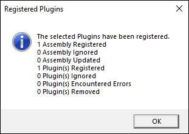

1. Click **OK** to close the **Register New Assembly** dialog.

### Configure activity names

1. In the list of **Registered Plugins and Custom Workflow Activities** locate the **(Assembly) SampleWorkflowActivity** and expand it to show the **(Workflow Activity) SampleWorkflow.Activity.IncrementByTen - Isolatable**.
1. Select the **(Workflow Activity) SampleWorkflow.Activity.IncrementByTen - Isolatable** and in the **Properties** area edit the **Editable properties** using the values in the following table:

    |Editable Field|Original Value|New Value|Description|
    |--|--|--|--|
    |Description||Returns the value of the input parameter plus 10.|Not visible in the UI of the process designer, but may be useful when generating documentation from data drawn from the PluginType Entity that stores this information.|
    |FriendlyName|a GUID value|IncrementByTen|User friendly name for the plug-in.|
    |Name|SampleWorkflowActivity.IncrementByTen|Increment By 10|The name of the menu represented|
    |WorkflowActivityGroupName|SampleWorkflowActivity (1.0.0.0)|Sample|The name of the submenu added to the main menu in the Dataverse process designer.|

    > [!NOTE]
    > If the **Name** and **WorkflowActivityGroupName** are set to null, the custom activity will not be visible in the process designer.

1. Click the **Save** (icon) to save the changes.

    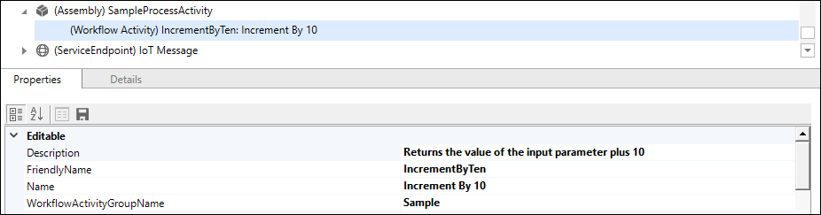

## Test your assembly

You can test your new workflow activity by creating a process that will use it. Use these steps to create the Workflow process described in the [Goal](#goal) section above:

1. Open [Power Apps](https://make.powerapps.com/?utm_source=padocs&utm_medium=linkinadoc&utm_campaign=referralsfromdoc)
1. Select **Solutions**.
1. Open the **CDS Default Publisher** solution.
1. In the menu, expand the **...** and choose **Switch to classic**.
    
    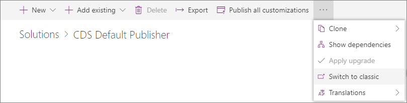

1. Select **Processes** in the **Components** list
1. Select **New** and in the **Create Process** dialog enter the following:

    |Field|Value|
    |--|--|
    |Process name|Test of SampleWorkflowActivity.IncrementByTen|
    |Category|Workflow|
    |Entity|Account|
    |Run this workflow in the background (recommended)|deselected|

    > [!NOTE]
    > The option to **Run this workflow in the background** has been de-selected to make this a real-time (synchronous) workflow. This will make testing simpler.

    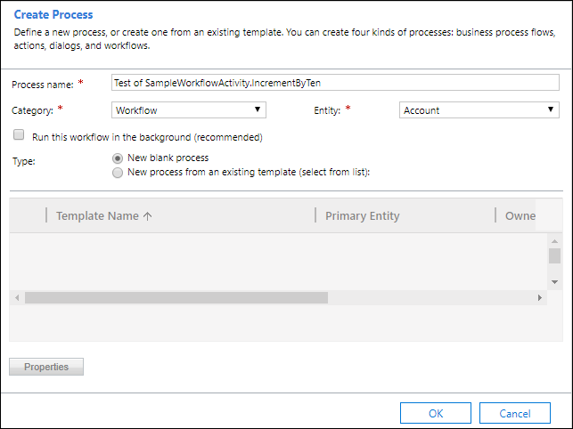

1. Click **OK**
1. Apply the following changes:

    |Field|Value|
    |--|--|
    |Scope|Organization|
    |Start when: Record fields change|selected, and `name` field specified in the dialog.|

    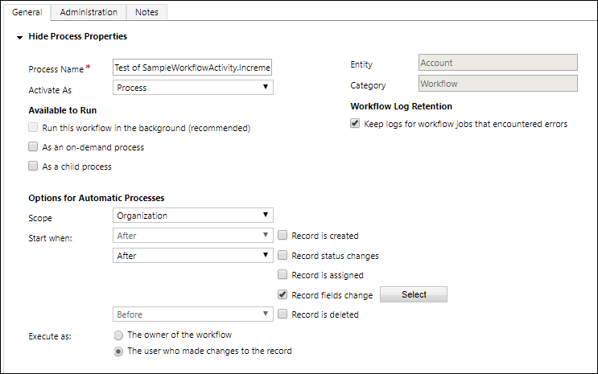

    > [!NOTE]
    > Setting **Scope** to **Organization** creates a workflow that can be applied by anyone in the organization.

1. Add the following **Step**:

    

1. Set the Step **Description** to **Get incremented Account Credit Limit** and click **Set properties**.
1. Set the value of the **Decimal input** property to the Credit Limit of the account with a default value of 0.

    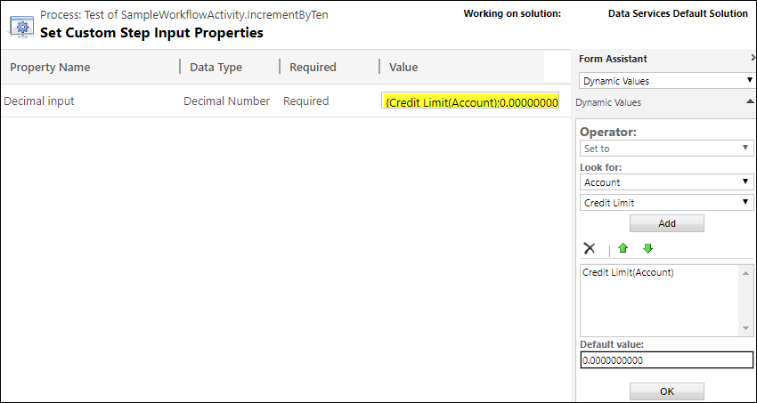

1. Click **Save and Close**.
1. Add an **Update Record** step:

    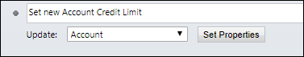

1. Click **Set Properties** and set the value of the **Credit Limit** to the value of the **Get incremented Account Credit Limit** step.

    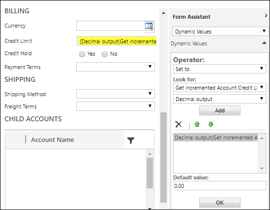

    The workflow steps should look like this:

    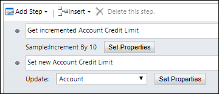

1. Click **Save and Close**.
1. Activate the workflow by clicking **Activate** in the menu...

    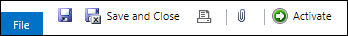

1. And click **Activate** in the **Process Activate Confirmation** dialog.

    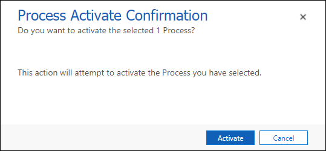

1. Navigate to a model-driven app and view a list of acccounts.
1. Select an account.
1. Edit the **Account Name** field value.
1. Save the account record.
1. Verify that the account you edited has **Credit Limit** value has increased by 10.

    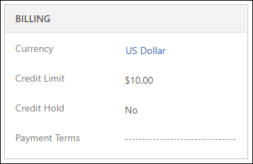

## Add your assembly to a solution

To distribute a custom workflow activity in a solution, you must add the registered assembly that contains it to an unmanaged solution.

1. Open the unmanaged solution you want to add the assembly to using [Power Apps](https://make.powerapps.com/?utm_source=padocs&utm_medium=linkinadoc&utm_campaign=referralsfromdoc)
1. Select **Add existing** > **Other** > **Plugin assembly**

    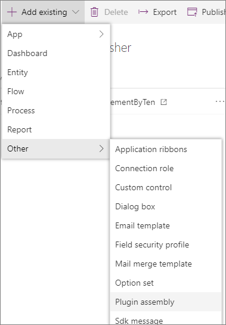

1. Search for the Plugin assembly by name, in this case 'SampleWorkflowActivity'.
1. Select the plugin assembly and select **Add**.

### See also

[Workflow extensions](workflow-extensions.md)<br />
[Sample: Create a custom workflow activity](sample-create-custom-workflow-activity.md)<br />
[Sample: Update next birthday using a custom workflow activity](sample-update-next-birthday-using-custom-workflow-activity.md)<br />
[Sample: Calculate a credit score with a custom workflow activity](sample-calculate-credit-score-custom-workflow-activity.md)


[!INCLUDE[footer-include](../../../includes/footer-banner.md)]