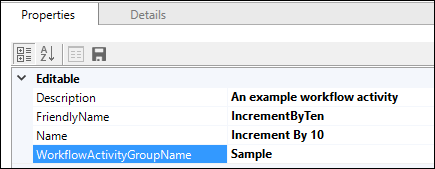
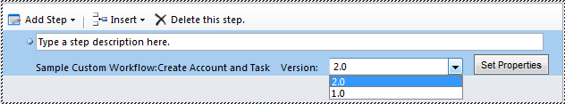

# Workflow extensions

[!INCLUDE[cc-terminology](../includes/cc-terminology.md)]

You can extend the options available within the workflow designer used in Microsoft Dataverse. These extensions are added by adding an assembly that contains a class the extends the [CodeActivity](/dotnet/api/system.activities.codeactivity) class. These extensions are commonly called *workflow assemblies* or *workflow activities*.

You can use these custom extensions within the workflow designer, custom actions, and dialogs (deprecated).

> [!IMPORTANT]
> Whenever possible, you should first consider applying one of the several declarative options to define business logic. More information: [Apply business logic in Dataverse](../../../maker/data-platform/processes.md)
>
> Use workflow extensions when a declarative process doesn’t meet your requirement.

## When to create a workflow extension

If you don’t find the functionality you require using the default process activities, you can add custom activities so that they are available in the editor used to compose workflow, dialog, and action processes.

By default, these processes include a common set of activities you can perform as shown in the following table:

|Activity|Workflow|Action|Dialog|
|--|--|--|--|
|Query Data|||X|
|Assign Value||X|X|
|Create Record|X|X|X|
|Update Record|X|X|X|
|Assign Record|X|X|X|
|Send Email|X|X|X|
|Start Child Workflow|X|X|X|
|Perform Action|X|X||
|Link Child Dialog|||X|
|Change Status|X|X|X|
|Stop Workflow|X|X||
|Stop Dialog|||X|

You can use the **Perform Action** activity to execute any custom actions or the following system messages called **Command Actions**:

|Actions|Actions (cont'd)|Actions (cont'd)|
|--|--|--|
|AddToQueue|AddUserToRecordTeam|RemoveUserFromRecordTeam|
|SetProcess|SetWordTemplate||

If you have Dynamics 365 Sales or Service solutions, you can find other command actions depending on the solution:

|Actions|Actions (cont'd)|Actions (cont'd)|
|--|--|--|
|ApplyRoutingRule|CalculateActualValue|CloseOpportunity|
|GetQuoteProductsFromOpportunity|GetSalesOrderProductsFromOpportunity|LockInvoicePricing|
|LockSalesOrderPricing|QualifyLead|RemoveUserFromRecordTeam|
|ResolveIncident|ResolveQuote|Revise|
|UnlockInvoicePricing|UnlockSalesOrderPricing|

More information:

- [Configure workflow stages and steps](/flow/configure-workflow-steps)
- [Use Dataverse dialogs for guided processes](/flow/use-cds-for-apps-dialogs)
- [Create a custom action](/flow/create-actions)

## Technology used

You can register an assembly built using the [.NET Framework Activity library](/dotnet/framework/windows-workflow-foundation/net-framework-4-5-built-in-activity-library) that defines custom activities that will appear within the web application editor and will be invoked when the process runs.

Custom workflow activities require creating a .NET Framework assembly that includes one or more classes that are derived from the abstract [CodeActivity Class](/dotnet/api/system.activities.codeactivity?view=netframework-4.6.2). This class provides the [Execute(CodeActivityContext) Method](/dotnet/api/system.activities.codeactivity.execute?view=netframework-4.6.2) called by the Dataverse platform when the activity is executed. Each class in your assembly will define a specific activity.

Workflow activities should define input and output parameters which are visible in the process designer and enable someone to pass data into the workflow activity and receive the processed output. When you write the class you will add properties for these parameters and annotate them with [.NET attributes](/dotnet/standard/attributes/index) to provide the metadata that Dataverse will use to expose your custom workflow activity with any parameters in the designer.

## Create a custom workflow activity assembly

These are general steps used to create a custom workflow activity using Visual Studio. For a complete step-by-step example see [Tutorial: Create workflow extension](tutorial-create-workflow-extension.md).

1. Create a Class Library project using .NET Framework 4.6.2 as the target framework.
    > [!IMPORTANT]
    > While assemblies built using later versions should generally work, if they use any features introduced after 4.6.2 an error will occur.
1. Install the [Microsoft.CrmSdk.Workflow](https://www.nuget.org/packages/Microsoft.CrmSdk.Workflow/) NuGet package.

    This package includes the [Microsoft.CrmSdk.CoreAssemblies](https://www.nuget.org/packages/Microsoft.CrmSdk.CoreAssemblies/) package.

1. (Optional) If you wish to use early bound table classes, include them in the project.

    More information:

    - [Late-bound and Early-bound programming using the Organization service](../org-service/early-bound-programming.md)
    - [Generate early-bound classes for the Organization service](../org-service/generate-early-bound-classes.md)

1. Add a public class. The name of the class should correspond with the action to be performed by the activity.
1. Add the following using directives

    ```csharp
    using System.Activities;
    using Microsoft.Xrm.Sdk;
    using Microsoft.Xrm.Sdk.Workflow;
    ```

1. Add properties to the class to represent any input or output parameters and use [.NET attributes](/dotnet/standard/attributes/index) to provide necessary metadata to expose these properties to the workflow process designer.

    More information: [Add parameters](#add-parameters)

1. Make your class derive from the [CodeActivity Class](/dotnet/api/system.activities.codeactivity?view=netframework-4.6.2) and implement the [Execute(CodeActivityContext) Method](/dotnet/api/system.activities.codeactivity.execute?view=netframework-4.6.2) that contains the operations your activity will perform.

    More information: [Add your code to the Execute method](#add-your-code-to-the-execute-method)

1. Sign your assembly
1. Build your assembly.
1. Register your assembly using the Plug-in Registration tool and set the `Name` and `WorkflowActivityGroupName` properties to define the text that will be visible in the workflow designer.

    More information: [Register your assembly](#register-your-assembly)

1. Test your workflow activity by invoking it from within a workflow, dialog, or action processes
1. (Recommended) Add your workflow activity to a solution.

## Add parameters

When you define parameters for your class you must define them as [InArgument\<T>](/dotnet/api/system.activities.inargument-1), [OutArgument\<T>](/dotnet/api/system.activities.outargument-1), or [InOutArgument\<T>](/dotnet/api/system.activities.inoutargument-1) types. These types provide methods inherited from a common [Argument Class](/dotnet/api/system.activities.argument) to Get or Set the parameters. Your code will use these methods in the Execute method. More information: [Add your code to the Execute method](#add-your-code-to-the-execute-method)

When your custom workflow activity uses input or output parameters you must add appropriate .NET attributes to the public class properties that define them. This data will be read by the process designer to define how the parameters can be set in the process designer.

You can use the following types of properties as input or output parameters:

|Properties|Properties (cont'd)|Properties (cont'd)|
|--|--|--|
|[bool](/dotnet/api/system.boolean)|[DateTime](/dotnet/api/system.datetime)|[Decimal](/dotnet/api/system.decimal)|
|[Double](/dotnet/api/system.double)|<xref:Microsoft.Xrm.Sdk.EntityReference>|[int](/dotnet/api/system.int32)|
|<xref:Microsoft.Xrm.Sdk.Money>|<xref:Microsoft.Xrm.Sdk.OptionSetValue>|[string](/dotnet/api/system.string)|

### Input and Output parameters

To define the text to display for an input or output parameter in the process designer, you will use the following pattern using [.NET Attributes](/dotnet/standard/attributes/index).

```csharp
[Input("Integer input")]
public InArgument<int> IntInput { get; set; }
```

or

```csharp
[Output("Integer output")]
public OutArgument<int> IntOutput { get; set; }
```

A single property in your class can be both an input and output parameter by including both attributes:

```csharp
[Input("Int input")]  
[Output("Int output")]  
public InOutArgument<int> IntParameter { get; set; }
```

### Required values

If you want to make an input parameter required when using the workflow activity in a process you must use the `[RequiredArgument]` attribute.

### Default values

When a value passed in as an input parameter or set as an output parameter is not defined, you can specify a default value. For example, to set the default value for a bool property:

```csharp
[Input("Bool input")]
[Default("True")]
public InArgument<bool> Bool { get; set; }
```

The format for the default value depends on the type of property. Examples are in the following table:

|Type|Example|
|--|--|
|[bool](/dotnet/api/system.boolean)|[Default("True")]|
|[DateTime](/dotnet/api/system.datetime)|[Default("2004-07-09T02:54:00Z")]|
|[Decimal](/dotnet/api/system.decimal)|[Default("23.45")]|
|[Double](/dotnet/api/system.double)|[Default("23.45")]|
|<xref:Microsoft.Xrm.Sdk.Money>|[Default("23.45")]|
|<xref:Microsoft.Xrm.Sdk.EntityReference>|[Default("3B036E3E-94F9-DE11-B508-00155DBA2902", "account")]|
|[int](/dotnet/api/system.int32)|[Default("23")]|
|<xref:Microsoft.Xrm.Sdk.OptionSetValue>|[Default("3")]|
|[string](/dotnet/api/system.string)|[Default("string default")]|

### EntityReference parameters

When you define a property for an <xref:Microsoft.Xrm.Sdk.EntityReference> parameter you must use the `ReferenceTarget` attribute. This establishes which type of table is permitted. For example:

```csharp
[Input("EntityReference input")]
[Output("EntityReference output")]
[ReferenceTarget("account")]
public InOutArgument<EntityReference> AccountReference { get; set; }
```

### OptionSetValue parameters

When you define a property for an <xref:Microsoft.Xrm.Sdk.OptionSetValue> parameter you must use the `AttributeTarget` attribute. This attribute defines which table and column contains the valid set of values for the parameter. For example:

```csharp
[Input("Account IndustryCode value")]
[AttributeTarget("account", "industrycode")]
[Default("3")]
public InArgument<OptionSetValue> IndustryCode { get; set; }
```

## Add your code to the Execute method

The logic you include in the [CodeActivity.Execute(CodeActivityContext) Method](/dotnet/api/system.activities.codeactivity.execute?view=netframework-4.6.2) method defines what your workflow activity does.

> [!IMPORTANT]
> The code in the `Execute` method should be written to be stateless. It is not recommended to use global or member variables to pass data from one invocation to the next.
> For improved performance, Dataverse caches custom workflow activity instances. Because of this, the constructor is not called for every invocation of the custom workflow activity. Also, multiple system threads could execute the custom workflow activity at the same time. You should only use the information that is passed via the [CodeActivityContext](/dotnet/api/system.activities.codeactivitycontext) parameter to the `Execute` method.

### Reference parameters

To reference parameters defined for your class you will use the [Argument.Get](/dotnet/api/system.activities.argument.get?view=netframework-4.6.2) or [Argument.Set(ActivityContext, Object)](/dotnet/api/system.activities.argument.set?view=netframework-4.6.2) methods they provide which require the [CodeActivityContext](/dotnet/api/system.activities.codeactivitycontext) instance that is passed to the `Execute` method. The following example shows accessing the value of an input parameter and setting the value of an output parameter.

```csharp
using Microsoft.Xrm.Sdk.Workflow;
using System.Activities;

namespace SampleWorkflowActivity
{
  public class IncrementByTen : CodeActivity
  {
    [RequiredArgument]
    [Input("Decimal input")]
    public InArgument<decimal> DecInput { get; set; }

    [Output("Decimal output")]
    public OutArgument<decimal> DecOutput { get; set; }

    protected override void Execute(CodeActivityContext context)
    {
      decimal input = DecInput.Get(context);
      DecOutput.Set(context, input + 10);
    }
  }
}
```

### Get Contextual information

When your code requires contextual information you can access this using the [CodeActivityContext.GetExtension\<T> method](/dotnet/api/system.activities.activitycontext.getextension) with the <xref:Microsoft.Xrm.Sdk.Workflow.IWorkflowContext> interface. This object is derived from the <xref:Microsoft.Xrm.Sdk.IExecutionContext> interface which provides access to many read-only properties that describe the context of the operation. The `IWorkflowContext` provides similar contextual information specific to the executing workflow that is using your workflow assembly.

Use the following code in your `Execute` function to access the `IWorkflowContext`:

```csharp
protected override void Execute(CodeActivityContext context)
{
 IWorkflowContext workflowContext = context.GetExtension<IWorkflowContext>();
...
```

> [!IMPORTANT]
> You should not include any logic dependencies based on the context information. When your custom workflow activity is used in a workflow, all the relevant input parameters should be set within the designer. The output value or behavior of the custom activity should always be determined solely by the input parameters so that there are no hidden factors that change the behavior. When someone uses the custom activity in the designer, the behavior should always be predictable.

### Use the Organization service

When you need to perform data operations using the Organization service you can access this using the [CodeActivityContext.GetExtension\<T>](/dotnet/api/system.activities.activitycontext.getextension) method with the <xref:Microsoft.Xrm.Sdk.IOrganizationServiceFactory> interface. From there you can use the <xref:Microsoft.Xrm.Sdk.IOrganizationServiceFactory.CreateOrganizationService(System.Nullable{System.Guid})> method to access an instance of the service proxy that you can use to perform data operations. The <xref:Microsoft.Xrm.Sdk.Workflow.IWorkflowContext>.<xref:Microsoft.Xrm.Sdk.IExecutionContext.InitiatingUserId> can be used to determine the user context to use if you want the operation to be performed in the same context as the calling process.
Use the following code in your `Execute` function to get access to the Organization service:

```csharp
protected override void Execute(CodeActivityContext context)
{
 IWorkflowContext workflowContext = context.GetExtension<IWorkflowContext>();
 IOrganizationServiceFactory serviceFactory = context.GetExtension<IOrganizationServiceFactory>();

 // Use the context service to create an instance of IOrganizationService.             
 IOrganizationService service = serviceFactory.CreateOrganizationService(workflowContext.InitiatingUserId);
...
```

## Register your assembly

You will use the Plug-in Registration tool (PRT) to register assemblies containing custom workflow activities. This is the same tool you use to register plug-ins. For both plug-ins and custom workflow activities, you must register the assembly which will upload it to the environment. However, you do not register steps for custom workflow activities.

For custom workflow activities you must specify the following properties to control what is displayed in the workflow process designer.

|Field|Description|
|--|--|
|`Description`|Not visible in the UI of the process designer, but may be useful when generating documentation from data drawn from the PluginType table that stores this information.|
|`FriendlyName`|User friendly name for the plug-in.|
|`Name`|The name of the menu represented|
|`WorkflowActivityGroupName`|The name of the submenu added to the main menu in the Dataverse process designer.|



> [!NOTE]
> These values will not be visible in the unmanaged solution when you test your workflow activity. However, when you export a managed solution that includes this workflow activity these values will be visible in the process designer.

## Debug Workflow Activities

With custom workflow activities deployed to Dataverse you can capture profiles to replay for local debugging and use the tracing service to write information to a table.

The following example shows using the tracing service to write the following message: `Add your message.`

```csharp
protected override void Execute(CodeActivityContext context)
{
//Create the tracing service
ITracingService tracingService = context.GetExtension<ITracingService>();

//Use the tracing service
tracingService.Trace("{0} {1} {2}.", "Add", "your", "message");
...
```

More information:
 - [Debug workflow activities](debug-workflow-activites.md)
 - [Use tracing](../debug-plug-in.md#use-tracing)
 - [View trace logs](../tutorial-write-plug-in.md#view-trace-logs)

## Add to Solution

When you register assemblies using the plug-in registration tool they will be added to the **Default solution**, not to be confused with the **Common Data Service Default Solution**. Because the **Default solution** contains all the unmanaged customizations applied to the environment, before you can distribute your custom workflow activity using a solution you must add it to an unmanaged solution. For example, you could add it to the **Common Data Service Default Solution** or any unmanaged solution you have created.

## Manage changes to custom workflow activities

You will need to maintain the code for your custom workflow activities. Because code changes can include breaking changes, you will need to manage this change. You will use different steps to update or upgrade your custom workflow assemblies.

When you register an assembly containing custom workflow activities the version of the assembly is included. This information is extracted using reflection from the assembly. You can control the version number using the `AssemblyInfo.cs` file in your Visual Studio project.

You will find a section at the bottom that looks like this:

```
// Version information for an assembly consists of the following four values:
//
//      Major Version
//      Minor Version 
//      Build Number
//      Revision
//
// You can specify all the values or you can default the Build and Revision Numbers 
// by using the '*' as shown below:
//[assembly: AssemblyVersion("1.0.0.*")]
[assembly: AssemblyVersion("1.0.0.0")]
[assembly: AssemblyFileVersion("1.0.0.0")]
```

This version information is important because it allows you to apply updates to deployed assemblies or upgrade assemblies when you want to include new capabilities.

### Update a custom workflow activity assembly

When you make changes to fix bugs or re-factor code that do not make significant changes to public classes or method signatures you can update the assembly so that all running processes will automatically start using the new version of the assembly.

#### To update an assembly:

1. Change only the **Build Number** and **Revision values** in your `AssemblyInfo.cs` `AssemblyVersion` attribute. For example, change from `1.0.0.0` to `1.0.10.5`.
1. Use the Plug-in Registration tool to update the assembly. More information: [Update an assembly](../register-plug-in.md#update-an-assembly)

#### Upgrade a custom workflow activity assembly:

If you make changes that include significant changes to public classes or method signatures, such as changing the parameters you would break any currently running processes defined to use the original signatures. In this case you must upgrade the assembly. This will create a new custom workflow activity that exposes options define which version to apply in the process designer. This allows for each process using this activity to be re-configured to adapt to the changes included in the new assembly. After all processes using the original assembly are updated to use the upgraded assembly, you can de-register the older assembly.

#### To upgrade an assembly:

1. Make sure the new assembly has the same `Name`, `PublicKeyToken`, and `Culture` as the existing assembly.
1. Change the **Major Version** and/or **Minor Version** values in your `AssemblyInfo.cs` `AssemblyVersion` attribute. For example, change from `1.0.0.0` to `2.0.0.0`.
1. Use the Plug-in Registration tool to register the assembly as a new assembly. More information: [Register an assembly](../register-plug-in.md#register-an-assembly)
1. For each process using the custom workflow activity, you must deactivate the process and edit the steps which use the custom workflow activity.

    You will find a **Version** selector in the process designer that you can use to choose which version of the assembly should be used.

    

When all processes are converted to use the new assembly, you can use the Plug-in Registration tool to unregister the assembly, so it will no longer be available. More information: [Unregister components](../register-plug-in.md#unregister-components)

## Performance Guidance

Performance considerations for your workflow extensions are the same as for ordinary plug-ins.  More information: [Performance considerations](../write-plug-in.md#performance-considerations)

Unlike an ordinary plug-in, with workflow extensions you do not have the opportunity to explicitly register your code for a specific step. This means you don't control whether the code in your workflow extension will run synchronously or asynchronously. Particular care must be considered for code that runs synchronously because it will directly impact the application user's experience.

As re-usable components, workflow extensions can be added to any workflow or custom action. The workflow may be configured as a *real-time* workflow, which means it will run synchronously. Custom actions are always synchronous, but they do not participate in a database transaction unless they have **Enable rollback** set.

> [!IMPORTANT]
> When your workflow extension is used in a synchronous workflow or a custom action the time spent running the code directly impacts the user's experience. For this reason, workflow extensions should require no more than two seconds to complete when used synchronously. If your extension requires more time than this, you should document this and discourage use of the extension in synchronous workflows or custom actions.

You should also be aware that in a synchronous workflow or a custom action that participates in the transaction, any error thrown by your workflow extension will cause the entire transaction to rollback, which is a very expensive operation that can impact performance.

You can use the value in the <xref:Microsoft.Xrm.Sdk.Workflow.IWorkflowContext>.<xref:Microsoft.Xrm.Sdk.Workflow.IWorkflowContext.WorkflowMode> property to determine if the workflow is running synchronously.

## Real-time workflow stages

When a workflow extension is used in a real-time (synchronous) workflow it will be invoked in the event execution pipeline stages shown in the following table. For more information : [Event execution pipeline](../event-framework.md#event-execution-pipeline)

|Message  |Stage  |
|---------|---------|
|**Create**|PostOperation|
|**Delete**|PreOperation|
|**Update**|PreOperation or <br /> PostOperation|

You can use the value in the <xref:Microsoft.Xrm.Sdk.Workflow.IWorkflowContext>.<xref:Microsoft.Xrm.Sdk.Workflow.IWorkflowContext.StageName> property to detect the stage.

For the **Update** operation, the stage is configurable using **Before** or **After** options in the workflow designer. More information: [Using real-time workflows](/flow/configure-workflow-steps#using-real-time-workflows)

If your workflow extension depends on data passed in the execution context, the stage it runs in will control whether data is available in the <xref:Microsoft.Xrm.Sdk.Workflow.IWorkflowContext>.<xref:Microsoft.Xrm.Sdk.IExecutionContext.InputParameters> and <xref:Microsoft.Xrm.Sdk.Workflow.IWorkflowContext>.<xref:Microsoft.Xrm.Sdk.IExecutionContext.OutputParameters>.

> [!NOTE]
> We don't recommend including logic dependencies based on the <xref:Microsoft.Xrm.Sdk.IExecutionContext.InputParameters> and <xref:Microsoft.Xrm.Sdk.IExecutionContext.OutputParameters>. Workflow extensions should depend on the configured [input and output parameters](#input-and-output-parameters) so that the person using the workflow extension can understand the expected behavior without having anything hidden from them.

## Entity images for workflow extensions

There is no way to configure entity images for workflow extensions since you only register the assembly and the workflow activity runs in the context of the workflow. Workflow extensions entity images are available using the key values `PreBusinessEntity` and `PostBusinessEntity` respectively for the pre and post entity images. More information: [Entity images](../understand-the-data-context.md#entity-images)

### See also

[Best practices and guidance regarding plug-in and workflow development](../best-practices/business-logic/index.md)
[Tutorial: Create workflow extension](tutorial-create-workflow-extension.md)<br />
[Sample: Create a custom workflow activity](sample-create-custom-workflow-activity.md)<br />
[Sample: Update next birthday using a custom workflow activity](sample-update-next-birthday-using-custom-workflow-activity.md)<br />
[Sample: Calculate a credit score with a custom workflow activity](sample-calculate-credit-score-custom-workflow-activity.md)

[!INCLUDE[footer-include](../../../includes/footer-banner.md)]
