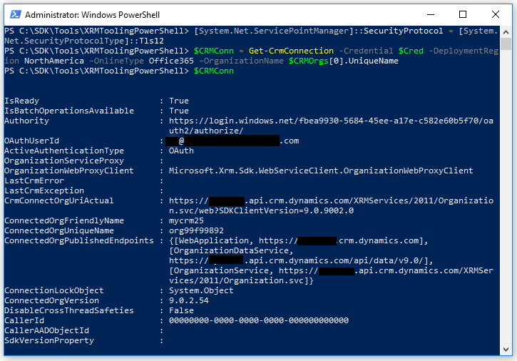

# Use PowerShell cmdlets for XRM tooling to connect to Microsoft Dataverse

XRM tooling provides you with the following **Windows PowerShell** cmdlets that you can use to connect to Dataverse and retrieve organizations that the current user has access to: `Get-CrmConnection` and `Get-CrmOrganizations`.  

 
<a name="Prereq"></a>   

## Prerequisites  
  
-  To use the XRM tooling cmdlets, you need **PowerShell** version 3.0 or later. To check the version, open a **PowerShell** window and run the following command: `$Host`  
  
-  Set the execution policy to run the signed **PowerShell** scripts. To do so, open a **PowerShell** window as an **administrator** and run the following command: `Set-ExecutionPolicy -ExecutionPolicy RemoteSigned`  
  
<a name="register"></a>   

## Acquire the Microsoft.Xrm.Tooling.CrmConnector.PowerShell cmdlet 

Before you can use the **Microsoft.Xrm.Tooling.CrmConnector.PowerShell** cmdlet, you have to install it. The XRM tooling PowerShell cmdlet is available on the PowerShell Gallery [here](https://www.powershellgallery.com/packages/Microsoft.Xrm.Tooling.CrmConnector.PowerShell). To download and install the cmdlet
  
Open PowerShell or PowerShell ISE in admin mode, and run the following command:

   ```powershell
  Install-Module -Name Microsoft.Xrm.Tooling.CrmConnector.PowerShell
   ```  
If you installed the module in the past, you can update it with the following command:

   ```powershell
  Update-Module -Name Microsoft.Xrm.Tooling.CrmConnector.PowerShell
   ```
    
You’re now ready to use the **Microsoft.Xrm.Tooling.CrmConnector.PowerShell** cmdlet. To list the functions that you registered, run the following command in the PowerShell window:  
  
   ```powershell
  Get-Help “Crm”  
   ```  


<a name="RetrieveOrgs"></a>   

## Use the cmdlet to retrieve organizations from Dataverse  

Use the `Get-CrmOrganizations` cmdlet to retrieve the organizations that you have access to.  
  

1.  Provide your credentials to connect to your Dataverse instance. Running the following command will prompt you to type your user name and password to connect to the Dataverse instance, and it will be stored in the `$Cred` variable.  

  
    ```powershell  
    $Cred = Get-Credential  
    ```  
2. Use the following command to retrieve your organizations, and store the information in the `$CRMOrgs` variable

    - If you’re connecting to a Dataverse instance:  
  
        ```powershell  
        $CRMOrgs = Get-CrmOrganizations -Credential $Cred -DeploymentRegion NorthAmerica –OnlineType Office365  
        ```  
  
        > [!NOTE]
        > For the `DeploymentRegion` parameter, valid values are `NorthAmerica`, `EMEA`, `APAC`, `SouthAmerica`, `Oceania`, `JPN`, `CAN`, `IND`, and `NorthAmerica2`. For the `OnlineType` parameter, specify `Office365`.
  
  
3.  Your supplied credentials are validated when you run the command in step 2. On successful execution of the command, type the following command, and press ENTER to display the organizations that you have access to:  
  
      ```powershell  
      $CRMOrgs  
      ```  
      > [!div class="mx-imgBorder"]
      > 
  

> [!TIP]
> You can use the variable that was used to store the retrieved Dataverse organizations (in this case `$CRMOrgs`) with the `Get-CrmConnection` cmdlet to connect to Dataverse. To specify the org name, use the following command: `$CRMOrgs.UniqueName`.  
>   
> If there is more than one organization value stored in the `$CRMOrgs` variable, you can refer to the `nth` organization using the following command: `$CRMOrgs[n-1]`. For example, to refer to the unique name of the second organization in the `$CRMOrgs` variable, use the following command: `$CRMOrgs[1].UniqueName`.
  
<a name="ConnecttoCRM"></a>
   
## Use the cmdlet to connect to Dataverse  

Use the `Get-CrmConnection` cmdlet to connect to a Dataverse instance. The cmdlet lets you either use the XRM tooling common login control to specify your credentials and connect to Dataverse or lets you specify your credentials as inline parameters. More information: [Use the XRM Tooling common login control](use-xrm-tooling-common-login-control-client-applications.md)

> [!IMPORTANT]
> Before using the `Get-CrmConnection` cmdlet, ensure that you use the following command to enforce usage of TLS 1.2 by PowerShell to connect to your Dataverse instance<br/>
> `[System.Net.ServicePointManager]::SecurityProtocol = [System.Net.SecurityProtocolType]::Tls12`<br/>
> More information about TLS 1.2 requirement for Dataverse connection [Blog Post: Updates coming to Dataverse connection security](https://blogs.msdn.microsoft.com/crm/2017/09/28/updates-coming-to-dynamics-365-customer-engagement-connection-security/)   
  
### Connect to Dataverse by using the common login control  
  
1.  If you want to use the common login control to provide your credentials to connect to Dataverse, use the following command. The connection information is stored in the `$CRMConn` variable so that you can use it later.  
  
    ```powershell  
    $CRMConn = Get-CrmConnection -InteractiveMode  
    ```  
  
2. The **LoginControl** dialog box appears. Provide your credentials to connect to your Dataverse instance, and click **Login**.    
  
### Connect to Dataverse by specifying credentials inline  
  
1.  To connect to Dataverse, use the following commands. Note that these commands use the `$Cred` variable created earlier to store the credential while retrieving the organizations. The connection information is stored in the `$CRMConn` variable:

     - If you’re connecting to a Dataverse instance

        ```powershell  
        $CRMConn = Get-CrmConnection -Credential $Cred -DeploymentRegion <Deployment region name> –OnlineType Office365 –OrganizationName <OrgName>  
        ```
        > [!NOTE]
        > For the `DeploymentRegion` parameter, valid values are `NorthAmerica`, `EMEA`, `APAC`, `SouthAmerica`, `Oceania`, `JPN`, `CAN`, `IND` and `NorthAmerica2`. For the `OnlineType` parameter, specify `Office365`. 
  
        > [!NOTE]
        > For the `OrganizationName` parameter in all the preceding commands, you can either specify the organization unique name or friendly name. You can also use the organization unique name or friendly name that you retrieved using the `Get-CrmOrganizations` cmdlet and stored in the `$CRMOrgs` variable. For example, you can use `$CRMOrgs[x].UniqueName` or `$CRMOrgs[x].FriendlyName`.  
  
2.  Your supplied credentials are validated when you run the command in step 1. On successful execution of the cmdlet, type the following command, and press ENTER to display the connection information and status:  

      ```powershell  
       $CRMConn  
       ```  

       > [!div class="mx-imgBorder"]
       >  

  
### See also
  
[Use XRM Tooling API to connect to Dataverse](use-crmserviceclient-constructors-connect.md)<br />
[Build Windows client applications using the XRM tools](build-windows-client-applications-xrm-tools.md)<br />
[Blog: PowerShell module for performing data operations and manipulating user and system settings in Dataverse](https://cloudblogs.microsoft.com/dynamics365/no-audience/2015/09/25/powershell-module-for-performing-data-operations-and-manipulating-user-and-system-settings-in-crm/)


[!INCLUDE[footer-include](../../../includes/footer-banner.md)]