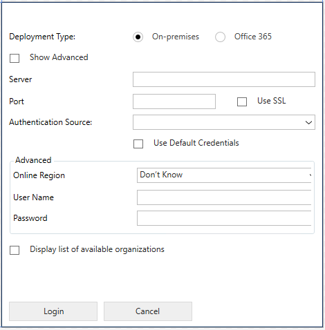
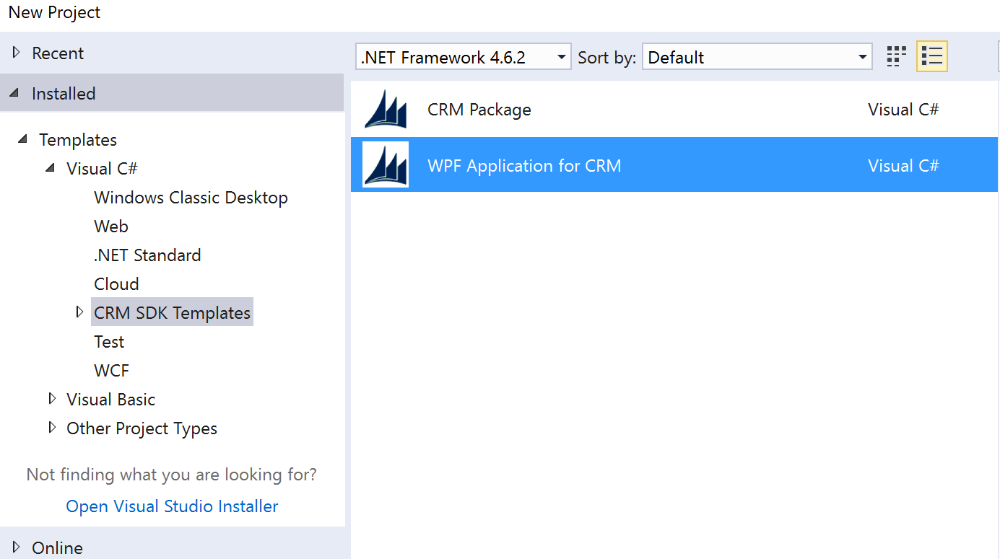
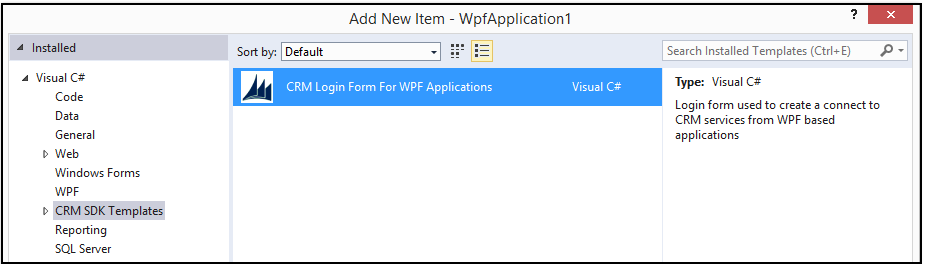
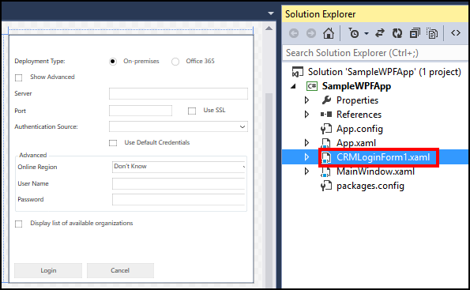
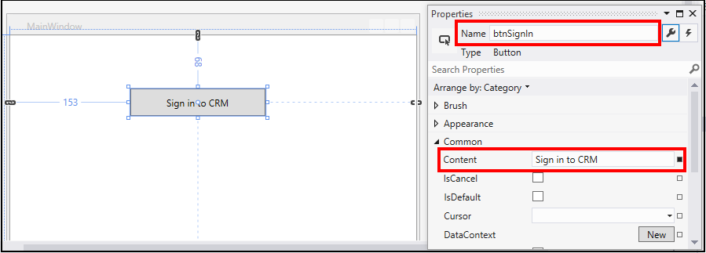
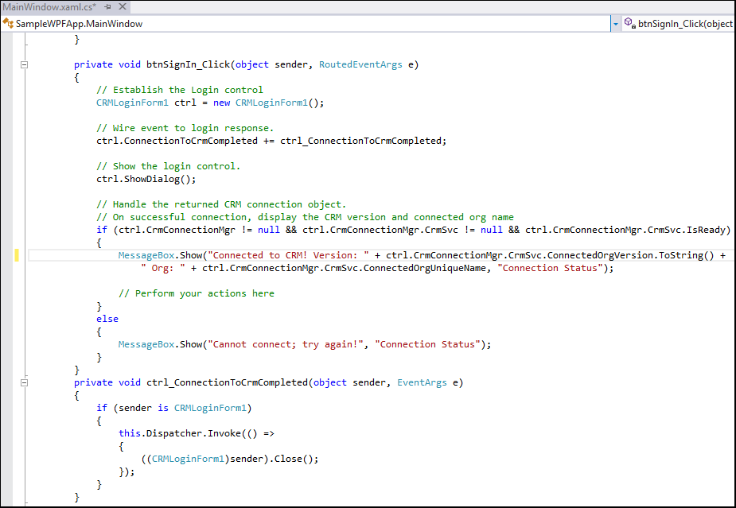
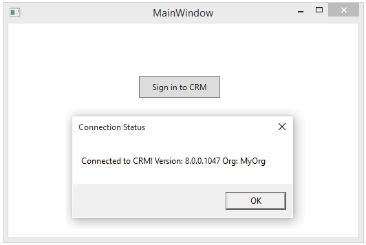
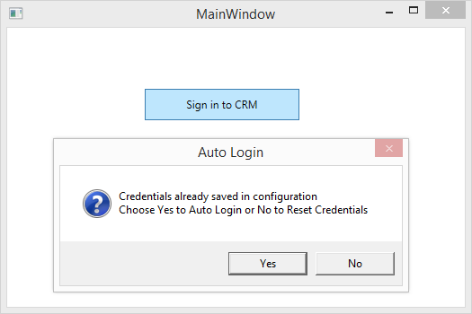

# Use the XRM tooling common login control in your client applications

There is a template for Visual Studio that enables you to use the common login control in your client applications. The code for Microsoft Dataverse authentication, credential storage and retrieval, and diagnostic logging is built into the template so that you can quickly leverage these capabilities in your Windows client applications for Dataverse. The common login control is an implementation of the <xref:Microsoft.Xrm.Tooling.CrmConnectControl>, and the control resembles the following image.  
  

  
<a name="Prereq"></a>

## Prerequisites
  
- .NET Framework 4.6.2 or higher.
- Visual Studio 2017 (recommended)
- Connected to Internet so that you can download/restore the required Nuget packages while using the project template.  
  
<a name="NewProjectUsingTemplate"></a>
   
## Create a WPF application using the common login control template
  
Here is a quick way to create a **Windows Presentation Foundation (WPF)** application that leverages the common login control and the underlying code for authentication, credential storage and reuse, and default tracing or logging.  
  
1.  Start Visual Studio, and create a new project.  
2.  In the **New Project** dialog box:  
    1.  From the list of installed templates, expand **Visual C#**, and select **Dataverse SDK Templates**.  
    2.  Ensure that **.NET Framework 4.6.2** is selected.  
    3.  Select **WPF Application for Dynamics 365**.  
    4.  Specify the name and location of the project, and click **OK**.  
  
     > [!div class="mx-imgBorder"]
     >    

> [!NOTE]
> **Known Issue with Visual Studio 2015**
> 
> When you are running your project/solution in VS 2015 in debug mode, you may not be able to connect. This happens regardless of whether you are using a Target Framework of 4.6.2 or higher. This can occur because the Visual Studio hosting process is compiled against .NET 4.5 which means by default it does not support TLS 1.2. You can disable the Visual Studio hosting process as a work around. 
>
> Right-click on the name of your project in Visual Studio and then click **Properties**. On the **Debug** tab you can uncheck the **Enable the Visual Studio hosting process** option. 
>
> This only impacts the debug experience in VS 2015. This does not impact the binaries or executable that are built. The same issue does not occur in Visual Studio 2017.
  
3. To test the project:
  
    1. Save the project and press **F5** or click **Debug** > **Start Debugging** to verify if the project compiles successfully. On successful compilation, you’ll see a MainWindow with **Login to Dynamics 365** button. Click the button to display the common login control.  

    2.  Test the authentication by providing your credentials to connect to Dataverse, and then click **Login**. A message displays your Dataverse connection status.  

  
 For a sample that uses the common login control template to connect to Dataverse and perform various operations, see [Sample: Quick start for XRM Tooling API](sample-quick-start-xrm-tooling-api.md).  
  
<a name="Add"></a>

## Add the common login control template to your existing WPF application

 If you already have a WPF client application, you can easily add the common login control template to it to leverage the uniform sign-in experience and the underlying code for Dataverse authentication, credential storage and reuse, and default tracing or logging. In this case, you must create a control in the user interface of your existing client application to call the common login control, instantiate an instance of the Dataverse connection object, and then use the connection object to perform various operations in Dataverse.  
  
1. Open an existing WPF application project in Visual Studio. For this example, let’s assume that the name of your WPF application project is `SampleWPFApp`.  
  
2. Add the common login control template to your project.  
  
    1. In the **Solution Explorer** pane, right-click the project name, and click **Add** > **New Item**.  
  

    2.  In the **Add New Item** dialog box, from the list of installed templates, expand **Visual C#**, and select **Dataverse SDK Templates**. Click **Dataverse Login Form for WPF Applications**, and click **OK**.  

          > [!div class="mx-imgBorder"]
          > 
  
3. The newly added `CrmLoginForm1.xaml` login control is displayed in the XAML designer area. If it isn’t displayed, double-click the `CrmLoginForm1.xaml` file in the **Solution Explorer** pane.  
  
    > [!div class="mx-imgBorder"]
    > 
  

4.  You must now call the newly added login control from your application. To do this, add a **Button** control on your `MainWindow.xaml` file, and set the name and content to **btnSignIn** and **Sign in to Dataverse** respectively.  
 
     > [!div class="mx-imgBorder"]
     > 
  
5. Double-click the button to add code for the click event of the **btnSignIn** button in the `MainWindow.xaml.cs` file.  
  
6.  Add the following sample code in the click event of the **btnSignIn** button to call the `CrmLoginForm1` control, and create an instance of the Dataverse connection object.  
 
```csharp
    // Establish the Login control.  
    CRMLoginForm1 ctrl = new CRMLoginForm1();  
  
    // Wire event to login response.   
    ctrl.ConnectionToCrmCompleted += ctrl_ConnectionToCrmCompleted;  
  
    // Show the login control.   
    ctrl.ShowDialog();  
  
    // Handle the returned CRM connection object.  
    // On successful connection, display the CRM version and connected org name   
    if (ctrl.CrmConnectionMgr != null && ctrl.CrmConnectionMgr.CrmSvc != null && ctrl.CrmConnectionMgr.CrmSvc.IsReady)  
    {  
        MessageBox.Show("Connected to CRM! Version: " + ctrl.CrmConnectionMgr.CrmSvc.ConnectedOrgVersion.ToString() +   
        " Org: " + ctrl.CrmConnectionMgr.CrmSvc.ConnectedOrgUniqueName, "Connection Status");  
  
        // Perform your actions here  
    }  
    else  
    {  
        MessageBox.Show("Cannot connect; try again!", "Connection Status");  
    }  
```  
  
7. Add the definition of the `ctrl_ConnectionToCrmCompleted` event below the click event of the button:  
  
```csharp  
    private void ctrl_ConnectionToCrmCompleted(object sender, EventArgs e)  
    {  
        if (sender is CRMLoginForm1)  
        {  
            this.Dispatcher.Invoke(() =>  
            {  
                ((CRMLoginForm1)sender).Close();  
            });  
        }  
    }  
 ```  
  
8. This is how your `MainWindow.xaml.cs` file appears after adding code from the previous two steps:

    > [!div class="mx-imgBorder"]
    > 
  
9. To test the project:  
  
    1.  Save the project and press F5 or click **Debug** > **Start Debugging** to verify if the project compiles successfully. On successful compilation, you will see a MainWindow with the new **Sign In to Dataverse** button. Click it to display the common login control.  
  
    2.  Test the authentication by providing your credentials to connect to Dataverse, and then click **Login**. If successful, a message appears stating the version and the organization name that you are connected to. Click **OK** to close the message.  
  
 
    > [!div class="mx-imgBorder"]
    >  

  
    3. If you click **Sign In to Dynamics 365** again, the application prompts you to either choose the saved credentials from the last sign-in activity, or to re-enter the new credentials.  
  
        > [!div class="mx-imgBorder"]
        > 
  
### See also  

[Sample: Quick start for XRM Tooling API](sample-quick-start-xrm-tooling-api.md)<br />
[Build windows client applications using the XRM tools](build-windows-client-applications-xrm-tools.md)


[!INCLUDE[footer-include](../../../includes/footer-banner.md)]