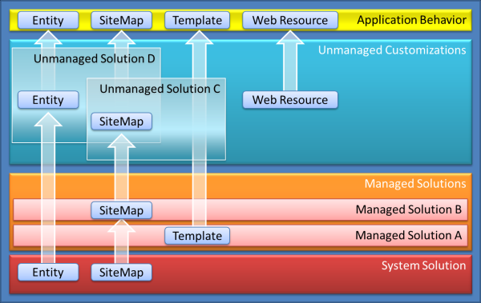

# Introduction to solutions

*Solutions* are how customizers and developers author, package, and maintain units of software that extend the Common Data Service (CDS). Customizers and developers distribute solutions so that organizations can use the CDS to install and uninstall the business functionality defined by the solution.
Every customization that you make to the CDS is part of a solution. Every change you apply is tracked and any dependencies can be calculated. When you export a managed solution, it contains all the changes that have been applied for that solution into a file that you can then import into a different CDS environment.
If you intend to transport customizations or extensions between different CDS environments or distribute solutions using AppSource, you must understand the solution framework.

## Unmanaged and managed solutions

There are two types of solutions: *managed* and *unmanaged*.

A **managed** solution is a completed solution that is intended to be distributed and installed. 
- You cannot edit the components of a managed solution.
- You cannot export a managed solution.
- You can add unmanaged customizations to components of a managed solution. When you do this, you create a dependency between your unmanaged customizations and the managed solution. When a dependency exists, the managed solution cannot be uninstalled until you remove the dependency.
- When a managed solution is deleted (uninstalled), all the customizations and extensions included with it are removed.

 > [!IMPORTANT]
 > When you uninstall a managed solution, the following data is lost: data stored in custom entities that are part of the managed solution and data stored in custom attributes that are part of the managed solution on other entities that are not part of the managed solution.

An **unmanaged** solution is one that is still under development or isn’t intended to be distributed. 
- While a solution is unmanaged, you can continue to add and remove components to it. 
- You can export an unmanaged solution to transport unmanaged customizations from one environment to another.
- When an unmanaged solution is deleted, only the solution container of any customizations included in it is deleted. All the unmanaged customizations remain in effect and belong to the default solution. 
- When the unmanaged solution is complete and you want to distribute it, export it as a managed solution.

 > [!NOTE]
 > You cannot import a managed solution into the same environment that contains the originating unmanaged solution. To test a managed solution, you need a separate environment to import it into.

## Solution publishers
Each solution is linked to a solution publisher. The solution publisher provides information about how to contact the publisher as well a customization prefix value. The default value is `new`.

When any schema changes are included as part of a solution, the solution publisher customization prefix is prepended to the name of the schema items. Any custom actions (See [Create Custom Actions](use-web-services.md#create-custom-actions)) also have this value appended to them. This is valuable because it allows for easy recognition of which solution added the schema item or custom action. It is not required for all schema items and custom actions in a solution to use the same customization prefix, but it is strongly recommended.

> [!IMPORTANT]
> Before you start creating a solution, you should create a solution publisher record and create a new solution linked to it. You should make sure the customization prefix represents a value that makes sense for you. 

Your choice of solution publisher is important in case you want to publish an update to a solution you have shipped. An update can only be applied to a managed solution with the same publisher as the original managed solution. 

More information: [Developer Guide: Maintain managed solutions > Create managed solution updates](/dynamics365/customer-engagement/developer/maintain-managed-solutions#create-managed-solution-updates)

## Solution layering

It is possible for two managed solutions to be installed which contradict each other or for some customizations applied to the environment to override a managed solution. How does this work?

It works because CDS evaluates managed solutions by the order in which they are installed and any customizations that are not in a managed solution are evaluated last.

The following diagram introduces how managed solutions and unmanaged customizations interact to control what is included at runtime in the application.
<!-- TODO: update this diagram with a modern look -->

In this example, default behavior defined in the system solution is overridden or appended by managed solutions. Any unmanaged customizations can then override or append customizations that are then visible in the application.

More information: [Developer Guide: Introduction to solutions > Unmanaged and managed solutions](/dynamics365/customer-engagement/developer/introduction-solutions#unmanaged-and-managed-solutions)

## Managed Properties

When you distribute a managed solution, anyone who installs your solution can include their own unmanaged customizations to it. Those unmanaged customizations can then be added to a solution that they distributed as a managed solution that depends on your solution. But what if you don’t want people to do this? As the publisher of the managed solution you can use managed properties to disable specific customizations for the components of your managed solution.

More information: [Developer Guide: Use managed properties](/dynamics365/customer-engagement/developer/use-managed-properties)

## Modular solutions

You can use the solution framework to create a discrete set of components that provide a set of functionalities. Each managed solution can be installed and uninstalled to return the customer’s deployment to its original state. Each managed solution you create runs on top of the system solution and can access the capabilities of that underlying solution.

You can also build managed solutions that run on top of other solutions to create a set of functionalities that can be shared by different solutions. In this way, you can build and maintain a common module as a solution to support multiple solutions. Because of this, customers only need to install the solutions that are right for them and you don’t need to include the same shared functionality in every solution. If you need to push out an update to solution that supports multiple solutions, you only need to update the common module.

Customers, System Implementers, and other ISVs can then build solutions on top of your solutions to achieve the specific customizations they require.

When a set of business functionality is composed with multiple solutions, these are called packages. You can use the *Package Deployer* to combine multiple solutions into a single installable unit.

## Deploy Solution Packages

Use the *Package Deployer* to create a custom installer for a package that can include 
- One or more solution files.
- Flat files or exported configuration data files. 
- Custom code that can run before, while, or after the package is deployed.
- HTML content specific to the package that can display at the beginning and end of the deployment process. This can be useful to provide a description of the solutions and files that are deployed in the package.

More information: [Developer Guide: Create packages for the Dynamics 365 Package Deployer](/dynamics365/customer-engagement/developer/create-packages-package-deployer).

## Team development of solutions

A solution file is a single binary file that does not lend itself to source code control or team development. There is no way for multiple developers to work on the custom components in the solution.

The *SolutionPackager* tool resolves the problem of source code control and team development of solution files. The tool identifies individual components in the compressed solution file and extracts them out to individual files. The tool can also re-create a solution file by packing the files that had been previously extracted. This enables multiple people to work independently on a single solution and extract their changes into a common location. Because each component in the solution file is broken into multiple files, it becomes possible to merge customizations without overwriting prior changes. A secondary use of the SolutionPackager tool is that it can be invoked from an automated build process to generate a compressed solution file from previously extracted component files without needing an active Dynamics 365 server.

More information: [Developer Guide: Solution tools for team development](/dynamics365/customer-engagement/developer/solution-tools-team-development)
