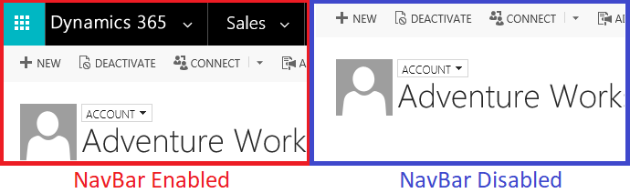

# Consider disabling NavBar when programmatically opening forms or views

**Category**: Design, Performance

**Impact potential**: Medium

<a name='symptoms'></a>

## Symptoms

Opening up forms or views with a URL, could lead to slower client performance on high latency networks when the navigation bar (NavBar) is enabled.

<a name='guidance'></a>

## Guidance

Determine if your users need to have the full navigation bar when creating customizations that open forms or views through a URL. In most cases, users selects on a link to open a form, do some quick work, and then close the record.  Disabling the navigation bar will lower the amount of resources to be loaded which lowers the number of network requests being made.  

[!INCLUDE[cc-terminology](../../../data-platform/includes/cc-terminology.md)]

When constructing URLs to open up forms or views, implement `navbar=off` within your query string parameters for the `main.aspx` page. The following example opens an Account form with the navigation bar disabled.

```JavaScript
function disableNavBar() {
    var globalContext = Xrm.Utility.getGlobalContext();
    return globalContext.getClientUrl() + "/main.aspx?appid=9411ee28-4310-e811-a839-000d3a33a7cb&etc=1&id={00000000-0000-0000-00AA-000010001004}&pagetype=entityrecord&navbar=off";
}
```

> [!IMPORTANT]
> The navbar=off query string parameter is only available with the `main.aspx` page. 

<a name='problem'></a>

## Problematic patterns

> [!WARNING] 
> These scenarios should be avoided. 

Keeping the navigation bar (NavBar) enabled does not mean users will experience performance issues. However, it does mean that additional resources must be loaded on the form or view which does require additional network requests.  It has been observed on highly latent networks this can lead to a poor user experience.

An example of a constructed URL with the NavBar enabled is as follows

```JavaScript
function enabledNavBar() {
    var globalContext = Xrm.Utility.getGlobalContext();
    // By default, NavBar is set to true if you do not include the parameter in the query string:
    return globalContext.getClientUrl() + "/main.aspx?appid=9411ee28-4310-e811-a839-000d3a33a7cb&etc=1&id={00000000-0000-0000-00AA-000010001004}&pagetype=entityrecord";
}

function enabledNavBarExplicit() {
    var globalContext = Xrm.Utility.getGlobalContext();
    // Explicitly defining that the NavBar will be enabled
    return globalContext.getClientUrl() + "/main.aspx?appid=9411ee28-4310-e811-a839-000d3a33a7cb&etc=1&id={00000000-0000-0000-00AA-000010001004}&pagetype=entityrecord&navbar=on";
}
```

<a name='additional'></a>

## Additional information

When opening up other records from within model driven apps, the navigation bar is being loaded with the areas and subareas defined within the sitemap.  In addition, it also renders the [Office app launcher](https://support.office.com/article/Meet-the-Office-365-app-launcher-79f12104-6fed-442f-96a0-eb089a3f476a) which displays the Office 365 apps the user has access to.<br/>


<a name='seealso'></a>

### See also

[Open forms, views, dialogs, and reports with a URL](../../open-forms-views-dialogs-reports-url.md)


[!INCLUDE[footer-include](../../../../includes/footer-banner.md)]