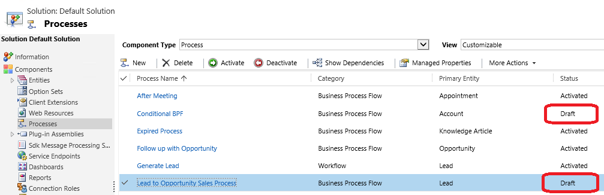

# Remove deactivated or disabled customizations

**Category**: Maintainability, Supportability

**Impact potential**: Low

## Symptoms

Deactivated or disabled customizations should be removed from a solution to improve solution management and to decrease the risk of utilizing or managing an outdated component.

## Guidance

Ensure that each solution component that is deactivated, or disabled, has been done so intentionally.  If so and will no longer be utilized, consider removing it from the solution to prevent confusion for users and system customizers. These components include:

- SDK Message Processing Steps
- Processes
- Record Creation and Update Rules
- SLAs

As well as Entity components such as:

- Forms
- Views
- Business Rules

### See also

[Apply custom business logic with business rules and flows in model-driven apps](/powerapps/maker/model-driven-apps/guide-staff-through-common-tasks-processes) 
[Events in forms and grids in model-driven apps](/powerapps/developer/model-driven-apps/clientapi/events-forms-grids) 

[!INCLUDE[footer-include](../../../../includes/footer-banner.md)]