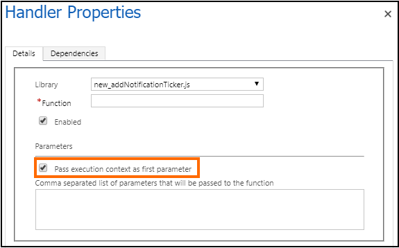
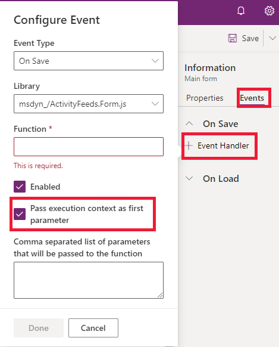

# Client API execution context

The execution context defines the event context in which your code executes. The execution context is passed when an event occurs on a form or grid. Use it in your event handler to perform various tasks such as determine [formContext](clientapi-form-context.md) or [gridContext](clientapi-grid-context.md), or manage the save event.

The execution context is passed in one of the following ways:

- **Defining event handlers using UI**: The execution context is an *optional* parameter that can be passed to a JavaScript library function through an event handler. Use the **Pass execution context as first parameter** option in the **Handler Properties** dialog while specify the name of the function to pass the event execution context. The execution context is the first parameter passed to a function.

   ### [Legacy](#tab/pass-execution-context-legacy)

     

   ### [Unified Interface](#tab/pass-execution-context-unified-interface)

     

   ---

- **Defining event handlers using code**: The execution context is automatically passed as the first parameter to functions set using code. For a list of methods that can be used to define event handlers in code, see [Add or remove functions to events using code](events-forms-grids.md#add-or-remove-event-handler-function-to-event-using-code).

The execution context object provides many methods to further work with the context. More information: [Execution context (Client API reference)](reference/execution-context.md)

## Using context objects asynchronously

The context passed to an event is only guaranteed to perform as expected during the event. When you keep a reference to a context after the event ends, actions might occur that cause context methods to behave in an unexpected fashion.

For example, if your event handler dispatches an async action that takes an extended amount of time while you're holding on to a reference to the execution context, the end user might navigate away from the current page by the time the promise resolves and you invoke the context method. This situation might cause methods like `formContext.getAttribute(<name>).getValue()` to return `null`, even though at the time the original event handler executed, the attribute had a value.

The following examples show where you should add more checks and take caution because the event handler function uses the execution context after the event completes.

### Accessing context in a promise

The context might change in unexpected ways after a [promise](https://developer.mozilla.org/docs/Web/JavaScript/Reference/Global_Objects/Promise) resolves.

```JavaScript
function onLoad(executionContext) {
    var formContext = executionContext.getFormContext();
    fetch("https://www.contoso.com/").then(
        function (result) {
            // Using formContext or executionContext here may not work as expected
            // because onLoad has already completed when the promise is resolved.
            formContext.getAttribute("name").setValue(result);
        }
    );
}
```

### Accessing context after an await statement

The context might change in unexpected ways after using [await](https://developer.mozilla.org/docs/Web/JavaScript/Reference/Operators/await) within an [async function](https://developer.mozilla.org/docs/Web/JavaScript/Reference/Statements/async_function). 

```JavaScript
async function onLoad(executionContext) {
    var formContext = executionContext.getFormContext();
    var result = await fetch("https://www.contoso.com/");
    // Using formContext or executionContext here might not work as expected
    // because the synchronous part of onLoad has already completed.
    formContext.getAttribute("name").setValue(result);
}
```

### Accessing context in a timeout function

The context might change in unexpected ways after using [setTimeout](https://developer.mozilla.org/docs/Web/API/setTimeout) or [setInterval](https://developer.mozilla.org/docs/Web/API/setInterval) to defer executing some code.

```JavaScript
function onLoad(executionContext) {
    var formContext = executionContext.getFormContext();
    if (notReady) {
        setTimeout(function () {
            // Using formContext or executionContext here may not work as expected
            // because onLoad has already completed when this delayed function executes.
            var name = formContext.getAttribute("name").getValue();
        }, 100);
    } else {
        formContext.getAttribute("name").setValue("abc");
    }
}
```


### Related articles

 [Client API form context](clientapi-form-context.md)<br>
 [Client API grid context](clientapi-grid-context.md)<br>
 [Form and grid context in ribbon actions](../pass-data-page-parameter-ribbon-actions.md#form-and-grid-context-in-ribbon-actions)

[!INCLUDE[footer-include](../../../includes/footer-banner.md)]
