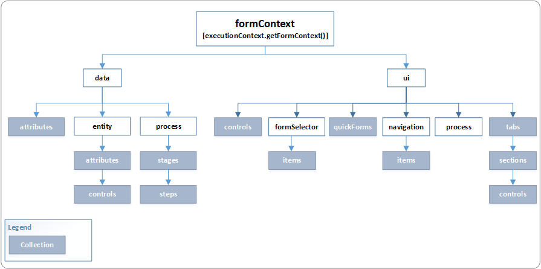

# Client API form context

The Client API form context (**formContext**) provides a reference to the form or to an item on the form, such as, a quick view control or a row in an editable grid, against which the current code is executed.

Earlier, the global **Xrm.Page** object was used to represent a form or an item on the form. With the latest version, the **Xrm.Page** object is [deprecated](/dynamics365/get-started/whats-new/customer-engagement/important-changes-coming#some-client-apis-are-deprecated), and you should use the [getFormContext](reference/executioncontext/getFormContext.md) method of the passed in execution context object to return reference to the appropriate form or an item on the form. 

> [!IMPORTANT]
> *Deprecated* means that we intend to remove a feature or capability from a future major release of model-driven apps; the feature or capability will continue to work and is fully supported until it is officially removed. A public announcement here in the documentation, on the official blog, and in many other places will be made at least six months before removal.<br/><br/>Use of the **Xrm.Page** object as a static access to the primary form context is *still* supported to maintain backward compatibility with the existing scripts, and won’t be removed as soon as some other client API methods listed in the [Client API deprecation](/dynamics365/get-started/whats-new/customer-engagement/important-changes-coming#some-client-apis-are-deprecated) section. We recommend that you use the new **formContext** object instead of the **Xrm.Page** object in your code targeting version 9.0 or later where possible. Also, using the **formContext** object enables you to create common event handlers that can operate either on a form or in an editable grid depending on where its called. More information: [getFormContext (Client API reference)](reference/executioncontext/getFormContext.md).<br><br>Getting the **formContext** object for JavaScript functions for ribbon actions is different from how you get it in form scripting. More information: [Form and grid context in ribbon actions](../pass-data-page-parameter-ribbon-actions.md#form-and-grid-context-in-ribbon-actions).

## Using the formContext object instead of the Xrm.Page object 

It's easy to convert existing code with **Xrm.Page** to use the new **formContext** object. For example, consider the following script that uses the **Xrm.Page** object:

```JavaScript
function displayName()
{
	var firstName = Xrm.Page.getAttribute("firstname").getValue();
	var lastName = Xrm.Page.getAttribute("lastname").getValue();
	console.log(firstName + " " + lastName);
}
```

Here is the updated script that uses the passed in execution context to retrieve the **formContext** object instead of using the static **Xrm.Page** object:

```JavaScript
function displayName(executionContext)
{
	var formContext = executionContext.getFormContext(); // get formContext

	// use formContext instead of Xrm.Page	
	var firstName = formContext.getAttribute("firstname").getValue(); 
	var lastName = formContext.getAttribute("lastname").getValue();
	console.log(firstName + " " + lastName);
}
```

>[!IMPORTANT]
>You must remember to select the **Pass execution context as first parameter** option in the **Handler Properties** dialog while defining your event handlers to use the **formContext** object. More information: [Client API execution context](clientapi-execution-context.md)

## formContext object model

Use the **data** and **ui** objects under the **formContext** object to programmatically manipulate data and user interface elements in model-driven apps.



[!INCLUDE[cc-terminology](../../data-platform/includes/cc-terminology.md)]

### data object

Provides properties and methods to work with the data on a form, including table data and data in the business process flow control. Contains the following objects:


| **Object**  | **Description**|
|--|--|
|attributes|Collection of non-table data on the form. Items in this collection are of the same type as the column collection, but they are not columns of the form table. <br/>More information: [Collections](reference/collections.md)|
|entity|Provides methods to retrieve information specific to the record displayed on the page, the save method, and a collection of all the columns included on the form. Column data is limited to columns represented on the form. <br/>More information: [formContext.data.entity](reference/formContext-data-entity.md)|
|process|Provides objects and methods to interact with the business process flow data on a form.<br/>More information: [formContext.data.process](reference/formContext-data-process.md)|

It also provides an **attributes** collection for accessing non-table bound control. See the **Collections in the formContext object model** section later in this topic.

More information: [formContext.data](reference/formContext-data.md) 

### ui object

Provides methods to retrieve information about the user interface, in addition to collections for several sub components of the form or grid. Contains the following objects:

| **Object**  | **Description**|
|-----------------|----------------|
|formSelector|Provides an items collection that provides capabilities to query the forms available for the current user. Use the navigate method to close the current form and open a different one.|
|navigation|Does not contain any methods. Provides access to navigation items through the items collection. See the next section on collections for more information.|
|process|Provides methods to interact with the business process flow control on a form.|

More information: [formContext.ui](reference/formContext-ui.md)

## Collections in the formContext object model

The following table describes the collections in **Xrm** object model. For
information about the methods available for collections in general, see
[Collections (Client API
reference)](reference/collections.md).

| **Collection**  | **Description**|
|-----------------|----------------|
| [attributes](reference/attributes.md)  | Two objects contain a column collection:<br/><br/>- **formContext.data.attributes** collection provides access to non-table bound columns.<br/><br/>- **formContext.data.entity.attributes** collection provides access to each table column that is available on the form. Only those columns added to the form are available.| 
| [controls](reference/controls.md)  | Three objects contain a controls collection:<br/><br/> - **formContext.ui.controls**: Provides access to each control present on the form.<br/><br/>- **formContext.data.entity.attribute.controls**: Because a column may have more than one control on the form, this collection provides access to each of them. This collection will contain only one item unless multiple controls for the column are added to the form.<br/><br/>- **formContext.ui.tabs.sections.controls**: This collection only contains the controls found in the section.|
|**formContext.data.process.**[stages](reference/formContext-data-process/process/getStages.md) and **formContext.data.process**.[steps](reference/formContext-data-process/stage/getSteps.md)| Provides access to stages and steps collection in a business process flow. These also allow for adding and removing of items from the collection.|
|**formContext.ui.formSelector.**[items](reference/formContext-ui-formselector.md)|When multiple forms are provided for a table, you can associate each form with security roles. When the security roles associated with a user enable them to see more than one form, the **formContext.ui.formSelector.items** collection provides access to each form definition available to that user.|
|**formContext.ui.navigation.**[items](reference/formContext-ui-navigation.md)|The **formContext.ui.navigation.items** collection provides access to navigation items that are defined using the navigation area of the form editor. People navigate to these using the command bar.|
| **formContext.ui.**[quickForms](reference/formContext-ui-quickForms.md) | Provides methods to access all the quick view controls and its constituent controls on the Customer Enagagement forms.| **Xrm.Page.ui.tabs** collection provides access to each of these tabs.|
| **formContext.ui.**[tabs](reference/formContext-ui-tabs.md) | You can organize each form by using one or more tabs. This collection provides access to each of these tabs.|
| **formContext.ui.tabs.**[sections](reference/formContext-ui-sections.md) | You can organize each form tab by using one or more sections. The tab **sections** collection provides access to each of these sections. You need to define the tab which contains the desired section or iterate through each tab to find the relevant section.|


  
### Related topics

[getFormContext method](reference/executioncontext/getFormContext.md)<br/>
[getGlobalContext method](reference/xrm-utility/getGlobalContext.md)<br/>
[getAttribute method](reference/attributes.md)<br/>
[getControl method](reference/controls/getcontrol.md)<br/>
[Execution context methods](reference/execution-context.md) 

 


[!INCLUDE[footer-include](../../../includes/footer-banner.md)]
