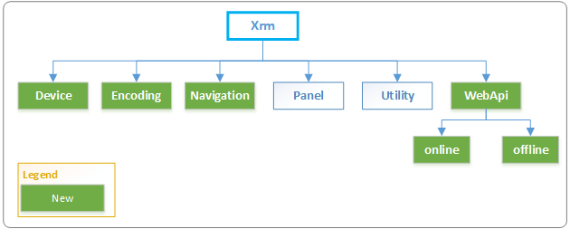

# Client API Xrm object

The **Xrm** object is globally available to use in your code without having to use the execution context in Client API.

## Xrm object model

The following illustration displays the Xrm object model:

Here is the information about each of the namespaces in the Xrm object:

| Namespace                                     | Description                                                                                                                                                                                                                                                                                                                                                                                                                                                                                           |
| --------------------------------------------- | ----------------------------------------------------------------------------------------------------------------------------------------------------------------------------------------------------------------------------------------------------------------------------------------------------------------------------------------------------------------------------------------------------------------------------------------------------------------------------------------------------- |
| [Xrm.Device](reference/xrm-device.md)         | Provides methods to use native device capabilities.                                                                                                                                                                                                                                                                                                                                                                                                                                                   |
| [Xrm.Encoding](reference/xrm-encoding.md)     | Provides methods to encode strings.                                                                                                                                                                                                                                                                                                                                                                                                                                                                   |
| [Xrm.Navigation](reference/xrm-navigation.md) | Provides methods for navigating forms and items in model-driven apps.                                                                                                                                                                                                                                                                                                                                                                                                                                 |
| [Xrm.Panel](reference/xrm-panel.md)           | Provides a method to display a web page in the side pane of model-driven apps form.                                                                                                                                                                                                                                                                                                                                                                                                                   |
| [Xrm.Utility](reference/xrm-utility.md)       | Provides a container for useful methods.                                                                                                                                                                                                                                                                                                                                                                                                                                                              |
| [Xrm.WebApi](reference/xrm-webapi.md)         | Provides methods to use Web API to create and manage records and execute Web API actions and functions.  [Xrm.WebApi.offline](reference/xrm-webapi/offline.md): Provides methods to create and manage records in the model-driven apps mobile clients while working in the _offline_ mode.  [Xrm.WebApi.online](reference/xrm-webapi/online.md): Provides methods to use Web API to create and manage records and execute Web API actions and functions when connected to the server. |

## Client API global context

Use the **Xrm.Utility**.[getGlobalContext](reference/xrm-utility/getGlobalContext.md) method in forms to retrieve information specific to an organization, a user, or the client where script is run without going through the form execution context. This is a change from previous versions where you had to use the form context to retrieve global context by using **Xrm.Page.context**.

> [!NOTE] 
> **Xrm.Page.context** is [deprecated](/dynamics365/get-started/whats-new/customer-engagement/important-changes-coming#some-client-apis-are-deprecated) in the current release, and you should now use the new **Xrm.Utility.**[getGlobalContext](reference/xrm-utility/getGlobalContext.md) method to get global context in your code targeting version 9.0 or later.

To access the global context information in a standalone HTML Web resource, you should include a reference to **ClientGlobalContext.js.aspx** in the web resource, and then use the **GetGlobalContext** function. More information: [GetGlobalContext function and ClientGlobalContext.js.aspx](reference/GetGlobalContext-ClientGlobalContext.js.aspx.md)

### Related topics

[Understand the Client API object model](understand-clientapi-object-model.md) 
[Deprecated client APIs](/dynamics365/get-started/whats-new/customer-engagement/important-changes-coming#some-client-apis-are-deprecated)

[!INCLUDE[footer-include](../../../includes/footer-banner.md)]
