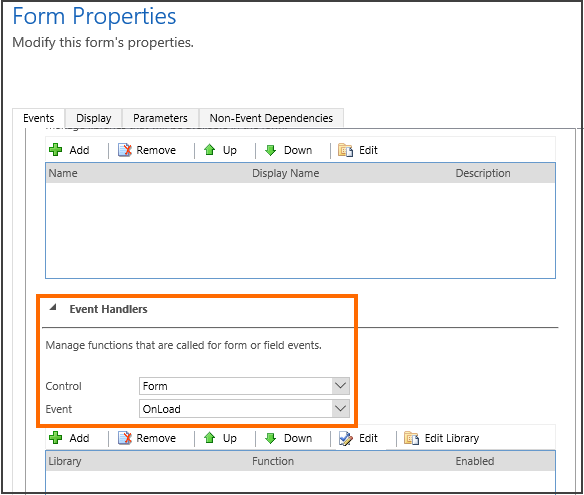
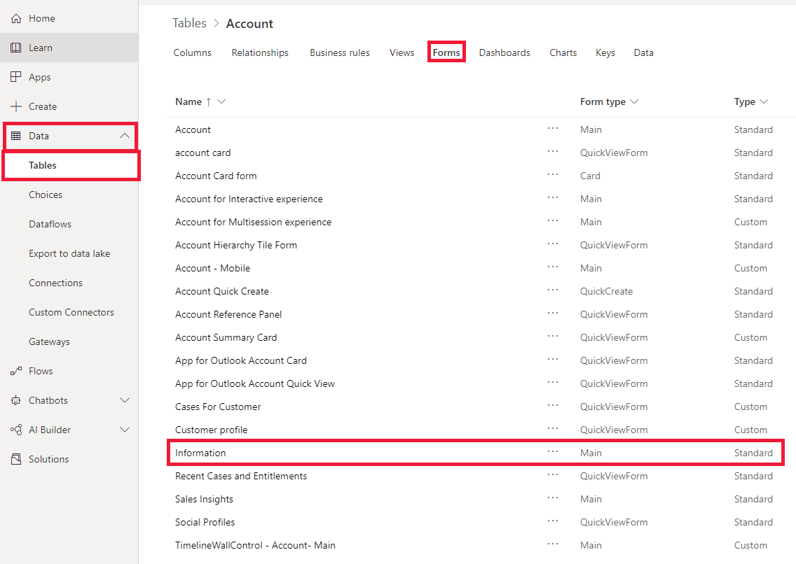
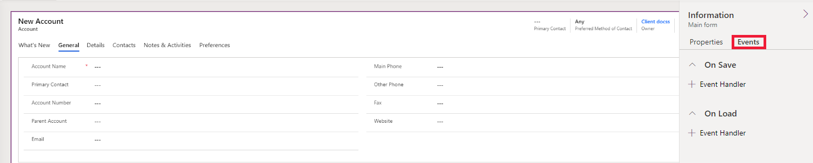
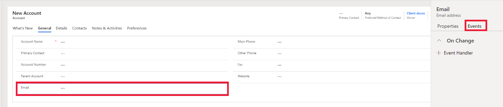

# Events in forms and grids in model-driven apps

All client-side code is initiated by events. In model-driven apps, you associate a specific function in a JavaScript library ([Script web resource](../script-jscript-web-resources.md)) to be executed when an event occurs. This function is called an *event handler*. Each event handler specifies a single function within a JavaScript library and any parameters that can be passed to the function.

You can associate event handlers to only some events using the UI. For events that are not available to be associated through UI, Client API provides methods that can be used to attach event handlers to such events. 

[!INCLUDE[cc-terminology](../../data-platform/includes/cc-terminology.md)]

## Add or remove event handler function to event using UI

### [Legacy](#tab/add-event-handlers-legacy)

Use the **Event Handlers** section of the **Form Properties** dialog box to associate your script with an event for forms and columns.

### [Unified Interface](#tab/add-event-handlers-unified-interface)

To add or remove event handler functions to events in the new Unified Interface:

1. Go to [Power Apps](https://make.powerapps.com).
1. In the left navigation pane, select **Data** and then select **Tables**. 
1. From the list of tables, select the table where you want to add the event handlers.
1. Select **Forms** tab from the command bar and then select the form where you want to add.

    

1. Select **Events** tab. You'll notice that both the **On Save** and **On Load** event handlers.

    

1. If you wish to add the event handler for the on change event, select the column and then select **Event** tab.

     

---

## Add or remove event handler function to event using code

Using the following methods to add and remove event handler for events that cannot be associated through UI:

|Events |Event handler|
|-------|-------|
|Attribute [OnChange](reference/events/attribute-onchange.md) | [addOnChange](reference/attributes/addonchange.md) and [removeOnChange](reference/attributes/removeOnchange.md) methods|
|Form [OnLoad](reference/events/form-onload.md)| formContext.ui [addOnLoad](reference/formcontext-ui/addonload.md) and [removeOnLoad](reference/formcontext-ui/removeonload.md) methods|
|Form data [OnLoad](reference/events/form-data-onload.md)| formContext.data [addOnLoad](reference/formcontext-data/addonload.md) and [removeOnLoad](reference/formcontext-data/removeonload.md) methods|
|Form [OnSave](reference/events/form-onsave.md)| [addOnSave](reference/formcontext-data-entity/addonsave.md) and [removeOnSave](reference/formcontext-data-entity/removeonsave.md) methods|
|Lookup control [PreSearch](reference/events/presearch.md)| [addPreSearch](reference/controls/addpresearch.md) and [removePreSearch](reference/controls/removepresearch.md) methods|
|kbsearch control [OnResultOpened](reference/events/onresultopened.md)|[addOnResultOpened](reference/controls/addOnResultOpened.md) and [removeOnResultOpened](reference/controls/removeOnResultOpened.md) methods|
|kbsearch control [OnSelection](reference/events/onselection.md)|[addOnSelection](reference/controls/addOnSelection.md) and [removeOnSelection](reference/controls/removeOnSelection.md) methods|
|kbsearch control [PostSearch](reference/events/postsearch.md)|[addOnPostSearch](reference/controls/addOnPostSearch.md) and [removeOnPostSearch](reference/controls/removeOnPostSearch.md) methods|

>[!IMPORTANT]
>The execution context is automatically passed as the first parameter to functions that are set using the code. More information: [Client API execution context](clientapi-execution-context.md) 

## Form event pipeline
You can define up to 50 event handlers for each event. Each event handler is executed in the order that it is displayed in the **Event Handlers** section in the **Events** tab of the **Form Properties** dialog box.

Use the [setSharedVariable](reference/executioncontext/setSharedVariable.md) and [getSharedVariable](reference/executioncontext/getSharedVariable.md) methods to pass a common variable between event handlers (functions). Use the execution context [getDepth](reference/executioncontext/getDepth.md) method to know the sequence that an event handler is being executed in relative to other event handlers. 

### Related topics

[Understand the Client API object model](understand-clientapi-object-model.md) 
[Client API execution context](clientapi-execution-context.md) 
[Events (Client API reference)](reference/events.md) 

[!INCLUDE[footer-include](../../../includes/footer-banner.md)]