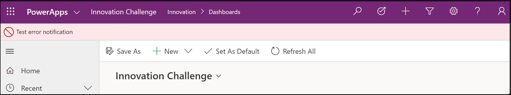
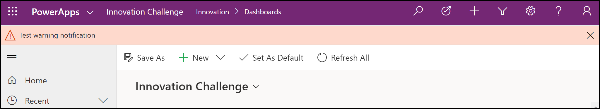
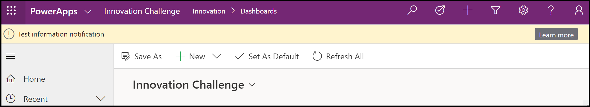

# addGlobalNotification (Client API reference)

[!INCLUDE[./includes/addGlobalNotification-description.md](./includes/addGlobalNotification-description.md)]

## Syntax

`Xrm.App.addGlobalNotification(notification).then(successCallback, errorCallback);`

## Parameters

<table style="width:100%">
<tr>
<th>Name</th>
<th>Type</th>
<th>Required</th>
<th>Description</th>
</tr>
<tr>
<td>notification</td>
<td>Object</td>
<td>Yes</td>
<td>The notification to add. The object contains the following values:
<ul>
<li><b>action</b>: (Optional) Object. Contains the following values:
<ul>
<li><b>actionLabel</b>: (Optional) String. The label for the action in the message.</li>
<li><b>eventHandler</b>: (Optional) Function reference. The function to execute when the action label is clicked.</li>
</ul>
<li><b>level</b>: Number. Defines the level of notification. Valid values are:
<ul><li>1: Success</li>
<li>2: Error</li>
<li>3: Warning</li>
<li>4: Information</li></ul></li>
<li><b>message</b>: String. The message to display in the notification.</li>
<li><b>showCloseButton</b>: (Optional) Boolean. Indicates whether or not the user can close or dismiss the notification. If you don't specify this parameter, users can't close or dismiss the notification by default.</li>
<li><b>type</b>: Number. Defines the type of notification. Currently, only a value of 2 is supported, which displays a message bar at the top of the app.</li>
</ul></td>
</tr>
<tr>
<td>successCallback</td>
<td>Function</td>
<td>No</td>
<td><p>A function to call when notification is displayed. A GUID value is passed to uniquely identify the notification. You can use the GUID value to close or dismiss the notification using the <a href="clearGlobalNotification.md">clearGlobalNotification</a> method.</p>
</td>
</tr>
<tr>
<td>errorCallback</td>
<td>Function</td>
<td>No</td>
<td>A function to call when the operation fails.</td>
</tr>
</table>

## Return Value

On success, returns a promise object containing a GUID value to uniquely identify the notification as described earlier in the description of the **successCallback** parameter.

## Examples

### Display an error notification that can't be closed or dismissed by user

```JavaScript
// define notification object
var notification = 
{
  type: 2,
  level: 2, //error
  message: "Test error notification"
}

Xrm.App.addGlobalNotification(notification).then(
    function success(result) {
        console.log("Notification created with ID: " + result);
        // perform other operations as required on notification display
    },
    function (error) {
        console.log(error.message);
        // handle error conditions
    }
);
```

This is how the error notification will appear in the app:



### Display a warning notification that can be closed or dismissed by user

```JavaScript
// define notification object
var notification = 
{
  type: 2,
  level: 3, //warning
  message: "Test warning notification",
  showCloseButton: true
}

Xrm.App.addGlobalNotification(notification).then(
    function success(result) {
        console.log("Notification created with ID: " + result);
        // perform other operations as required on notification display
    },
    function (error) {
        console.log(error.message);
        // handle error conditions
    }
);
```

This is how the warning notification will appear in the app:



### Display an information notification with a "Learn more" link that can be clicked by users

```javascript
// define action object
var myAction =
{
  actionLabel: "Learn more", 
  eventHandler: function () {
        Xrm.Navigation.openUrl("https://docs.microsoft.com/powerapps/");
        // perform other operations as required on clicking
    }
}

// define notification object
var notification = 
{
  type: 2,
  level: 4, // information
  message: "Test information notification",  
  action: myAction
}

Xrm.App.addGlobalNotification(notification).then(
    function success(result) {
        console.log("Notification created with ID: " + result);
        // perform other operations as required on notification display
    },
    function (error) {
        console.log(error.message);
        // handle error conditions
    }
);
```

This is how the information notification will appear in the app:



### See also

[clearGlobalNotification](clearGlobalnotification.md)


[!INCLUDE[footer-include](../../../../../includes/footer-banner.md)]