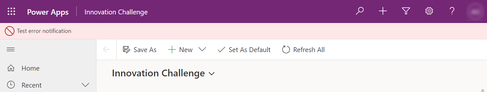
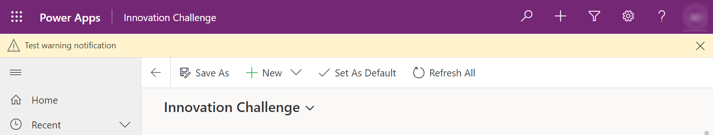
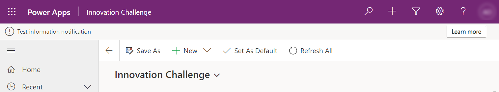

# addGlobalNotification (Client API reference)

[!INCLUDE[./includes/addGlobalNotification-description.md](./includes/addGlobalNotification-description.md)]

## Syntax

`Xrm.App.addGlobalNotification(notification).then(successCallback, errorCallback);`

## Parameters

|Name|Type|Required|Description|
|---|---|---|---|
|`notification`|Object|Yes|The notification to add. See [notification parameter](#notification-property)|
|`successCallback`|Function|No|A function to call when notification is displayed. A GUID value is passed to uniquely identify the notification. You can use the GUID value to close or dismiss the notification using the [clearGlobalNotification method](clearGlobalNotification.md).|
|`errorCallback`|Function|No|A function to call when the operation fails.|

### notification property

The object contains the following properties:

|Property|Type|Required|Description|
|---|---|---|---|
|`action`|Object|No|An object with the following properties: <br />- `actionLabel`(Optional) String. The label for the action in the message.<br />- `eventHandler`: (Optional) Function reference. The function to execute when the action label is clicked.|
|`level`|Number|Yes|Defines the level of notification. Valid values are:<br />1: Success<br />2: Error<br />3: Warning<br />4: Information|
|`message`|String|Yes|The message to display in the notification.|
|`showCloseButton`|Bool|No|Indicates whether or not the user can close or dismiss the notification. If you don't specify this parameter, users can't close or dismiss the notification by default.|
|`type`|Number|Yes|Defines the type of notification. Currently, only a value of 2 is supported, which displays a message bar at the top of the app.|


## Return Value

On success, returns a promise object containing a GUID value to uniquely identify the notification as described earlier in the description of the **successCallback** parameter.

## Examples

### Display an error notification that can't be closed or dismissed by user

```JavaScript
// define notification object
var notification = 
{
  type: 2,
  level: 2, //error
  message: "Test error notification"
}

Xrm.App.addGlobalNotification(notification).then(
    function success(result) {
        console.log("Notification created with ID: " + result);
        // perform other operations as required on notification display
    },
    function (error) {
        console.log(error.message);
        // handle error conditions
    }
);
```

This is how the error notification will appear in the app:



### Display a warning notification that can be closed or dismissed by user

```JavaScript
// define notification object
var notification = 
{
  type: 2,
  level: 3, //warning
  message: "Test warning notification",
  showCloseButton: true
}

Xrm.App.addGlobalNotification(notification).then(
    function success(result) {
        console.log("Notification created with ID: " + result);
        // perform other operations as required on notification display
    },
    function (error) {
        console.log(error.message);
        // handle error conditions
    }
);
```

This is how the warning notification will appear in the app:



### Display an information notification with a "Learn more" link that can be clicked by users

```javascript
// define action object
var myAction =
{
  actionLabel: "Learn more", 
  eventHandler: function () {
        Xrm.Navigation.openUrl("https://learn.microsoft.com/powerapps/");
        // perform other operations as required on clicking
    }
}

// define notification object
var notification = 
{
  type: 2,
  level: 4, // information
  message: "Test information notification",  
  action: myAction
}

Xrm.App.addGlobalNotification(notification).then(
    function success(result) {
        console.log("Notification created with ID: " + result);
        // perform other operations as required on notification display
    },
    function (error) {
        console.log(error.message);
        // handle error conditions
    }
);
```

This is how the information notification will appear in the app:



### Related articles

[clearGlobalNotification](clearGlobalnotification.md)


[!INCLUDE[footer-include](../../../../../includes/footer-banner.md)]
