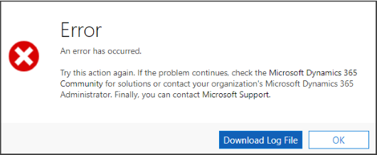

# openErrorDialog (Client API reference)


[!INCLUDE[./includes/openErrorDialog-description.md](./includes/openErrorDialog-description.md)]

## Syntax

`Xrm.Navigation.openErrorDialog(errorOptions).then(successCallback,errorCallback);`

## Parameters

|Name |Type |Required |Description |
|---|---|---|---|
|errorOptions|Object|Yes|An object to specify the options for error dialog. The object contains the following values:<br/>- **details**: (Optional) String. Details about the error. When you specify this, the **Download Log File** button is available in the error message, and clicking it will let users download a text file with the content specified in this value.<br/>- **errorCode**: (Optional) Number. The error code. If you just set **errorCode**, the message for the error code is automatically retrieved from the server and displayed in the error dialog. If you specify an invalid **errorCode** value, an error dialog with a default error message is displayed.<br/>- **message**: (Optional) String. The message to be displayed in the error dialog.<br/><br/>You must set either the **errorCode** or **message** value. |
|successCallback|function|No|A function to execute when the error dialog is closed.|
|errorCallback|function|No|A function to execute when the operation fails.|

## Example

The following code sample passes an incorrect errorCode (1234) to display an error dialog with default message:

```JavaScript
Xrm.Navigation.openErrorDialog({ errorCode:1234 }).then(
    function (success) {
        console.log(success);        
    },
    function (error) {
        console.log(error);
    });
```

This displays an error dialog with the default message:



### Related topics

[Xrm.Navigation](../xrm-navigation.md)<br/>
[List of error codes](../../../../data-platform/org-service/web-service-error-codes.md)


[!INCLUDE[footer-include](../../../../../includes/footer-banner.md)]