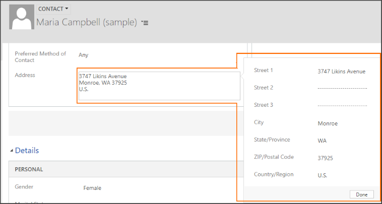

# Composite columns 

Some columns added to a form can represent multiple items of data. These *composite columns* behave differently from other columns when displayed in the web application and you must write scripts differently to use them properly.

[!INCLUDE[cc-terminology](../../../data-platform/includes/cc-terminology.md)]

The following table lists the composite columns available in model-driven apps:

<table>
    <tbody>
        <tr>
            <th scope="col">
                <p>
                    Table
                </p>
            </th>
            <th scope="col">
                <p>
                    Display Name
                </p>
            </th>
            <th scope="col">
                <p>
                    Logical name
                </p>
            </th>
        </tr>
        <tr>
            <td rowspan="2">
                <p>
                    Account
                </p>
            </td>
            <td>
                <p>
                    <strong>Address 1</strong>
                </p>
            </td>
            <td>
                <p>
                    address1_composite
                </p>
            </td>
        </tr>
        <tr>
            <td>
                <p>
                    <strong>Address 2</strong>
                </p>
            </td>
            <td>
                <p>
                    address2_composite
                </p>
            </td>
        </tr>
        <tr>
            <td rowspan="3">
                <p>
                    Contact
                </p>
            </td>
            <td>
                <p>
                    <strong>Full Name</strong>
                </p>
            </td>
            <td>
                <p>
                    fullname
                </p>
            </td>
        </tr>
        <tr>
            <td>
                <p>
                    <strong>Address 1</strong>
                </p>
            </td>
            <td>
                <p>
                    address1_composite
                </p>
            </td>
        </tr>
        <tr>
            <td>
                <p>
                    <strong>Address 2</strong>
                </p>
            </td>
            <td>
                <p>
                    address2_composite
                </p>
            </td>
        </tr>
        <tr>
            <td rowspan="3">
                <p>
                    Lead
                </p>
            </td>
            <td>
                <p>
                    <strong>Full Name</strong>
                </p>
            </td>
            <td>
                <p>
                    fullname
                </p>
            </td>
        </tr>
        <tr>
            <td>
                <p>
                    <strong>Address 1</strong>
                </p>
            </td>
            <td>
                <p>
                    address1_composite
                </p>
            </td>
        </tr>
        <tr>
            <td>
                <p>
                    <strong>Address 2</strong>
                </p>
            </td>
            <td>
                <p>
                    address2_composite
                </p>
            </td>
        </tr>
        <tr>
            <td rowspan="3">
                <p>
                    User
                </p>
            </td>
            <td>
                <p>
                    <strong>Full Name</strong>
                </p>
            </td>
            <td>
                <p>
                    fullname
                </p>
            </td>
        </tr>
        <tr>
            <td>
                <p>
                    <strong>Address</strong>
                </p>
            </td>
            <td>
                <p>
                    address1_composite
                </p>
            </td>
        </tr>
        <tr>
            <td>
                <p>
                    <strong>Other Address</strong>
                </p>
            </td>
            <td>
                <p>
                    address2_composite
                </p>
            </td>
        </tr>        
        <tr>
            <td rowspan="2">
                <p>
                    Quote
                </p>
            </td>
            <td>
                <p>
                    <strong>Bill To Address</strong>
                </p>
            </td>
            <td>
                <p>
                    billto_composite
                </p>
            </td>
        </tr>
        <tr>
            <td>
                <p>
                    <strong>Ship To Address</strong>
                </p>
            </td>
            <td>
                <p>
                    shipto_composite
                </p>
            </td>
        </tr>
        <tr>
            <td rowspan="2">
                <p>
                    Order
                </p>
            </td>
            <td>
                <p>
                    <strong>Bill To Address</strong>
                </p>
            </td>
            <td>
                <p>
                    billto_composite
                </p>
            </td>
        </tr>
        <tr>
            <td>
                <p>
                    <strong>Ship To Address</strong>
                </p>
            </td>
            <td>
                <p>
                    shipto_composite
                </p>
            </td>
        </tr>
        <tr>
            <td rowspan="2">
                <p>
                    Invoice
                </p>
            </td>
            <td>
                <p>
                    <strong>Bill To Address</strong>
                </p>
            </td>
            <td>
                <p>
                    billto_composite
                </p>
            </td>
        </tr>
        <tr>
            <td>
                <p>
                    <strong>Ship To Address</strong>
                </p>
            </td>
            <td>
                <p>
                    shipto_composite
                </p>
            </td>
        </tr>
    </tbody>
</table>

## Composite columns in the web application

When composite columns are added to a main form, the web application will show just the composite column. When someone edits the column, a flyout appears showing the individual column that comprise the composite column. 

For example, the **Address** column on a Contact form is a composite column. Selecting the **Address** column displays a flyout with individual columns that comprise the composite column. 



Although not explicitly added to the form in the form editor, each of the columns that are part of the column are available to the form. Although you can read the value of the composite value using [getValue](attributes/getValue.md), you can’t use [setValue](attributes/setValue.md) to change the value of the composite column directly; you must set one or more of the columns referenced by the composite column.

You can access the individual constituent controls displayed in the flyout by name. These controls use the following naming convention: \<**composite control name**>\_compositionLinkControl_\<**constituent column name**>. 

To access just the **address_line1** control in the **address1_composite** control, you would use: 

`formContext.getControl("address1_composite_compositionLinkControl_address1_line1")`

## Composite columns in mobile clients

The mobile client for model-driven apps use the same form definitions used for the tables that have composite columns but it interprets them differently. If a composite column is found in the form definition, it will show all the columns that are part of the composite column in that section of the form. There is no need for a flyout because all the columns are visible. You can write scripts for the form accessing each of the individual columns just as if they had been individually added to the form.
However, the actual composite control will not be present in the model-driven apps mobile clients page.

## Mitigate the differences

If you want to access the fullname column for the Contact, Lead, or User tables, using the **formContext.data.entity**.[getPrimaryAttributeValue](formContext-data-entity/getPrimaryAttributeValue.md) method is an easy way to get the value for this column without referencing it directly. This method works for both the web application and model-driven apps mobile clients.

If you have code that needs to read the value of one of the address composite columns, to work with both clients, you need to separate the code using the [getClient](Xrm-Utility/getGlobalContext/client.md#getclient) method as shown in the following function that will display the formatted address using the **Xrm.Navigation**.[openAlertDialog](Xrm-Navigation/openAlertDialog.md) method in either the main web application or the mobile apps version of the same form.

```JavaScript
function showAddressDialog(executionContext) {
    var address1_compositeValue;
    var formContext = executionContext.getFormContext();
    if (Xrm.Utility.getGlobalContext().client.getClient() != "Mobile") {
        address1_compositeValue = formContext.getAttribute("address1_composite").getValue();
    }
    else {
        var address1_line1 = formContext.getAttribute("address1_line1").getValue();
        var address1_line2 = formContext.getAttribute("address1_line2").getValue();
        var address1_line3 = formContext.getAttribute("address1_line3").getValue();
        var address1_city = formContext.getAttribute("address1_city").getValue();
        var address1_stateorprovince = formContext.getAttribute("address1_stateorprovince").getValue();
        var address1_postalcode = formContext.getAttribute("address1_postalcode").getValue();
        var address1_country = formContext.getAttribute("address1_country").getValue();

        // Achieve equivalent formatting
        //address1_line1
        //address1_line2
        //address1_line3
        //address1_city, address1_stateorprovince address1_postalcode
        //address1_country

        var addressText = "";
        if (address1_line1 != null) {
            addressText += address1_line1 + "\n";
        }
        if (address1_line2 != null) {
            addressText += address1_line2 + "\n";
        }
        if (address1_line3 != null) {
            addressText += address1_line3 + "\n";
        }
        if (address1_city != null) {
            addressText += address1_city + ", ";
        }
        if (address1_stateorprovince != null) {
            addressText += address1_stateorprovince + " ";
        }
        if (address1_postalcode != null) {
            addressText += address1_postalcode + "\n";
        }
        addressText += address1_country;

        address1_compositeValue = addressText;
    }
    Xrm.Navigation.openAlertDialog({ text: address1_compositeValue });
    console.log(address1_compositeValue);
}
```

### Related topics
[Columns](attributes.md)


[!INCLUDE[footer-include](../../../../includes/footer-banner.md)]